# Python 中的投资组合优化

> 原文：<https://pub.towardsai.net/portfolio-optimization-in-python-83fa20b02241?source=collection_archive---------0----------------------->

## [优化](https://towardsai.net/p/category/optimization)

## Python 中投资组合优化的三种方法


由[卡罗琳娜·格拉博斯卡](https://www.pexels.com/@karolina-grabowska)在[像素](https://www.pexels.com/photo/heap-of-different-nominal-per-dollars-4386442/)上拍摄的照片

在投资中，投资组合优化的任务是选择资产，使投资回报最大化，同时风险最小化。例如，投资者可能对从 20 只股票中选择 5 只股票感兴趣，以确保它们尽可能赚钱。应用于私募股权的投资组合优化方法也有助于管理和分散对私人公司的投资。最近，随着加密货币的兴起，投资组合优化技术已被应用于比特币和以太坊等投资。

在每一种情况下，优化资产的任务都涉及到平衡风险和回报之间的权衡，其中股票的回报是一段时间后实现的利润，风险是资产价值的标准差。许多可用的投资组合优化方法本质上是投资中资产多样化方法的延伸。这里的想法是，拥有不同类型资产的投资组合比拥有相似资产的投资组合风险更低。

找到投资组合优化的正确方法是投资银行和资产管理公司工作的重要组成部分。早期的方法之一叫做均值-方差优化，是由 Harry Markowitz 开发的，因此也被称为 Markowitz 方法或 HM 方法。这种方法的原理是假设投资者厌恶风险。具体来说，它选择一组相关性最小(即彼此不同)且产生最高回报的资产。这种方法意味着，给定一组具有相同回报的投资组合，你将选择彼此之间具有最小统计关系的资产的投资组合。虽然这是现代投资组合理论中的一个基本方法，但它有许多局限性，如假设历史回报完全反映未来回报。

例如，你不应该选择科技公司股票的投资组合，而应该选择不同行业股票的投资组合。在实践中，均值-方差优化算法可能会选择包含技术、零售、医疗保健和房地产资产的投资组合，而不是像技术这样的单一行业。

其他方法如分级风险平价(HRP)和平均条件风险值(mCVAR)解决了均值-方差优化方法的一些局限性。具体来说，HRP 不需要对协方差矩阵求逆。协方差矩阵是股票收益如何同向移动的一种度量。均值-方差优化方法需要找到协方差矩阵的逆矩阵，这在计算上并不总是可行的。此外，mCVAR 方法不做均值-方差优化所做的假设，这种假设在收益率呈正态分布时发生。由于 mCVAR 不假设正态分布的回报，它对均值-方差优化等极值不敏感。这意味着，如果一只股票的价格出现异常上涨，mCVAR 将比均值-方差优化更稳健，更适合资产配置。相反，均值-方差优化可能会天真地建议我们不成比例地将大部分资源投资于价格异常上涨的资产。

Python 包 [PyPortfolioOpt](https://pypi.org/project/pyportfolioopt/#an-overview-of-classical-portfolio-optimization-methods) 提供了各种各样的特性，使得实现所有这些方法变得简单明了。

在这里，我们将看看如何应用这些方法来构建跨行业的股票投资组合。

**访问股票价格数据**

我们将使用 Pandas-Datareader 库提取股票价格数据。您可以在终端命令行中使用 pip 轻松安装该库:

pip 安装熊猫-datareader

接下来，让我们在新的 Python 脚本中导入数据读数:

```
import pandas_datareader.data as webimport datetime
```

我们应该从几个不同的行业中挑选股票，因此我们将收集医疗保健、科技、零售和金融方面的价格数据。我们将为每个行业挑选三只股票。

让我们从医疗保健行业的几只股票开始。我们将调出 Moderna、辉瑞和强生公司两年的股价数据。

首先，让我们导入熊猫并放宽行和列的显示限制:

```
import pandas as pdpd.set_option("display.max_columns", None)pd.set_option("display.max_rows", None)
```

接下来，让我们导入 datetime 模块并定义开始和结束日期:

```
start = datetime.datetime(2019,9,15)end = datetime.datetime(2021,9,15)
```

现在我们有了拉低股价所需的一切。让我们得到现代基因(MRNA)的数据:

```
moderna = web.DataReader("MRNA","yahoo",start,end)print(moderna.head())
```

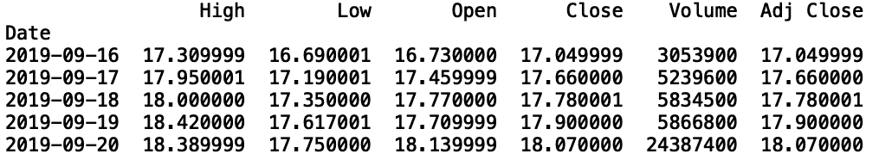

作者图片

让我们将这个逻辑封装在一个函数中，我们可以很容易地重用它，因为我们将提取几只股票:

```
def get_stock(ticker): data = web.DataReader(f"{ticker}","yahoo",start,end) data[f"{ticker}"] = data["Close"] data = data[[f"{ticker}"]] print(data.head()) return data
```

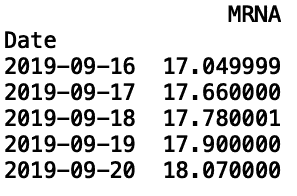

作者图片

现在，让我们支持辉瑞(PFE)和强生(JNJ):

```
pfizer = get_stock("PFE")jnj = get_stock("JNJ")
```

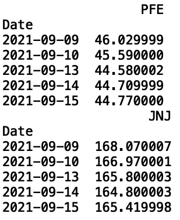

作者图片

让我们定义另一个函数，它获取一个股票列表，并为每只股票生成一个股价数据框架:

```
from functools import reducedef combine_stocks(tickers): data_frames = [] for i in tickers: data_frames.append(get_stock(i)) df_merged = reduce(lambda left,right: pd.merge(left,right,on=["Date"], how="outer"), data_frames) print(df_merged.head()) return df_mergedstocks = ["MRNA", "PFE", "JNJ"]combine_returns(stocks)
```

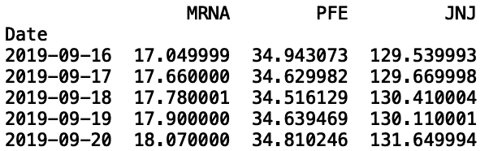

作者图片

现在，我们来看看其余行业的股票:

1.  医疗保健:现代制药(MRNA)，辉瑞制药(PFE)，强生公司(JNJ)
2.  科技:谷歌(Google)，脸书(FB)，苹果(AAPL)
3.  零售:好市多(COST)，沃尔玛(WMT)，克罗格公司(KR)
4.  金融:摩根大通(JPM)、美国银行(BAC)、汇丰控股(汇丰)

```
stocks = ["MRNA", "PFE", "JNJ", "GOOGL","FB", "AAPL", "COST", "WMT", "KR", "JPM","BAC", "HSBC"]portfolio = combine_stocks(stocks)
```

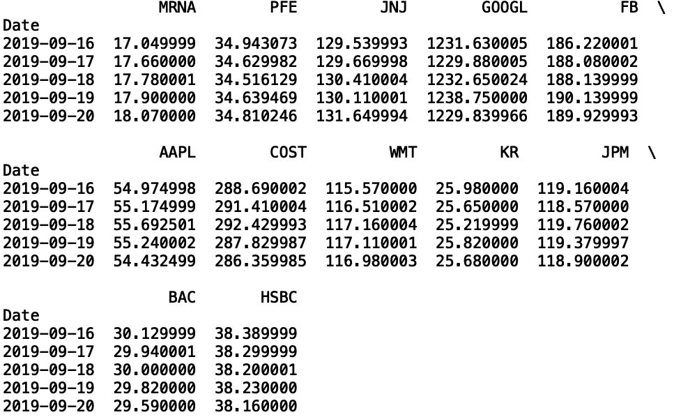

作者图片

我们现在有一个单一的股票回报数据框架。让我们将这个数据帧写入一个 CSV 文件，这样我们就可以轻松地读入数据，而不必重复地使用 Pandas-DataReader 来读取数据。

```
portfolio.to_csv("portfolio.csv", index=False)
```

现在，让我们阅读我们的 csv:

```
portfolio = pd.read_csv("portfolio.csv")
```

**均值-方差优化**

现在我们准备实施均值-方差优化方法来构建我们的投资组合。让我们从安装 [PyPortfolioOpt](https://pypi.org/project/pyportfolioopt/#an-overview-of-classical-portfolio-optimization-methods) 库开始:

```
pip install PyPortfolioOpt
```

现在，让我们计算协方差矩阵，并将计算的回报分别存储在变量 *S* 和 *mu* 中:

```
from pypfopt.expected_returns import mean_historical_returnfrom pypfopt.risk_models import CovarianceShrinkagemu = mean_historical_return(portfolio)S = CovarianceShrinkage(portfolio).ledoit_wolf()
```

接下来，让我们导入 EfficientFrontier 模块并计算权重。这里，我们将使用最大夏普统计。夏普比率是收益和风险之间的比率。风险越低，回报越高，夏普比率就越高。该算法寻找最大夏普比率，该比率转化为具有最高回报和最低风险的投资组合。夏普比率越高，投资组合的表现越好。

```
from pypfopt.efficient_frontier import EfficientFrontieref = EfficientFrontier(mu, S)weights = ef.max_sharpe()cleaned_weights = ef.clean_weights()print(dict(cleaned_weights))
```

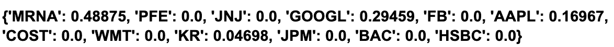

作者图片

我们还可以展示投资组合的表现:

```
ef.portfolio_performance(verbose=True)
```

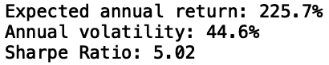

作者图片

最后，让我们将权重转换为实际分配值(即，每只股票的购买数量)。对于我们的分配，让我们考虑 100，000 美元的投资金额:

```
from pypfopt.discrete_allocation import DiscreteAllocation, get_latest_priceslatest_prices = get_latest_prices(portfolio)da = DiscreteAllocation(weights, latest_prices, total_portfolio_value=100000)allocation, leftover = da.greedy_portfolio()print("Discrete allocation:", allocation)print("Funds remaining: ${:.2f}".format(leftover))
```

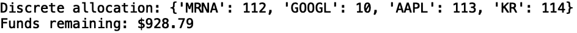

作者图片

我们的算法说我们应该投资 112 股 MRNA，10 股 GOOGL，113 股 AAPL，114 股 KR。

我们看到我们的投资组合表现出 225%的预期年回报率。这一业绩得益于疫情期间 Moderna 的快速增长。此外，夏普比率值 5.02 表明投资组合优化算法在我们的当前数据下表现良好。当然，这种回报被夸大了，而且在未来不太可能持续。

均值-方差优化的表现不是很好，因为它做出了许多简化的假设，例如收益是正态分布的，以及需要一个可逆的协方差矩阵。幸运的是，像 HRP 和 mCVAR 这样的方法解决了这些限制。

**分级风险平价(HRP)**

HRP 方法的工作原理是根据收益找到相似资产的子群，并从这些子群中构建一个层次结构，以生成每项资产的权重。

让我们从从 Pypfopt 导入 HRPOpt 方法开始:

```
from pypfopt import HRPOpt
```

然后我们需要计算回报:

```
returns = portfolio.pct_change().dropna()
```

然后运行优化算法获得权重:

```
hrp = HRPOpt(returns)hrp_weights = hrp.optimize()
```

我们现在可以打印投资组合的表现和权重:

```
hrp.portfolio_performance(verbose=True)print(dict(hrp_weights))
```

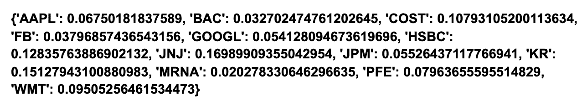

作者图片

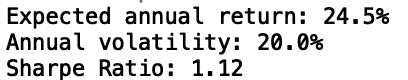

作者图片

我们看到，我们的预期年回报率为 24.5%，远远低于我们通过均值-方差优化实现的 225%的虚高回报率。我们还看到夏普比率降低到 1.12。这更加合理，并且在未来更有可能成立，因为 HRP 对异常值不像均值-方差优化那样敏感。

最后，让我们使用我们的权重来计算离散分配:

```
da_hrp = DiscreteAllocation(hrp_weights, latest_prices, total_portfolio_value=100000)allocation, leftover = da_hrp.greedy_portfolio()print("Discrete allocation (HRP):", allocation)print("Funds remaining (HRP): ${:.2f}".format(leftover))
```

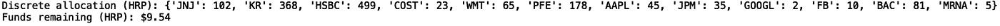

作者图片

我们看到，我们的算法表明，我们大量投资克罗格(Kroger)、汇丰(HSBC)、强生(Johnson & Johnson)和辉瑞(Pfizer)(PFE)，而不是像之前的模型那样，大量投资 Moderna。此外，虽然性能有所下降，但我们可以更有信心地认为，当我们刷新数据时，该模型的性能会一样好。这是因为 HRP 对现代股票价格的异常上涨更为稳健。

**平均条件风险值(mCVAR)**

mCVAR 是均值-方差优化的另一种流行替代方法。它通过衡量投资组合中每种资产的最坏情况来工作，在这里用损失最多的钱来表示。然后，每项资产的最坏情况损失用于计算每项资产分配的权重。

让我们导入 EEfficicientCVAR 方法:

```
from pypfopt.efficient_frontier import EfficientCVaR
```

计算重量并获得性能:

```
S = portfolio.cov()ef_cvar = EfficientCVaR(mu, S)cvar_weights = ef_cvar.min_cvar()cleaned_weights = ef_cvar.clean_weights()print(dict(cleaned_weights))
```

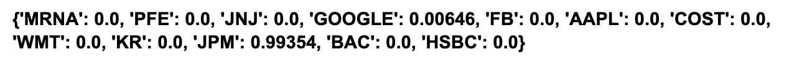

作者图片

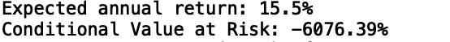

作者图片

接下来，获取离散分配:

```
da_cvar = DiscreteAllocation(cvar_weights, latest_prices, total_portfolio_value=100000)allocation, leftover = da_cvar.greedy_portfolio()print("Discrete allocation (CVAR):", allocation)print("Funds remaining (CVAR): ${:.2f}".format(leftover))
```

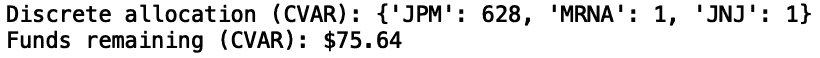

作者图片

我们看到，这种算法建议我们大举投资摩根大通(JP Morgan Chase，JPM ),同时买入 Moderna 和强生(Johnson & Johnson，JNJ)的股票。此外，我们看到预期回报率为 15.5%。这比均值-方差优化给出的夸大的 225%回报率要合理得多，因为它对现代股票价格的异常行为不那么敏感。

这篇文章的代码可以在 [GitHub](https://github.com/spierre91/builtiin/blob/main/portfolio_opt.py) 上找到。

**结论**

虽然我们只考虑了医疗保健、技术、零售和金融，但我们讨论的方法可以很容易地修改，以考虑其他行业。例如，也许你对构建能源、房地产和材料行业的公司投资组合更感兴趣。这种投资组合的一个例子就是埃克森美孚(ExxonMobil)、杜邦(DuPont)和美国铁塔(American Tower)等股票。我鼓励你在构建投资组合时尝试不同的行业。

我们讨论的内容为那些对 Python 中的投资组合优化方法感兴趣的人提供了坚实的基础。了解投资组合优化的方法和工具可以让定量分析师和数据科学家更快地进行优化投资组合的实验。

如果你有兴趣学习 python 编程的基础知识，使用 Pandas 进行数据操作，以及 python 中的机器学习，请查看[*Python for Data Science and Machine Learning:Python 编程，Pandas and Scikit-初学者学习教程*](https://www.amazon.com/dp/B08N38XW2Q/ref=sr_1_1?dchild=1&keywords=sadrach+python&qid=1604966500&s=books&sr=1-1) *。我希望你觉得这篇文章有用/有趣。*

***本帖原载于*** [***内置博客***](https://builtin.com/data-science) ***。原片可以在这里找到***[](https://builtin.com/data-science/portfolio-optimization-python)****。****