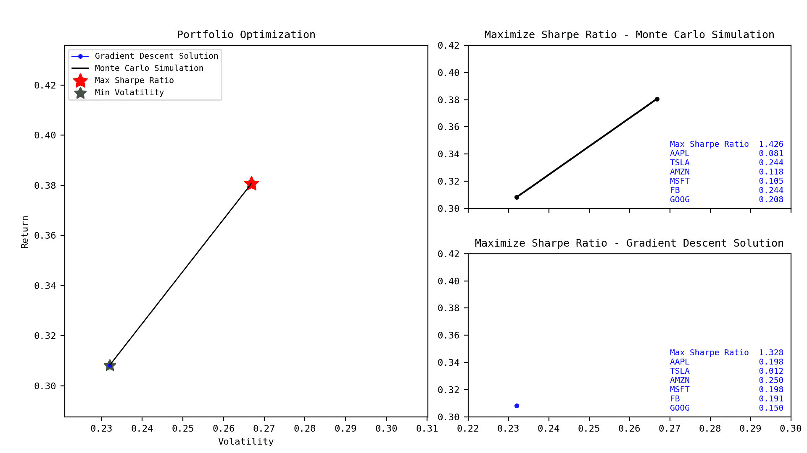
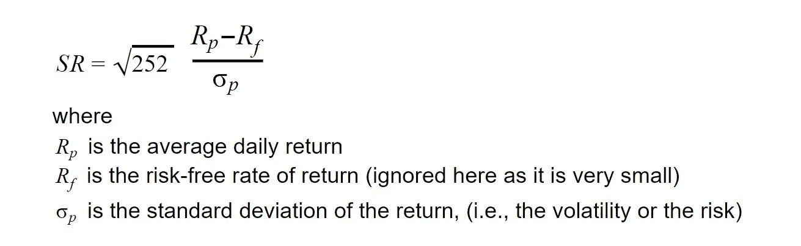
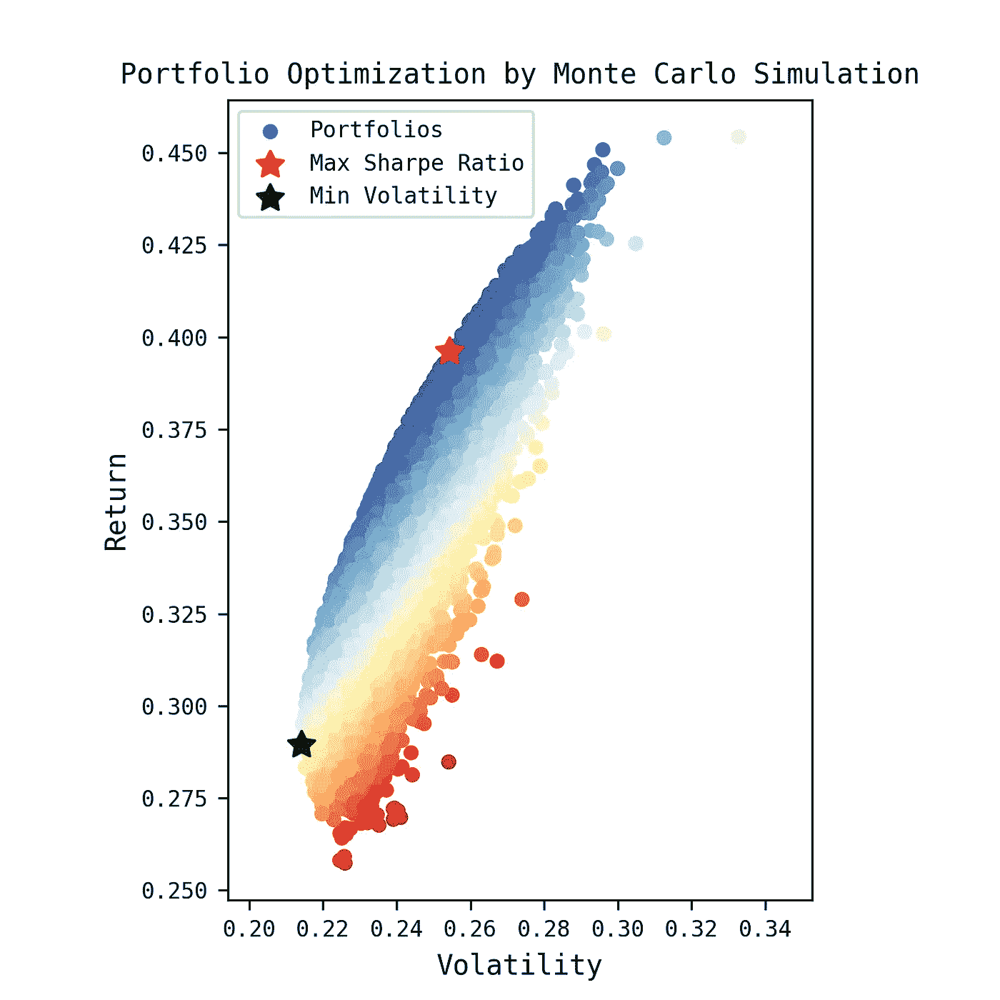
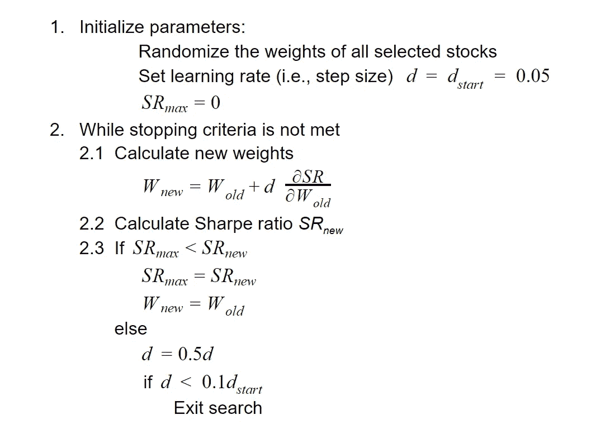
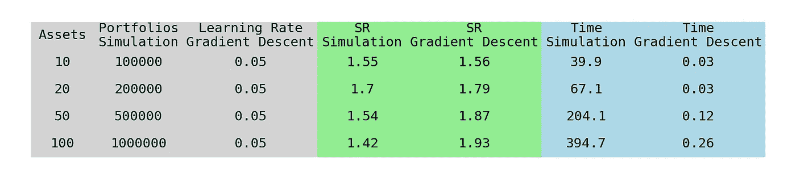

# 投资组合优化中夏普比率的最大化

> 原文：<https://pub.towardsai.net/portfolio-optimization-using-python-f63e6281373c?source=collection_archive---------0----------------------->

## [数据可视化](https://towardsai.net/p/category/data-visualization)

投资组合优化是数量金融学中最流行的问题之一。它是根据某些目标，从所有被考虑的资产集合中选择各种资产比例的过程。

它是由 Markowitz 在 20 世纪 50 年代首次提出的，表述为在给定的金融风险(波动性)水平下最大化投资组合的回报。还有其他优化目标，如最小化风险、最大化夏普比率等。有一些有趣的文章和论文讨论优化公式和求解技术[1，2，3，4]。

本文主要讨论这方面的夏普比率最大化问题。作者使用梯度下降搜索方法提出了一个温和的 Python 解决方案。它以常用的蒙特卡罗模拟为基准，如下图所示。

投资组合优化(作者图片)

本文中使用的源代码可以在[我的 GitHub 资源库](https://github.com/steveyx/PortfolioOptimization)中找到。

# 数据源

这里使用的数据是使用 **Yfinance** 包从雅虎财经下载的。你可以参考[这篇文章](https://towardsdatascience.com/financial-data-from-yahoo-finance-with-python-b5399743bcc6)关于使用这个包来检索各种类型的财务数据[5]。

以下代码行用于下载历史每日股票数据:

# 蒙特 卡罗模拟

模拟生成一定数量的投资组合，例如 1000 个。对于每个投资组合，股票的权重在 0 和 1 之间随机分配。假设不允许卖空(负权重)。所有股票权重之和等于 1。

使用以下公式计算年度夏普比率。

如下图所示，使用 **Matplotlib** 软件包绘制波动率与回报率的关系图。具有最大夏普比率和最小波动性的投资组合也被突出显示。

使用蒙特卡罗模拟的投资组合优化(图片由作者提供)

此外，在我配有 2.5GHz CPU 和 8Gb RAM 的 PC 上，这 1000 个投资组合的计算时间约为 0.43 秒。

# 梯度下降解

梯度下降是用于凸优化的最流行的搜索方法之一[6]。因为这里的目标是最大化夏普比率，这种方法也可以称为梯度上升法[7]。该算法在以下步骤中给出。

为了加快优化速度，这里的算法使用多个学习率，如上面的步骤所述。它从更大的学习率开始。如果算法找到更好的夏普比率，它将继续以当前的学习速率进行搜索。否则学习率减半。

搜索停止标准是 1)没有找到更好的夏普比率，以及 2)学习率足够小，例如小于开始学习率的 10%。

下图显示了两种方法中最佳夏普比率的搜索路径。在蒙特卡罗模拟中，从 1000 个随机投资组合中获得的最大夏普比率是 1.477，而梯度下降解决方案仅在几次迭代中就可以获得 1.478 的更好的值。

夏普比率最大化路径的两种方法(图片由作者提供)

如上图所示，梯度下降法只需几次迭代就能找到解。该方法的计算时间为 0.02 秒，比蒙特卡罗模拟(0.43 秒)快 10 倍以上。

为了测试算法的性能，还包括大量资产，如下表所示。资产的数量从 10 到 100 不等。从模拟中产生的随机投资组合的数量与资产的数量成比例。算法中使用的学习率与上一节相同。

使用大量资产进行基准测试(图片由作者提供)

上表显示，随着资产数量的增加，通过算法获得的最大夏普比率越来越好于模拟。这也表明，对于所有这些情况，该算法导致优化目标的收敛。

另一方面，模拟需要生成更多的投资组合，以获得可比的目标。从 100 项资产的结果中可以看出，这大大降低了计算速度。

在需要以更实时的方式评估大量资产的情况下，这种梯度下降解决方案的优势比模拟更明显。

# 结论

本文主要研究投资组合优化中的夏普比率最大化问题。它使用梯度下降法给出了一个简单但更有效的解决方案。该解决方案的优势在基准测试中相对于常用的蒙特卡罗模拟得到了体现。

关于本主题中其他优化方法和技术的进一步阅读，您可以参考那些文章[1，6，8]。

# 参考

1.  《金融中的优化技巧》，安德鲁·莱斯尼夫斯基，[https://mfe . Baruch . CUNY . edu/WP-content/uploads/2014/12/Opt _ lecture 5 _ 2019 . pdf](https://mfe.baruch.cuny.edu/wp-content/uploads/2014/12/Opt_Lecture5_2019.pdf)
2.  Python 中的高效前沿投资组合优化，[https://towards data science . com/efficient-Frontier-Portfolio-optimization-in-Python-e 7844051 e7f](https://towardsdatascience.com/efficient-frontier-portfolio-optimisation-in-python-e7844051e7f)
3.  了解投资组合优化，[https://towards data science . com/understanding-Portfolio-Optimization-795668 cef 596](https://towardsdatascience.com/understanding-portfolio-optimization-795668cef596)
4.  从零开始的投资组合优化，[https://medium . com/swlh/portfolio-Optimization-From-Scratch-925 f66c 4020d](https://medium.com/swlh/portfolio-optimization-from-scratch-925f66c4020d)
5.  来自雅虎财经的财经数据与 Python，[https://towards Data science . com/financial-Data-from-Yahoo-Finance-with-Python-b 5399743 bcc 6](https://towardsdatascience.com/financial-data-from-yahoo-finance-with-python-b5399743bcc6)
6.  梯度下降及其变体快速指南，[https://towards data science . com/quick-Guide-to-Gradient-Descent-and-Its-Variants-97a AFB 33 add](https://towardsdatascience.com/quick-guide-to-gradient-descent-and-its-variants-97a7afb33add)
7.  Python 中带强化学习的交易第二部分:应用，[https://teddykoker . com/2019/06/trading-with-Reinforcement-Learning-in-Python-Part-II-Application/](https://teddykoker.com/2019/06/trading-with-reinforcement-learning-in-python-part-ii-application/)
8.  寻找基于优越夏普比率的投资组合，[https://medium . com/@ pai . viji/in-search-of-superior-Sharpe-Ratio-based-Portfolios-3653 D1 AE 989](https://medium.com/@pai.viji/in-search-of-superior-sharpe-ratio-based-portfolios-3653d1ae989)