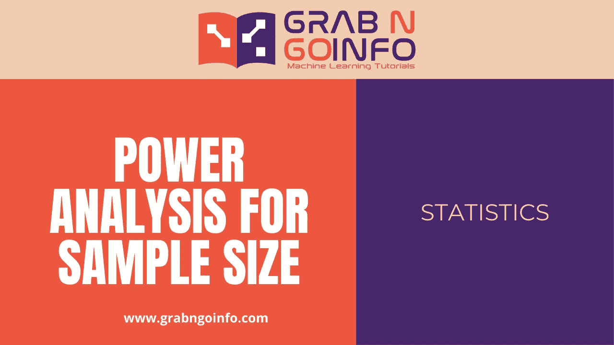
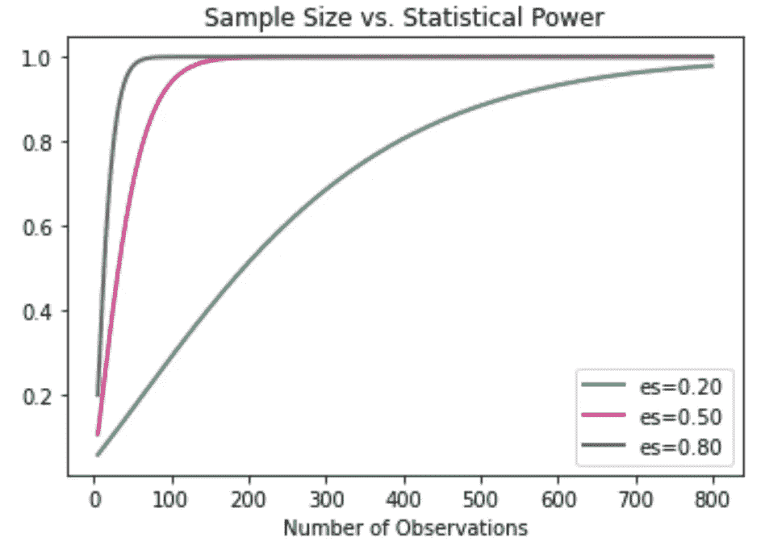
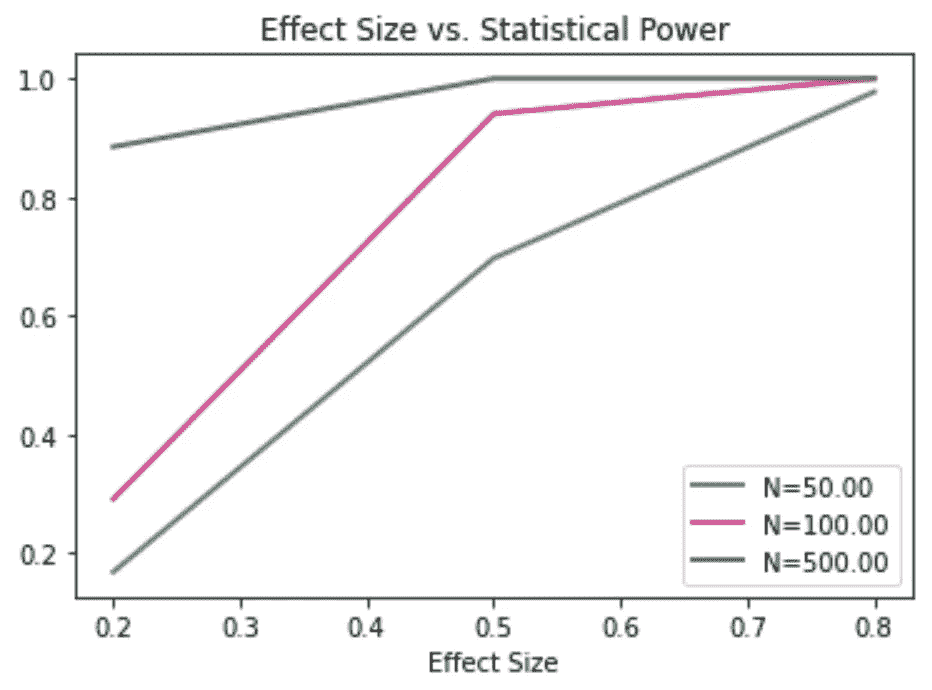
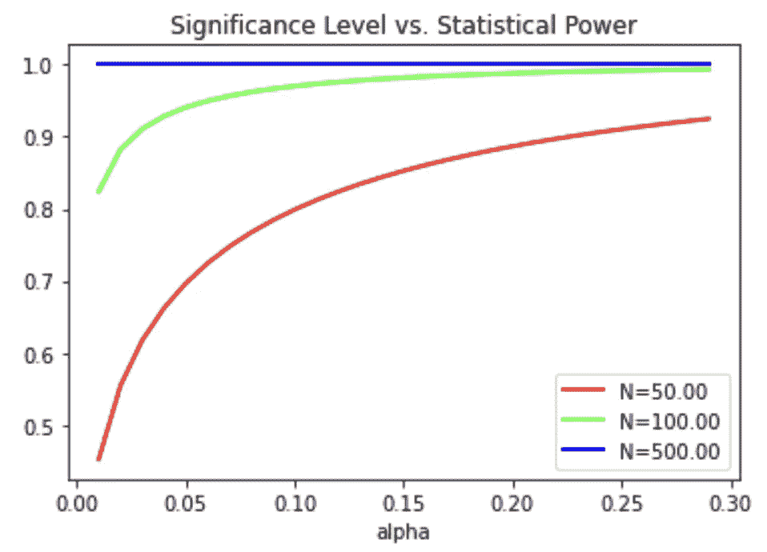

# 使用 Python 对样本大小进行功效分析

> 原文：<https://pub.towardsai.net/power-analysis-for-sample-size-using-python-33da7d5f570d?source=collection_archive---------0----------------------->

如何使用 Python 计算假设检验(AB 检验)的样本量



图片归[GrabNGoInfo.com](http://grabngoinfo.com/)所有

功效分析是基于显著性水平、效应大小、统计功效和样本大小的统计分析。给定其他三个值，我们可以用它来计算四个值中的任何一个。功效分析和样本大小计算是数据分析师、数据科学家和机器学习工程师职位的常见面试问题。

在本教程中，我们将介绍

*   什么是显著性水平、效应大小、统计功效和样本量？
*   如何使用 Python 计算假设检验(AB 检验)的样本量？
*   统计功效怎么算？
*   如何计算最小可检测效应大小？
*   显著性水平如何计算？
*   样本大小、显著性水平和效应大小如何影响统计功效？

**本岗位资源:**

*   [YouTube](https://www.youtube.com/watch?v=rrFDeTEX37Q&list=PLVppujud2yJp5G5WwOWR4P2nXfdT5Pkxc&index=1) 上的视频教程
*   点击[此处](https://mailchi.mp/f561ff83e739/mfl1gl8ksd)获取 Colab 笔记本。
*   关于[统计](https://www.youtube.com/playlist?list=PLVppujud2yJp5G5WwOWR4P2nXfdT5Pkxc)的更多视频教程
*   更多关于[统计数据的博文](https://medium.com/@AmyGrabNGoInfo/list/statistics-4dbda6b2001e)

我们开始吧！

# 步骤 0:什么是显著性水平、效应大小、统计功效和样本大小

功效分析通常用于假设检验中样本量的计算。这一步将讨论功效分析的四个组成部分:显著性水平、效应大小、统计功效和样本大小。

*   显著性水平也称为 alpha。它是当零假设为真时拒绝零假设的概率。阿尔法告诉我们假阳性率或 I 型错误。常用的 alpha 值是 0.05。
*   效应大小是零假设和替代假设之间的差异大小。
*   在其他因素相同的情况下，我们需要更大的样本量来检测更小的效应量。
*   效应大小越显著，治疗组和对照组之间的差异由随机误差引起的可能性就越小。相反，当数据集中存在更多可变性时，差异更可能是由随机误差造成的。
*   Cohen's d 在考虑标准偏差的同时测量了治疗组和对照组的平均值之间的距离。通常，科恩的 d 值 0.2 被认为是小效果尺寸，0.5 是中等效果尺寸，0.8 是大效果尺寸。
*   从商业角度来看，效果大小需要有意义。
*   统计功效是正确拒绝零假设的概率。或者我们可以说它是检测到一个效应的概率，如果它存在的话。幂等于 1 减去β，其中β是假阴性率或 II 型误差。0.8 是功率的常用值。
*   样本量是每组所需的最小样本量。

# 步骤 1:导入库

第一步，我们将为功耗分析导入库。

`numpy`用于数据计算。`TTestIndPower`从`statsmodels`进口，用于双样本独立 t 检验的功效分析。`matplotlib`是为了可视化。

```
# Data calculation
import numpy as np# Power analysis
from statsmodels.stats.power import TTestIndPower# Visualization
import matplotlib.pyplot as plt
```

# 第二步:计算样本量

在第 2 步中，我们将计算双样本 t 检验所需的样本量。为了计算样本大小，我们需要提供效果大小、alpha 和功效值。

效应大小是指标准化的效应大小。治疗组和对照组平均值之间的差异除以合并的标准偏差。`effect_size`值必须是正数。我们对效果大小使用值 0.2，这是一个小的效果大小值。

`alpha`为显著性水平，`power`为统计功效。我们对`alpha`用常用值 0.05，`power`用常用值 0.8。

我们做的是双边假设检验，所以`alternative = 'two-sided'`。

```
# Initiate the power analysis
power_analysis = TTestIndPower()# Calculate sample size
sample_size = power_analysis.solve_power(effect_size = 0.2, alpha = 0.05, power = 0.8, alternative = 'two-sided')# Print results
print('The sample size needed for each group is', round(sample_size))
```

功效分析给了我们 393 的样本量。这意味着我们在每个 AB 测试组中至少需要 393 个样本来检测 80%功效和 5%显著性水平的微小差异。

```
The sample size needed for each group is 393
```

# 第三步:计算功率

在第 3 步中，我们将使用效应大小、显著性水平和样本大小来计算功效。

我们使用样本大小 393 来计算功效，样本大小 393 是根据上一步计算的。

`ratio = 1`表示对照组和治疗组的样本数量相同。

```
# Initiate the power analysis
power_analysis = TTestIndPower()# Calculate power
power = power_analysis.power(effect_size = 0.2, alpha = 0.05, nobs1 = 393, ratio = 1, alternative = 'two-sided')# Print results
print('The power for the hypothesis testing is', round(power, 2))
```

我们得到 0.8 的幂，这与之前在样本量计算中的结果一致。

```
The power for the hypothesis testing is 0.8
```

# 第四步:计算效果大小

有不同的方法来计算效果大小。Cohen 的 d 是计算效应大小最广泛使用的方法之一。在第 4 步中，我们将使用科恩的 d 方程计算效应大小。

Cohen 的 d 方程需要治疗组和对照组的平均值、标准偏差和样本量。它首先计算混合标准差，然后使用平均差除以混合标准差。

```
# Input parameters
mu1 = 2.1 # Group 1 average value
mu2 = 1.9 # Group 2 average value
s1 = 0.6 # Group 1 standard deviation
s2 = 0.5 # Group 2 standard deviation
n1 = 400 # Group 1 sample size
n2 = 400 # Group 2 sample size# Calculate the pooled standard deviation
s = np.sqrt(((n1 - 1) * s1 + (n2 - 1) * s2) / (n1 + n2 - 2))# Calculate the Cohen's d effect size
d = (mu1 - mu2) / s# Print results
print('The effect size for the hypothesis testing is', round(d, 2))
```

我们得到的效应大小为 0.27，这是一个相对较小的科恩 d 值。

```
The effect size for the hypothesis testing is 0.27
```

# 步骤 5:计算显著性水平

在第 5 步中，我们将计算给定其他三个值的显著性水平。

```
# Initiate the power analysis
power_analysis = TTestIndPower()# Calculate power
alpha = power_analysis.solve_power(effect_size = 0.2, power = 0.8, nobs1 = 393, ratio = 1, alternative = 'two-sided')# Print results
print('The significance level for the hypothesis testing is', round(alpha, 2))
```

我们得到 0.05 的显著性水平，这与先前的结果一致。

```
The significance level for the hypothesis testing is 0.05
```

# 步骤 6:样本量与统计功效

在第 6 步中，我们将考察统计功效如何随着样本量的变化而变化。

`dep_var`指定 x 轴的尺寸。`dep_var='nobs'`表示我们使用样本大小作为 x 轴，使用功效作为 y 轴。

`nobs`是样本量的值。我们使用 5 到 800 的值来绘制图表。

`effect_size`是功效分析的效果大小值。我们使用广泛使用的 Cohen 的 d 值来表示小、中和大的效果尺寸。每个`effect_size`在图上有一条曲线。

`alpha`为显著性水平。我们在这个图中使用了 0.05。

```
# Initiate the power analysis
power_analysis = TTestIndPower()# Visualization
power_analysis.plot_power(dep_var='nobs',
                          nobs=np.arange(5, 800),
                          effect_size=np.array([0.2, 0.5, 0.8]),
                          alpha=0.05,
                          title='Sample Size vs. Statistical Power')
plt.show()
```



图片归[GrabNGoInfo.com](http://grabngoinfo.com/)所有

从图表中，我们可以看到

*   统计功效随着样本量的增加而增加。
*   为了达到相同的统计功效，我们需要更多的样本来检测更小的效应大小。

# 步骤 7:效应大小与统计功效

在第 7 步中，我们将考察统计功效如何随效应大小而变化。

`'effect_size'`用作 x 轴。我们绘制了三种样本大小(50、100 和 500)的曲线。

```
# Initiate the power analysis
power_analysis = TTestIndPower()# Visualization
power_analysis.plot_power(dep_var='effect_size',
                          nobs=np.array([50, 100, 500]),
                          effect_size=np.array([0.2, 0.5, 0.8]),
                          alpha=0.05,
                          title='Effect Size vs. Statistical Power')
plt.show()
```



图像归[GrabNGoInfo.com](http://grabngoinfo.com/)所有

从图表中，我们可以看到

*   统计功效随着效应大小而增加。
*   当效果尺寸较小时，需要较大的样本尺寸来实现良好的功效值。
*   随着效果大小的增加，样本大小对功效的影响越来越小。

# 步骤 8:显著性水平与统计功效

在第 8 步中，我们将考察统计功效如何随显著性水平而变化。

`'alpha'`用作 x 轴。我们绘制了 alpha 范围从 0.01 到 0.30 的曲线。`effect_size`固定在 0.5。

```
# Initiate the power analysis
power_analysis = TTestIndPower()# Visualization
power_analysis.plot_power(dep_var='alpha',
                          nobs=np.array([50, 100, 500]),
                          effect_size=0.5,
                          alpha=np.arange(0.01,0.30, 0.01),
                          title='Significance Level vs. Statistical Power')
plt.show()
```



图片归[GrabNGoInfo.com](http://grabngoinfo.com/)所有

从图表中，我们可以看到

*   统计功效随着显著性水平而增加。
*   当α较小时，需要较大的样本量来获得较好的功率值。
*   随着 alpha 的增加，样本大小对功率的影响变小。

# 摘要

在本教程中，我们讨论了如何使用统计功效分析进行假设检验。该方法可用于计算 AB 检验所需的最小样本量。我们覆盖了

*   什么是显著性水平、效应大小、统计功效和样本量？
*   如何使用 Python 计算假设检验(AB 检验)的样本量？
*   统计功效怎么算？
*   如何计算最小可检测效应大小？
*   显著性水平如何计算？
*   样本大小、显著性水平和效应大小如何影响统计功效？

更多教程可在 GrabNGoInfo [YouTube 频道](https://www.youtube.com/channel/UCmbA7XB6Wb7bLwJw9ARPcYg)和 GrabNGoInfo.com[网站](https://grabngoinfo.com/tutorials/)上获得

# 推荐教程

*   [GrabNGoInfo 机器学习教程盘点](https://medium.com/grabngoinfo/grabngoinfo-machine-learning-tutorials-inventory-9b9d78ebdd67)
*   [用于异常检测的单级 SVM](https://medium.com/p/one-class-svm-for-anomaly-detection-6c97fdd6d8af)
*   [使用 Python 中的 Prophet 进行多时间序列预测的 3 种方法](https://medium.com/p/3-ways-for-multiple-time-series-forecasting-using-prophet-in-python-7a0709a117f9)
*   [使用 Python 实现不平衡分类的四种过采样和欠采样方法](https://medium.com/p/four-oversampling-and-under-sampling-methods-for-imbalanced-classification-using-python-7304aedf9037)
*   [利用 Python 中的 Prophet 进行具有季节性和假日效应的多元时间序列预测](https://medium.com/p/multivariate-time-series-forecasting-with-seasonality-and-holiday-effect-using-prophet-in-python-d5d4150eeb57)
*   [如何检测离群值|数据科学面试问答](https://medium.com/p/how-to-detect-outliers-data-science-interview-questions-and-answers-1e400284f6b4)
*   [利用 Python 中的 Prophet 进行时间序列异常检测](https://medium.com/p/time-series-anomaly-detection-using-prophet-in-python-877d2b7b14b4)
*   [如何配合谷歌 Colab 笔记本使用 R](https://medium.com/p/how-to-use-r-with-google-colab-notebook-610c3a2f0eab)

# 参考

[1] [statsmodels 功率分析文档](https://www.statsmodels.org/dev/generated/statsmodels.stats.power.TTestIndPower.html)

[](https://medium.com/@AmyGrabNGoInfo/membership) [## 通过我的推荐链接加入媒体-艾米 GrabNGoInfo

### 作为一个媒体会员，你的会员费的一部分会给你阅读的作家，你可以完全接触到每一个故事…

medium.com](https://medium.com/@AmyGrabNGoInfo/membership)