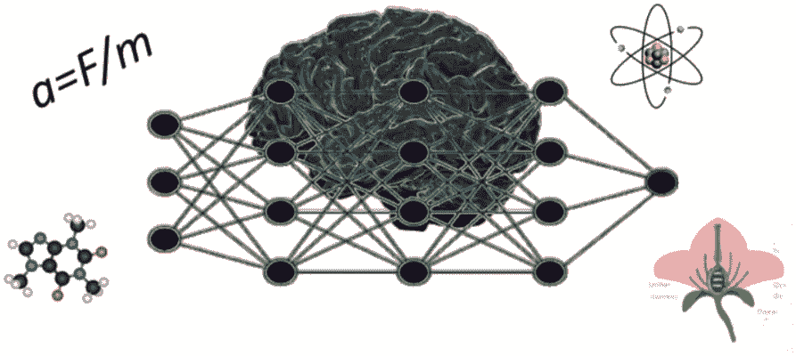

# 我的测试和原型应用程序中 Gpt-3 的功能、局限性和用例，您可以立即复制

> 原文：<https://pub.towardsai.net/power-limitations-and-use-cases-of-gpt-3-from-my-tests-and-prototype-apps-you-can-replicate-right-89bfb40daf5e?source=collection_archive---------0----------------------->

## 例如，智能聊天机器人甚至可以听和说，自然地指挥程序，或作为全职在线导师帮助学生。全都在网上。

自从 OpenAI 在几年前发布它以来，我一直在使用 GPT-3 并对它进行各种测试。在参加了旨在量化 GPT-3 对科学了解程度的考试后，我开始用它来帮助我自己的写作过程(事实证明，克服“白页阻塞”特别酷)，还创建了各种用途的聊天机器人，从欢迎和引导我网站的访问者到聊你喜欢的任何话题，甚至通过自然对话，以及通过自然语音控制应用程序。让我们在这里回顾一下我写的所有关于这一切的文章。

作者创作的图形。

# 首先，GPT-3 是什么？

GPT-3 是由 OpenAI 开发的用于自然语言处理的最新一代人工神经网络。它读入文本并产生新的文本，其方式使得输入/输出对可以对应于问题/答案、文本/摘要、指南/长文本、语言 1 的句子/翻译成另一种语言、请求自然语言的命令/对应的源代码等。

输入通常伴随着 GPT-3 不知道的信息头和/或它必须提供的输入和输出种类的例子。这种完整的输入实际上在 GPT 协议 3 中被称为“提示”，而输出则是“完成”。将定制融入提示的策略被称为“少量学习”。虽然你可以在 [OpenAI 的网站](https://beta.openai.com/docs/guides/fine-tuning)上了解更多关于它的一般情况，但我的大多数例子都包括一些简单的学习，所以你会很容易掌握它是如何工作的，以及它如何帮助你更好地使用 GPT-3。

OpenAI 让 GPT-3 变得非常简单，只需通过一个 API 就可以在线访问。它的使用不是免费的，但很便宜，他们免费提供积分来试用。我的不同文章详细讨论了这两点，因为我的所有例子都通过 JavaScript/PHP 包装器调用 GPT-3，并且不局限于我的 API 键，而是让您插入自己的 API 键。

# 费用和相关说明

当你从 OpenAI 获得一个帐户来使用 Gpt-3 时，你也可以获得一些免费的积分来开始使用它，你甚至可以通过简单的请求获得更多的积分(尽管他们不会授予你)。然后，你将不得不为你使用的代币付款。它并不太贵(特别是，这个月刚刚变得[便宜，看这里](https://medium.com/geekculture/as-of-september-2022-using-openais-gpt-3-will-be-2-3-times-cheaper-6282387041))当然，如果你在付费服务或程序中使用 GPT-3，你可以以某种方式将 GPT-3 接入包括在你的成本中。或者，正如我在所有例子中所做的那样，你让用户编写自己的 API 密钥，这意味着如果他们使用免费密钥，他们可以尝试你的应用程序，而无需在 GPT-3 上花费，如果他们想继续使用你的 GPT-3 驱动的应用程序，则可以购买更多的 GPT-3 信用额。

# 通过 PHP 调用 GPT-3，然后在网络应用程序中使用它！

如果你浏览我的编程和开发文章，不仅仅是那些关于 GPT 3 的文章，而是所有的文章，你会发现我所做的 90%以上都是为网络量身定制的。我强烈支持 web 开发，尤其是在可能的情况下基于客户端的开发，因为这有很多好处，我不会在这里深究(你可以看看[这篇文章和](https://lucianosphere.medium.com/coming-up-a-series-of-articles-on-short-practical-codes-to-add-cool-features-to-your-web-app-2ccbe4816428) [这篇文章](https://medium.com/geekculture/to-me-simply-the-best-free-web-hosting-out-there-honest-review-not-paid-advertisement-4829689913a)来了解这些动机)。

要从您的 web 应用程序中使用 GPT-3，您不能直接从 JavaScript 调用 API。相反，您可以调用一个 PHP 函数，该函数从托管您的 web 应用程序的服务器调用 API。我在本教程中解释了如何做到这一点，适应于由 [Altervista](https://medium.com/geekculture/to-me-simply-the-best-free-web-hosting-out-there-honest-review-not-paid-advertisement-4829689913a) 提供的 PHP 支持的免费托管服务。

 [## 用非常简单的代码为你的网站构建定制的基于 GPT 3 的聊天机器人

### 了解 GPT-3，PHP 和 JavaScript，因为你建立了一个在线 GPT-3 为基础的聊天机器人专门在一个给定的主题，你…

towardsdatascience.com](https://towardsdatascience.com/custom-informed-gpt-3-models-for-your-website-with-very-simple-code-47134b25620b) 

简言之，您需要两个 PHP 文件(一个库和一个调用者)和一小段 JavaScript 代码来通过调用者调用 GPT-3。在我文章的例子里都很清楚。

# GPT-3“知道”多少，我们如何“向它解释”我们想要它做什么？内在“知识”和少量学习

现在我们来看我的早期测试，那时我自己还没有体验到 GPT-3 的敬畏。特别是，在开始的时候，我非常好奇 GPT-3 知道多少东西。所以，作为一名科学家，我决定在对各种科学的评估中，用越来越难的问题来推动这个模型。下面是我如何设置我的评估，包括一些关于化学、生物和物理的基本问题，然后我接下来的两篇文章介绍了我更深入的评估，以及一些非常有趣的结论。一些积极的喜欢:

 [## 经过长期训练的类似 GPT 3 的模特可能成为未来生物学生的全天候导师

### 尽管其他科目的成绩相当令人沮丧，但 GPT-3 在生物方面表现相当好，如果它…

towardsdatascience.com](https://towardsdatascience.com/gpt-3-like-models-with-extended-training-could-be-the-future-24-7-tutors-for-biology-students-904d2ae7986a) 

而另一些则相当消极，有点出乎意料，但这里详细探讨了:

 [## 在基础物理上测试 GPT-3 揭示了一些重要的问题

### 该软件似乎是可靠的咨询理论概念，但不是他们的应用，与潜在的…

towardsdatascience.com](https://towardsdatascience.com/testing-gpt-3-on-elementary-physics-unveils-some-important-problems-9d2a2e120280) 

在这两篇文章之后，有人有点生气地说，我似乎在暗示 GPT-3 可以“思考”。当然，它不是，因为它只是一个统计模型，根据输入标记“简单地”传播最可能的标记(输出)。如果输入的标记组成了一个连贯的问题，其答案 GPT-3 已经在训练中见过，那么它有很大的机会正确回答。这就是它在我的生物测试中表现更好的原因。我在一篇[的专门文章](https://towardsdatascience.com/a-note-on-gpt-3-and-its-obviously-null-thinking-capabilities-de84a26ac0f3)中澄清了这一切。

# 智能 GPT-3 机器人聊天，交谈，并控制命令

GPT-3 是如此多功能，并且经过如此庞大和丰富的数据集(涵盖几种人类语言，甚至包括源代码等非人类语言)的训练，它可以执行非常复杂的任务，并轻松地进行看起来非常真实的对话。这些任务包括摘要、文本创建、翻译、源代码编写、问题回答和其他支持一系列应用程序的疯狂功能。

问答是聊天机器人的基础，我在一些文章中探讨了这一点，这些文章还包括通过上面介绍的 PHP 模块进行的基于 web 的调用，还对机器人的“知识”进行了裁剪，以正确回答它在培训期间无法了解的某些主题的问题——例如我的简历，我为欢迎我的网站的访问者而构建的机器人。

 [## 用非常简单的代码为你的网站构建定制的基于 GPT 3 的聊天机器人

### 了解 GPT-3，PHP 和 JavaScript，因为你建立了一个在线 GPT-3 为基础的聊天机器人专门在一个给定的主题，你…

towardsdatascience.com](https://towardsdatascience.com/custom-informed-gpt-3-models-for-your-website-with-very-simple-code-47134b25620b)  [## 基于网络的聊天机器人项目，模块 2:GPT-3-生成的答复与数据库辅助…

### 这个项目的第二部分跨越网络编程，数学，人工智能，等等

towardsdatascience.com](https://towardsdatascience.com/web-based-chatbot-project-module-2-gpt-3-generated-responses-assisted-with-a-database-for-1ee2a0f4aad4) 

此外，如果你将 GPT-3 与语音识别和合成引擎结合起来，创造出你可以通过说话进行[自然对话](https://medium.com/technology-hits/go-talk-with-this-chatbot-online-now-162f13971747) [的机器人，那将会令人印象深刻！我是这样编码的:](https://medium.com/geekculture/naturally-talking-with-a-chatbot-that-you-can-try-out-online-too-2dc1e48f415c)

 [## 耦合 GPT-3 与语音识别和合成，以实现一个完整的聊天机器人，运行…

### 我是如何创建这个网络应用程序的，通过它你可以和 GPT-3 自然地谈论任何你想谈论的话题，所有这些都是基于网络的

towardsdatascience.com](https://towardsdatascience.com/coupling-gpt-3-with-speech-recognition-and-synthesis-to-achieve-a-fully-talking-chatbot-that-runs-abfcb7bf580) 

同样，利用 GPT-3 的能力，如果在提示中进行适当调整，可以将自然语言转换为应用程序特定的命令，这里我制作了一个应用程序，通过自然语音控制分子浏览器，GPT-3 将自然语音转换为命令:

 [## 通过自然语言控制网络应用程序，使用 GPT 3 将语音转换为命令

### 最后一篇文章展示了 GPT3 的实际应用，详细解释了工作流程和…

towardsdatascience.com](https://towardsdatascience.com/control-web-apps-via-natural-language-by-casting-speech-to-commands-with-gpt-3-113177f4eab1) 

# 轮到你了:你建造了什么或想要创造什么？

请在评论中告诉我，我会在这里添加最酷的项目！

# 了解更多你可以马上使用的人工智能技术

关于 GATO，Deepmind 的最新通才 AI:

 [## 加托，来自 Deepmind 的最新作品。走向真 AI？

### 加托可以玩游戏、生成文本、处理图像和控制机械臂。而且还不算太大。是真 AI…

towardsdatascience.com](https://towardsdatascience.com/gato-the-latest-from-deepmind-towards-true-ai-1ac06e1d18cd)  [## 当真正的人工智能出现时，我们会做什么？

### 来自 Deepmind 的最新消息和一些基于社区的预测让我想到:真正的人工智能可能会比我更早到来…

medium.com](https://medium.com/geekculture/what-will-we-do-when-true-ai-is-here-8145fc7286a2) 

关于达尔-E-2 和其他图像发生器:

 [## 我现在在我的文章中使用人工智能生成的图像

### 一些高超的现代工具允许你使用他们的创作，甚至用于商业目的-来，看看他们有什么能力…

medium.com](https://medium.com/new-writers-welcome/im-now-using-ai-generated-images-for-my-articles-7959b5db9971)  [## 1 位艺术家，16 种风格-你猜对了，不是人类

### 玩一个新的“人工智能”程序，它可以在几秒钟内根据 word 提示创建绘画。的…

lucianosphere.medium.com](https://lucianosphere.medium.com/1-artist-16-styles-you-guessed-it-it-aint-human-42971b70595) 

像 GPT-3 一样处理文本，但具有更简单的网络和期望，但具有巨大的实际潜在效用:

 [## 这个自动摘要工具会给写作带来革命吗？

### 我刚刚发现这个新工具，看起来很有希望帮助作家，至少对我来说，我的文章旨在…

medium.com](https://medium.com/technology-hits/could-this-automatic-summarization-tool-revolutionize-writing-c042908c170d) 

www.lucianoabriata.com*我写作并拍摄我广泛兴趣范围内的一切事物:自然、科学、技术、编程等等。* [***成为媒介会员***](https://lucianosphere.medium.com/membership) *访问其所有故事(我免费获得小额收入的平台的附属链接)和* [***订阅获取我的新故事***](https://lucianosphere.medium.com/subscribe) ***通过电子邮件*** *。到* ***咨询关于小职位*** *查看我的* [***服务页面这里***](https://lucianoabriata.altervista.org/services/index.html) *。你可以* [***这里联系我***](https://lucianoabriata.altervista.org/office/contact.html) ***。***