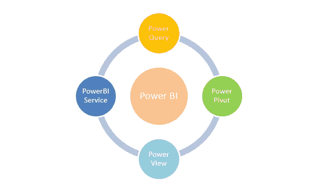
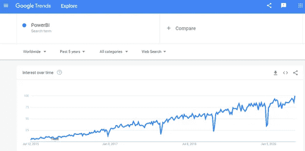

# PowerBI:可视化工具介绍

> 原文：<https://pub.towardsai.net/powerbi-introduction-of-a-visualization-tool-f71c0f81eaf8?source=collection_archive---------3----------------------->

## [数据可视化](https://towardsai.net/p/category/data-visualization)

## 面向所有数据分析的商业智能

由[威廉·艾文](https://unsplash.com/@firmbee?utm_source=medium&utm_medium=referral)在 [Unsplash](https://unsplash.com?utm_source=medium&utm_medium=referral) 上拍摄

**PowerBI 简介**

数据分析成为全球最受欢迎的工作。为了促进业务增长，数据扮演着重要的角色。玩数据是数据科学家的常见角色，人工智能、机器学习将数据中的信息可视化。

业务增长伴随着对与销售、财务和成功率相关的数据的描述性分析。它需要一个强有力的统计数据来分析过去发生的所有表现。

对于这种分析，不同公司开发了一些工具来进行分析，并通过图表和图形进行可视化。

发现数据中的模式非常重要。简而言之，分析正在将数据转化为视觉洞察，以做出业务增长决策。

趋势最好的分析工具是 PowerBI。Power BI 是一个商业智能工具，有助于分析数据、清理数据并将数据转换为可视化格式。PowerBI 由微软公司开发，2014 年首次发布。

除了 PowerBI，还有更多替代工具。有些是:

1.looker——使用 SQL 模式进行数据分析——成立于 2012 年。
2。Tableau —数据可视化工具—创建于 2003 年。
3。Qlik Sense —数据发现和分析工具—成立于 2014 年
4。Sisense —敏捷 BI —数据分析工具—成立于 2004 年
5。domo——基于云的数据分析工具——成立于 2010 年
6。IBM Cognos Analytics——基于 Web 的 BI 套件，用于提取数据、分析数据并生成报告。

为什么 PowerBI 在所有 BI 工具中很出名。它有更多的可视化图形和图表。业务人员可以使用 PowerBI 制作报告和仪表板。

PowerBI 是一组工具，主要包括:

*   **Power Query** —这是一个 ETL 工具，用于清理数据和加载数据。
*   **动力支点** —用于数据建模。创建不同数据源之间的关系。
*   **功率视图** —用于可视化。它可以创建 250 多种不同类型的图表。
*   **Power BI 服务**–该服务用于与其他用户共享报告。

如果我们在谷歌趋势网站上搜索 PowerBI 超过 5 年，我们可以很容易地观察到 powerBI 的搜索量。

图片来自谷歌趋势

人们搜索 PowerBI 更多是因为它在创建仪表板的数据 ETL 工具中的最大特性。在其他工具中，PowerBI 的成本是最便宜的。

PowerBI 提供 90 多个数据连接器来连接数据源。

**例子:**

CSV、Excel、pdf、SQL、MS Access、Outlook、网站等等。

它可以从 PowerBI 中的结构化、半结构化和非结构化数据源中提取数据。PowerBI 是一个完整的自动化软件包，用于数据清理、数据建模、创建报告和可视化。

我希望你喜欢这篇文章。通过我的 [LinkedIn](https://www.linkedin.com/in/data-scientist-95040a1ab/) 和 [twitter](https://twitter.com/amitprius) 联系我。

# 推荐文章

1.  [NLP —用 Python 从零到英雄](https://medium.com/towards-artificial-intelligence/nlp-zero-to-hero-with-python-2df6fcebff6e?sk=2231d868766e96b13d1e9d7db6064df1)

2. [Python 数据结构数据类型和对象](https://medium.com/towards-artificial-intelligence/python-data-structures-data-types-and-objects-244d0a86c3cf?sk=42f4b462499f3fc3a160b21e2c94dba6)