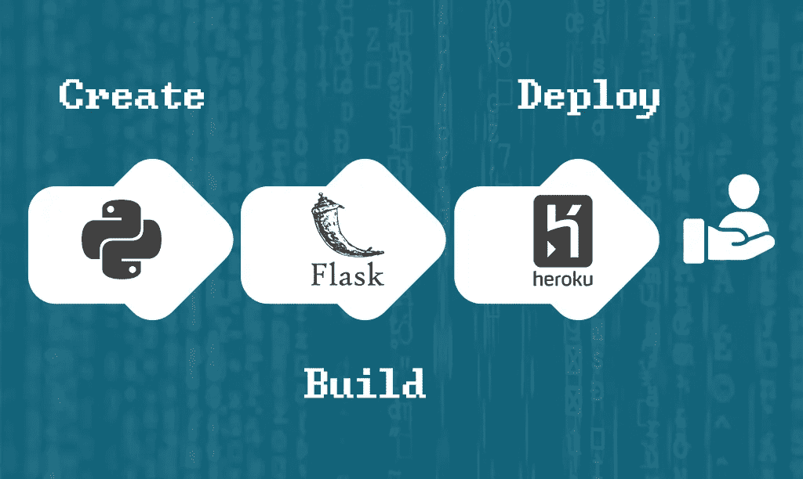
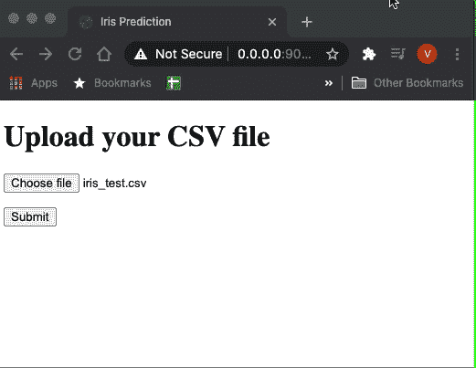
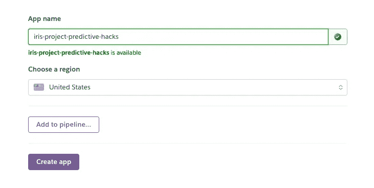

# 实践指南:构建和部署机器学习 Web 应用程序

> 原文：<https://pub.towardsai.net/practical-guide-build-and-deploy-a-machine-learning-web-app-c6760f877fb?source=collection_archive---------3----------------------->

## [机器学习](https://towardsai.net/p/category/machine-learning)，[编程](https://towardsai.net/p/category/programming)



这是一个机器学习项目的简单管道的指南。在本课程中，我们的目标是创建一个 web 应用程序，该应用程序将花的属性(萼片长度/宽度和花瓣长度/宽度)的 CSV 文件作为输入，并返回一个带有预测值(Setosa Versicolour Virginica)的 CSV 文件。你可能已经知道，我们将使用传说中的虹膜数据集

# 1.创建新环境并安装依赖项

我知道你想跳过这一步，但是不要。这将组织你的包，你将确切地知道你需要哪些包来运行你的代码，以防我们想和其他人分享它。相信我，这很重要。你不希望你的客户告诉你“这不是运行”。同样，在一个环境中拥有我们的项目将会帮助我们很容易地创建我们以后需要的需求文件。

```
conda create -n iris_project

#activate your project
conda activate  iris_project
```

# 安装依赖项

```
pip install pandas
pip install -U scikit-learn
pip install Flask
pip install gunicorn
```

> *Hack:如果你正在使用 Jupyter，你可以通过添加* ***'！'来直接安装库*** *在 Jupyter 单元格内的每个命令之前。*

# 2.训练并保存您的 ML 模型

现在有趣的事情。使用 pickle 创建您的模型并将其保存在一个文件中。在这篇文章中，我们将使用 Iris 数据集创建一个逻辑回归模型。

```
from sklearn import datasets
from sklearn.linear_model import LogisticRegression
import pandas as pd
iris = datasets.load_iris()

features=pd.DataFrame(iris['data'])

target=iris['target']

model=LogisticRegression(max_iter=1000)

model.fit(features,target)
```

## 使用 Pickle 保存模型

```
import pickle

pickle.dump(model, open('model_iris', 'wb'))
```

# 3.使用 Flask 创建 web 应用程序

作为一名数据科学家，烧瓶是最有用的技能之一。然而，你不需要知道关于它的一切。只需使用代码块作为项目的模型。

让我们做一些准备。在您的项目目录下创建一个名为 **templates** 的文件夹和一个名为 **static** 的文件夹。在**静态**文件夹中创建一个名为 **files** 的文件夹。接下来，创建两个**。py** 文件、 **main.py、**和 **iris_model.py** 。在 **main.py** 中将是我们的 flask 代码，在 **iris_model.py** 中将是我们的模型。

你可以以此为模板，根据自己的需要稍加修改。这是我个人的工作方式。

# main.py

```
from flask import Flask, render_template, request, redirect, url_for, send_file
import os

#we are importing the function that makes predictions.
from iris_model import predict_iris

import pandas as pd

app = Flask(__name__)
app.config["DEBUG"] = True

#we are setting the name of our html file that we added in the templates folder
@app.route('/')
def index():
    return render_template('index.html')

#this is how we are getting the file that the user uploads. 
#then we are setting the path that we want to save it so we can use it later for predictions
@app.route("/", methods=['POST'])
def uploadFiles():
    uploaded_file = request.files['file']

    if uploaded_file.filename != '':
        file_path = ( "static/files/file.csv")
        uploaded_file.save(file_path)
    return redirect(url_for('downloadFile'))

#now we are reading the file, make predictions with our model and save the predictions.
#then we are sending the CSV with the predictions to the user as attachement 
@app.route('/download')
def downloadFile ():
    path = "static/files/file.csv"
    predictions=predict_iris(pd.read_csv(path))
    predictions.to_csv('static/files/predictions.csv',index=False)
    return send_file("static/files/predictions.csv", as_attachment=True)

#here we are setting the port. 
if (__name__ == "__main__"):
     app.run(debug=True,host='0.0.0.0', port=9010)
```

在这个文件中，我们有一个函数，它将带有特征的数据帧作为输入，并输出预测。

# iris _ 模型. py

```
from sklearn.linear_model import LogisticRegression
import pandas as pd
import pickle

#we are loading the model using pickle
model = pickle.load(open('model_iris', 'rb'))

def predict_iris(df):
    predictions=model.predict(df)
    df['predictions']=predictions
    return(df)
```

在模板中，文件夹创建了一个 index.html 文件，其中包含以下代码。同样，不需要理解 HTML 中的所有内容，你可以改变标题，或者如果你熟悉 HTML，你可以做更多的实验。

```
<!doctype html>
<html>
  <head>
    <title>Iris Prediction</title>
  </head>
  <body>
    <h1>Upload your CSV file</h1>
    <form method="POST" action="" enctype="multipart/form-data">
      <p><input type="file" name="file"></p>
      <p><input type="submit" value="Submit"></p>
    </form>
  </body>
</html>
```

# 在本地运行 Web 应用程序

现在，如果你在你的终端上运行 **main.py** ，这个应用程序应该会启动。在您的浏览器中点击 [http://0.0.0.0:9010/](http://0.0.0.0:9010/) ，您将可以访问我们的应用程序。

这是一个非常简单的用户界面，但我们不需要任何花哨的东西。如果你上传一个具有 iris 特征的样本文件，你将得到预测。



我们的 web 应用程序已经准备好了！现在我们需要以某种方式部署它，这样我们就可以与世界分享它。我们将向你展示如何使用 [Heroku](https://dashboard.heroku.com/) 免费完成。

# 最后一步:部署 Web 应用程序

我们大多数人不知道如何从本地转移到现场，部署这个词可能会让我们害怕。这复杂吗？这个贵吗？嗯，不是也不是。我们将免费向你展示如何非常容易地做到这一点！有一个叫 Heroku 的网站为你提供 5 个免费的 web 应用部署。如果你想要一个更简单的付费解决方案，你可以使用数字海洋遵循[这个指南。](https://predictivehacks.com/how-to-deploy-a-flask-api-the-easiest-fastest-and-cheapest-way/)

在我们继续之前，您需要在 [Heroku](https://dashboard.heroku.com/) 创建一个帐户，并按照他们的说明将 [Heroku CLI](https://devcenter.heroku.com/articles/getting-started-with-python#set-up) 安装到您的机器上。另外，确保您已经安装了 [Git](https://git-scm.com/book/en/v2/Getting-Started-Installing-Git) 。

在部署我们的应用程序之前，一个关键的步骤是创建包含我们的应用程序的依赖关系的 **requirements.txt** 文件。幸运的是，使用 Conda 环境，这很容易做到。只需运行以下命令:

```
pip freeze > requirements.txt
```

此外，我们需要创建一个名为 **Procfile** 的新文件，其中包含启动应用程序的命令。在我们的例子中，我们将使用 gunicorn，因此在文件中添加以下内容

```
web: gunicorn main:app
```

接下来，转到 Heroku 中的仪表板，创建一个新的应用程序。下面的屏幕将出现，你必须把应用程序的名称和地区。



创建应用程序后，在您的终端上运行以下命令来登录 Heroku。

```
heroku login
```

然后，转到您的项目目录并运行:

```
git init

#here you need to put the name of your app in heroku
heroku git:remote -a iris-project-predictive-hacks 

git add .
git commit -m first_commit
git push heroku master
```

就是这样！你的应用程序已准备好。它会给你一个这样的网址[https://iris-project-predictive-hacks.herokuapp.com/.](https://iris-project-predictive-hacks.herokuapp.com/.)还不错吧？

这是一个非常简单的方法。然而，你甚至可以将这个应用程序交付给客户，因为它非常实用，你不需要比这更复杂的东西。下一步是使用 e better 服务器来扩展我们的应用程序，或者/甚至使用 [Docker](https://predictivehacks.com/how-to-use-docker-for-flask-api/) 。

【https://predictivehacks.com】最初发表于[](https://predictivehacks.com/practical-guide-build-and-deploy-a-machine-learning-web-app/)**。**