# 机器学习中的助推算法实用指南

> 原文：<https://pub.towardsai.net/practical-guide-to-boosting-algorithms-in-machine-learning-61c023107e12?source=collection_archive---------0----------------------->

## 用弱学习者创造强学习者

B oosting(最初称为假设提升)是指任何能够将几个弱学习者组合成一个强学习者的集成方法。大多数 boosting 方法的一般思想是顺序训练预测器，每个预测器都试图纠正其前任。首先，根据训练数据建立模型。然后建立第二个模型来纠正第一个模型中存在的错误。继续该过程，并且添加模型，直到正确预测了完整的训练数据集，或者添加了最大数量的模型。通过组合所有单个模型的预测来做出最终预测。Boosting 可用于回归和分类任务，是处理非线性数据的强大工具。它还相对抗过拟合，这意味着它通常可以在不牺牲泛化能力的情况下实现高水平的准确性。提高预测模型的准确性也是众所周知的。因此，Boosting 是许多实际机器学习应用程序的流行选择。

由[汉娜·布斯](https://unsplash.com/@hannahbusing?utm_source=medium&utm_medium=referral)在 [Unsplash](https://unsplash.com?utm_source=medium&utm_medium=referral) 拍摄的照片

有许多可用的增强方法，但在本文中，我们将涵盖最流行的增强算法:自适应增强(AdaBoost)、梯度增强和极端梯度增强(XGBoost)。

## 目录:

1.  自适应增压(AdaBoost)
    1.1。自适应 Boosting 算法讲解
    1.2。Python
    1.3 中的 AdaBoost。用于分类的 AdaBoost
    1.4。Adaboost 回归
2.  梯度升压
    2.1。梯度提升算法讲解
    2.2。Python
    2.3 中的渐变提升。提前停止的梯度推进
3.  极端梯度推进(XGBoost)
    3.1。XGBoost &的主要优点是什么？
    3.2。Python
    3.3 中的 XGBoost。XGBoost 超参数

**如果你想免费学习数据科学和机器学习，看看这些资源:**

*   免费互动路线图，自学数据科学和机器学习。从这里开始:[https://aigents.co/learn/roadmaps/intro](https://aigents.co/learn/roadmaps/intro)
*   数据科学学习资源搜索引擎(免费)。将你最喜欢的资源加入书签，将文章标记为完整，并添加学习笔记。[https://aigents.co/learn](https://aigents.co/learn)
*   想要在导师和学习社区的支持下从头开始学习数据科学吗？免费加入这个学习圈:[https://community.aigents.co/spaces/9010170/](https://community.aigents.co/spaces/9010170/)

**如果你想在数据科学&人工智能领域开始职业生涯，但不知道如何开始。我提供数据科学指导课程和长期职业指导:**

*   长期师徒:【https://lnkd.in/dtdUYBrM】T4
*   辅导课程:[https://lnkd.in/dXeg3KPW](https://lnkd.in/dXeg3KPW)

***加入*** [***中等会员***](https://youssefraafat57.medium.com/membership) ***计划继续无限制学习。如果你使用下面的链接，我会收到一小部分会员费，不需要你额外付费。***

 [## 加入我的介绍链接媒体-优素福胡斯尼

### 阅读 Youssef Hosni(以及媒体上成千上万的其他作家)的每一个故事。您的会员费直接支持…

youssefraafat57.medium.com](https://youssefraafat57.medium.com/membership) 

# 1.自适应增强(AdaBoost)

## 1.1.自适应升压算法解释

我们要讨论的第一个 boosting 算法是**自适应 Boosting** (AdaBoost)。新预测器校正其前任的一种方法是对前任拟合不足的训练实例多加注意。这是通过给每个实例分配权重来实现的，对错误分类的实例分配较高的权重。这导致新的预测者越来越关注错误分类的病例。

例如，为了构建 AdaBoost 分类器，第一基本分类器被训练并用于对训练集进行预测。然后，错误分类的训练实例的相对权重增加。使用更新的权重训练第二个分类器，并且再次对训练集进行预测，权重被更新，等等。

一旦训练了所有的预测器，集成就使用所有训练的预测器进行预测，并使用硬投票或软投票来组合它们。在硬投票中，我们考虑每个分类器的类别预测，然后根据特定类别的最大投票数对输入进行分类。在软投票中，我们考虑每个分类器对每个类别的概率预测，然后根据该类别的平均概率(分类器概率的平均值)将输入分类到具有最大概率的类别。

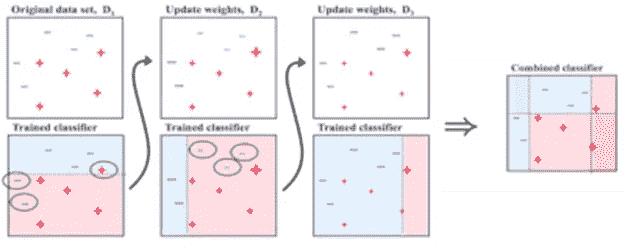

图一。Adaboost 算法概述。

让我们仔细看看 AdaBoost 算法背后的数学原理，以便更好地理解它的工作原理。最初，将每个实例权重 w(i)设置为 1\m。然后训练第一个预测器，并在训练集上计算其加权误差率 e₁。等式(1)是 jᵗʰ预测器的加权误差率 eⱼ。

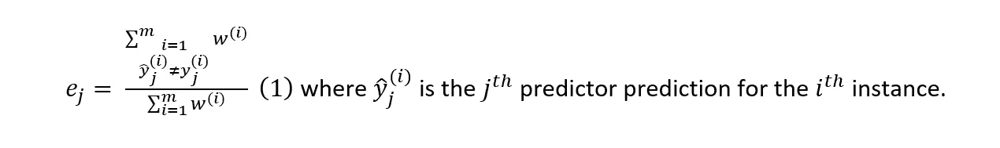

然后使用等式 2 计算预测值的权重αⱼ:

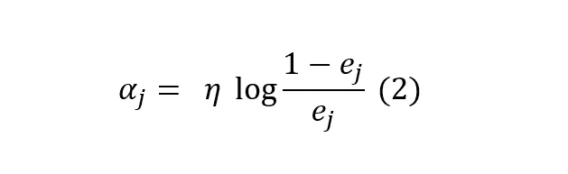

其中η是学习率超参数(默认为 1)。预测器越精确，其权重就越高。如果只是随机猜测，那么它的权重将接近于零。然而，如果它经常是错误的(即，不如随机猜测准确)，那么它的权重将是负的。接下来，使用等式 3 更新实例权重，其中错误分类的实例被提升。

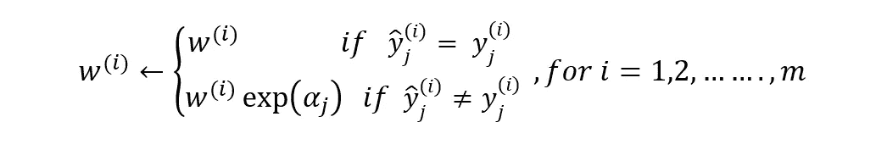

然后，通过将所有实例权重除以 w 的和来归一化所有实例权重。最后，使用更新后的权重来训练新的预测器，并重复整个过程(计算新预测器的权重，更新实例权重，然后训练另一个预测器，依此类推)。当达到期望的预测器数量或找到理想的预测器时，算法停止。为了进行预测，AdaBoost 只需计算所有预测值的预测值，并使用预测值权重αⱼ.对它们进行加权如等式 4 所示，预测类别是接收大多数加权投票的类别。

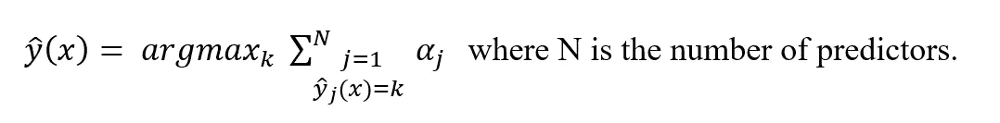

## 1.2.Python 中的 AdaBoost

Scikit-Learn 使用 AdaBoost 的多类版本，称为 **SAMME** (使用多类指数损失函数的分阶段加法建模)。当只有两个类时， **SAMME** 相当于 AdaBoost。此外，如果预测器可以估计类概率(即，如果它们有 predict_proba()方法)，Scikit-Learn 可以使用 SAMME 的一个变体，称为 SAMME。R(其中 R 代表“实数”)，它依赖于类别概率而不是预测，通常性能更好。

## **1.3*。Adaboost 为分类***

下面的代码使用 Scikit-Learn 的 **AdaBoostClassifier** 类基于 500 个决策树桩训练了一个 AdaBoost 分类器(如下所示，还有一个用于回归任务的 **AdaBoostRegressor** 类)。决策树桩是 max_depth=1 的决策树，换句话说，是由一个决策节点和两个叶节点组成的树。这是 AdaBoostClassifier 类的默认基本估计量:

让我们首先创建一个月球数据集并绘制它:

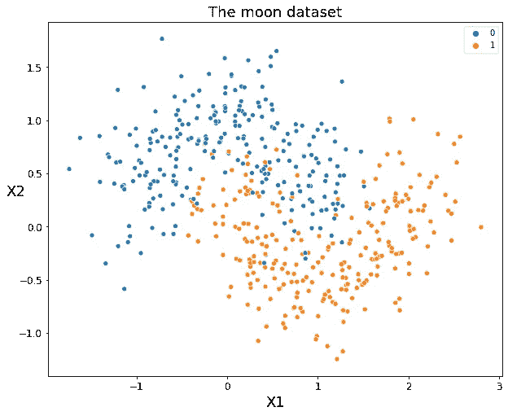

图二。

让我们画出决策界限。

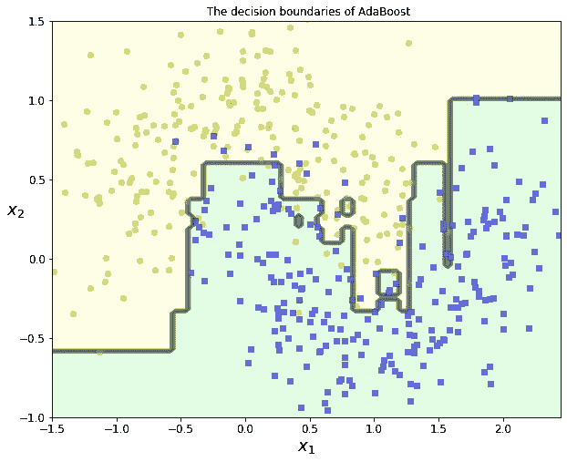

图 3。

## 1.4.Adaboost 回归

我们还可以使用 Scikit-Learn 的 **AdaBoostRegressor** 类来使用 Adaboost 进行回归。首先，我们将使用下面的代码创建一个二次数据集，用于回归任务:

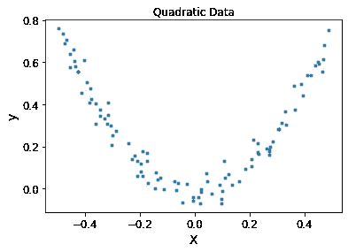

图 4。用于回归任务的二次数据集

现在，让我们在训练数据集上训练一个 **AdaBoost 回归器**，预测验证数据集的标签，并使用以下代码计算均方根误差:

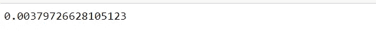

均方根误差(RMSE)为 0.003，这是一个非常好的结果。

# 2.梯度推进

## 2.1.梯度推进算法解释

另一个非常流行的提升算法是**梯度提升**。就像 AdaBoost 一样，梯度增强的工作原理是将预测器顺序添加到集合中，每个预测器都校正其前任。然而，这种方法不是像 Adaboost 那样在每次迭代中增加误分类的实例权重，而是尝试用新的预测器来拟合前一个预测器产生的残差。

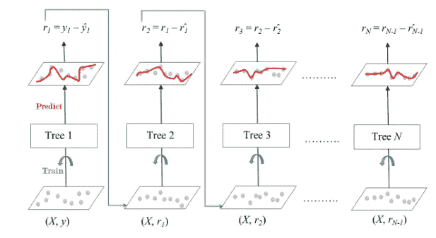

图 5。

让我们看一个使用决策树作为基本预测器的简单回归示例。这被称为梯度树提升或梯度提升回归树(GBRT)。首先，让我们为训练集(例如，一个有噪声的二次训练集)拟合一个 DecisionTreeRegressor:

现在根据第一个预测器产生的残差训练第二个决策树回归器:

然后，我们根据第二个预测器产生的残差训练第三个回归量:

现在我们有一个包含三棵树的系综。它可以简单地通过将所有树的预测相加来对新实例进行预测:

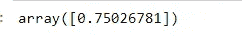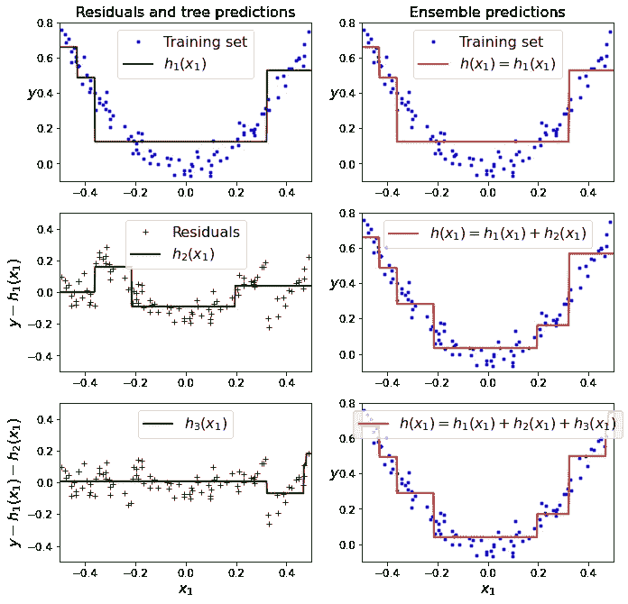

图 6。实践中的梯度推进。

图 5 在左栏中表示这三棵树的预测，在右栏中表示集合的预测。在第一行中，集合只有一棵树，因此它的预测与第一棵树的预测完全相同。在第二行中，根据第一棵树的残差训练新的树。在右侧，您可以看到集合的预测等于前两棵树的预测之和。类似地，在第三行中，根据第二棵树的残差训练另一棵树。你可以看到，随着集合中加入树木，集合的预测逐渐变得更好。

## 2.2.Python 中的梯度增强

训练 GBRT 合奏的一个更简单的方法是使用 Scikit-Learn 的**GradientBoostingClassifier&GradientBoostingRegressor**类。与 RandomForestRegressor 类非常相似，它具有控制决策树增长的超参数(例如，max_depth、min_samples_leaf 等)，以及控制整体训练的超参数，例如树的数量(n_estimators)。

我们将从上面创建的月球数据集上的梯度增强分类器开始:

我们还可以使用之前创建的 **plot_decision_boundary** 函数绘制决策边界:

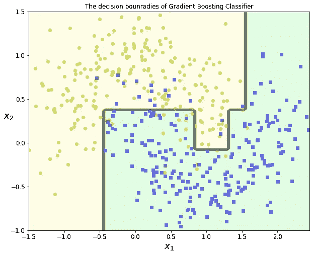

我们可以看到，该模型成功地以一种完美的方式分离了两个类，而没有导致任何过度拟合。

我们还可以使用**GradientBoostingRegressor**类将梯度推进用于回归，如下所示:

**learning_rate** 超参数缩放每棵树的贡献。如果将其设置为较低的值，如 0.1，则集合中将需要更多的树来适应训练集，但预测通常会更好地进行归纳。这是一种被称为**收缩**的正则化技术。让我们训练另一个 GBRT，它具有较低的学习率= 0.1，但是具有较高数量的估计器= 200 棵树。

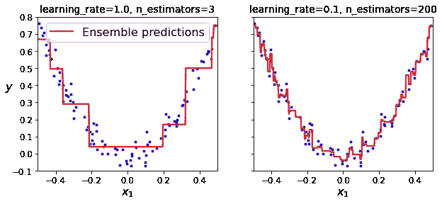

图 7。

图 7 显示了以低学习率训练的两个 GBRT 系综:左边的系综没有足够的树来适应训练集，而右边的系综有太多的树，超过了训练集。

## 2.3.提前停止的梯度推进

为了找到最佳的树数，你可以使用**提前停止**。实现这一点的一个简单方法是使用 **staged_predict()** 方法:它返回集合在每个训练阶段所做预测的迭代器(用一棵树、两棵树等)。).

以下代码用 120 棵树训练一个 GBRT 系综，然后在训练的每个阶段测量验证误差以找到最佳的树数，最后使用最佳的树数训练另一个 GBRT 系综:

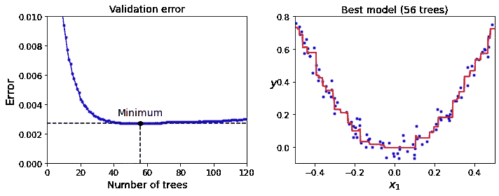

图 8。

流行的 python 库 XGBoost 中有一个梯度增强的优化实现，它代表极端梯度增强。这个包最初是由陈天琦作为分布式(深度)机器学习社区(DMLC)的一部分开发的，它的目标是非常快速、可伸缩和可移植。事实上，XGBoost 往往是 ML 比赛中获奖作品的重要组成部分。我们将在下一节更深入地了解它。

# 3.极端梯度增强(XGBoost)

## 3.1.XGBoost &主要优点是什么？

XGBoost 是梯度增强方法的高级版本。字面意思是极端的梯度推进。它提供了一个并行树提升，并且是用于回归、分类和排序问题的领先机器学习库。XGBoost 是由陈天琦开发的，在许多开发人员的贡献下，它现在属于分布式机器学习社区(DMLC)的范畴。

XGBoost 是梯度提升的可扩展和高度精确的实现，推动了提升树算法的计算能力的极限，主要是为了增强机器学习模型性能和计算速度而构建的。在 XGBoost 中，树是并行构建的，而不是顺序构建的，就像梯度增强一样。它遵循逐层策略，扫描梯度值，并使用这些部分和来评估训练集中每个可能分裂的分裂质量。这旨在提高计算的速度和效率。

XGBoost 是一个软件库，您可以下载并安装到您的机器上，然后从各种界面进行访问。具体来说，XGBoost 支持以下主要接口:

*   命令行界面(CLI)。
*   C++(编写库的语言)。
*   Python 接口，以及 scikit-learn 中的一个模型。
*   r 接口以及 caret 包中的一个模型。
*   朱莉娅。
*   像 Scala 这样的 Java 和 JVM 语言以及 Hadoop 这样的平台。

XGBoost 在过去几年中获得了巨大的声望，因为它帮助团队赢得了几乎每一场 Kaggle 结构化数据竞赛。在这些比赛中，公司和研究人员发布数据，之后统计学家和数据挖掘者竞争产生预测和描述数据的最佳模型。

## **系统优化:**

*   **正则化**:因为决策树的集合有时会非常复杂。XGBoost 使用 Lasso 和岭回归正则化来惩罚高度复杂的模型。
*   **并行化和缓存块:**在，XGBoost 中，我们不能并行训练多棵树，但是可以并行生成树的不同节点。为此，数据需要按顺序排序。为了降低排序的成本，它将数据存储在块中。它以压缩的列格式存储数据，每一列按相应的特征值排序。这种切换通过抵消计算中的任何并行化开销来提高算法性能。
*   **树修剪:** XGBoost 使用 **max_depth** 参数，该参数由分支的停止标准指定，并开始向后修剪树。这种深度优先的方法显著提高了计算性能。
*   **缓存感知和分数外计算:**该算法被设计为有效地利用硬件资源。这是通过在每个线程中分配内部缓冲区来存储梯度统计数据的缓存感知来实现的。“核外计算”等进一步的增强优化了可用磁盘空间，同时处理了不适合内存的大数据帧。在核外计算中，XGBoost 试图通过压缩来最小化数据集。
*   **稀疏感知:** XGBoost 可以处理预处理步骤或缺失值可能产生的稀疏数据。它使用一种特殊的分裂查找算法，这种算法可以处理不同类型的稀疏模式。
*   **加权分位数草图:** XGBoost 内置了分布式加权分位数草图算法，可以更轻松有效地在加权数据集之间找到最佳分割点。
*   **交叉验证:** XGBoost 实现附带了一个内置的交叉验证方法。当数据集不是很大时，这有助于算法防止过度拟合。

## 3.2.Python 中的 XGBoost

让我们首先使用下面的代码安装 XGBoost 库:

和以前一样，我们将使用它在月球数据集上进行一次分类，在二次数据集上进行一次回归。让我们从分类任务开始:

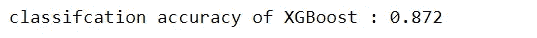

看起来测试精度很小，可能是因为模型过度拟合了训练数据。我们可以使用之前定义的 **plot_decision_boundary** 函数绘制决策边界:

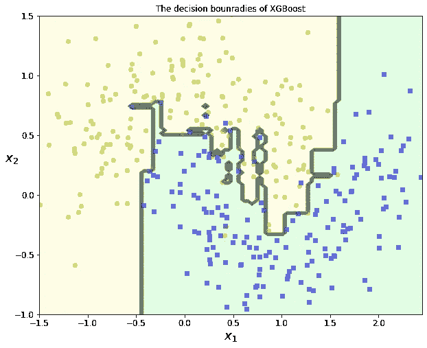

图 9。

正如所料，模型过度拟合了训练数据，因此我们可以调整模型超参数来克服这种过度拟合。

## 3.3.XGBoost 超参数

模型参数可分为以下四个参数:**通用参数**、**助推器参数**、**学习任务参数**和**命令行参数。**为了提高性能，我们可以调整前三类参数——**通用参数**、**助推器参数、**和**任务参数**。第四类参数是**命令行参数**。它们只在 XGBoost 的控制台版本中使用。

**1。一般参数:**这些参数指导 XGBoost 模型的整体功能，它们是:

*   `booster [default = gbtree]` -这是用于提高模型性能的算法类型。它有三种选择 **gbtree** 、 **gblinear、**或 **dart。****GB tree**和 **dart** -使用基于树的模型，而 **gblinear** 使用线性模型。
*   `verbosity [default = 1]` -它测量数据集中单词的详细程度。
*   `nthread [default = max]` - 这是用来运行 XGBoost 的并行线程数。

**2。助推器参数:**我们有两种助推器——**树状助推器**和**直线助推器**。我们将把我们的讨论限制在**树形助推器**上，因为它总是优于**线性助推器**，因此后者很少被使用。

*   `eta [default = 0.3]` -类似于 GBM 中的学习率。其范围在[0，1]之间
*   `gamma [default = 0]` - Gamma 指定进行分割所需的最小损失减少量。这用于减少校正模型误差时的损失。
*   `max_depth [default = 6]` -这是 XGBoost 分类器的最大深度。
*   `min_child_weight [default = 1]` -这是我们被允许划分树的叶节点的最小尺寸。它用于控制过度拟合。较高的值会阻止模型学习可能高度特定于为树选择的特定样本的关系。过高的值会导致拟合不足
*   `max_delta_step [default = 0]` -用于在训练过程中更新模型类。通常，这个参数是不需要的，但是当类极度不平衡时，它可能有助于逻辑回归
*   `subsample [default = 1]` -我们用来对模型的训练阶段进行抽样的比率。将其设置为 0.5 意味着 XGBoost 将在生成树之前随机采样一半的训练数据，这将防止过度拟合。
*   `colsample_bylevel [default = 1]` -这显示了树中不同的分支级别是如何被分开的。
*   `colsample_bynode [default = 1]` -显示不同的节点是如何分割的。
*   `colsample_bytree [default = 1]` -展示了 XGBoost 中不同的树是如何被分开的。
*   `reg_lambda` -这是用于增加模型权重的参数。
*   `reg_alpha` -这是用于减少模型重量的参数
*   `n_estimators` -这是在模型训练期间添加的估计器的总数。

**3。学习任务参数**

*   `objective` -它指定了用于构建模型的算法类型，在这种情况下，它使用逻辑回归。
*   `seed` -模型使用的种子。
*   `random_state` -该播种编号由模型使用。
*   `base_score` -这是对初始模型的预测。它的默认分数是`0.5`。
*   `n_jobs` -这是模型处理的作业总数。

***喜爱文章？成为*** [***中等会员***](https://youssefraafat57.medium.com/membership) ***继续无限制学习。如果你使用下面的链接，我会收到一小部分会员费，不需要你额外付费。***

 [## 加入我的介绍链接媒体-优素福胡斯尼

### 阅读 Youssef Hosni(以及媒体上成千上万的其他作家)的每一个故事。您的会员费直接支持…

youssefraafat57.medium.com](https://youssefraafat57.medium.com/membership) 

***感谢阅读！如果你喜欢这篇文章，一定要鼓掌(高达 50！)并在***[***LinkedIn***](https://www.linkedin.com/in/youssef-hosni-b2960b135/)***上与我联系，并在*** [***上关注我的【中型】***](https://youssefraafat57.medium.com/) ***以保持更新我的新文章***