# Python 支持向量机实用指南

> 原文：<https://pub.towardsai.net/practical-guide-to-support-vector-machines-in-python-dc0e628d50bc?source=collection_archive---------1----------------------->

支持向量机(SVM)是一种强大的机器学习算法，被数据科学家和机器学习实践者广泛使用。原因是它的线性和非线性分类和回归能力。它可以用于不同的数据集，如文本和图像。**支持向量机非常适合处理中小型数据集的分类问题。**这其中的主要原因

就是它训练复杂度高，会需要很高的训练时间和精力。因此，它只对小型和中型数据集具有计算效率。

支持向量机

# 目录:

1.  线性 SVM 分类
    1.1。硬利润与软利润分类
    1.2。实践中的线性 SVM
2.  非线性 SVM 分类
    2.1。多项式内核
    2.2。相似特征
3.  SVM 回归
4.  参考

您可以在 GitHub 资源库中找到本文中使用的代码:

 [## GitHub-youssefHosni/机器学习-实用指南

### 此时您不能执行该操作。您已使用另一个标签页或窗口登录。您已在另一个选项卡中注销，或者…

github.com](https://github.com/youssefHosni/Machine-Learning-Practical-Guide) 

**如果你想免费学习数据科学和机器学习，看看这些资源:**

*   免费互动路线图，自学数据科学和机器学习。从这里开始:[https://aigents.co/learn/roadmaps/intro](https://aigents.co/learn/roadmaps/intro)
*   数据科学学习资源搜索引擎(免费)。将你最喜欢的资源加入书签，将文章标记为完整，并添加学习笔记。[https://aigents.co/learn](https://aigents.co/learn)
*   想要在导师和学习社区的支持下从头开始学习数据科学吗？免费加入这个学习圈:[https://community.aigents.co/spaces/9010170/](https://community.aigents.co/spaces/9010170/)

如果你想在数据科学&人工智能领域开始职业生涯，但你不知道如何开始。我提供数据科学指导课程和长期职业指导:

*   长期指导:[https://lnkd.in/dtdUYBrM](https://lnkd.in/dtdUYBrM)
*   辅导会议:[https://lnkd.in/dXeg3KPW](https://lnkd.in/dXeg3KPW)

***加入*** [***中等会员***](https://youssefraafat57.medium.com/membership) ***计划，只需 5 美元，继续无限制学习。如果你使用下面的链接，我会收到一小部分会员费，不需要你额外付费。***

## 1.线性 SVM 分类

SVM 分类器背后的基本思想是在类之间拟合尽可能宽的街道或边界。这就是所谓的**大幅度分类**。考虑下图，有两个类，SVM 分类器的主要目标是分类数据的决策边界或超平面以及具有最大余量的支持向量。

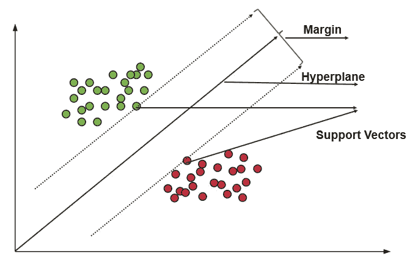

图一。SVM 决策界限

值得一提的是**支持向量机分类器对特征的尺度很敏感。**如果特征不是同一尺度，这将导致优化的边距会偏向最大的特征。因此，在训练模型之前对数据进行标准化非常重要。这可以在下图中看到，当要素具有不同的比例时，我们可以看到决策边界和支持向量只对 X1 要素进行分类，而没有考虑 X0 要素，但是在将数据缩放到相同的比例后，决策边界和支持向量看起来更好，并且模型考虑了这两个要素。

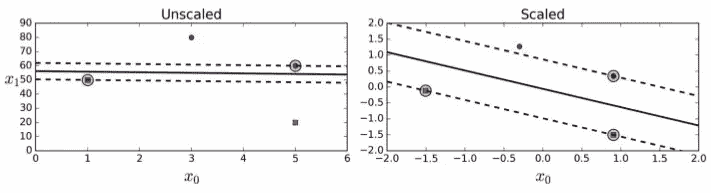

图二。SVM 分类器决策边界和支持向量的非缩放与缩放特征。

## **1.1。硬利润与软利润分类**

有两种类型的分类硬分类和软分类余量。硬分类页边距是这样一种页边距，其中所有实例都必须在街道之外和右侧。硬分类余量有两个主要问题:

*   仅对于线性可分的数据:如果数据不是线性可分的，我们将无法找到硬边界。
*   对异常值敏感:如果数据有异常值，这将影响差值，并且很难找到类别之间的硬差值。

为了克服这些问题，我们使用软边界分类，在这种分类中，我们试图在尽可能拥有最宽的街道或边界与限制边界违规的数量(例如在错误的一侧拥有实例)之间进行平衡。

## 1.2.实践中的线性 SVM

让我们看看如何在实践中使用 SVM，为此我们将使用 **scikit learn** 库。在下面的示例中，我们将首先加载 iris 数据集，缩放要素，然后训练线性 SVM 来检测 Iris virginica 花朵:

下面的 Scikit-Learn 代码缩放这些特征，然后训练一个线性 SVM 模型(使用 C = 1 的 LinearSVC 类和铰链损失函数，简要描述)来检测 Iris-Virginica 花朵。最终的模型如图 3 所示。

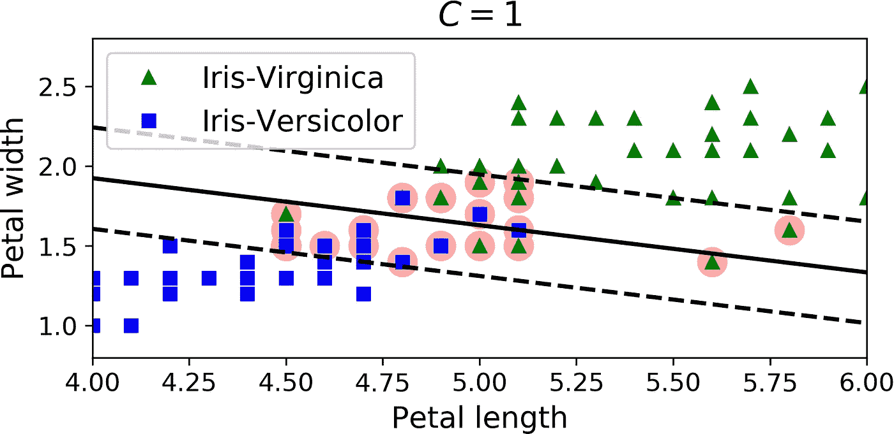

图 3。缩放后的虹膜数据上的决策边界。

**LinearSVC** 类正则化了偏差项，因此您应该首先通过减去其平均值来集中训练集。如果您使用**标准缩放器**缩放数据，这是自动的，如上面的代码所示。此外，确保将**损耗**超参数设置为**“铰链”**，因为它不是默认值。最后，为了获得更好的性能，应该将 dual 超参数设置为 False，除非特征多于训练实例。

您也可以使用 SVC 类，使用 **SVC(kernel="linear "，C=1)** ，但是它会慢得多，特别是对于大型训练集，所以不推荐使用。另一种选择是使用 **SGDClassifier 类**，带 SGDClassifier(loss="hinge "，alpha=1/(m*C))。这应用规则随机梯度下降来训练线性 SVM 分类器。**它没有 LinearSVC 类收敛得快，但是它可以用于处理不适合内存的大型数据集。**最后，重要的是要记住，如果你的 SVM 模型过度拟合，你可以通过减少 c 来调整它

# 2.非线性 SVM 分类

尽管线性 SVM 分类器非常高效，并且在许多情况下效果惊人，但许多数据集并不接近线性可分。处理非线性可分离数据集的一种方法是添加更多的要素，例如多项式要素。在某些情况下，这可能会产生线性可分离数据集。考虑图 4 中左边的图:它表示一个只有一个特征 x1 的简单数据集。如你所见，这个数据集不是线性可分的。但是如果你添加第二个特征 x2 = (x1)2，得到的 2D 数据集是完全线性可分的。

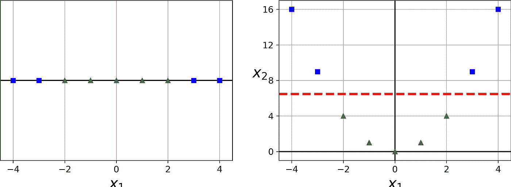

图 4。添加要素将使数据集可线性分离。

为了使用 Scikit-Learn 实现这一想法，您可以创建一个包含**polynomial features**transformer 的管道来创建 Iris 数据集的多项式特征，然后，它将跟随一个 **StandardScaler** 和一个 **LinearSVC** 。让我们在 moons 数据集上对此进行测试:这是一个用于二进制分类的玩具数据集，其中数据点被成形为两个交错的半圆，如图 5 所示。以下代码将生成月球数据集，创建多项式要素，对其进行缩放，在其上训练线性 SVM，然后绘制决策边界。

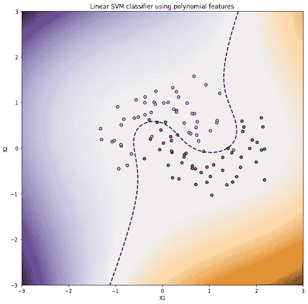

图 5。使用多项式特征的线性 SVM 分类器

## **2.1。多项式内核**

如前一示例中那样添加多项式要素实现起来很简单，并且可以很好地用于各种机器学习算法(不仅仅是 SVM)，但是在低多项式次数下，无法处理非常复杂的数据集，而在高多项式次数下，会创建大量的要素，使得模型太慢。

幸运的是，在使用支持向量机时，您可以应用一种几乎不可思议的数学技术，称为核技巧，稍后将对其进行解释。它可以获得与添加许多多项式特征相同的结果，即使多项式的次数非常高，实际上也不必添加它们。因此，功能的数量不会增加，因为我们实际上没有添加任何功能。这个技巧是由 SVC 类实现的。让我们在 moons 数据集上测试它:

此代码使用三次多项式内核训练 SVM 分类器。图 6 显示了这一点，它是使用以下函数绘制的:

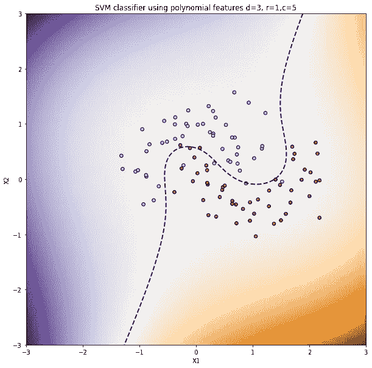

图 6。具有次数= 3 且系数 0 = 1 的多项式核的 SVM 分类器

图 7 显示了使用 10 次多项式内核的另一个 SVM 分类器的决策边界。

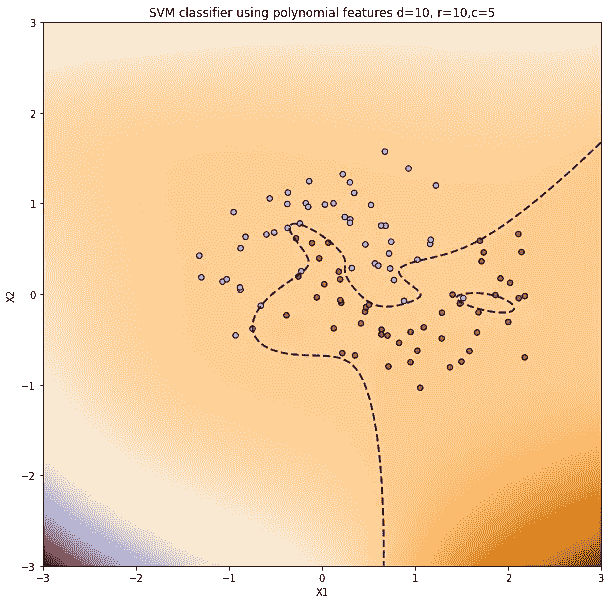

图 7。具有次数= 10 且系数 0 = 10 的多项式核的 SVM 分类器。

显然，如果您的模型过拟合，您可能希望降低多项式次数。相反，如果它不合适，你可以尝试增加它。超参数 **coef0** 控制模型受高次多项式和低次多项式的影响程度。找到正确的超参数值的一个常用方法是使用**网格搜索**。首先进行非常粗略的网格搜索，然后围绕找到的最佳值进行更精细的网格搜索，通常会更快。很好地理解每个超参数的实际作用可以帮助您搜索超参数空间的正确部分。

## **2.2。相似特征**

另一种处理非线性问题的技术是添加使用相似性函数计算的特征，该函数测量每个实例与特定地标的相似程度。例如，让我们以前面讨论过的图 4 所示的一维数据集为例，在 x1 =–2 和 x1 = 1 处添加两个界标，如图 8(左)所示。

接下来，让我们将相似性函数定义为γ = 0.3 的高斯径向基函数(RBF)，如下式所示:

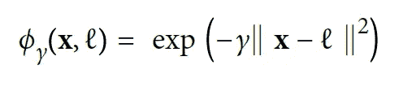

它是一个钟形函数，从 0(离标志非常远)到 1(在标志处)变化。现在我们准备计算新的特征。例如，让我们看看实例 x1 =–1:它位于距离第一个地标 1 和第二个地标 2 的位置。因此，它的新特性是 x2 = exp(–0.3×12)≈0.74，x3 = exp(–0.3×22)≈0.30。图 8(右)显示了没有原始要素的变换数据集。如你所见，它现在是线性可分的。

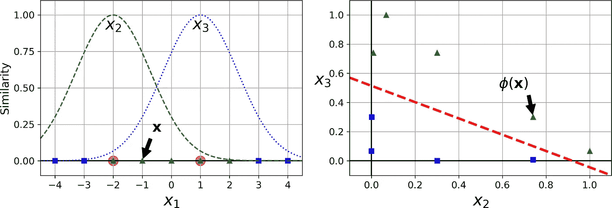

图 8。使用高斯径向基函数的特征相似性。

你可能想知道如何选择地标。最简单的方法是在数据集中每个实例的位置创建一个地标。这产生了许多维度，从而增加了变换后的训练集是线性可分的机会。缺点是，具有 m 个实例和 n 个特征的训练集被转换为具有 m 个实例和 m 个特征的训练集(假设您删除了原始特征)。如果你的训练集非常大，你最终会得到同样多的特征。

## **2.3。高斯径向基函数核**

就像多项式特征方法一样，相似性特征方法对于任何机器学习算法都是有用的，但是计算所有附加特征在计算上可能是昂贵的，尤其是在大型训练集上。然而，内核技巧又一次施展了它的 SVM 魔法:它使得获得类似的结果成为可能，就好像你已经添加了许多类似的特性，而实际上并没有添加它们。

让我们使用 SVC 类来尝试高斯 RBF 核:

该模型的输出如下图所示:

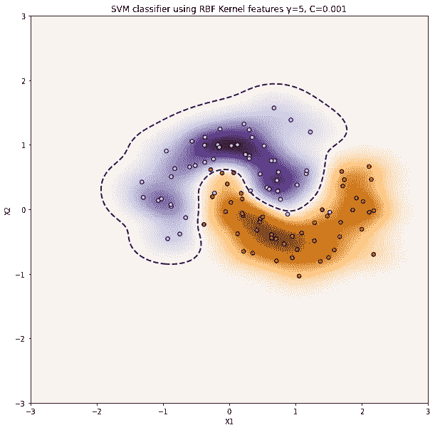

图 9。使用 RBF 核特征γ=5 和 c=0.001 的 SVM 分类器。

我们还可以尝试使用超参数γ(γ)和 C 的其他值来训练模型。让我们首先将 C 增加到 1000，并像以前一样保持γ = 5。这个模型的输出如图 10 所示。

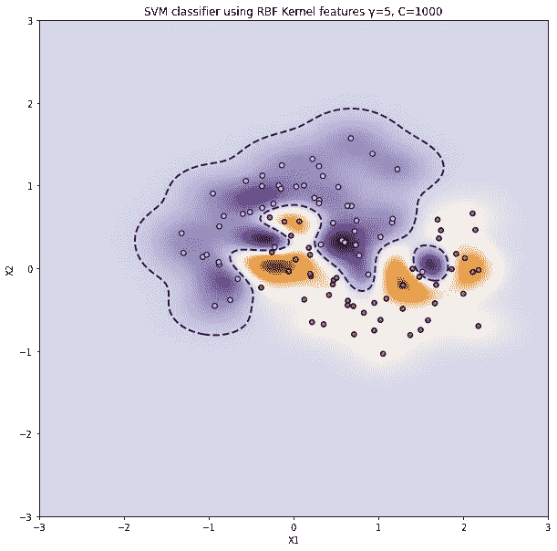

图 10。使用 RBF 核特征γ=5 和 c=1000 的 SVM 分类器。

现在让我们将γ减小到 0.1，并尝试 C = 0.001 和 C =1000。结果如图 11 和 12 所示:

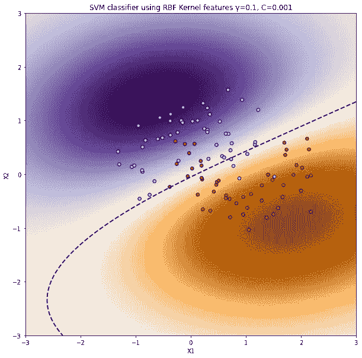

图 11。使用 RBF 核特征γ=0.1 和 c=0.001 的 SVM 分类器。

最后我们用γ = 0.1，C=1000 来训练模型:

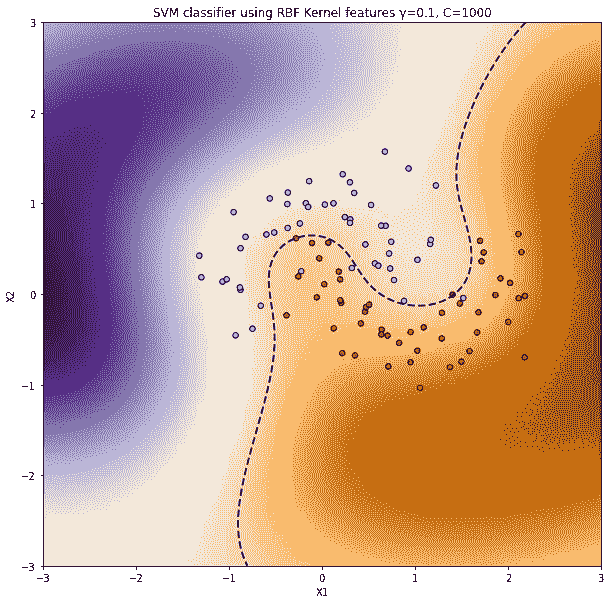

图 12。使用 RBF 核特征γ=0.1 和 c=1000 的 SVM 分类器。

增加 gamma 会使钟形曲线变得更窄(参见图 8 的左图)，因此，每个实例的影响范围更小:决策边界最终变得更加不规则，在各个实例周围摆动(图 9、10)。相反，较小的 gamma 值会使钟形曲线变得更宽，因此实例的影响范围更大，决策边界最终会更平滑(图 11、12)。所以γ的作用就像一个正则化超参数:如果你的模型过拟合，你就应该减少它，如果过拟合，你就应该增加它(类似于 C 超参数)。

> 其他内核也存在，但很少使用。例如，一些内核专用于特定的数据结构。当分类文本文档或 DNA 序列时，有时使用串核(例如，使用基于 Levenshtein 距离的串子序列核)。

有这么多内核可供选择，您如何决定使用哪一个呢？作为一个经验法则，你应该总是首先尝试线性内核(记住 LinearSVC 比 sklearn 中的 SVC(kernel = "**linear**")**快得多，尤其是如果训练集非常大或者如果它有很多特性**。如果训练集不是太大，也要试试高斯 RBF 核；它在大多数情况下工作良好。然后，如果您有空闲时间和计算能力，您还可以使用交叉验证和网格搜索来试验一些其他内核，尤其是如果有专门针对您的训练集的数据结构的内核。

## 2.4.计算的复杂性

**LinearSVC** 类基于 **liblinear** 库，该库实现了线性 SVM 的优化算法。它不支持内核技巧，但它几乎与训练实例的数量和特征的数量成线性比例关系:它的训练时间复杂度大致为 O(m × n)。如果您要求非常高的精度，该算法需要更长的时间。这由公差超参数ϵ控制(在 Scikit-Learn 中称为 **tol** )。在大多数分类任务中，默认容差是合适的。

**SVC** 类基于 **libsvm** 库，它实现了一个支持内核技巧的算法。训练时间复杂度通常在 O(m2 × n)到 O(m3 × n)之间。不幸的是，这意味着当训练实例的数量变大时(例如，几十万个实例)，它会变得非常慢。该算法非常适合复杂但规模较小或中等的训练集。**然而，它与特征的数量成比例，尤其是稀疏特征(即，当每个实例几乎没有非零特征时)。在这种情况下，该算法大致与每个实例中非零要素的平均数量成比例。**

# 3.SVM 回归

SVM 算法非常通用:它不仅支持线性和非线性分类，还支持线性和非线性回归。诀窍是颠倒目标:SVM 回归不是试图在两个类之间拟合最大可能的街道，同时限制边界违规，而是试图在街道上拟合尽可能多的实例，同时限制边界违规(即街道外的实例)。街道的宽度由超参数ϵ.控制

让我们首先创建随机数据:

然后，让我们训练两个 SVM 分类器，一个具有ϵ =1.5，ϵ =0.5:

最后，让我们绘制两个基于随机线性数据训练的线性 SVM 回归模型，一个具有大幅度(ϵ = 1.5)，另一个具有小幅度(ϵ =0.5)。

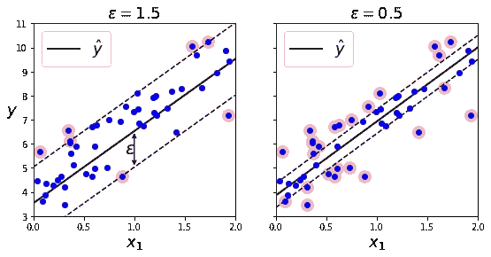

图 13。不同ϵ = 1.5 和 0.5 的 SVM 回归。

在容限内添加更多的定型实例不会影响模型的预测；因此，这个模型被称为ϵ-insensitive.您可以使用 Scikit-Learn 的 **LinearSVR** 类来执行线性 SVM 回归。

为了处理非线性回归任务，您可以使用内核化的 SVM 模型。首先在下面的代码中，我们将生成一个随机二次训练集:

然后，我们将使用不同的 C 值的二次多项式核来训练 SVM 回归器。

然后，我们将使用下面的代码绘制这两个模型的曲线图:

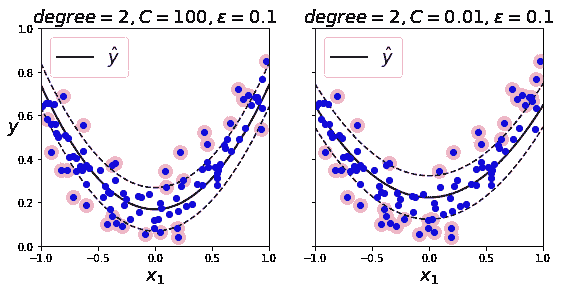

图 14。使用二次多项式核的 SVM 回归。

正如我们在图 14 中看到的，左边的图(具有大 C 值的模型)上几乎没有正则化，而右边的图(具有小 C 值的模型)上有更多的正则化。

我们可以使用 Scikit-Learn 的 **SVR 类**(支持内核技巧)生成图 14 中的相同模型。 **SVR 类**是 **SVC 类**的回归等价物， **LinearSVR 类**是 **LinearSVC 类**的回归等价物。 **LinearSVR 类**随着训练集的大小线性扩展(就像 LinearSVC 类)，而当训练集变大时，SVR 类变得太慢(就像 SVC 类)。

# 4.参考

[1].使用 Scikit-Learn、Keras 和 TensorFlow 进行机器实践学习，第二版

[2].您可以在 GitHub 资源库中找到本文中使用的代码:

 [## GitHub—youssefHosni/机器学习实用指南

### 此时您不能执行该操作。您已使用另一个标签页或窗口登录。您已在另一个选项卡中注销，或者…

github.com](https://github.com/youssefHosni/Machine-Learning-Practical-Guide)  [## 加入我的介绍链接媒体-优素福胡斯尼

### 阅读 Youssef Hosni(以及媒体上成千上万的其他作家)的每一个故事。您的会员费直接支持…

youssefraafat57.medium.com](https://youssefraafat57.medium.com/membership) 

*感谢阅读！如果你喜欢这篇文章，一定要鼓掌(高达 50！)并在*[*LinkedIn*](https://www.linkedin.com/in/youssef-hosni-b2960b135/)*上与我联系，并在*[*Medium*](https://youssefraafat57.medium.com/)*上关注我的新文章*