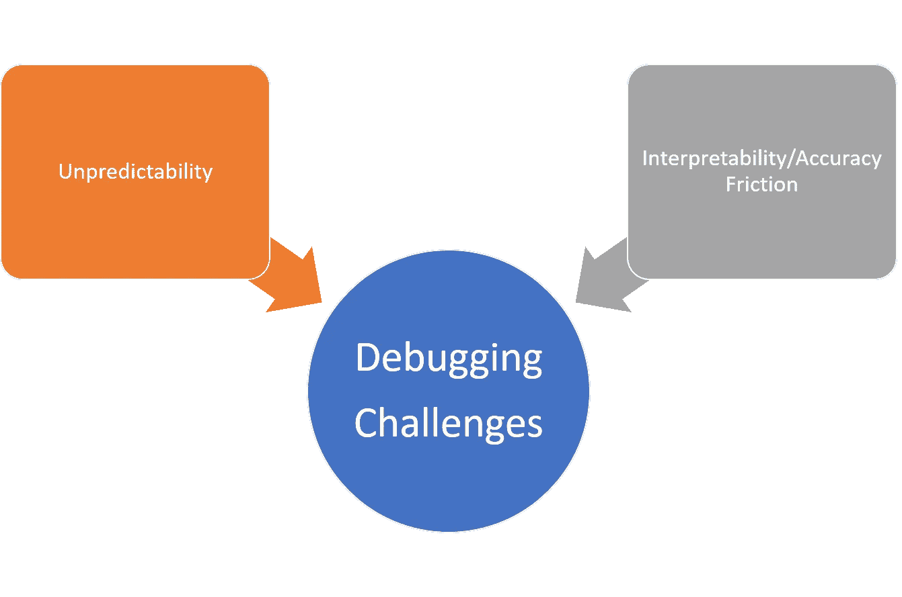
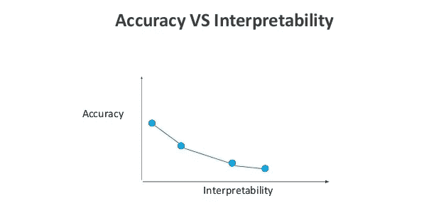

# 关于调试神经网络的实践课程

> 原文：<https://pub.towardsai.net/practical-lessons-about-debugging-neural-networks-dc3b02956d31?source=collection_archive---------1----------------------->

## 尽管调试堆栈已经取得了很大进展，但它们仍然是机器学习应用程序中的基本挑战之一。

来源:[https://ADT mag . com/articles/2018/06/01/machine-learning-platform . aspx](https://adtmag.com/articles/2018/06/01/machine-learning-platform.aspx)

> 我最近创办了一份专注于人工智能的教育时事通讯，已经有超过 125，000 名订户。《序列》是一份无废话(意思是没有炒作，没有新闻等)的 ML 导向时事通讯，需要 5 分钟阅读。目标是让你与机器学习项目、研究论文和概念保持同步。请通过订阅以下内容来尝试一下:

 [## 序列

### 与机器学习、人工智能和数据发展保持同步的最佳资源…

thesequence.substack.com](https://thesequence.substack.com/) 

大规模机器学习(ML)解决方案在现实世界中的实施是一条充满挑战的道路。这些挑战中有许多是基于这样一个事实，即我们在典型软件应用程序的生命周期中使用的许多工具和技术并不适用于深度学习领域。因此，数据科学家和 ML 工程师不断尝试重新设想几十年来传统软件开发中已经解决的问题的解决方案。调试是我们经常忽略的领域之一，也是数据科学团队的噩梦。

是什么让深度学习应用中的调试变得如此具有挑战性？答案可以总结为两个主要因素:不可预测性和可解释性-准确性之间的摩擦。

# 不可预测性

深度学习程序的不可预测性是其动态性的结果。虽然大多数软件程序展示了基于程序员创建的静态代码的常规运行时模式，但是 ML 应用程序的运行时行为一直在变化。让我们以一个深度神经网络为例，它一直定期实现 3.5%的错误率。然而，在用新的数据集重新训练模型之后，神经网络表现出改进的 3%的错误率。对于数据科学家来说，几乎不可能确定新的行为是否是最佳的，以及是什么导致了改进。

# 可解释性与准确性之间的摩擦

可解释性/准确性的摩擦是统治当前一代深度学习技术的不幸动态之一。你关心获得最好的结果，还是关心理解那些结果是如何产生的？这是数据科学家在每个深度学习场景中都需要回答的问题。许多深度学习技术本质上是复杂的，尽管它们在许多情况下非常准确，但它们可能变得难以置信地难以解释。

来源:[https://www . research gate . net/figure/interpretatibility-vs-Accuracy-Computational-Complexity-in-fuzzy-system _ fig 3 _ 318154996](https://www.researchgate.net/figure/Interpretability-vs-Accuracy-Computational-Complexity-in-fuzzy-system_fig3_318154996)

为了理解深度学习程序的行为，数据科学家需要专注于两个主要任务:提高可解释性和真正擅长调试😉。

# 改进 ML 调试的实用技巧

可解释性是 ML 应用程序的元素之一，它被广泛定义并且难以量化，但是对于成功调试神经网络是必不可少的。到底怎么调试一个连自己都不懂的东西？有一些非常实用的方法，我们可以应用于 ML 程序，以提高它们的可解释性。[在最近的一篇论文](https://distill.pub/2018/building-blocks/)中，来自谷歌的研究人员提出了三个可以提高深度学习模型可解释性的基本要素:

1.  **了解隐藏层做什么:**深度学习模型中的大部分知识都是在隐藏层中形成的。在宏观水平上理解不同隐藏层的功能对于能够解释深度学习模型是至关重要的。
2.  **理解节点是如何激活的:**可解释性的关键不是理解网络中单个神经元的功能，而是理解在同一空间位置一起放电的相互连接的神经元群。将一个网络分割成相互连接的神经元群将提供一个更简单的抽象层次来理解它的功能。
3.  **理解概念是如何形成的:**理解深度神经网络如何形成单个概念，然后将这些概念组合成最终输出，这是可解释性的另一个关键组成部分。

# 深度学习调试的实用技巧

深度神经网络的复杂结构和复杂工具的缺乏使得深度学习应用程序的调试无异于一场噩梦。然而，有几个实用的技巧可以帮助你在调试深度学习程序时更有效:

**1 —可视化网络及其结果**

一个非常明显的观点；当构建深度学习应用程序时，必须利用工具，这些工具可以帮助基于某些输入来可视化连接的图形和模型的结果。这将为开发人员提供一种直观的方式，通过模型进行推理，并试图理解算法的行为。

**2 —分析训练和测试错误**

深度学习模型中的训练和测试错误可以在潜在问题发生之前提供有用的线索。例如，如果模型过度拟合(测试误差较高)，但训练误差仍然较低，则可能是算法中存在错误。然而，如果训练误差很高，那么模型是欠拟合的，并且我们可能在训练过程中发现误差。

**3 —使用小数据集进行测试**

在前一点的基础上；如果一个模型不合适，我们需要确定是代码缺陷还是数据缺陷。实现这一点的一个方法是用非常少的例子进行测试。如果模型失败了，那么很可能是由于代码的问题。

**4 —监视器激活和梯度值**

关注隐藏单元的激活和梯度的值是优化深度学习模型的必要措施。节点激活的数量是理解神经网络是否饱和的重要度量。类似地，获得梯度值的直方图视图对于理解模型中未来优化的潜力是非常有用的技术。

调试和理解深度学习程序对许多主流软件工程师来说感觉不自然。提高深度学习架构的可解释性和设置正确的调试流程是数据科学团队应该在开发生命周期的早期考虑实施的两个因素。随着深度学习研究的发展，深度神经网络的架构应该变得更容易解释，从而更容易调试。