# 3 表格数据实践的实际监控 ML-OPS 指南系列

> 原文：<https://pub.towardsai.net/practical-monitoring-for-tabular-data-practices-ml-ops-guide-series-3-86d33f3b8aef?source=collection_archive---------3----------------------->

## [MLOps](https://towardsai.net/ai/mlops)

*概念漂移、数据漂移&监控*

*在之前作为 ML-Ops 指南系列的一部分的博客中，我们讨论了什么是概念漂移、数据漂移&监控作为 ML 生命周期一部分的重要性。现在，我们将了解如何从表格数据集的训练和测试数据中消除漂移。*


*鸣谢:谷歌云*

*大多数情况下，为了检测数据集比较中的漂移，需要一个参考分布，其中包含我们与生产数据分布进行比较的固定数据分布。例如，这可能是第一个月的训练数据或整个训练数据集。这取决于你试图检测漂移的背景和时间范围。但是显然，参考分布应该包含足够的样本来表示训练数据集。*

*例如:为了简单起见，假设我们有一个包含 20 个特征的分类/回归模型。假设特性 A 和特性 B 是模型中贡献最大的特性。在这篇文章中，让我们来看看我们如何去尝试看看功能是否有数据漂移发生。*

*为此，将对数据集计算一些不同的统计(正态性检验)技术，并讨论下一步的工作，*

```
import pandas as pd
import numpy as np
df=pd.read_csv('../input/yahoo-data/MSFT.csv')
df=df[['Date','Close']]
```

*这里的文件包含了 53 周以来微软股票价格的数据。现在，我们想处理股票的回报，而不是价格本身，所以我们需要做一些数据处理*

```
df['diff'] = pd.Series(np.diff(df['Close']))
df['return'] = df['diff']/df['Close']
df = df[['Date', 'return']].dropna()
print(df.head(3))
```

```
Date    return
0  2018-01-01  0.015988
1  2018-01-08  0.004464
2  2018-01-15  0.045111
```

*为了让数据更容易理解，特别是为什么我们将价格转换为回报，然后我们想使用 Python 测试其正态性，让我们使用直方图来可视化数据*

```
from matplotlib import pyplot as plt

plt.hist(df['return'])
plt.show()
```

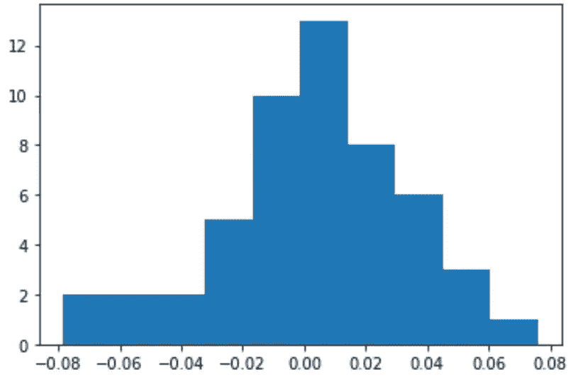

*如果你看到数据的分布在视觉上看起来有点像正态分布。但真的是这样吗？这就是我们要用不同的统计方法来回答的问题，*

# *Q-Q 剧情测试*

我们将从一种更直观、更少数学的方法开始，分位数-分位数图。

什么是分位数-分位数图？该图显示了给定数据相对于正态分布的分布，即现有分位数相对于正态理论分位数。

让我们使用 Python 为我们的数据创建 Q-Q 图，然后解释结果。

```
import pylab
import scipy.stats as statsstats.probplot(df['return'], dist="norm", plot=pylab)
pylab.show()
```

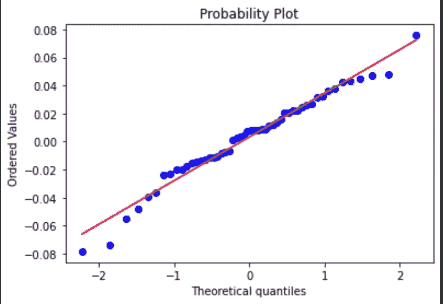

看上面的图表，我们看到一个向上倾斜的线性关系。对于正态分布，观察值应该都出现在 45 度直线上。我们在上面看到这样的关系了吗？我们做了一部分。所以这可以告诉我们的是，我们正在研究的分布并不完全是正态分布，而是接近正态分布。

# *Jarque–Bera 测试*

*Jarque-Bera 是正态性检验的一种，具体来说是将偏度和峰度与正态分布的偏度和峰度相匹配的拟合优度检验。*

*其统计量为非负，大值表示显著偏离正态分布。*

*Jarque-Bera 的检验统计量 JB 定义如下:*

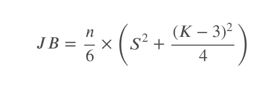

*其中𝑆为样本* [*偏度*](https://docs.scipy.org/doc/scipy/reference/generated/scipy.stats.skew.html) *，𝐾为样本* [*峰度*](https://docs.scipy.org/doc/scipy/reference/generated/scipy.stats.kurtosis.html) *，𝑛为样本大小。*

*假设:*

*𝐻0:sample 𝑆和样本𝐾没有显著不同于正态分布*

*𝐻1:sample 𝑆和样本𝐾显著不同于正态分布*

*现在我们可以计算 Jarque-Bera 检验统计量，并找到相应的𝑝-value:*

```
from scipy.stats import jarque_beraresult = (jarque_bera(df['return']))print(f"JB statistic: {result[0]}")
print(f"p-value: {result[1]}")JB statistic: 1.9374105196180924
p-value: 0.37957417002404925
```

查看这些结果，我们未能拒绝零假设，并得出样本数据遵循正态分布的结论。

*注:Jarque-Bera 检验在大样本(通常大于 2000 个观察值)中工作正常，其统计量具有 2 个自由度的卡方分布)*

# *科尔莫戈罗夫-斯米尔诺夫试验*

Kolmogorov-Smirnov 检验(或 K-S 检验)是最常见的正态性检验之一。与其他检验相比，Kolmogorov-Smirnov 检验的一个主要优点是非参数的，这意味着它是无分布的。

这里我们关注单样本 Kolmogorov-Smirnov 测试，因为我们希望将一维概率分布与理论上指定的分布(在我们的例子中是正态分布)进行比较。

*Kolmogorov-Smirnov 检验统计量测量样本的经验分布函数(ECDF)和参考分布的累积分布函数之间的距离。*

*在我们的例子中，经验分布函数将来自我们之前收集的回报数据。因为我们将它与正态分布进行比较，所以我们将使用正态分布的累积分布函数。*

到目前为止，这听起来很专业，所以让我们试着把它分解并形象化，以便更好地理解。

*第一步:*

*让我们用收益数据的平均值和标准偏差创建一个正态分布值数组:*

```
data_norm = np.random.normal(np.mean(df['return']), np.std(df['return']), len(df))
```

*使用*[*NP . random . normal()*](https://numpy.org/doc/stable/reference/random/generated/numpy.random.normal.html)*我们创建了 data_norm，它是一个数组，具有与 df['return']相同数量的观察值，还具有相同的均值和标准差。*

*这里的直觉是，如果我们假设分布的一些参数(平均值和标准偏差)，那么具有这些参数的数字将形成正态分布。*

*第二步:*

*接下来，我们要做的是在两个数据集上使用*[*NP . histogram()*](https://numpy.org/doc/stable/reference/generated/numpy.histogram.html)*对它们进行排序，并将它们分配到箱:*

```
values, base = np.histogram(df['return'])
values_norm, base_norm = np.histogram(data_norm)
```

*注意:默认情况下，该函数将使用 bins = 10，您可以根据正在处理的数据进行调整。*

*第三步:*

*使用*[*NP . cumsum()*](https://numpy.org/doc/stable/reference/generated/numpy.cumsum.html)*计算上面创建的数组的累计和:*

```
cumulative = np.cumsum(values)
cumulative_norm = np.cumsum(values_norm)
```

*第四步:*

*绘制累积分布函数:*

```
plt.plot(base[:-1], cumulative, c='blue')
plt.plot(base_norm[:-1], cumulative_norm, c='green')
plt.show()
```

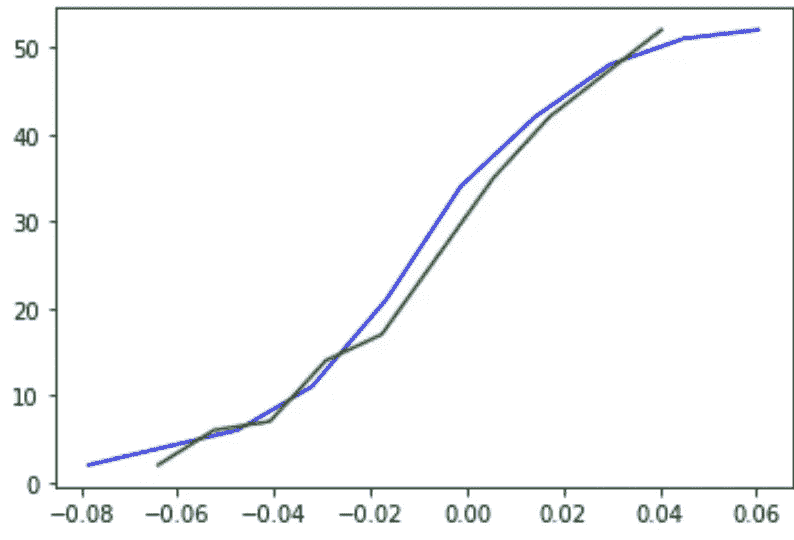

*其中蓝线是 df['return']的 ECDF(经验累积分布函数)，绿线是正态分布的 CDF。*

*第四步替代:*

*您可以使用 seaborn 更快地创建图形，并且只需要步骤 1 中的 df['return']和 data _ norm:*

```
import seaborn as sns
sns.ecdfplot(df['return'], c='blue')
sns.ecdfplot(data_norm, c='green')
```

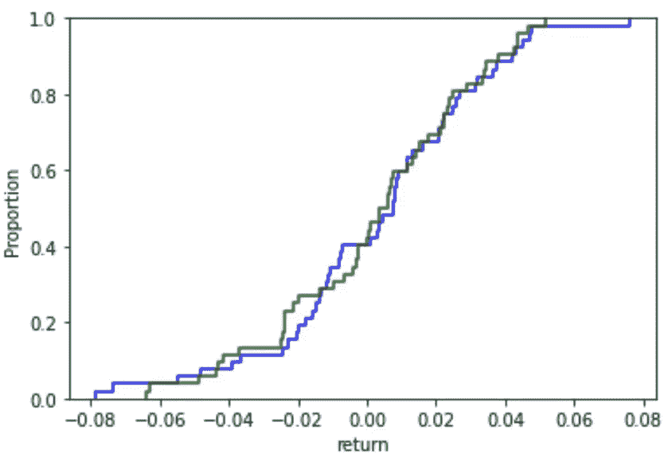

*现在，在可视化这两个累积分布函数之后，让我们回到 Kolmogorov-Smirnov 测试。Kolmogorov-Smirnov 检验是基于这两条曲线(蓝绿色)之间的最大距离，假设如下:*

*𝐻0:的两个样本来自同一个分布*

*𝐻1:的两个样本来自不同的分布*

*我们定义 ECDF 为:*

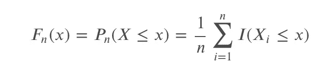

*即统计样本观测值低于𝑥.水平的比例*

我们定义一个给定的(理论上的)CDF 为:𝐹(𝑥).在正态性检验的情况下，𝐹(𝑥)是正态分布的 CDF。

*Kolmogorov-Smirnov 统计量被定义为:*

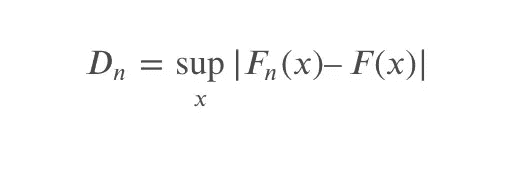

*直观上，该统计测量所有𝑥值的两个分布函数之间的最大绝对距离。*

使用上面的图表，这是我估计的上确界:


这里蓝线表示上确界。计算𝐷𝑛的值，并将其与𝐷0.05 的临界值(假设 5%)进行比较，我们可以拒绝或无法拒绝零假设。

*回到我们的例子，让我们对微软股票收益数据进行 K-S 检验:*

```
from scipy.stats import kstestresult = (kstest(df['return'], cdf='norm'))print(f"K-S statistic: {result[0]}")
print(f"p-value: {result[1]}")K-S statistic: 0.46976096086398267
p-value: 4.788934452701707e-11
```

*由于𝑝-value 显著小于 0.05，我们拒绝零假设，接受另一个假设，即测试的两个样本不是来自同一个累积分布，这意味着微软股票的回报不是正态分布。*

# *安德森-达林测试*

安德森-达林试验(A-D 试验)是对上述科尔莫戈罗夫-斯米尔诺夫试验的改进。它测试给定的观察样本是否来自给定的概率分布(在我们的例子中，来自正态分布)。

*𝐻0:数据来自指定的分布*

*𝐻1:数据不是来自指定的分布*

*A-D 检验比 K-S 检验更有效，因为它考虑了数据中的所有值，而不仅仅是产生最大距离的值(如 K-S 检验)。它还为拟合分布的尾部分配更多的权重。*

*该检验属于二次经验分布函数(EDF)统计，由以下公式给出:*

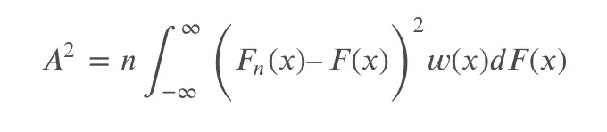

*其中，𝐹是假设的分布(在我们的例子中是正态分布)，𝐹𝑛是 ECDF(上一节讨论的计算)，𝑤(𝑥是加权函数。*

*加权函数由下式给出:*

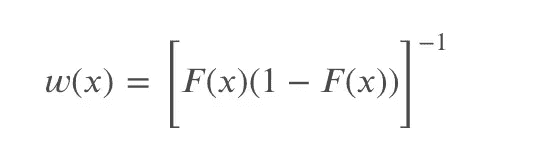

允许在分布的尾部对观察值给予更多的权重。

*给定这样一个加权函数，检验统计量可以简化为:*

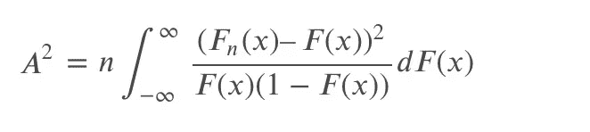

*假设我们有一个𝑋数据样本，我们想测试这个样本是否来自正态分布的累积分布函数(𝐹(𝑥)。*

*我们需要对数据进行排序，以使𝑥1 < 𝑥2 < … < 𝑥𝑛，然后计算𝐴2 的统计数据为:*

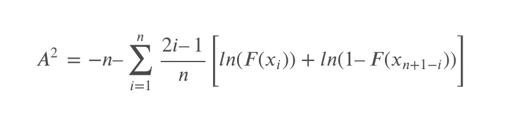

*回到我们的例子，让我们用 Python 对微软股票回报数据进行 A-D 测试:*

```
from scipy.stats import andersonresult = (anderson(df['return'], dist='norm'))print(f"A-D statistic: {result[0]}")
print(f"Critical values: {result[1]}")
print(f"Significance levels: {result[2]}")A-D statistic: 0.3693823006816217
Critical values: [0.539 0.614 0.737 0.86  1.023]
Significance levels: [15\.  10\.   5\.   2.5  1\. ]
```

*输出的第一行是 A-D 检验统计量，在 0.37 左右；输出的第三行是具有不同显著性级别(从 15%到 1%)的列表；输出的第二行是相应显著性水平的临界值列表。*

*假设我们要在 5%的水平上测试我们的假设，这意味着我们将使用的临界值是 0.737(来自上面的输出)。由于计算机 A-D 检验统计量(0.37)小于临界值(0.737)，我们无法拒绝零假设并得出微软股票收益的样本数据来自正态分布的结论。*

# *夏皮罗-维尔克检验*

*夏皮罗-维尔克检验(S-W 检验)是统计学中的另一种正态性检验，假设如下:*

*样本的𝐻0:分布与正态分布没有显著差异*

*样本的𝐻1:分布明显不同于正态分布*

*与 Kolmogorov-Smirnov 测试和 Anderson-Darling 测试不同，它的统计计算不是基于 ECDF 和 CDF，而是使用从正态分布样本的矩生成的常数。*

*夏皮罗-维尔克检验统计量定义为:*

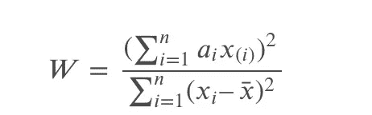

*其中𝑥(𝑖)是样本中𝑖th 最小的数(𝑥1<𝑥2<……<𝑥𝑛)；和𝑎𝑖是从正态分布样本的 var，cov，mean 生成的常数。*

*回到我们的例子，让我们用 Python 对微软股票回报数据执行 S-W 测试:*

```
from scipy.stats import shapiro

result = (shapiro(df['return']))

print(f"S-W statistic: {result[0]}")
print(f"p-value: {result[1]}")S-W statistic: 0.9772366881370544
p-value: 0.41611215472221375
```

*给定大于 0.05 ( > 0.05)的大𝑝-value (0.42)，我们无法拒绝零假设并得出样本与正态分布没有显著差异的结论。*

*注意:该测试的最大限制之一是规模偏差，这意味着样本规模越大，您越有可能获得具有统计显著性的结果。*

*要下载笔记本和数据集，请检查* [*Github*](https://github.com/rashmimarganiatgithub/normality-test)

注意:数据漂移和概念漂移是可以写一本新书的巨大话题。因此，其他一些有用的工具，探索作为一个参考，有一些更广泛和更深入的各种味道的数据集，如 [*【火炬裂痕】*](https://torchdrift.org/)*[*【证据】*](https://evidentlyai.com/blog/evidently-001-open-source-tool-to-analyze-data-drift)[不在场证明检测](https://github.com/SeldonIO/alibi-detect)[河](https://github.com/online-ml/river)。*

*在接下来的系列文章中，我们将从不同的方面探讨如何实现一个有效的数据管道，这是 ML 系统开发阶段的一个关键部分。*