# 外汇预测的实用深度学习模型

> 原文：<https://pub.towardsai.net/pragmatic-deep-learning-model-for-forex-forecasting-569aae6d4a1a?source=collection_archive---------0----------------------->

## [深度学习](https://towardsai.net/p/category/machine-learning/deep-learning)

## 使用 LSTM 和张量流对 GBPUSD 时间序列进行多步预测

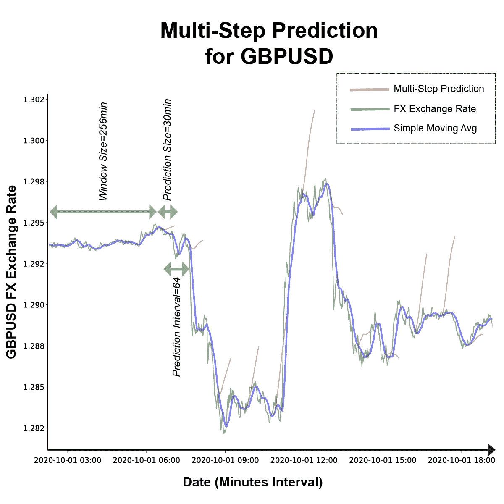

为了解决这个经典问题，“机器学习能预测市场吗？”，我登陆 GBPUSD 外汇作为一个富有挑战性的金融系列，拥有丰富和免费的数据集。虽然在这个平台上有几十个关于股票 ML 预测的故事和几个关于外汇 ML 预测的故事，但在这里，你会看到我深入研究经常被忽略的特性，并旨在将我的模型带到现实光谱中:

*   通过实现多步预测，例如 30 或 60 步(在这种情况下是几分钟)或更多，与单步(1 分钟)预测相反
*   通过使用算法交易机器人消费模型，让盈利或亏损成为判断(下一个故事)

在故事的结尾，有一些 Python 和 ML 经验的读者将能够使用这些概念并修改链接的代码来产生他们自己的模型变体。在第 2 部分中，读者将能够使用该模型的商业算法交易平台。

## 源代码和后续工作

该模型是使用 TensorFlow/Keras 2.3 在 Python 3.8 中构建的。为了让这个故事集中在概念上，完整的源代码和环境准备，以及与运行和更改代码相关的解释都在这里:

[](https://github.com/AdamTibi/LSTM-FX) [## 阿达姆蒂比/LSTM-外汇

### 这是外汇预测实用深度学习模型的配套代码。所以，如果你想了解…

github.com](https://github.com/AdamTibi/LSTM-FX) 

此外，您还可以查看环境设置和运行模型的步骤，直观地解释如下:

解释环境设置和运行模型的步骤

# 目录

## 外汇交易入门

*   **什么是外汇？**
*   **佣金、差价和点数**
*   **滴答数据**
*   **开盘高低收盘数据**
*   **烛台图表**
*   **外汇交易**
*   **算法交易**
*   **回溯测试**

## ML 模型:概念和计划

*   **型号选择**
*   **技术堆栈选择**
*   **硬件选择**
*   **这个计划**

## 1 —数据来源

## 2 —数据准备

*   **时间间隔和 OHLC**
*   **平滑**
*   **平稳性**
*   **批量大小**
*   **训练，测试分割**
*   **流程总结**
*   **缩放比例**
*   **LSTM 数据输入概述**
*   **窗户尺寸**
*   **转换样本**

## 3 —模型培训

*   **培训统计**

## 4 —预测

*   **单步预测**
*   **多步预测**

## 继续并扩大研究

*   **日期特征工程**
*   **最小化异常值的影响**
*   **非常小的迷你批量**
*   **不同的平滑方法**
*   **区间聚合**
*   **序列间预测**

## 放弃

## 结论

## 第二部分:使用交易平台的模型

## 更多阅读

## 关于我

## 参考

# 外汇交易入门

我将定义与这个故事相关的外汇交易的基础知识。如果你熟悉外汇基础知识，那么你可以跳过这一节。

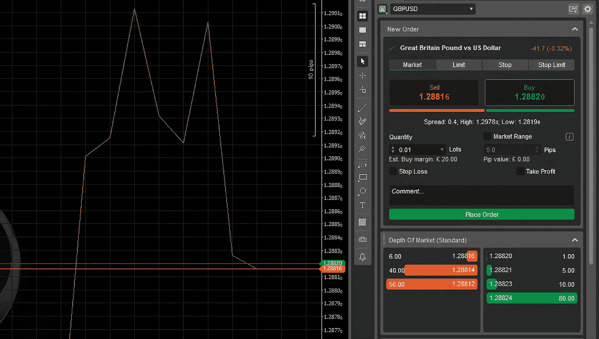

GBPUSD 汇率买入= 1.28820，卖出= 1.28816 取自 [cTrader](https://ctrader.com/)

## 什么是外汇？

外汇是两个经济体之间的货币价格关系，例如英镑对美元或 GBPUSD。符号中的前三个字母代表称为“基础货币”的第一个经济体，后三个字母代表称为“报价货币”的第二个经济体。如果 GBPUSD 的汇率是 1.28818，这意味着买 1.28818 美元你要支付 1 美元，外加佣金和/或差价。

## 佣金、差价和点数

如果你是与朋友交换，那么你可能会使用两个小数点，并在 1.29 交换 GBPUSD，但是，如果你是通过外汇经纪人通过外汇交易平台进行交换，那么就有费用。

佣金:这是经纪人对每笔交易收取的固定费用。佣金金额取决于经纪人。

**价差**:买入价和卖出价之间的差额。经纪人就是这样盈利的。

举个例子，如果你有英镑，你想买美元，那么 GBPUSD 买入是 1.28820，反之卖出是 1.28816。这使得传播:

```
Spread = Buy - Sell = 1.28820 - 1.28816 = 0.00004 = 0.4e-4
```

除非发生影响经济的事件，否则外汇价格的变化通常很小，因此交易者使用点数来表示变化。

**PIP** :价格利息点是特定于货币的。对于包括 GBPUSD 在内的大多数货币来说，汇率是:兑换 x 10000

我们可以将价差视为价格变化，因此可以表示为:

```
Spread = 0.4e-4 = 0.4 pips
```

例如，如果 GBPUSD 的卖价从 1.28816 变为 1.28827，我们说价格上涨了:

```
1.28827 - 1.28816 = 0.00011 = 1.1 pips
```

## 滴答数据

价格的变化，也称为“滴答”，随机发生，例如每秒多次变化或两分钟内一次变化。外汇快速生成分笔成交点数据，这是 2020 年 9 月 30 日前 5 秒的 GBPUSD 分笔成交点数据示例:

```
**Date                  | Sell    | Buy**
20200930 00:00:00.220 | 1.28643 | 1.28654
20200930 00:00:00.322 | 1.28643 | 1.28653
20200930 00:00:01.025 | 1.28641 | 1.28655
20200930 00:00:01.754 | 1.28641 | 1.28654
20200930 00:00:03.403 | 1.28642 | 1.28653
20200930 00:00:04.204 | 1.28642 | 1.28655
20200930 00:00:04.255 | 1.28643 | 1.28654
20200930 00:00:04.356 | 1.28644 | 1.28656
20200930 00:00:05.520 | 1.28645 | 1.28657
20200930 00:00:05.853 | 1.28647 | 1.28657
```

还有另一种方式来查看数据，特别是当您想要检查更长时间(分钟、小时、周等)的价格时。

## 开盘高低收盘数据

OHLC 是汇总数据的另一种方式。OHLC 可以应用于任何时间间隔，如一分钟或一小时。开盘获取时间间隔开始时的卖价，收盘获取第二个时间间隔开始前的价格。高表示价格在区间内达到的最高价，低表示价格达到的最低价。这是 2020 年 9 月 30 日 GBPUSD 最初几分钟的 1 分钟 OHLC 数据示例:

```
**Date           | Open    | High    | Low     | Close**
20200930 00:00 | 1.28643 | 1.28663 | 1.28641 | 1.28659
20200930 00:01 | 1.28663 | 1.28675 | 1.28649 | 1.28649
20200930 00:02 | 1.28649 | 1.28650 | 1.28627 | 1.28630
20200930 00:03 | 1.28630 | 1.28648 | 1.28626 | 1.28638
20200930 00:04 | 1.28639 | 1.28647 | 1.28635 | 1.28640
20200930 00:05 | 1.28641 | 1.28654 | 1.28641 | 1.28651
20200930 00:06 | 1.28650 | 1.28655 | 1.28648 | 1.28653
20200930 00:07 | 1.28653 | 1.28654 | 1.28647 | 1.28649
```

## 烛台图表

交易者通常用 OHLC 数据来看图表，这就是为什么他们用“蜡烛图”来更好地表示这种类型的数据:

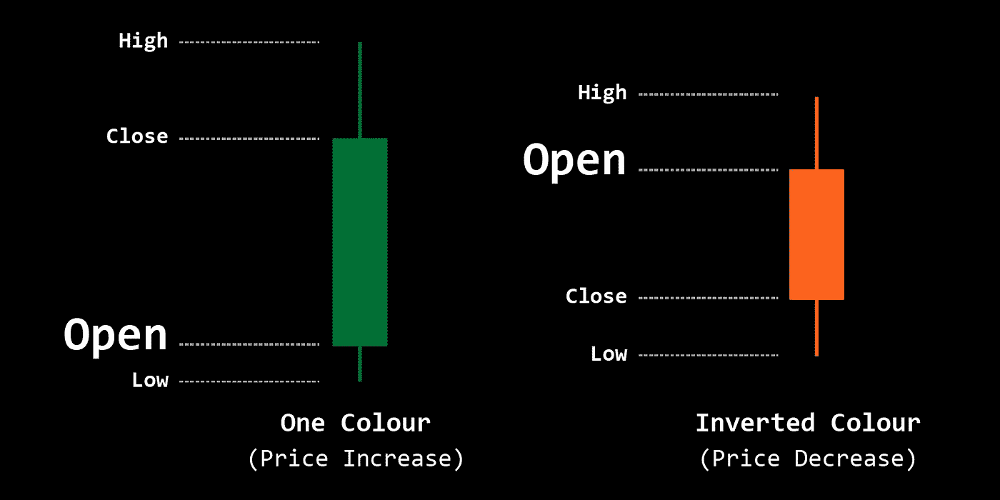

烛台吧。作者图片

请注意，烛台的颜色是任意的，惯例是使用一种颜色和一种相反的颜色，如黑色和灰色，我在这个故事中使用了绿色和橙色。接下来是我们上面的 OHLC 表，表示为蜡烛图:

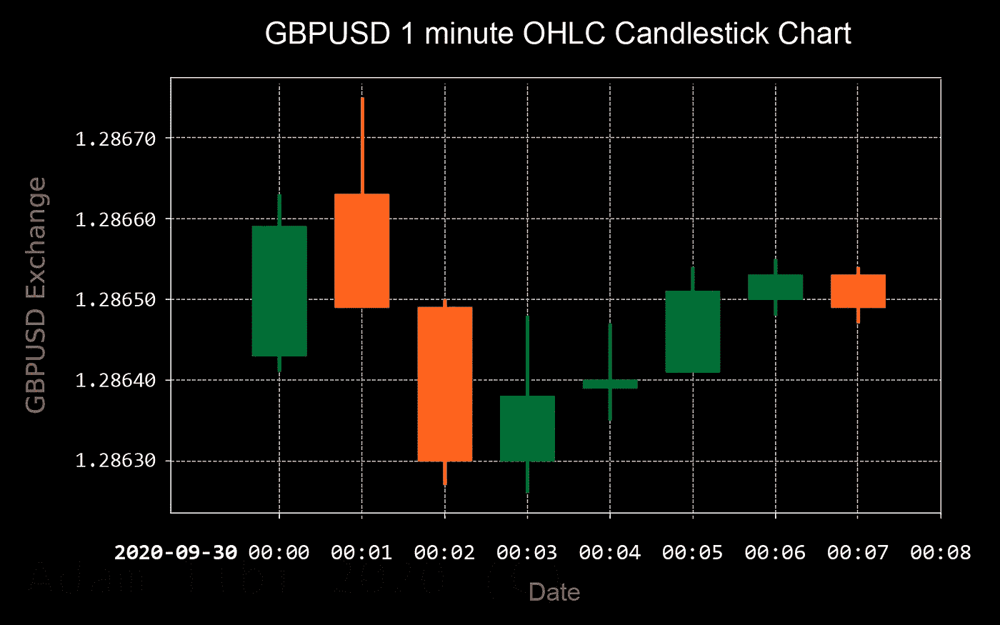

蜡烛图从 2020 年 9 月 30 日午夜开始。作者图片

## 外汇交易

本质上，如果你认为价格会上涨，你用报价货币(美元)买入基础货币(英镑)，如果你认为价格会下跌，你卖出基础货币。

交易与策略相关联，以这个过于简单的策略为例“如果你认为价格会上涨至少 10 点就买入，如果你认为价格会下跌至少 10 点就卖出。”

你对价格变化的信念可能来自许多方面，天空是极限，例如:

*   你认为一个政治决定会影响一对经济体中的一个
*   你期待一份不同寻常的 GDP 公告
*   你使用一些技术指标，并以此为基础做出决定
*   您根据历史数据训练一个 ML 模型，并要求它预测未来价格

## 算法交易

算法交易是使用机器人，一种用代码编写的策略，并通过 API 或其他基于机器人建议的方式自动执行交易。

一个例子是使用一个机器人，将输入数据推入一个 ML 模型，并就价格变化咨询模型，然后相应地进行交易。

**在第二部分，我将展示这个故事中的模型将如何用于算法交易**。

## 回溯测试

当你建立了一个机器人，你想确保机器人能够盈利，一种方法是使用一个回溯测试平台来运行这个机器人，最好是和你的生产平台相同的平台。

另一个级别的回溯测试是在相同的生产平台上以演示模式(虚拟货币)运行一段时间，但使用实时数据。

通过这种方式，你减轻了损失的风险，但是，你仍然有其他风险，如市场模式转变的风险。

**在第 2 部分，我将展示如何回测基于这个模型的机器人。**

# ML 模型:概念和计划

在交易中，如果我们想知道在某个特定时间是买、卖还是什么都不做，我们想预测价格会涨还是会跌，涨多少。

为了做交易决定，技术交易者使用指标来分析固定数量的时间步长(价格变化)。如果指标符合特定的模式，这意味着买入或卖出信号。本质上，这些指标是试图从以前的价格中提取模式。

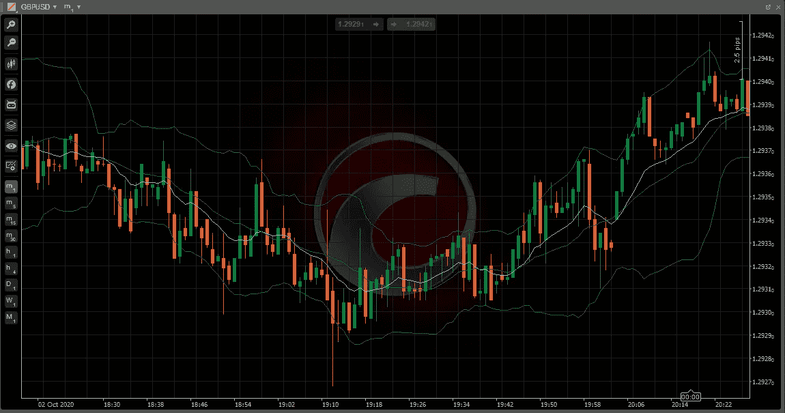

带布林线(绿色)和均线(青色)指标的蜡烛图。捕捉自 [cTrader](https://ctrader.com/)

这里的想法是让我们的模型作为一个指标。我们将使用历史数据来训练我们的模型，研究价格变化以及它们是否会导致价格上涨或下跌。如果历史数据中有重复出现的模式，那么我们希望我们的模型能够识别它们。

简而言之，我们希望我们的模型能够识别价格模式，并在遇到模式时告知我们预期的价格变化。

## 型号选择

为了实现我们的目标，我们将需要一个 ML 模型，该模型将识别时间序列模式并预测下一个模式，因此我们可以将选择范围缩小到适用的模型。

回归模型，如 **GARCH** 、 **ARIMA** 和**脸书先知**，对于不太复杂的时间序列预测很好，所以我将它们排除在外，而倾向于深度学习神经网络模型，如**注意力网络**和**长短期记忆(LSTM)** ，因为它们更适合这种预测。

我更喜欢 LSTM，因为与新的注意力网络相比，这个模型得到了大量的研究，尽管我可能会用注意力网络做另一项研究。

## 技术堆栈选择

*   **开发:** Python 3.8，Tensorflow 2.3(内置 Keras)，Visual Studio 代码带 Jupyter 笔记本，Visual Studio，Pandas，NumPy，Scikit-Learn，Matplotlib，Ubuntu 20.04
*   **制作:** Python 3.8，C#，CTrader 算法交易平台(CTrader Automate)，Flask Web 服务器，Windows 10

## 硬件选择

这不是一个真正的选择，这是我已经拥有的。

*   笔记本电脑(用于开发):Dell Precision M4800，32GB 内存，8 个逻辑内核英特尔 i7 2.9GHz，2GB 内存 Nvidia Quadro K2100M
*   服务器(用于培训):Dell Precision Tower 7910、24GB 内存、28 个逻辑内核英特尔至强 2.6GHz、Nvidia GeForce RTX 2080 8GB 内存

## 这个计划

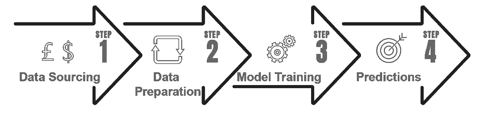

这个计划。作者图片

我们将经历标准的 ML 监督学习过程，我们将获取数据，以适合模型的结构准备数据，训练模型，然后使用模型进行预测。

# 1 —数据来源

我选择了GBPUSD 外汇市场，因为这里有大量免费的高质量数据，小到分笔成交点数据，而且我住在英国，对数据本身也很熟悉(我可以盲目地指出 2008 年信贷危机、英国退出欧盟投票日和新冠肺炎封锁)。

你可以使用像 [Quandl](https://www.quandl.com/tools/python) 这样的资源从 Python 下载 GBPUSD 数据，或者像我一样以 CSV 格式下载。我用一个叫做 [Quant 数据管理器](https://strategyquant.com/quantdatamanager/)的 Windows 桌面软件从 Dukascopy 瑞士网上银行下载了 GBPUSD 1 分钟数据。这是一个样本数据:

```
Date,High,Low
2010-01-01 00:00,1.61673,1.61659
2010-01-01 00:01,1.61670,1.61670
...
2020-10-01 23:58,1.28852,1.28838
2020-10-01 23:59,1.28853,1.28846
```

# 2 —数据准备

外汇数据通常是干净的，所以我在这方面投资了一点。此外，我将努力强调量化金融概念，而不是关注代码，这将使链接的代码不言自明。

## 时间间隔和 OHLC

有了外汇，你可以很容易地获得报价。然而，分笔成交点数据非常不稳定，价格变化率不可预测，可能是每秒多次变化，也可能是两分钟一次变化。此外，分笔成交点价格生成了太多的数据，这将增加 ML 训练时间。

我选择 1 分钟 OHLC(开盘价、最高价、最低价、收盘价)，因为我认为 1 分钟是在大量样本和良好的训练时间之间的一个很好的平衡。使用 OHLC 之外的收盘价是一种常见的做法。然而，我不认为这是时间间隔的最佳表示，所以我取了最高价和最低价之间的平均价格，我在代码中称之为 **HLAvg** :

```
df['HLAvg'] = df['High'].add(df['Low']).div(2)
```

## 缓和

考虑到影响汇率的因素，我相信使用平滑的时间序列而不是价格的实际变化会产生更好的预测准确性。我坚持平滑的基本原则，使用 14 周期的简单移动平均线。我选择了 14，因为这是大多数技术分析工具的默认周期。

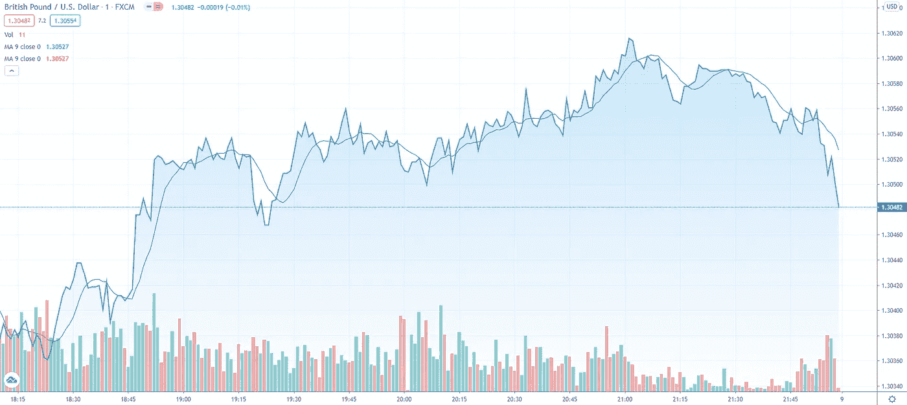

GBPUSD 1 分钟图上有 14 个周期的 SMA。图表来自[TradeView.com](https://uk.tradingview.com/)，数据来源为 [FXCM](https://www.fxcm.com/uk/) 。

```
df['MA'] = df['HLAvg'].rolling(window=14).mean()
```

注意，在计算移动平均线时，第一个周期减一，没有移动平均线(在我们的例子中是前 13 行)。我们将删除这些行。

## 平稳性

简单地说，平稳性意味着一个看起来平淡无奇的序列，没有趋势。简而言之，稳定是趋势的反义词。有一些统计测试可以告诉你一个特定时间序列的状态。更深入的分析:

[](https://machinelearningmastery.com/time-series-data-stationary-python/) [## 如何用 Python 检查时间序列数据是否平稳—机器学习精通

### 时间序列不同于更传统的分类和回归预测建模问题。时间…

machinelearningmastery.com](https://machinelearningmastery.com/time-series-data-stationary-python/) 

然而，基于经验证据，外汇和股票是非平稳的。所以，我们将继续假设我们的仪器是不稳定的。

虽然我们的 LSTM 深度学习模型不要求时间序列是平稳的，但许多来源都建议使用平稳的时间序列。

> [1]如果你的序列是上升或下降的趋势，估计[最小和最大可观察]值可能是困难的，标准化可能不是解决你的问题的最佳方法。
> 
> [1]在时间序列预测中，使序列平稳是一种很好的做法，即在对问题建模之前，从序列中去除任何系统趋势和季节性。使用 LSTMs 时，建议这样做。

我们可以通过计算收益来使金融工具稳定。定量金融的方法是使用日志回报。这是一篇精彩经典文章的链接，这篇文章解释了使用日志返回的原因:

[https://quantivity.wordpress.com/2011/02/21/why-log-returns](https://quantivity.wordpress.com/2011/02/21/why-log-returns)

通过对数回归使一个序列平稳是可逆的，因为我们不会丢失任何数据，不像用简单的移动平均线平滑。这很重要，因为我们希望能够从预测中重建我们的时间序列，稍后您将会看到这一点。

从简单移动平均线 *MA* 计算时间步长 *t* 的对数收益；

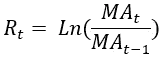

```
df['Returns'] = np.log(df['MA']/df['MA'].shift(1))
```

要根据收益计算未来移动平均值，预测后需要:

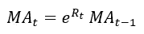

```
df['MA'] = df['MA'].mul(np.exp(df['Returns'].shift(-1))).shift(1)
```


具有简单移动平均和对数回报的时间序列

在上面的图表中，前两个图表之间没有太大的差异，因为在这种缩放级别下，1 分钟系列的平滑操作不会很清楚。

请注意，您将无法计算第一行的回报，因此我们将删除这一行。

## 批量

**批量大小**是梯度更新前用于神经网络训练的模型样本数量。

为了实用，我们需要了解批量大小:

*   是一个影响数据训练的超参数，需要进行更改以最大限度地减少预测误差
*   按照惯例可以取 2 到 32 之间的一个值，称为**小批量。**其他常见的数值有 64 和 128
*   它越大，在 GPU 上训练就越快。然而，不利的一面是，这导致了比小批量更多的训练错误

最佳批量是一个有争议的话题，我建议试错法来平衡最佳训练时间和最少的错误。

> [2]所呈现的结果证实，在大范围的实验中，对于给定的计算成本，使用小批量实现了最佳的训练稳定性和泛化性能。在所有情况下，最佳结果都是在批量 m = 32 或更小的情况下获得的，通常小到 m = 2 或 m = 4。

经过无数次的批量试错，我选择了 32 个。对于这个大小，我在我的硬件上每个时期花了大约 25 分钟(在我的 GitHub repo 上描述)。

## 列车，测试分流

所有 ML 从业者都熟悉训练/测试分离。我遵循传统的方法，但是添加了批量大小作为额外的约束。

我将数据长度限制为批量大小的倍数，因为我有将近 400 万条记录，牺牲数据开头的几条记录不会有任何影响。丢失的数据将小于最大批量，在本例中小于 32 分钟。

```
df = df[df.shape[0] % batch_size:]
```

之后，我根据批量大小对数据进行了拆分。注意 *val_size、test_size、window_size* (后面会讲到*window _ size*)*T5 也都是 *batch_size* 的倍数。我没有使用传统的 80/20 或 90/10 进行训练/测试分割。*

```
df_train = df[:- val_size - test_size]
df_val = df[- val_size - test_size - window_size:- test_size]
df_test = df[- test_size - window_size:]
```

我采用这种批量大小约束来降低使用 LSTM 模型时所需算法的复杂性。

这三个数据帧将保存到三个独立的 CSV 中，以便在训练、验证和测试模型时使用。

## 流程总结

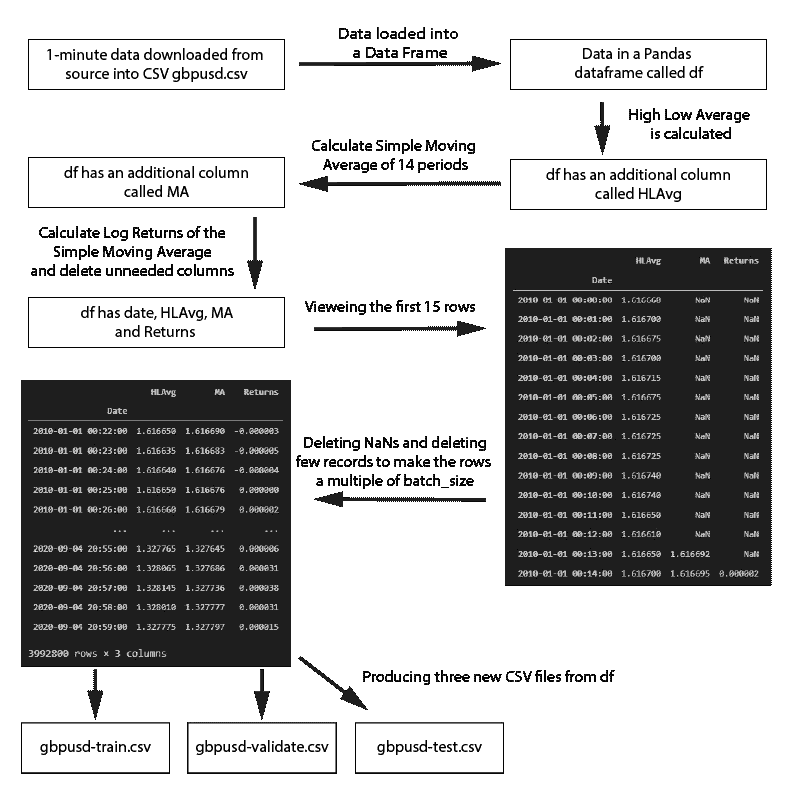

数据准备过程的第一步总结

之前的数据准备流程生成了三个单独的 CSV 文件，分别用于培训、验证和测试。这将有助于把我们的整个过程分割成单独的 Jupyter 笔记本。

## 缩放比例

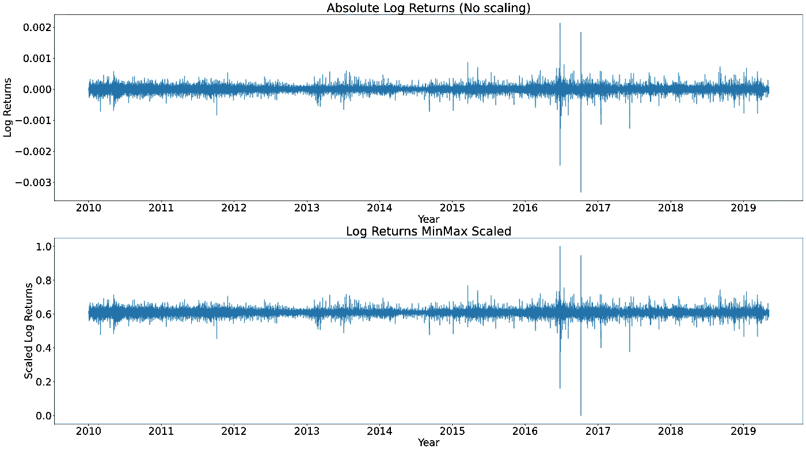

训练集:缩放后的日志返回介于 0 和 1 之间的值

我在这项研究中使用了*最小最大缩放器*，因为这是最有效的缩放器，因为与其他缩放器相比，单个历元时间是*最小最大缩放器*的三到四倍。

*最小最大缩放器*将数据值归一化到最小值和最大值之间，默认情况下，最小值和最大值分别为 0 和 1。当输入值缩放到标准范围时，LSTM 的性能会更好。

```
scaler = MinMaxScaler()
train_values = scaler.fit_transform(train_df[['Returns']].values)
...
test_values = scaler.transform(test_df[['Returns']].values)
```

稍后在预测之后，模型将预测缩放后的值，因此您必须反转变换以将其返回到真实值:

```
df['Returns_Prediction'] = scaler.inverse_transform(df[['Returns_Prediction_Scaled']].values)
```

这个定标器应该适合训练数据一次，然后从这一点开始重新使用来定标其他数据集:验证数据、测试数据、回测数据和生产数据。值得注意的是，如果缩放器适用于所有数据集，它将引入前瞻偏差。

要重用缩放器，最快的方法是持久化它(将其存储为文件)并在需要时加载它:

```
joblib.dump(scaler, 'scalers/scaler.bin') # For persisting to file
...
scaler = joblib.load('scalers/scaler.bin') # For loading from file
```

这个过程的一个注意事项是，您需要使用相同的 SciKit Learn 版本来保存和加载。

到目前为止，我们已经对行数据执行了以下操作:

*   已计算最高最低平均值(HLAvg)
*   计算简单移动平均线(SMA)
*   计算了 SMA 的对数收益
*   计算了缩放后的测井回报

我们从日期开始，从高点和低点开始，以缩放后的日志回报结束，这是我们的原始数据和处理后的数据的 10 条记录的快照:

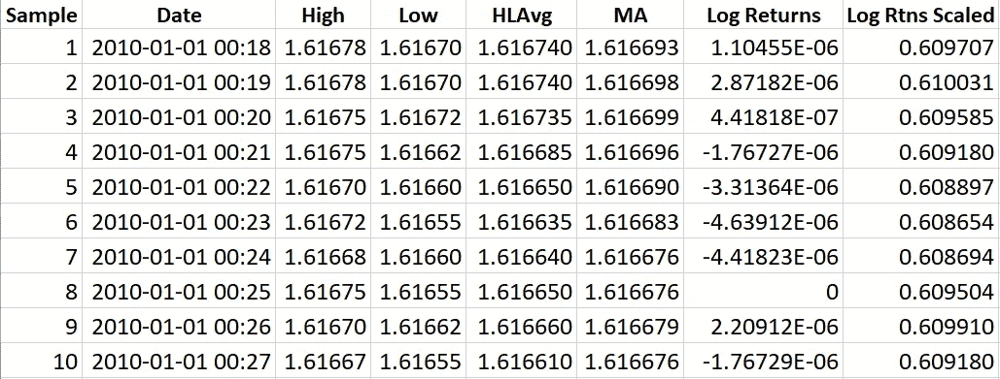

## LSTM 数据输入概览

我们需要从一个模型中得到一个固定数量的最近样本，并得到预测。让我们使用上表，假设现在的时间是 2010–01–01 00:23，这是第 6 个样本。我们希望预测样本 7 处的 HLAvg，如下所示:

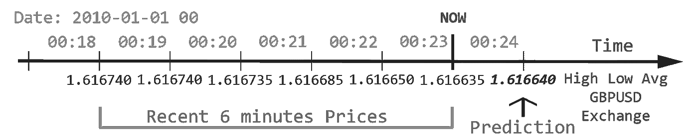

前期价格及其预测。作者图片

我们的预测越接近一分钟后的市场实际价值(样本 7，00:24)，我们的预测就越准确。

LSTM 模型期望输入的训练数据看起来像先前的数据，但是应用了所有的数据准备。根据上表，它预期的数据如下所示:

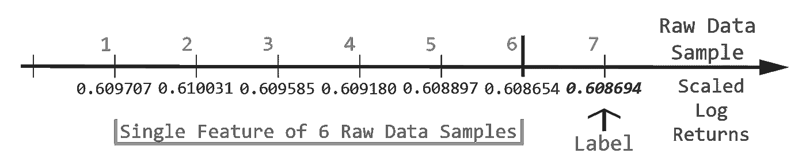

一个特征和一个标签。作者图片

在我们的实现中，单个特征的长度是*窗口大小，在前面的例子中，它是 6。*

## 窗口大小

窗口大小，也称为“回望期”，是过去样本的数量，在我们的情况下是分钟，您希望在预测下一个样本的时间点上考虑它。把它想象成你想要依赖的相关的过去的样本，来决定金融工具是上涨还是下跌。

为了在整个数据集上训练我们的模型，我们必须将训练集构造为特征(X)和标签(y)的模型样本，如果我们以前面的表为例，窗口大小为 6:

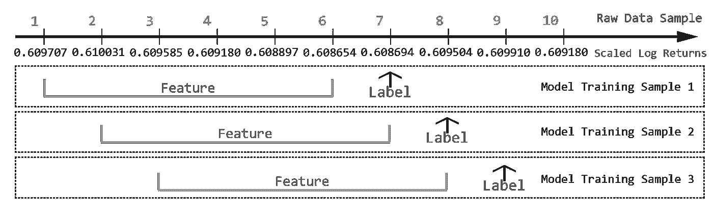

每个样本移动 1 的图示。作者图片

接下来我们将展示创建这个数据结构所必需的代码，为了简化算法并符合 LSTM 输入，我将*窗口大小*设为*批量大小的倍数。*

```
batch_size = 32
window_size = 8 * batch_size # 256 minutes, 4.3 hours
```

## 转换样本

由于“样本”是一个松散的术语，我们姑且称之为“模型-样本”，给它一个精确的定义。为了训练模型，我们需要将所有处理过的样本(比例对数回报)转换为模型样本(窗口大小和标签的特征集合)。按照惯例，特征集合被称为 *X* ，它们的标签是 *y.*

```
def convert_raw_samples_to_model_samples(scd_log_rtns, window_size):
    X, y = [], []
    len_log_rtns = len(scd_log_rtns)
    for i in range(window_size, len_log_rtns):
        X.append(values[i-window_size:i])
        y.append(values[i])
    X, y = np.asarray(X), np.asarray(y)
    X = np.reshape(X, (X.shape[0], X.shape[1], 1))
    return X, y
```

举例说明前面的函数，如果 *scd_log_rtns* 有 10 个数据样本，并且 *window_size* =6，则 for 循环可以表示为:

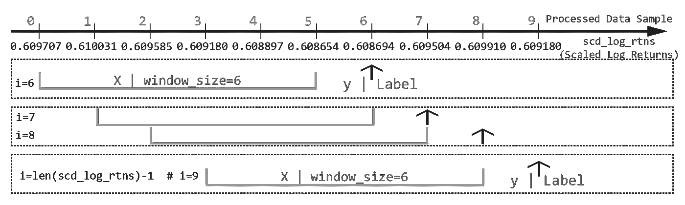

for 循环的图示。作者图片

LSTM 输入期望形状的 3D 阵列:处理的数据样本的数量、窗口大小和特征

*   已处理数据样本的数量是所有定标测井返回的大小减去窗口大小。记住，我们不能使用所有的训练数据，因为第一个 *window_size* 样本是不可用的。
*   在我们的例子中，特征是 1，这是比例对数回报

*X* 的最后一个*整形*会将 *X* 转换为 LSTM 3D 兼容输入。

同样，同样的过程也适用于验证数据集。

# 3 —模型培训


模型的数据流。作者图片

Keras 成为 v2 中 TensorFlow 的一部分，我们将 Keras 用于我们的模型:

```
model = Sequential()
model.add(LSTM(76, input_shape=(X.shape[1], 1), return_sequences = False))
model.add(Dropout(0.2))
model.add(Dense(1))
model.compile(loss="mse", optimizer='Adam')
```

**顺序** : Keras 层叠方式。详情如下:

[](https://keras.io/guides/sequential_model/) [## Keras 文档:顺序模型

### 作者:fchollet 创建日期:2020/04/12 最近修改时间:2020/04/12 描述:顺序…

keras.io](https://keras.io/guides/sequential_model/) 

LSTM:LSTM 网络非常适合处理时间序列问题。解释这一层的细节超出了本故事的范围，详情如下:

[](https://towardsdatascience.com/illustrated-guide-to-lstms-and-gru-s-a-step-by-step-explanation-44e9eb85bf21) [## LSTM 和 GRU 的图解指南:一步一步的解释

### 嗨，欢迎来到长短期记忆(LSTM)和门控循环单位(GRU)的图解指南。我是迈克尔…

towardsdatascience.com](https://towardsdatascience.com/illustrated-guide-to-lstms-and-gru-s-a-step-by-step-explanation-44e9eb85bf21) 

**Dropout** :是一个正则化层，用于 LSTM 和其他 RNN 网络以减少过度拟合。它通常出现在每一层 LSTM 之后。更多详情:

[](https://machinelearningmastery.com/how-to-reduce-overfitting-with-dropout-regularization-in-keras/) [## 如何在 Keras -机器学习掌握中使用退出正则化来减少过拟合

### 最后更新于 2020 年 8 月 25 日退出正则化是一种计算廉价的方式来正则化一个深神经…

machinelearningmastery.com](https://machinelearningmastery.com/how-to-reduce-overfitting-with-dropout-regularization-in-keras/) 

我用的是一层有 76 个神经元的 LSTM。对于正则化，我使用了 20%的辍学层。在我构建网络的试错过程中，我使用了多对 LSTM 和漏失层，我尝试了 1、2、3 和 4 对(通过隐藏层使网络更深)，我还尝试了改变每层神经元的数量和漏失百分比。

我降落在一对层，这产生了最少的错误和最少的训练时间。

**密集**:我的输入有多个神经元(76)，会产生多维度的输出。密集层将创建输入的加权线性组合(有偏差)，这将创建单个输出，在我们的情况下，它是单个预测，这是下一分钟。

## 培训统计

我尝试了从 2010 年 1 月 1 日到 2020 年 10 月 1 日的分钟数据，每个时期大约需要 25 分钟，100 个时期似乎不错。

训练测试的均方误差约为 3.2e-6，验证损失约为 2e-6。我试图将周期增加到 200，因为我认为模型训练不足，但这并没有减少测试的 MSE。我认为这种差异是因为验证集与测试集的模式不同，而且与其他时间序列相比，外汇市场的模式较少。

# 4 —预测

请记住，您的模型只理解比例对数回报，因为这是我们对它进行的培训。现在每次我们想要一个预测，我们都必须经历这个过程:

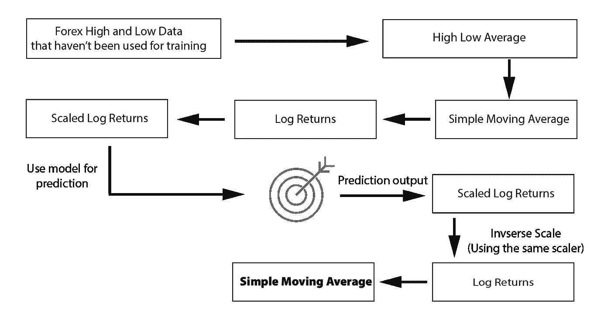

预测前后的数据流。作者图片

下面的代码实现了上面的过程，其中 X 是充当特性列表的数据:

```
y_pred = model.predict(X)
df['Pred_Scaled'] = np.pad(y_pred.reshape(y_pred.shape[0]), (window_size, 0), mode='constant', constant_values=np.nan)df['Pred_Returns'] = scaler.inverse_transform(df[['Pred_Scaled']].values)df['Pred_MA'] = df['MA'].mul(np.exp(df['Pred_Returns'].shift(-1))).shift(1)
```

值得注意的是，要从回报中重建 SMA，你需要初始资本。举个简单的例子，如果我知道你有+ 2、+ 3 和- 4 的回报，我就不会知道你的资本，但如果你告诉我你的初始资本，比如 1000，我就能构建一个完整的投资(想想 SMA)，这将是 1002，1005，1001。代码中的最后一行是这样做的，但是返回的不是算术返回，所以我使用 *exp* 函数来反转操作。

## 单步预测

这是模型的单步预测:

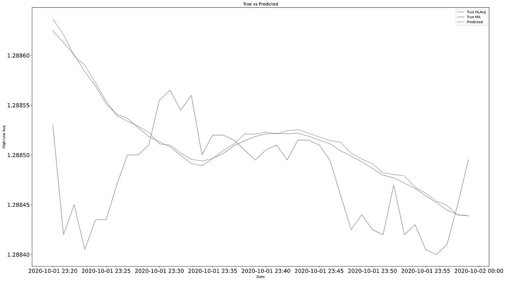

单项预测(1 分钟)。作者图片

在上图中，预测值离 SMA 不远。这并不意味着什么，因为我们预测的只是一分钟，任何一个不太好的模型都会给出一个好的结果。

## 多步预测

单步预测对交易没有用，你需要超过一分钟的预测，就好像你计划交易 1 分钟，佣金和价差会对你不利。

预测多个步骤的一种方法是预测未来一分钟，然后在新的预测中使用该分钟，依此类推。在下一张图中，我做了几个多步预测来显示不止一种情况:

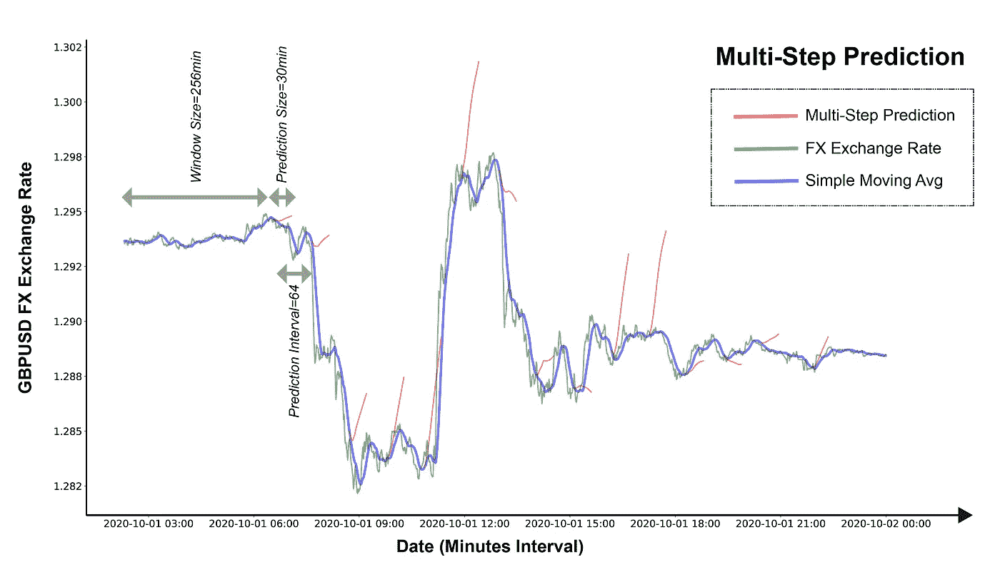

几个多步预测。作者图片

我受到雅各布·昂吉斯的启发，在他的文章中，我在更多阅读材料部分引用了他的文章，我有了这个有几个预测的图表。

说服 Matplotlib 在同一个图上画这些短红线是有挑战的，所以我使用了一个变通方法。我在图中添加了一条法线，但它是从图的起点填充到红线以' *np.nan'* 开始的点，下面的代码是准备图并同时进行预测:

# 继续并扩大研究

由于时间限制或硬件限制，我还没有尝试更多的实验概念。我在这里列出了一些，以便感兴趣的读者可以扩展这项研究。

## 日期特征工程

外汇可能有特定的模式，取决于日期的组成部分，如小时，周，月和/或年。

在这项研究中，我没有考虑日期值，我只是把每一分钟的价格变化作为一个样本。对日期组件进行特征工程设计并使用多种数据输入(多元时间序列预测)可能会揭示更多模式。

## 最小化异常值的影响

测井回归中的去趋势数据有几个异常值，最明显的是英国退出欧盟时期的异常值:

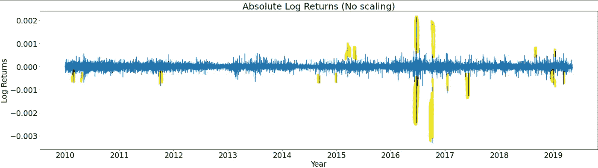

一些异常值的亮点。作者图片

我尝试了其他专门用于减少异常值影响的定标器，但模型训练时间增加了 3 到 4 倍。

如果决定这个模型不适合经济动荡，我会从物理上排除来自信贷危机、英国退出欧盟和新冠肺炎封锁期的样本。

## 非常小的迷你批量

对于 15 年来 32 个批次大小的单个时期，1 分钟的 GBPUSD 耗时约 45 分钟。因此，运行 200 个纪元需要大约一周时间(6.25 天)。

将大小减小到小于 32 可能会产生更好的预测，但会增加训练时间。

## 不同的平滑方法

我使用了 14 周期的简单移动平均线来平滑价格。但是对于交易者来说，均线没有指数加权均线受欢迎，因为均线对最近的数据样本更敏感。

## 区间聚合

我使用了 1 分钟的时间步长，但是，这也可以是 15 秒、30 秒、2 分钟、5 分钟、1 小时等等…

不同的汇总可能适合不同的交易风格，并可能揭示更多的模式。

## 序列间预测

我通过执行多个单一预测来模拟多步预测。还有另一种有趣的方法，称为序列间预测或 seq2seq。

在 seq2seq 中，不是预测单个 next 值，而是预测一个可变长度的新序列。例如

```
1.2752, 1.2751, 1.2754, 1.2756 -> 1.2758, 1.2760, 1.2761
```

> [3] seq2seq 学习，其核心是利用递归神经网络将变长输入序列映射为变长输出序列。虽然相对较新，但 seq2seq 方法不仅在其原始应用(机器翻译)方面取得了最先进的成果(Luong 等人，2015bJean 等人，2015 年 a；Luong 等人，2015 年 a；Jean 等人，2015bLuong 和 Manning，2015 年)，以及图像字幕生成(Vinyals 等人，2015 年 b)和选区解析(Vinyals 等人，2015 年 a)。

# 放弃

这些故事旨在研究深度学习的能力，而不是提供任何金融或交易建议。请勿将此研究和/或代码用于真实货币。

# 结论

尽管在我们的多步预测图中，并非所有的预测都是正确的，但请记住两件事:

1 —这仅仅是开始，正如“继续和扩大研究”一节所建议的，该模型还有很大的改进空间。

2——只要有一定比例的预测正确，就足以盈利。

一开始，我担心结果会遵循“均值回归”趋势，即预测会试图回到之前的平均价格。但事实并非如此。

# 第二部分:使用交易平台的模型

在这个故事的第二部分，我将使用在商业算法交易平台 cTrader 中构建的相同模型来测试它是否会盈利。我将描述将该模型投入生产的端到端方法的剩余部分。我将模型设置为在 web 服务器下运行，并公开一个 RESTful API，让 algo 交易平台实时请求预测，然后显示一个盈亏图，如下所示:


使用此模型对 2020 年 8 月 24 日和 2020 年 8 月 30 日之间的利润模拟 1000 进行回溯测试。将在第 2 部分讨论。捕捉自 [cTrader](https://ctrader.com/)

[](https://medium.com/towards-artificial-intelligence/using-a-tensorflow-deep-learning-model-for-forex-trading-ec4eff2ebe60) [## 使用 TensorFlow 深度学习模型进行外汇交易

### 在商业平台上建立一个算法机器人，根据模型的预测进行交易

medium.com](https://medium.com/towards-artificial-intelligence/using-a-tensorflow-deep-learning-model-for-forex-trading-ec4eff2ebe60) 

# 更多阅读

*   使用 LSTM 深度神经网络进行时间序列预测
*   [来自](https://machinelearningmastery.com/lstms-with-python/)[机器学习大师](https://machinelearningmastery.com/)的杰森·布朗利用 Python 制作的长短期记忆网络电子书。这是关于 LSTM 的最好的书面书籍，具有实用和更新的 Python 代码。
*   艾琳·尼尔森的《实用时间序列分析》一书。这是关于这个主题的最好的实用书籍，但有一个小小的警告:这本书时常在 Python 和 R 之间摇摆。
*   [现代时间序列分析| SciPy 2019 教程](https://www.youtube.com/watch?v=v5ijNXvlC5A)YouTube 上的 Aileen Nielsen。

# 关于我

我有 20 年的软件工程和金融专业背景。我在伦敦金融城担任软件架构师，我最喜欢的语言是 C#和 Python。我和实用数学有恋爱关系，和机器学习有暧昧关系。

# 参考

[1]杰森·布朗利(Jason Brownlee)，[长短期记忆网络与 Python](https://machinelearningmastery.com/lstms-with-python/) (2019)

[2] Dominic Masters 和 Carlo Luschi，[重温深度神经网络的小批量训练](https://arxiv.org/abs/1804.07612)，arXiv:1804.07612v1 [cs .2018 年 4 月 20 日

[3] Minh-Thang Luong，Quoc V. Le，Ilya Sutskever，Oriol Vinyals，Lukasz Kaiser，[多任务序列到序列学习](https://arxiv.org/abs/1511.06114)，作为 2016 年 ICLR 会议论文发表