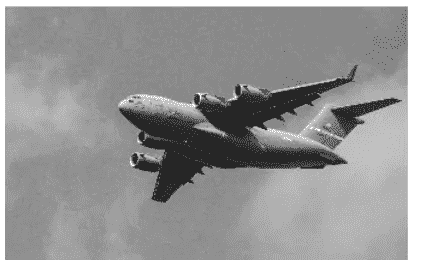
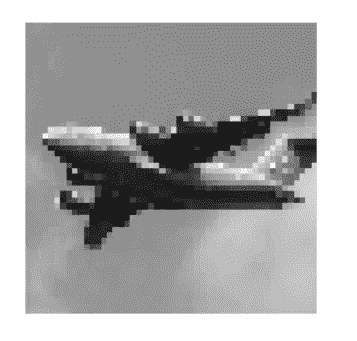
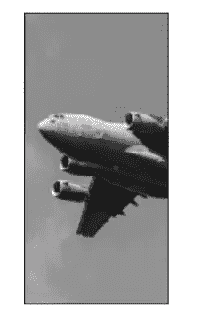
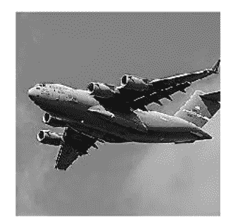

# Python 图像处理中的预处理技术

> 原文：<https://pub.towardsai.net/pre-processing-techniques-in-image-processing-with-python-81e5c8babf09?source=collection_archive---------1----------------------->

## [计算机视觉](https://towardsai.net/p/category/computer-vision)

## OpenCV 下的图像处理技术


由[安妮·斯普拉特](https://unsplash.com/@anniespratt?utm_source=medium&utm_medium=referral)在 [Unsplash](https://unsplash.com?utm_source=medium&utm_medium=referral) 上拍摄

在本文中，我们将使用 OpenCV 工具进行图像处理。

## 涵盖的主题:

*   **加载图像**
*   **保存图像**
*   **调整图像大小**
*   **裁剪图像**
*   **锐化图像**

图像分类是机器学习中最令人着迷和兴奋的话题。这是一个强大的工具包，计算机可以识别图像中的模式和对象。在将机器学习应用于图像之前，我们必须转换原始图像并提取对学习算法有用的特征。

有各种各样的库可以用来处理图像，但是开源计算机视觉(OpenCV)库对处理图像及其文档非常有帮助。

[](/become-a-data-scientist-in-2021-with-these-following-steps-5bf70a0fe0a1) [## 按照以下步骤，在 2021 年成为一名数据科学家

### 走上数据科学家之路需要具备的基本点

pub.towardsai.net](/become-a-data-scientist-in-2021-with-these-following-steps-5bf70a0fe0a1) [](/z-statistics-t-statistics-p-statistics-are-still-confusing-you-87557047e20a) [## Z-统计量，T-统计量，P-统计量还在迷惑你？

### 机器学习统计学中的定义和概念

pub.towardsai.net](/z-statistics-t-statistics-p-statistics-are-still-confusing-you-87557047e20a) 

## 加载图像

对于图像的预处理，我们必须借助 OpenCV 的“imread”来加载图像

```
# Load library
import cv2
import numpy as np
from matplotlib import pyplot as plt# Load image as grayscale
image = cv2.imread(“images/plane.jpg”, cv2.IMREAD_GRAYSCALE)we can view the image using the “matplotlib” library# Show image
plt.imshow(image, cmap=”gray”), plt.axis(“off”)
plt.show()
```



作者的照片

当我们使用“imread”时，我们将图像数据转换为“Numpy”数组的数据类型。

```
# Show data type
type(image)#output:
numpy.ndarray
```

现在，图像已经将图像转换成矩阵，元素对应于单个像素。矩阵值看起来像

```
# Show dimensions
image#output:array([[140, 136, 146, …, 132, 139, 134], [144, 136, 149, …, 142, 124, 126], [152, 139, 144, …, 121, 127, 134], …, [156, 146, 144, …, 157, 154, 151], [146, 150, 147, …, 156, 158, 157], [143, 138, 147, …, 156, 157, 157]], dtype=uint8)
```

现在，在浏览了结果之后，我们得到了一个基本的问题，比如这些矩阵值对我们意味着什么？

在灰度图像中，单个元素的值是图像中的像素亮度。灰色图像的像素强度值范围从 0 到 255，即分别从黑到白。

例如，在下面代码的帮助下，我们可以看到图像右上角像素的亮度

```
# Show first pixel
image[0,0]#output: 
140
```

当我们使用非灰度图像时，在矩阵中，每个元素代表三个值，分别是蓝、绿、红值(BGR)。

```
# Load image in color
image_bgr = cv2.imread(“images/plane.jpg”, cv2.IMREAD_COLOR)# Show pixel
image_bgr[0,0]#output: 
array([195, 144, 111], dtype=uint8)
```

重要提示:默认 OpenCV 使用 BGR 模式，但许多图像应用程序，如 Matplotlib 库，使用红绿蓝(RGB)模式。换句话说，这里红、蓝值被交换。

当我们想在 Matplotlib 库(使用 RGB)中显示 OpenCV 处理过的图像(BGR 彩色图像)时，首先将 BGR 转换为 RGB

这可以通过以下方式完成:

```
# Convert to RGB
image_rgb = cv2.cvtColor(image_bgr, cv2.COLOR_BGR2RGB)# Show image
plt.imshow(image_rgb), plt.axis(“off”)
plt.show()
```


作者的照片

图像的分辨率是 3600 x 2270，为了得到矩阵的维数，我们可以使用下面的代码

```
# Show dimensions
image.shape#output: 
(2270, 3600)
```

[](/step-by-step-basic-understanding-of-neural-networks-with-keras-in-python-94f4afd026e5) [## 使用 Python 中的 Keras 逐步基本了解神经网络

### 具有定义的神经网络的学习

pub.towardsai.net](/step-by-step-basic-understanding-of-neural-networks-with-keras-in-python-94f4afd026e5) 

## 保存图像

我们可以使用“imwrite”方法保存图像进行预处理。这需要两个参数

第一个代表指定用来保存图像的文件路径，第二个是图像本身。在这里，图像的格式可以由(定义。jpg，。png 等)。

需要注意的重要一点是,“imwrite”将会覆盖现有文件，而不会出现任何错误或要求确认

```
# Load libraries
import cv2
import numpy as np
from matplotlib import pyplot as plt# Load image as grayscale
image = cv2.imread(“images/plane.jpg”, cv2.IMREAD_GRAYSCALE)# Save image
cv2.imwrite(“images/plane_new.jpg”, image)#output: 
True
```

## 调整图像大小

我们可以在预处理阶段使用“调整大小”来改变图像的大小，原因有二。第一个，把所有形状和大小的图像保持在相同的尺寸，这样它们就可以用来提取特征。这被称为图像大小的标准化，我们正在减少矩阵的大小和图像的信息。

第二种，在机器学习训练过程中，需要数百或数千张图像，消耗大量内存。为了减轻这种情况，我们可以调整它们的大小，从而减少内存使用。

用于机器学习算法的常见图像大小为 32*32、64*64、96*96 和 256*256。

```
# Load image
import cv2
import NumPy as np
from matplotlib import pyplot as plt# Load image as grayscale
image = cv2.imread(“images/plane_256x256.jpg”, cv2.IMREAD_GRAYSCALE)# Resizing the image to 50x50 pixels
image_50x50 = cv2.resize(image, (50, 50))# View image
plt.imshow(image_50x50, cmap=”gray”), plt.axis(“off”)
plt.show()
```



作者的照片

## 裁剪图像

我们可以通过对数组进行切片来方便地裁剪图像，然后将图像编码为二维 numpy 数组，以去除图像的外部部分并改变它们的尺寸。

我们知道 OpenCV 在元素矩阵中表示图像，我们可以选择行和列，并根据矩阵的元素进行裁剪。

```
# Load image
import cv2
import numpy as np
from matplotlib import pyplot as plt# Load image in grayscale
image = cv2.imread(“images/plane_256x256.jpg”, cv2.IMREAD_GRAYSCALE)# Select first 128 pixels of the image
image_cropped = image[:,:128]# Show image
plt.imshow(image_cropped, cmap=”gray”), plt.axis(“off”)
plt.show()
```



作者的照片

## 锐化图像

首先让我们了解一下图像的锐化是什么意思？

这是一种增加**图像的表观**锐度**的技术。**当我们从原始图像中减去模糊图像时，它用于检测图像中的边缘。

当我们想要锐化图像时，首先创建一个突出目标像素的内核，然后使用“filter2D”将其应用于图像

```
# Load libraries
import cv2
import numpy as np
from matplotlib import pyplot as plt# Load image as grayscale
image = cv2.imread(“images/plane_256x256.jpg”, cv2.IMREAD_GRAYSCALE)# Create kernel
kernel = np.array([[0, -1, 0],
 [-1, 5,-1],
 [0, -1, 0]])# Sharpen image
image_sharp = cv2.filter2D(image, -1, kernel)# Show image
plt.imshow(image_sharp, cmap=”gray”), plt.axis(“off”)
plt.show()
```



作者的照片

## 结论:

图像处理在视觉问题中非常有用。大算法中总是需要基础预处理技术的知识。

[](/custom-statistical-details-of-data-frame-with-python-745d652b363f) [## 用 Python 定制数据框的统计细节

### 数据集中特征的统计分析

pub.towardsai.net](/custom-statistical-details-of-data-frame-with-python-745d652b363f) 

我希望你喜欢这篇文章。通过我的 [LinkedIn](https://www.linkedin.com/in/data-scientist-95040a1ab/) 和 [twitter](https://twitter.com/amitprius) 联系我。

# 推荐文章

[1。NLP —零到英雄与 Python](https://medium.com/towards-artificial-intelligence/nlp-zero-to-hero-with-python-2df6fcebff6e?sk=2231d868766e96b13d1e9d7db6064df1)
2。 [Python 数据结构数据类型和对象](https://medium.com/towards-artificial-intelligence/python-data-structures-data-types-and-objects-244d0a86c3cf?sk=42f4b462499f3fc3a160b21e2c94dba6)3 .[数据预处理概念同 Python](/data-preprocessing-concepts-with-python-b93c63f14bb6?source=friends_link&sk=5cc4ac66c6c02a6f02077fd43df9681a)
4。[用 Python 进行主成分分析降维](/principal-component-analysis-in-dimensionality-reduction-with-python-1a613006d531?source=friends_link&sk=3ed0671fdc04ba395dd36478bcea8a55)
5。[用 Python 全面讲解 K-means 聚类](https://medium.com/towards-artificial-intelligence/fully-explained-k-means-clustering-with-python-e7caa573176a?source=friends_link&sk=9c5c613ceb10f2d203712634f3b6fb28)
6。[用 Python](https://medium.com/towards-artificial-intelligence/fully-explained-linear-regression-with-python-fe2b313f32f3?source=friends_link&sk=53c91a2a51347ec2d93f8222c0e06402)
7 全面讲解了线性回归。[用 Python](https://medium.com/towards-artificial-intelligence/fully-explained-logistic-regression-with-python-f4a16413ddcd?source=friends_link&sk=528181f15a44e48ea38fdd9579241a78)
充分解释了 Logistic 回归 8。[用 Python 实现时间序列的基础知识](https://medium.com/towards-artificial-intelligence/basic-of-time-series-with-python-a2f7cb451a76?source=friends_link&sk=09d77be2d6b8779973e41ab54ebcf6c5)
9。[与 Python 的数据角力—第一部分](/data-wrangling-with-python-part-1-969e3cc81d69?source=friends_link&sk=9c3649cf20f31a5c9ead51c50c89ba0b)
10。[机器学习中的混淆矩阵](https://medium.com/analytics-vidhya/confusion-matrix-in-machine-learning-91b6e2b3f9af?source=friends_link&sk=11c6531da0bab7b504d518d02746d4cc)