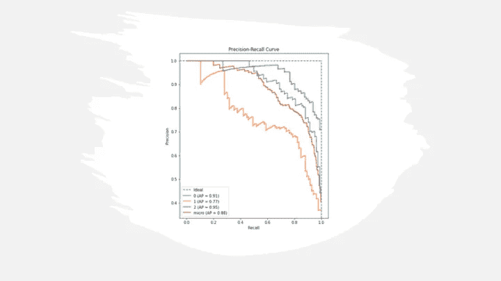
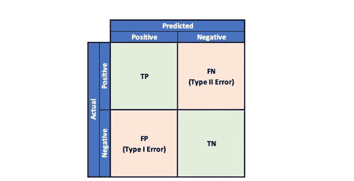
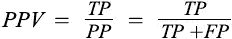
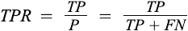
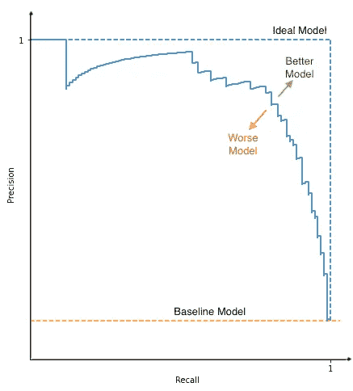
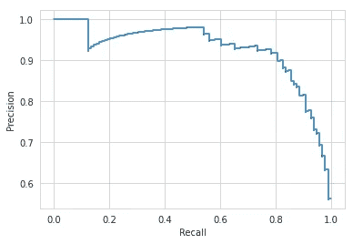
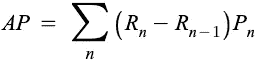
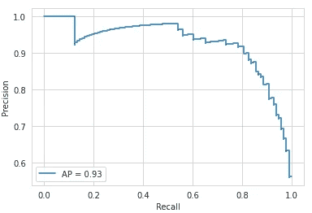
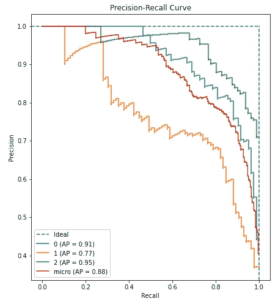

# 精确回忆曲线

> 原文：<https://pub.towardsai.net/precision-recall-curve-26f9e7984add?source=collection_archive---------0----------------------->

## 模型评估

## PR 曲线、AUC-PR 和 AP



作者图片

对任何模型的评估都是至关重要的。说到分类模型，无论是二进制还是多类，我们都有大量的指标可供使用。如果我们有一个平衡的数据集，你可能会选择准确性。如果真预测更重要，那么精度、召回率、特异性或 F1 将是选择。这里提到的所有指标都使用预测类进行评估，而不是预测分数。然而，一些指标使用预测分数，如精确召回曲线和 ROC。

## 精确度-召回曲线:

精度-召回曲线显示了不同阈值的精度和召回之间的权衡。它常用于班级严重失衡的情况。例如，如果预测某个观测值属于阳性类的概率大于 0.5，则该观测值被标记为阳性。然而，我们可以选择 0 到 1 之间的任何概率阈值。精度-召回曲线有助于可视化阈值如何影响分类器性能。

为了理解精确度和召回率，让我们通过参考混淆矩阵来快速刷新我们对二元分类问题中的可能结果的记忆。



困惑矩阵|作者图片

**精度**是指某一特定类别的所有预测中正确预测的比例。



**召回**指的是已经被模型预测为属于特定类别的实例的比例。



一个精度和召回率都很高的模型会返回很少的结果，但是大部分预测都是正确的。



PR 曲线|作者图片

然而，低精度和高召回率的模型返回许多结果，但是大多数预测将是不正确的。理想的模型将具有高精度和高召回率，并且将返回许多正确预测的结果，而基线模型将具有非常低的精度。

```
from sklearn.datasets import make_classification
from sklearn.model_selection import train_test_split
from sklearn.linear_model import LogisticRegression
from sklearn.metrics import precision_recall_curve
from sklearn.metrics import PrecisionRecallDisplayX, y = make_classification(n_samples=1000, n_classes=2,
                           random_state=1)
X_train, X_test, y_train, y_test = train_test_split(X, y,
                                                    test_size=.2,
                                                    random_state=2)
lr = LogisticRegression()
lr.fit(X_train, y_train)
y_pred = lr.predict(X_test)
y_pred_prob = lr.predict_proba(X_test)
y_pred_prob = y_pred_prob[:,1]precision, recall, threshold = precision_recall_curve(y_test, 
                                                      y_pred_prob)
prd = PrecisionRecallDisplay(precision, recall)
prd.plot()
```



PR 曲线|作者图片

**AP 和 AUC-PR**

平均精度将 PR 曲线总结为一个指标，即每个阈值达到的精度的加权平均值。



其中 Pn 和 Rn 是 n^th 阈值下的精度和召回率。

AUC-PR 代表曲线下面积-精确召回，它是图下的梯形面积。AP 和 AUC-PR 是将 PR 曲线总结为单一指标的类似方法。

高 AP 或 AUC 代表不同阈值的高精度和高召回率。AP/AUC 值在 1(理想模型)和 0(最差模型)之间波动。

```
from sklearn.metrics import average_precision_score
average_precision_score(y_test, y_pred_prob)**Output:** 0.927247516623891
```

我们可以把 PR 评分和图表结合起来。

```
ap = average_precision_score(y_test, y_pred_prob)
prd = PrecisionRecallDisplay(precision, recall, average_precision=ap)
prd.plot()
```



PR 曲线与 AP |作者图片

精确召回曲线通常使用两个类别进行评估，对于多类别或多标签分类，将为每个类别绘制直线曲线，每个类别的 AP 或 AUC 将有助于类别之间的排序。然而，要在一个指标中总结多个类别，可以计算微观、宏观和加权精度曲线和 AP/AUC。请参考 [**带混淆矩阵的多类模型评估和分类报告**](/multi-class-model-evaluation-with-confusion-matrix-and-classification-report-c92a74d5e908) 了解微观、宏观和加权指标。

*下面是为多类分类创建和绘制 PR 的 python 代码。*

```
from sklearn.datasets import make_classification
from sklearn.preprocessing import label_binarize
from sklearn.model_selection import train_test_split
from sklearn.linear_model import LogisticRegression
from sklearn.multiclass import OneVsRestClassifier# Load Dataset
X, y = make_classification(n_samples=1000, n_classes=2,
                           random_state=1)
y = label_binarize(y, classes=[0,1,2])
X_train, X_test, y_train, y_test = train_test_split(X, y,
                                                    test_size=.2,
                                                    random_state=2)
lr = LogisticRegression()
ovr = OneVsRestClassifier(lr)
ovr.fit(X_train, y_train)
y_pred = ovr.predict(X_test)
y_pred_prob = ovr.predict_proba(X_test)precision, recall, threshold, ap, labels = pr_curve(y_test,
                                                    y_pred_prob, 
                                                    labels=[0,1,2])
pr_curve_plot(precision, recall, threshold, ap, labels)
```



多级 PR 曲线|作者图片

**参考文献:**

[1]精确度-召回曲线。[https://sci kit-learn . org/stable/modules/generated/sk learn . metrics . precision _ recall _ curve . html # sk learn . metrics . precision _ recall _ curve](https://scikit-learn.org/stable/modules/generated/sklearn.metrics.precision_recall_curve.html#sklearn.metrics.precision_recall_curve)

[2]平均精度得分。[https://sci kit-learn . org/stable/modules/generated/sk learn . metrics . average _ precision _ score . html # sk learn . metrics . average _ precision _ score](https://scikit-learn.org/stable/modules/generated/sklearn.metrics.average_precision_score.html#sklearn.metrics.average_precision_score)

[3] AUC 评分。[https://sci kit-learn . org/stable/modules/generated/sk learn . metrics . AUC . html # sk learn . metrics . AUC](https://scikit-learn.org/stable/modules/generated/sklearn.metrics.auc.html#sklearn.metrics.auc)

[4]精确回忆显示。[https://sci kit-learn . org/stable/modules/generated/sk learn . metrics . precisionrecalldisplay . html？highlight = precisionrecalldisplay # sk learn . metrics . precisionrecalldisplay](https://scikit-learn.org/stable/modules/generated/sklearn.metrics.PrecisionRecallDisplay.html?highlight=precisionrecalldisplay#sklearn.metrics.PrecisionRecallDisplay)