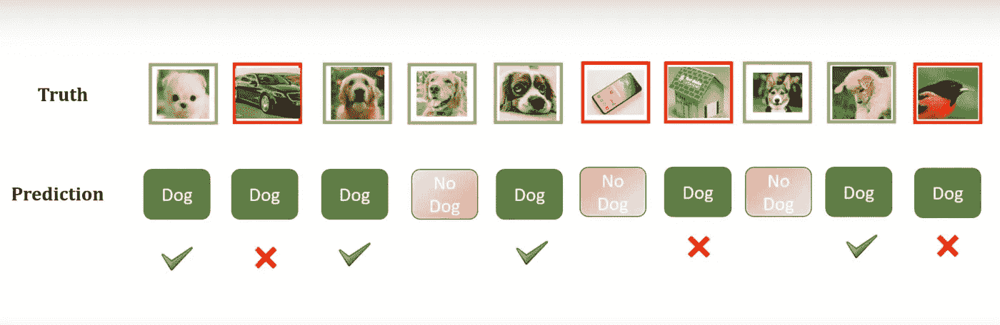
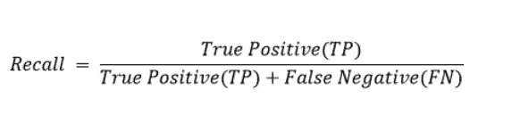

# 精准 vs 召回。他们到底告诉了你什么？

> 原文：<https://pub.towardsai.net/precision-vs-recall-what-do-they-actually-tell-you-8b07be389a39?source=collection_archive---------2----------------------->

## 理解精确和回忆背后的思想

米歇尔在**佩克斯**拍摄的照片

如果你问任何一位数据科学家或机器学习工程师他们学到的最容易和最困惑的话题，他们脑海中首先想到的事情之一将是**精确与回忆。**

**一方面**，这个话题确实令人困惑，我自己也花了一吨时间试图理解其中的区别，最重要的是，这两个术语告诉你什么。

**另一方面，**这个题目非常简单，不需要理解数学、编程或任何其他复杂的东西。在这篇文章中，我将结合我遇到的所有资源，尽我所能向你解释这个话题，这样你就再也不用担心这个问题了。

首先我们要明白**精度**和**召回**是评价你的模型的其他方式。通常，简单的精度测量是不够的。

## **为什么我不能只用精度？**

假设您有一个包含 1000 个水果图像、990 个苹果和 10 个橙子的数据集。您训练了一个模型来对该数据集上的苹果和橙子进行分类，并且您的模型决定说所有图像都是苹果。如果你计算准确度(正确预测/所有预测):990/1000，那么你将得到 99%的准确度！！即使你的模型有惊人的准确性，但它完全错误地分类了所有的橙子。

但是，如果我们也使用 **Precision** 和 **Recall，**来评估这个模型，我们会立刻感到谦卑。

在解释这两个术语之前，我们必须知道**真阳性、真阴性、假阳性、**和**假阴性**的含义。

> **注:**如果你已经非常清楚两者的区别，可以跳过这一部分

## 我们先来看看 ***真*** “类”。

这里的 True 表示模型正确预测了**。**

1.  因此，如果我们创建一个模型来对狗和非狗的图像进行分类——当模型将一幅图像分类为*狗，并且它确实是 ***狗*** 时，一个**真正肯定的**预测将是。*
2.  *如果模型将图像分类为 ***而不是狗*** ，并且它实际上是 ***而不是狗*** *，那么**真否定**预测将是。**

## *假班怎么办？*

*正如你可能已经猜到的， **False** 意味着模型错误地预测了**。***

1.  *****假阳性—** 模型将一幅图像归类为 ***狗*** ，但实际上是 ***而不是狗*。*****
2.  *****假阴性—** 模型将一张图像归类为 ***不是狗*** ，但实际上是一只 ***狗*。*****

***如你所见，**真**和**假**告诉你模型是对还是错。而**正**和**负**告诉你模型预测的是什么等级。(在我们的示例中，**正**类是狗图像，而**负**类是非狗图像)***

## ***注意***

***正面类不一定是*狗*的图像，你也可以说正面类是*的图像而不是*的图像。但大多数情况下，数据科学家将积极视为他们的目标/关注点。***

***希望现在你已经很好地理解了前面的部分，因为我们将需要它来理解**Precision**vs**Recall。*****

## ***精确***

***假设我们已经创建了一个模型来对狗和非狗的图像进行分类，并且我们在 10 个图像上测试了我们的模型，让我们专注于狗类:***

******

***视频由 [codebasics](https://youtu.be/2osIZ-dSPGE)***

***让我看看…有 6 张狗的图片，和 4 张非狗的图片。我们的模型将 7 幅图像分类为一只狗，然而，其中只有 4 幅是正确的。***

*****精度的公式:*****

******

***让我们一起计算狗类的**精度**:有 4 个真阳性图像(4 个*狗*图像被归类为*狗*)。现在我们把它除以 4 个真阳性+ 3 个假阳性(3 张*不是狗*的图像被归类为*狗*)。***

***4/7= 0.57.***

## ***它告诉我们什么？***

***嗯，基本上，它告诉我们在所有被分类为狗的图像**中，被正确分类为**的狗图像**的百分比。*****

***当我们计算精度时，我们关注的是预测。***

***如果我们有 100%的精度，我们可以 100%确定，如果我们的模型将图像分类为狗，它肯定是正确的。即使它没有将大多数狗图像分类为狗，那些被**分类为狗的图像也是 100%正确的。在**精度**中，我们只关心**预测的目标类**是否被正确分类。*****

## ***回忆***

***我们保留同样的例子，我会附上同样的照片，这样你就不用再向上滚动了:***

******

***视频由 [codebasics](https://youtu.be/2osIZ-dSPGE)***

*****召回的公式:*****

******

***我们一起算一下:4 个真阳性除以 4 个真阳性+ 2 个假阴性(2 张*狗*的图像被归类为*不是狗*)。***

***4/6 = 0.67***

## ***它告诉我们什么？***

***因此，如果 **Precision** 向我们显示在预测的狗图像中**被正确分类的狗图像的百分比，那么 **Recall** 向我们显示在实际的**狗图像中**被正确分类的狗图像的百分比。*****

***当我们计算**召回**时，我们关注的是实际数据。***

***如果我们有一个 100%的**回忆**，我们可以 100%确定，如果给定一组，比方说，20 个图像，其中 8 个是狗图像，我们的模型将把所有 8 个狗图像分类为狗。然而，它也可能说其他 12 幅图像也是狗，但是在**回忆**中，我们只关心**实际目标**图像被正确分类。***

## ***精确度与召回率的权衡***

***我不会太关注这个话题，如果你想让我写一篇关于它的文章，请在评论中告诉我。但基本上，通常情况下，当**精度**上升时，**召回**下降，反之亦然。***

## ***我如何知道我更需要关注什么？(真实世界的例子)***

***你可能会问这样一个问题:“好吧，我理解其中的区别，这是一个权衡，但是什么时候我需要更高的精度，什么时候我需要更高的召回率？”***

## ***什么时候我们更在乎精度？***

***让我们想象一下，我们正在为谷歌工作，具体来说，我们正在开发一个将电子邮件检测为垃圾邮件而不是垃圾邮件的模型，所有垃圾邮件都将被隐藏。在这种情况下，我们不想意外地将一封重要的电子邮件归类为垃圾邮件，因为它将被隐藏。因此，我们希望确保如果模型将电子邮件分类为垃圾邮件，它是正确的。我们真的不在乎一些垃圾邮件会不会对用户隐藏，他们可以自己隐藏。花点时间来处理它，并尝试理解 Precision 如何适合这个例子。***

## ***召回呢？我们什么时候更关注它？***

***假设我们在一个机场工作，我们建立了一个模型来对危险人物进行分类。如果我们的模型没有将危险人物归类为危险人物，他们也可能会被安全部门检测不到，然后造成很大的损失。这就是为什么我们需要把**每一个**危险的人归类为危险人物。***

***另一方面，如果模型将一个**普通**平民归类为危险，我们真的不在乎，他们会得到检查，然后继续前进。***

# ***练习***

1.  ***以狗 vs 非狗的数据为例，尝试计算**非狗**类的精度和召回率。(把**不是狗**类当成你的**正**类)。***
2.  ***试着想出你自己对精确和回忆的定义。***
3.  ***想想一个项目，甚至是一个真实世界的问题，其中精度更重要，反之亦然。***
4.  ***请在评论里告诉我你的答案，我会告诉你你是对还是错。***

***我真的希望这篇文章对你有所帮助，我试图让一切尽可能的清晰。但是如果你还有一些问题，请在评论中提问，我会尽力帮助你。***