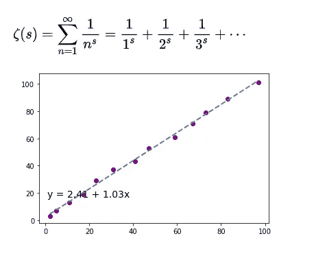
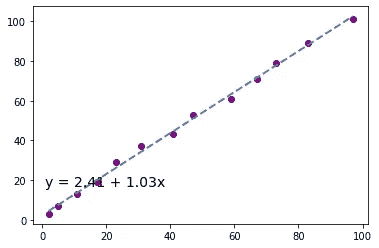
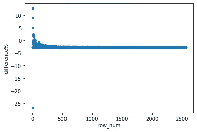
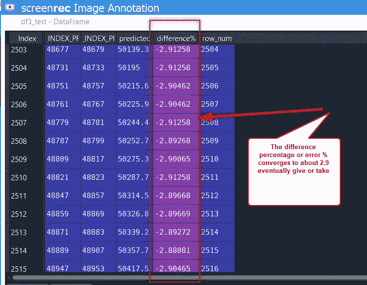
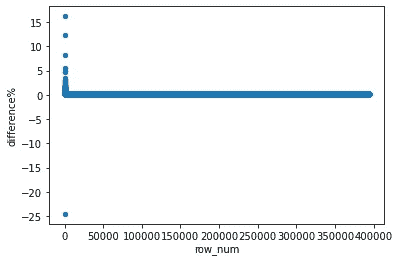
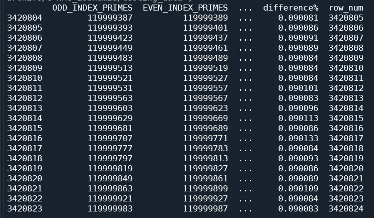

# 预测素数的原始研究——使用数据科学的误差收敛

> 原文：<https://pub.towardsai.net/predict-prime-numbers-error-convergence-using-data-science-da9360d2d4eb?source=collection_archive---------2----------------------->

## 使用 Python 解锁素数模式



## 目录

I 到 103 之间的素数样本(不包括)

二。模块化索引赔率和事件，以创建一个等式

三。逐步增加到 0 到 50023 之间的素数(不包括)

四。0 到 12000000 之间素数的误差消失法

不及物动词使用 n 素数的 Python 测试

## 一.样本

打开 Python 并输入以下代码。这个代码会给你从 0 到 103 的素数，不包括在内。

```
import sympy
c=list(sympy.sieve.primerange(0, 103))
```

这是质数。这些将在变量 c 下保存的列表中。

2 3 5 7 11 13 17 19 23 29 31 37 41 43 47 53 59 61 67 71 73 79 83 89 97 101

## 二。索引赔率和事件以创建一个等式

为了索引素数，让我们首先创建一个数据帧并存储素数。

```
import pandas as pddf = pd.DataFrame(c)
```

现在我们必须创建一个索引:

```
import numpy as np
df['row_num'] = np.arange(len(df))+1
```

现在让我们使用 mod 创建一个列来检测索引是奇数还是偶数。这种情况下的索引列称为 **row_num** 。 ***如果我们将这一列除以 2，余数为 0，则表示该指数为偶数，否则为奇数。***

> 如果我们将这一列除以 2，余数为 0，这意味着索引为偶数，否则为奇数。

```
df = df.assign(ODDEVEN = lambda x: (x['row_num']%2!=0))
```

接下来，我想把这个数据框分成两部分。我将把我的第一列重命名为 ODD_Index_Primes，然后分割数据帧，因为我将首先分离出奇数索引素数:

```
df=df.rename(columns={df.columns[0]: 'ODD_INDEX_PRIMES'})
```

现在，我将创建一个新的数据帧，第一列将是奇数索引的素数:

```
#ODD Index Primes
df1 = df.query('ODDEVEN==True')df1=df1['ODD_INDEX_PRIMES']df1=pd.DataFrame(df1)
df1=df1.reset_index(drop=True)
```

现在，我将创建另一个新的数据帧，第一列将是具有偶数索引的素数:

```
df2 = df.query('ODDEVEN==False')
df2=df2.rename(columns={df.columns[0]: 'EVEN_INDEX_PRIMES'})
df2=df2['EVEN_INDEX_PRIMES']
df2=pd.DataFrame(df2)
df2=df2.reset_index(drop=True)
```

现在，我将把数据框放在一起:

```
df3=pd.concat([df1, df2], axis=1)
df3=df3.apply(pd.to_numeric, errors='coerce')
```

现在，我想将第一列视为 x，将第二列视为 y，并创建一条最佳拟合线。请从这里了解更多关于最佳拟合线的代码:

[如何用 Python 绘制最佳拟合线(附实例)—统计学](https://www.statology.org/line-of-best-fit-python/#:~:text=You%20can%20use%20the%20following%20basic%20syntax%20to,Plot%20Basic%20Line%20of%20Best%20Fit%20in%20Python)

```
import numpy as np
import matplotlib.pyplot as plt#define data
x = np.array(df3['ODD_INDEX_PRIMES'])
y = np.array(df3['EVEN_INDEX_PRIMES'])#find line of best fit
a, b = np.polyfit(x, y, 1)#add points to plot
plt.scatter(x, y, color='purple')#add line of best fit to plot
plt.plot(x, a*x+b, color='steelblue', linestyle='--', linewidth=2)#add fitted regression equation to plot
plt.text(1, 17, 'y = ' + '{:.2f}'.format(b) + ' + {:.2f}'.format(a) + 'x', size=14)
```

运行代码后，您将得到一条最佳拟合线。你可以检查你的图，你会发现这个图像:



如你所见，最适合 0 到 100 之间的质数的等式是

y = 2.41 + 1.03x，**其中 x 是奇数索引的素数，y 是偶数索引的素数。**

> 如你所见，最适合 0 到 100 之间的质数的等式是
> 
> y = 2.41 + 1.03x，**其中 x 是奇数索引的素数，y 是偶数索引的素数。**

## 三。逐步增加到 0 到 50k 之间的质数

是时候对 0 到 50，000 之间的质数使用这个等式了。

首先，让我们得到素数，并使用模索引得到奇数和偶数索引:

```
#Test
d=list(sympy.sieve.primerange(0, 50023)) 
df_test = pd.DataFrame(d)
df_test['row_num'] = np.arange(len(df_test))+1df_test = df_test.assign(ODDEVEN = lambda x: (x['row_num']%2!=0))
```

让我们将该列重命名为 ODD_INDEX_PRIMES，因为我们将首先分离出这些素数:

```
df_test=df_test.rename(columns={df_test.columns[0]: 'ODD_INDEX_PRIMES'})
```

制作一个新的数据帧并存储奇数索引素数:

```
#ODD Index Primes
df_test_1 = df_test.query('ODDEVEN==True')df_test_1=df_test_1['ODD_INDEX_PRIMES']df_test_1=pd.DataFrame(df_test_1)
df_test_1=df_test_1.reset_index(drop=True)
```

现在制作另一个新的数据帧并存储偶数索引素数:

```
df2_test = df_test.query('ODDEVEN==False')
df2_test=df2_test.rename(columns={df2_test.columns[0]: 'EVEN_INDEX_PRIMES'})
df2_test=df2_test['EVEN_INDEX_PRIMES']
df2_test=pd.DataFrame(df2_test)
df2_test=df2_test.reset_index(drop=True)
```

将数据帧放在一起，这样我们就有两列，第一列是奇数索引素数，第二列是偶数索引素数:

```
df3_test=pd.concat([df_test_1, df2_test], axis=1)
df3_test=df3_test.apply(pd.to_numeric, errors='coerce')
```

现在让我们创建一个预测列，看看我们是否能接近:

```
df3_test['predicted']=df3_test['ODD_INDEX_PRIMES'].apply(lambda x: 2.41+(x*1.03))
```

现在，让我们创建一个差异%列来检测错误百分比:

```
df3_test['difference%']=(df3_test.EVEN_INDEX_PRIMES - df3_test.predicted) / df3_test.predicted * 100
```

请记住，误差百分比需要是预测的百分比，而不是实际的百分比。我们将使用误差百分比来改变我们的预测。

现在，让我们看看错误。为此，我们可以通过对数据帧进行行索引来创建快速错误图，并查看错误率是否收敛:

```
#plot of error
df3_test['row_num'] = np.arange(len(df3_test))+1
df3_test.plot.scatter(x='row_num',y='difference%')
```



如你所见，错误率确实收敛到 0%到-5%之间。

如果我们看看变量 explorer，我们可以看到它收敛到 2.9 左右。



## 四。0 到 12000000 之间素数的误差消失法

让我们首先以同样的方式进行预处理:

```
e=list(sympy.sieve.primerange(0, 12000000)) 
df_final = pd.DataFrame(e)
df_final['row_num'] = np.arange(len(df_final))+1df_final = df_final.assign(ODDEVEN = lambda x: (x['row_num']%2!=0))
df_final=df_final.rename(columns={df_final.columns[0]: 'ODD_INDEX_PRIMES'})#ODD Index Primes
df_final_1 = df_final.query('ODDEVEN==True')df_final_1=df_final_1['ODD_INDEX_PRIMES']df_final_1=pd.DataFrame(df_final_1)
df_final_1=df_final_1.reset_index(drop=True)df2_final = df_final.query('ODDEVEN==False')
df2_final=df2_final.rename(columns={df2_final.columns[0]: 'EVEN_INDEX_PRIMES'})
df2_final=df2_final['EVEN_INDEX_PRIMES']
df2_final=pd.DataFrame(df2_final)
df2_final=df2_final.reset_index(drop=True)df3_final=pd.concat([df_final_1, df2_final], axis=1)
df3_final=df3_final.apply(pd.to_numeric, errors='coerce')
df3_final.dtypes
```

现在，我们可以将原始方程乘以 0.97，因为上次的误差率约为 2.9%或 3%。

```
(2.41+(x*1.03))*.97)
```

让我们这样做:

```
df3_final['predicted']=df3_final['ODD_INDEX_PRIMES'].apply(lambda x: (2.41+(x*1.03))*.97)
```

现在，让我们计算误差:

```
df3_final['difference%']=(df3_final.EVEN_INDEX_PRIMES - df3_final.predicted) / df3_final.predicted * 100
```

让我们画出误差:

```
#plot of error
df3_final['row_num'] = np.arange(len(df3_final))+1
df3_final.plot.scatter(x='row_num',y='difference%')
```



这一次错误率收敛到非常接近 0。让我们看看变量资源管理器来检查一下:

```
#print tail
print(df3_final.tail(n=20))
```


正如您在打印尾部时看到的，差异%收敛到大约 0.09%。

这意味着，只要你有一个奇数索引的素数，你就可以通过使用下面的等式在大约 0.09%的误差范围内预测它之后的下一个素数

```
**(2.41+(x*1.03))*.97)**
```

其中 x 是奇数索引的素数。

如果我们再次运行代码，并上升到 6841648 个素数，错误率仍然在该值附近徘徊…



感谢阅读，

灰

以下是我另一篇文章的链接:

[](/heart-disease-prediction-with-machine-learning-52eaf239cf05) [## 基于机器学习的心脏病预测

### I .下载数据集

pub.towardsai.net](/heart-disease-prediction-with-machine-learning-52eaf239cf05)