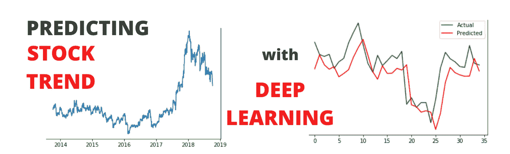
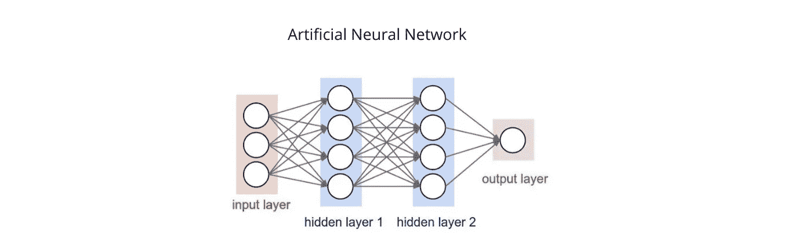
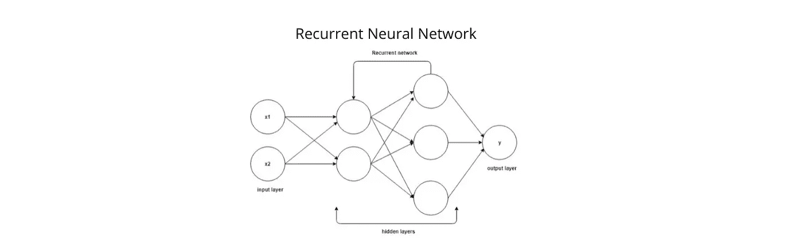
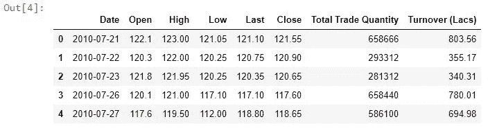
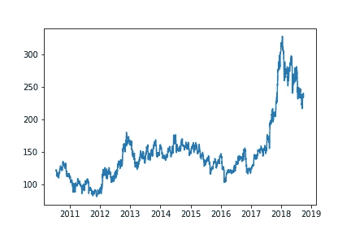
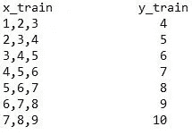
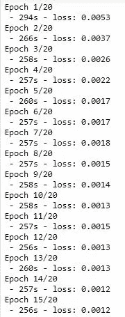
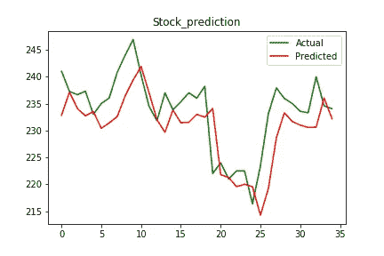

# 使用深度学习预测股票趋势

> 原文：<https://pub.towardsai.net/predict-the-stock-trend-using-deep-learning-5a4b7df1d152?source=collection_archive---------0----------------------->

## [深度学习](https://towardsai.net/p/category/machine-learning/deep-learning)

## 使用深度学习模型(递归神经网络)预测股票的未来趋势



使用深度学习预测股票趋势

> 在这篇文章中，我们将建立一个深度学习模型(具体来说是 **RNN** 模型)，它将帮助我们**预测给定的股票在未来**是上涨还是下跌。请记住，我们对预测实际值不感兴趣，因为与趋势预测相比，预测实际值要复杂得多。

如果你是第一次接触**深度学习**，不要担心，我会尽力给你一个**简单**和**容易**的完整教程讲解。此外，我认为这个特定的项目是一个入门级的项目，或者是一个人必须用递归神经网络做的最简单的项目。

所以，首先想到的问题是**什么是递归神经网络？**

要了解这一点，我们得先了解一下**神经网络**。在这里，我假设你已经熟悉了**机器学习**。神经网络又称**人工神经网络(ANN)**由三个阶段组成，即**输入层**、若干**隐含层**和**输出层**。顾名思义，输入层用于获取输入并将其输入到模型中，输出层用于给出预测的结果，而隐藏层负责所有的数学计算(每个单元或细胞负责进行小的运算)。 [*了解更多安在这里*](https://www.tutorialspoint.com/artificial_intelligence/artificial_intelligence_neural_networks.htm) 。



人工神经网络

**递归神经网络(RNN)** 是一种神经网络，其中一个时间步骤的输出充当下一个时间步骤的输入。比如**“我饿了，我需要食物”**这句话中，记住**饿了**这个词来预测**食物**是非常重要的。因此，为了预测即将到来的单词，记住前面的单词是很重要的。为了解决这种问题，RNN 来了。RNN 的主要特征是一个**隐藏状态**，它能记住序列信息。在天气、股市、文本等序列数据方面，RNN 表现得非常好。关于 RNN 的[**工作方式我就不赘述了，考虑到这篇文章对初学者比较友好，不过你可以随时谷歌一下😄**](https://www.geeksforgeeks.org/introduction-to-recurrent-neural-network/)



递归神经网络

# 先决条件:-

我假设你熟悉 ***python*** 并且已经在你的系统中安装了 ***python 3*** 。这个教程我用了一个 ***jupyter 笔记本*** 。你可以使用你喜欢的 **IDE** 。

# 使用的数据集:-

我们在本教程中使用的数据集来自 NSE Tata Global stock，可在 [**GitHub**](https://github.com/mwitiderrick/stockprice/blob/master/NSE-TATAGLOBAL.csv) 上获得。

# 安装所需的库

对于这个项目，您需要在 python 中安装以下包。如果没有安装，可以直接使用`pip install PackageName`。

*   **NumPy** —这个库提供快速计算 n 维数组对象。
*   **pandas** —它提供了一个数据框架和系列来对数据进行操作和分析。
*   **matplotlib** —这个库使用各种绘图来帮助可视化数据。
*   **scikit-learn** —它是一个机器学习库，提供各种工具和算法用于预测分析。我们将使用它的工具或功能对数据进行预处理。
*   **Keras** —它是一个基于 **TensorFlow** 构建的高级深度学习库，提供了一个简单的神经网络实现。我们使用它是因为它对初学者友好并且易于实现。
*   **TensorFlow**—**Keras**需要这个库，因为 Keras 运行 tensor flow 本身。

# 让我们开始编码

首先，我们需要导入我们将在项目中使用的库。这里，`numpy`用于创建 NumPy 数组，用于训练和测试数据。`pandas`用于制作数据集的数据框架，方便取值。`matplotlib.pyplot`绘制数据，如整体股票价格和预测价格。`MinMaxScaler`来自 **sklearn 的** (scikit-learn)预处理包，用于归一化数据。我们从 **Keras** 导入了`Sequential` `dense` `LSTM` `Dropout`，这将有助于创建深度学习模型。我们稍后将讨论这些模块。

```
**import** numpy as **np**
**import** pandas as **pd**
**import** matplotlib.pyplot as **plt**
**from** sklearn.preprocessing **import** MinMaxScaler
**#for deep learning model**
**from** keras **import** Sequential
**from** keras.layers **import** Dense
**from** keras.layers **import** LSTM
**from** keras.layers **import** Dropout
```

现在，我们已经将数据集作为数据框加载到名为 **df** 的变量中。然后，我们检查了数据集的形状，结果是 **(2035，8)** 表示数据集中有 2035 行和 8 列。之后，我们颠倒了数据集，使**日期**从最早的日期开始，到最近的日期，这样我们还必须重置索引。然后我们用`head()`打印了数据集的一些起始行。

```
df = pd.read_csv('NSE-TATAGLOBAL.csv')
df.shape
df = df[::-1]
df = df.reset_index(drop=True)
df.head()
```



数据集的前 5 个条目

我们只选择了一个功能，即**打开**来训练我们的模型，但您可以自由选择多个功能，但代码会相应地更改。在训练集中，我们有 2000 个值，而在测试中，我们决定只有 35 个值。然后我们简单地打印出两个`train_set` `test_set`的形状，分别为(2000，1)和(35，1)。

```
open_price = df.iloc[:,1:2]
train_set = open_price[:2000].values
test_set = open_price[2000:].values
print("Train size: ",train_set.shape)
print("Test size:",test_set.shape)
```

这里，我们将**日期**列转换为**日期时间**格式，以便于绘制。然后简单地使用`plot_date`在整个时间线上绘制股票的**开盘价**的数字，并使用`savefig`保存该数字。

```
dates = pd.to_datetime(df['Date'])
plt.plot_date(dates, open_price,fmt='-')
plt.savefig("test1final.png")
```



NSE 塔塔全球公开价格(2010–2019)

现在，我们已经初始化了用于缩放 0 和 1 范围内的每个值的`MinMaxScalar`。这是非常重要的一步，因为当特征处于相对相似的尺度时，神经网络和其他算法收敛得更快。

```
sc = MinMaxScaler()
train_set_scaled = sc.fit_transform(train_set)
```

棘手的部分来了。现在，我们必须使数据适合我们的 **RNN** 模型，即制作具有目标最终值的数据序列。我来举例说明一下。假设我们有一个数据集，其值从 1 到 10，序列长度为 3。在这种情况下，我们的训练数据将看起来像这样-



序列训练数据例子

在这里的代码中，序列的长度是 60，这意味着只有前 60 个值将决定下一个值，而不是整个数据集。之后，我们创建了 NumPy 数组`x_train`和`y_train`用于快速计算，并根据我们的模型的要求重塑了训练集。`x_train`的最终形状出来是(1940，60，1)。

```
x_train = []
y_train = []
for i in range(60,2000):
    x_train.append(train_set_scaled[i-60:i,0])
    y_train.append(train_set_scaled[i,0])
x_train = np.array(x_train)
y_train = np.array(y_train)x_train = np.reshape(x_train,(x_train.shape[0],x_train.shape[1],1))
x_train.shape
```

现在，我们将创建模型的架构。我们使用了 **Keras** ，因为与其他可用的库相比，使用 Keras 使**成为深度学习**模型相当容易。这里，我们已经初始化了我们的**序列**对象，它作为模型中所有层的捆绑器。我们的模型总共有 **4 个 LSTM** 层和**一个密集**层。

**LSTM(长短期记忆)**是一种递归神经网络，它有一些**上下文状态单元**，充当长期或短期记忆单元，这些单元调节输出。当我们需要根据**的历史背景**而不仅仅是最后的输入来预测输出时，这是很重要的。例如，我们必须预测序列中的下一个数字 **3，4，5，？**那么输出就是简单的 **6** (x+1)但是在序列 **0，2，4，？**输出也是 **6** ，但它也取决于**上下文信息**。

**丢弃**用于防止**过度拟合**数据，方法是一次简单地停用一些单元(**神经元**)，在我们的例子中，一次停用 **20** %的单元。最后，我们有一个**密集**层，其 **1** 单元给出了预测值。然后，我们简单地用`adam`优化器编译我们的模型，根据数据拟合我们的模型，并运行 **20** 次迭代，即`epochs`。

```
reg = Sequential()reg.add(LSTM(units = 50,return_sequences=True,input_shape=(x_train.shape[1],1)))
reg.add(Dropout(0.2))reg.add(LSTM(units = 50,return_sequences=True))
reg.add(Dropout(0.2))reg.add(LSTM(units = 50,return_sequences=True))
reg.add(Dropout(0.2))reg.add(LSTM(units=50))
reg.add(Dropout(0.2))reg.add(Dense(units=1))
reg.compile(optimizer = 'adam',loss='mean_squared_error')
reg.fit(x_train,y_train, epochs=20, batch_size =1,verbose=2)
```



每次迭代的损失

如你所见，我们的模型收敛于 **15** 个时期，我总共花了大约 **90** 分钟运行 **20** 个时期。是的 **RNN** 车型需要时间来训练。


RNN 模式需要时间

现在，是时候为测试创建输入了。`input`的形状是(95，1 ),我们也缩放这个数据。

```
input = open_price[len(open_price)-len(test_set)-60:].values
input.shape
input = sc.transform(input)
```

这是最后一部分，我们简单地制作数据的**序列**来预测过去 35 天的股票价值。第一个序列包含从 1–60 预测第 61 个值的数据，第二个序列包含从 2–61 预测第 62 个值的数据，依此类推。`x_test`的形状是(35，60，1)这证明了解释的正确性。

```
x_test = []
for i in range(60,95):
    x_test.append(input[i-60:i,0])
x_test = np.array(x_test)
x_test = np.reshape(x_test,(x_test.shape[0],x_test.shape[1],1))
x_test.shape
```

**最后**，我们简单地**使用`predict`我们定义的模型的函数来预测**值，并绘制给定股票的最后 **35** 实际值和预测值。

```
pred = reg.predict(x_test)
pred = sc.inverse_transform(pred)
plt.plot(test_set,color='green')
plt.plot(pred,color='red')
plt.title('Stock_prediction')
plt.show()
```



决赛成绩

***注*** *:图中两条线是独立的，即实际值不用于预测趋势。看起来我们的预测图是滞后的，但是相信我，它只是用它的预测值来预测序列中的下一个值。代码在这个数据集上运行良好，但在其他数据集上可能不太好。同样的代码是开源的，可以随意修改。*

正如你从图中看到的，我们的模型在预测给定股票的未来趋势时非常准确。😎现在你可以成为股票市场的优秀顾问。😆

通过加入**更多特性**、**增加数据集**、**调整模型**本身，可以进一步改进模型。

源代码在 [**GitHub**](https://github.com/PushkaraSharma/medium_articles_code/tree/master/Predict_Stock_Trend_RNN) 上有。请随意改进。

谢谢你宝贵的时间。😊我希望你喜欢这个教程。

还有，查看我的教程 [*如何可视化排序算法*](https://medium.com/analytics-vidhya/visualize-interesting-sorting-algorithms-with-python-bdd64bdd0713) *。*

[](https://medium.com/analytics-vidhya/visualize-interesting-sorting-algorithms-with-python-bdd64bdd0713) [## 用 Python 可视化有趣的排序算法

### 有各种类型的排序算法，有时很难理解它们…

medium.com](https://medium.com/analytics-vidhya/visualize-interesting-sorting-algorithms-with-python-bdd64bdd0713)