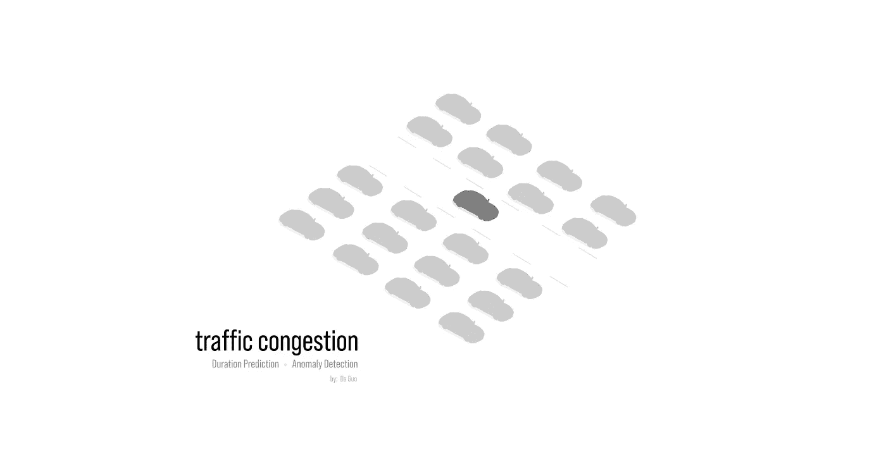
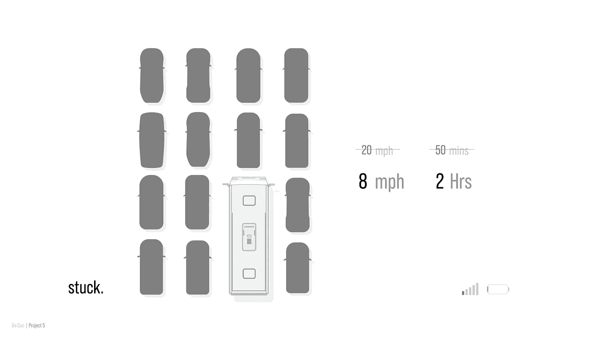
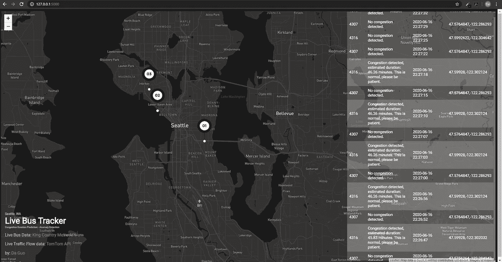
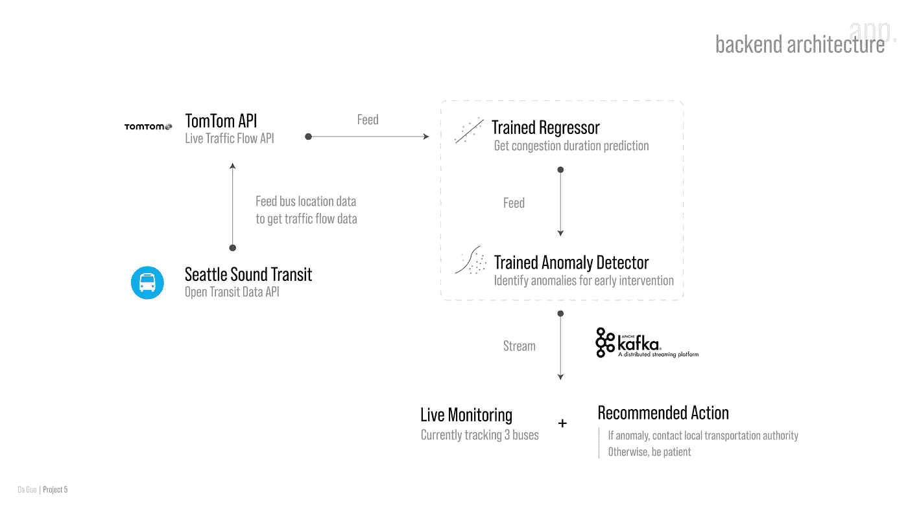
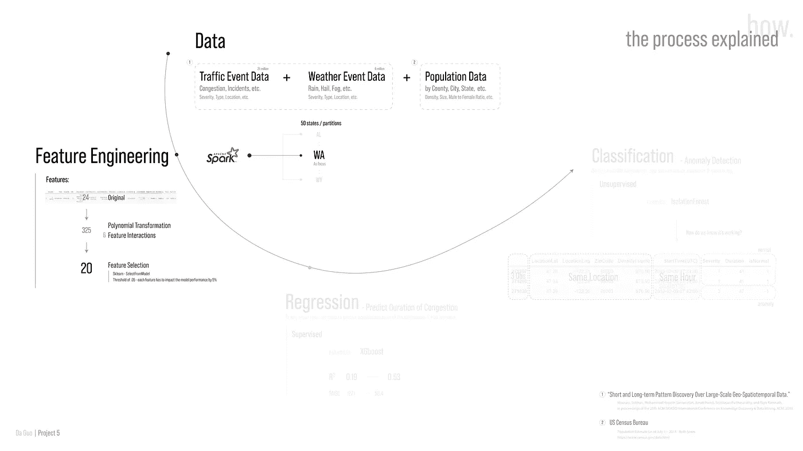
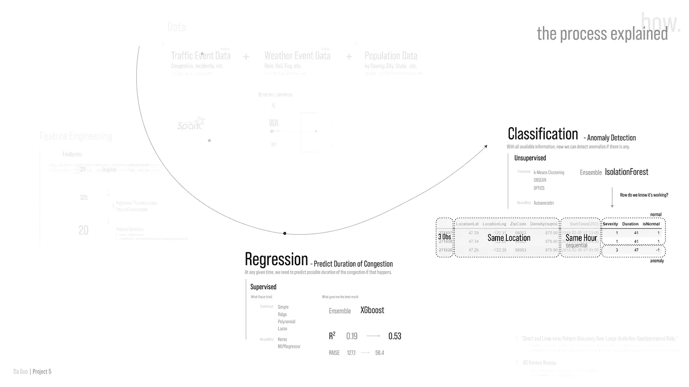
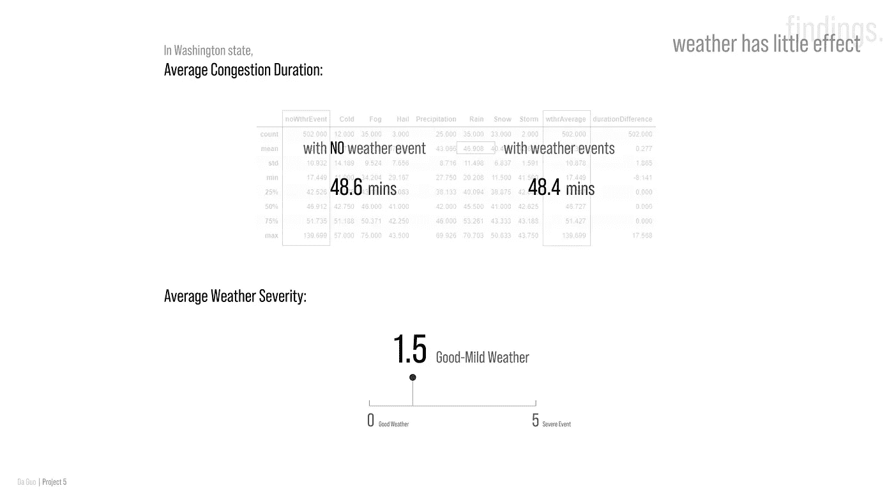
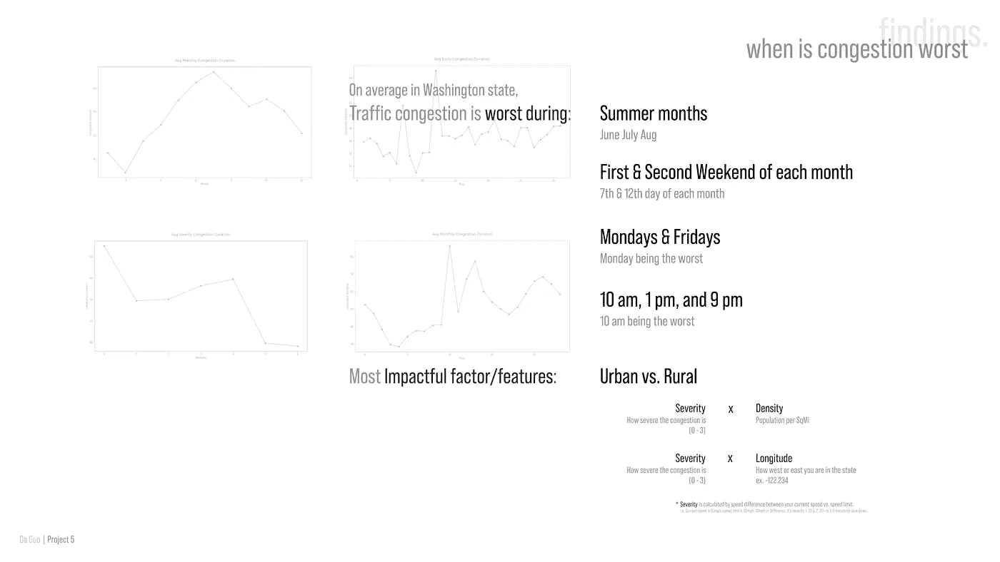
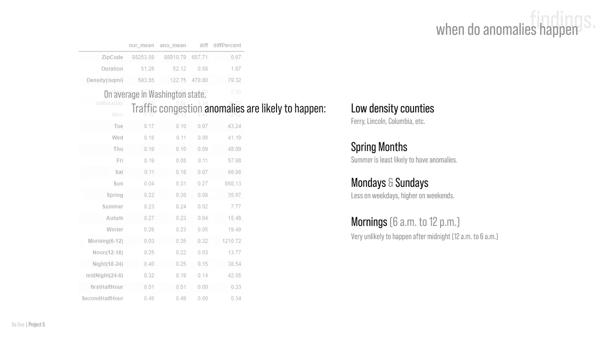

# 预测和检测交通拥堵持续时间异常

> 原文：<https://pub.towardsai.net/predicting-and-detecting-traffic-congestion-duration-anomalies-972873feee8a?source=collection_archive---------4----------------------->

## [机器学习](https://towardsai.net/p/category/machine-learning)

您可以在我的 [**GitHub 资源库**](https://github.com/opophehu/traffic_congestion_anomaly_detection) 上找到这个项目的代码。

# 语境

我们都遇到了交通堵塞。大多数都很正常，而且基本上已经成为您日常饮食的一部分。但是，当意外的异常拥堵发生时，它真的会毁了您的计划。

*想象。*

下午 5:30，在紧张的一天后，您终于下班了。你可能计划了一个晚上放松一下，看你最喜欢的节目来减压。你跳上公共汽车想“我只需要再忍受 50 分钟，然后我就回家了。”但是高速公路上发生了一些意想不到的事件，让你被困在交通中几个小时。

当你终于到家时，演出已经结束了，你必须早起，所以你必须洗漱后直接上床睡觉。你的夜晚完全被毁了，你在公共汽车上为这个事实浪费了几个小时的恐惧。

在去洗澡的路上，你可能会想:“如果我能预测出拥堵会持续多久，并且知道这是不正常的，我会选择另一条路回家，或许情况会有所不同。”

为了防止这样的悲剧，我问:

# 问题

1.  如果发生这种情况，我能**预测** **充血的持续时间**吗？
2.  我能**检测到交通拥堵事件中的异常**吗？

为了解决这些问题，我为公共汽车司机和乘客开发了一个现场公共汽车追踪器:

# 产品

三辆公共汽车被跟踪以示示范。请注意，像“4316”这样的数字是我从西雅图巴士 API 获得的巴士 ID，它与地图上的标记数字不太相符，但我计划很快修复它。使用**小叶. js** 完成，使用 **Apache Kafka** 流式传输。

这是西雅图地区的现场巴士追踪器。在右侧，我不断进行持续时间预测，并通知拥堵事件。如果没有事件，就没有表格单元格的颜色；如果存在拥塞并且是正常的，则单元颜色是白色，同时将进行拥塞将持续多长时间的预测。但是如果发生异常，它们将被标记为橙色，不幸的是，在我运行跟踪器的时候，这种情况还没有发生。

这使得公共汽车乘客和司机能够向交通当局报告异常情况，以便他们能够在整个过程之前进行干预，防止类似这样的悲剧发生。

这显示了数据在后端是如何移动的。

现在，我们来谈谈**模型**是如何训练的:

# 数据

主要数据来源于最近发表的一篇研究论文。该数据包含从 2016 年到 2019 年全美**2500 万交通事件数据**以及**600 万天气事件数据**。由于大小的原因，我使用 *pyspark* 对数据进行了分区，并且因为我住在西雅图地区，所以考虑到可伸缩性，我选择了华盛顿州作为重点。我还从美国人口普查局收集了一些县级人口数据，因为我认为人口密度可能是一个重要的特征。

然后通过特征工程，我从最初的 24 个特征减少到 325 个，然后使用多项式变换等技术减少到 20 个。所有的**最终 20 个特征**都被选中，因为它们**可以** **影响模型性能至少 5%** 。

如果你想知道这到底是怎么做到的，请访问 [**GitHub 仓库**](https://github.com/opophehu/traffic_congestion_anomaly_detection) 了解详情。

# **车型**

在获得并清理数据后，我构建了一个监督回归模型，使用 ***XGboost*** 预测拥堵持续时间，其中 **R2 为 0.53** 。从 0.19 到 0.53 的跳跃是特征工程和超参数网格搜索相结合的结果。

随着持续时间预测器的建立，我们现在可以通过建立异常检测器来查看它是否是一个异常。我的情况是用 [***隔离林***](https://towardsdatascience.com/outlier-detection-with-isolation-forest-3d190448d45e) ***。我选择它是因为它在解释能力和探测能力之间有一个很好的平衡，并且有最容易调整的超级参数。***

由于没有度量标准来评估无监督学习，这里我按顺序取出了 3 个观察值。**同样的地点，相似的时间，但相隔几分钟。**在 ***上午 7:33***第一次观察到拥堵事件，预测持续 41 分钟，一分钟后给出相同的预测，认为正常。然而 9 分钟后在 ***上午 7 点 43 分*** ，拥堵不仅没有好转反而变得更糟，并立即被标记为异常。

此时，当地交通部门可以在这种异常事件持续整个期间之前进行调查和干预，并在它发生之前防止它造成任何损害。

# 调查结果

分析华盛顿州天气数据的发现。

总体而言，天气对西澳大利亚交通拥堵持续时间的影响很小。这部分是因为从 2016 年到 2019 年，天气一直相当温和，总体上是好天气到温和天气。

通过建立持续时间预测器*(回归)*，我发现在夏季、**每月第一个和第二个周末**、周一**、**、**周五**、**上午 10 点**交通拥堵最严重。、**下午 1 点**和**晚上 9 点**

我还发现**最有影响力的特征**是如何“*”位置是*(即经度是你所在的东或西，西澳的西部比东部更城市化)*。*

*值得注意的是，**严重性**是根据您当前的速度与限速*计算得出的(即，如果您当前的速度为 50 英里/小时，限速为 60 英里/小时，相差 10，则严重性为 1；差 20，严重性 2 等)*。*

**

*通过构建异常检测器*(分类)*，我发现拥塞**异常很可能发生在**低密度县**、**春季**、周一**、**周日**、*(特别是周日)*、**上午**、*(早上 6 点到晚上 12 点)*。这对于交通紧急响应部门更有效地分配他们的资源用于早期干预是有价值的。*****

***最后，如果你想看代码，请访问这个项目的 [**GitHub 库**](https://github.com/opophehu/traffic_congestion_anomaly_detection) 。如有任何问题或疑虑，请随时联系我们！***

******