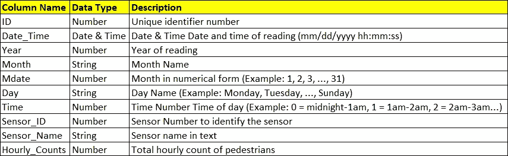
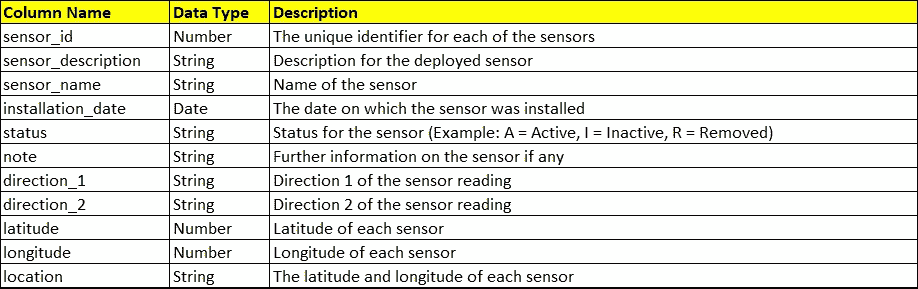
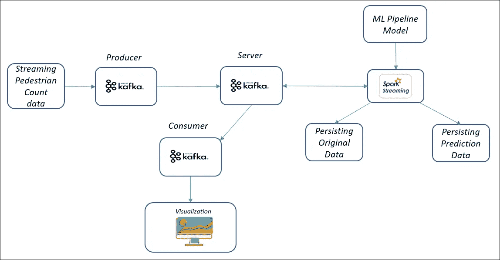

# 通过 Python 预测和可视化流数据

> 原文：<https://pub.towardsai.net/predicting-and-visualizing-streaming-data-through-python-2670003bc809?source=collection_archive---------3----------------------->

## [编程](https://towardsai.net/p/category/programming)

## 预测行人流量并在地图上可视化

由[托马索·斯卡拉](https://unsplash.com/@tommaso_27?utm_source=unsplash&utm_medium=referral&utm_content=creditCopyText)在 [Unsplash](https://unsplash.com/s/photos/pedestrian-street?utm_source=unsplash&utm_medium=referral&utm_content=creditCopyText) 上拍摄的照片

***目标简介***

在批处理/静态数据上训练模型的技能非常重要，但在流数据上应用该模型的能力也非常重要。在当今快速发展的世界中，人们/组织希望他们的查询得到实时响应/预测，因为每个人都在自己的世界中非常忙碌，坦率地说，我们都同意有很多事情要做。因此，这篇文章是献给那些试图掌握实时预测技能的人的。这篇文章是我的[上一篇](https://akashgoyal2110.medium.com/time-series-prediction-using-spark-8ee7fbe878e6)文章的延续，在那篇文章中，我们使用 Apache Spark 训练模型。

正如第一段所述，到目前为止，您应该已经对我们在本文中讨论的内容有所了解，是的，您是对的，我们将实时部署之前创建的模型，然后看看我们如何在地图上可视化传感器部署在特定“位置”的结果。为了方便起见，我将再次分享这篇文章中的数据结构。这样你就不用再去看最后一个帖子了。

遵循正确的方法总是好的，所以我们会像上次一样，解决一些关于要解决的问题的基本问题。

**哪些工具将用于处理实时流？**

根据这篇博客，使用的工具将是用于实时数据模拟的 [Apache Kafka](https://kafka.apache.org/) 和 [Apache Spark](https://spark.apache.org/) 。使用的编程语言是 Python。

这篇博客会使用什么类型的数据？

这个博客中会用到两个数据集

*   行人计数数据

*   传感器信息数据

使用 Apache Kafka，我们可以模拟一个实时流系统。其中新数据(位于逗号分隔的文件中)将实时流式传输，并且将首先根据需要对其进行处理，然后进行预测过程。在预测之后，我们将实时可视化数据，因为利益相关者不想打破他们的头脑去看预测，但是他们想看到能立即给他们答案的东西。

> **不幸的是，由于版权问题，实际使用的数据无法上传，但同时我会分享数据的结构，所以任何类似结构的数据或可以转换成类似结构的数据都可以使用。**

现在让我们快速解决手头的问题。

# 用于实现目标的流程

# 步伐

1.  设置 Kafka 生成器并发送数据
2.  从流中读取数据
3.  保留原始数据
4.  转换流数据
5.  执行预测
6.  持久化预测数据
7.  设置 Kafka 消费者
8.  形象化

# 设置 Kafka 生成器并发送数据

在这一步中，我们将为 Kafka producer 创建一个对象，该对象将具有我们需要用来创建数据流的 Kafka 服务器的配置。这将通过使用`KafkaProducer()`函数来完成，该函数有**服务器和端口地址**，要使用的 **api 版本**，以及另外两个参数 **value 和 key_serializer** ，Kafka 生产者可以在这里被指示如何将用户提供的键和值对象转换成字节。要通过 Kafka 发送数据，将数据放在一个主题上是很重要的。如果你是一个绝对的初学者，你会想到一个关于卡夫卡的数据库，你把数据放在里面。参见下面的代码。

下一步是发布所选主题的数据。请参见下面的代码块。

# 从流中读取数据

这里我们将看到如何使用 Spark 读取数据数据流，这相当容易。但是为了使它变得简单，我们需要了解以下内容:

*   火花`readStream` API
*   要从 Kafka 读取数据，我们需要使用 format()函数，并以`‘kafka’`作为参数。
*   `option(“kafka.bootstrap.servers”, “localhost:9092”)` —设置要使用的服务器。`localhost`可以替换为您想从中读取数据的服务器的 IP 地址。
*   `option(“subscribe”, topic)` —从需要读取数据的位置设置 Kafka 主题的选项。

# 保留原始数据

保持原始数据始终是一个好的做法。这可以使用 Spark 的`writestream` API 来完成。

*   Spark 的`writeStream` API
*   要以 parquet 格式写入数据，我们需要使用带有`'parquet'`参数的`format()`函数。
*   `outputMode('append')`:在此模式下，只有新的行会被添加到结果表中。
*   `option(path)`:存储结果表的文件路径。
*   `option(checkpointLocation)`:对状态设置检查点有助于恢复上一个状态。
*   `start()`:开始写入数据

# 转换流数据

为了准备用于预测的数据，我们可以像在上一篇文章中那样使用 lag 函数，或者我在这里讨论的另一种方法是，我们可以向`Date_Time`列添加一天，然后从那里提取所有的组成部分，例如日期(1，2，3…30/31)等。参见下面的代码。上一篇文章中讨论的模型非常简单，我们可以添加更多的功能，比如一年中的星期，等等。

# 执行预测

这里，我们首先需要加载我们在[上一篇](https://akashgoyal2110.medium.com/time-series-prediction-using-spark-8ee7fbe878e6)文章中学习保存的管道模型。可以使用函数`load()`加载模型，然后我们可以预测流数据和的值。要查看模型创建和预测，请参考 github 页面。

# 持久化预测数据

预测数据可以像我们保存原始数据一样容易地保存

# 设置 Kafka 消费者

现在，在流程的这一部分，我们将为 Kafka consumer 创建一个对象，该对象将具有 Kafka 服务器的配置，我们需要使用该配置来消费我们在 Kafka 主题上发布的预测数据。(这个请参考代码)。我们需要使用`KafkaConsumer()`函数，我们将在其中设置**服务器和端口地址**，要使用的 **api 版本**，值将被序列化的部分，就像我们在`KafkaProducer()`函数中所做的那样，还有 **auto_offset_reset** 属性。以下是这些参数的简短描述。

*   **auto_offset_reset** :参数值默认为“最新”。这使得总是采用提交数据的最新位置。
*   **api_version** :指定使用哪个 api 版本。
*   **consumer_timeout_ms** :这是以毫秒为单位的超时时间，超过该时间后，如果消费者无法消费任何消息，就会停止消费。
*   **value_deserializer** :序列化值，转换成字符串数据。
*   **bootstrap_servers** :必须使用的服务器地址。

# 形象化

最后但并非最不重要的是可视化，它抢了利益相关者的风头，因为他们总是想看到这一点。在这一步中，我们将使用 python 的**follow**库创建一个地图可视化，其中包含感兴趣区域的坐标(在我的代码中是 Melbourne)，还将缩放比例设置为 15 个单位，以便可以正确查看数据。

我们将通过消耗的消息，每次消耗 20 条消息，地图将刷新显示可视化。为了确保我们只关注重要的位置，使用了预测行人数量大于 2000 的位置。您可以根据您的使用情况选择任何数字。要查看代码，请参考 github 页面。

**请看一下**[**github**](https://github.com/akashgoyal2110/pedestrian-traffic-prediction/tree/main)**页面，关于我在 python 笔记本中做过的更多事情，为了简洁起见，不得不在帖子中长话短说。**

非常感谢你花时间阅读这篇文章，如果你想讨论与这篇文章相关的任何事情，请留下评论，我会尽力帮助你。另外，请点击鼓掌按钮，分享帖子。