# 预测客户流失

> 原文：<https://pub.towardsai.net/predicting-customer-churn-3c9aea6f874a?source=collection_archive---------0----------------------->

## [数据分析](https://towardsai.net/p/category/data-analytics)

找到一个客户需要几个月…失去一个只需几秒钟。

——文斯·隆巴迪


由 [Charanjeet Dhiman](https://unsplash.com/@charanjeet_dhiman?utm_source=unsplash&utm_medium=referral&utm_content=creditCopyText) 在 [Unsplash](https://unsplash.com/s/photos/customer-churn?utm_source=unsplash&utm_medium=referral&utm_content=creditCopyText) 上拍摄的照片

# 客户流失

当客户或服务订户停止与公司做生意时，就会发生客户流失。当客户在一段特定的时间内没有与企业互动时，企业会认为客户受到了影响。客户流失是一个重要的指标，因为获得新客户比留住现有客户要昂贵得多。获取客户需要通过销售渠道挖掘潜在客户，并在整个过程中使用销售和营销资源来实现销售。通过留住客户，您已经赢得了现有客户的信任和忠诚，并且您希望继续与这些客户建立有意义的关系。根据贝恩公司(Bain & Company)进行的研究，根据行业的不同，仅将客户保留率提高 5%就可以增加 25%至 95%的利润。

# **客户流失的原因**

客户流失有四个主要原因。

1.**客户服务差。Oracle 的一项研究发现，几乎十分之九的客户因为糟糕的体验而放弃了一项业务。此外，他们发现，出色的客户服务可以带来巨大的成功，86%的客户愿意为更好的客户体验支付更多费用。**

2.**糟糕的入职。**客户购买产品或服务后，需要通过使用产品或服务获得成功或收益。如果顾客迷失了方向，不理解某些东西，或者没有从产品中获得价值，他们就会放弃产品或服务。

3.**缺乏持续的客户成功。**客户需要继续从产品或服务中获得价值。如果你的客户停止与你互动，而你没有帮助他们在整个生命周期中从你的产品中获得价值，那么就有失去客户的风险。

4.**自然原因。**包括客户停业、运营或员工变动，这些变动会导致供应商发生变化，或者客户可能无法满足您的产品或服务需求。

# **如何留住客户**

1.**跟踪和分析流失指标**。公司需要跟踪和分析流失客户的数量，并了解客户决定流失的原因。公司可以利用这些信息并采取措施来防止进一步的客户流失。

2.**实施客户反馈流程。**开发一个用于分发、收集和分析客户评论和调查的系统。这使您能够更好地了解您的客户需求，并对您的产品或服务进行调整，从而为客户提供价值。

3.**保持与客户的沟通。**积极主动地与客户沟通。如果客户有一段时间没有与你的品牌互动，你应该与他们建立联系，重新建立关系。您可能希望提供促销优惠或提醒他们，他们的订阅即将到期，是时候续订了。

4.**制定客户教育计划。**该计划创建了各种客户自助服务工具，如知识库和社区论坛，客户可以用它们来寻找问题的解决方案。

5.**与客户建立信任。**始终如一地履行你的品牌承诺，并说到做到。承认并为你犯的任何错误道歉，并采取行动解决问题。

6.**提供独特服务。**提供优于竞争对手的产品或服务。这可能是一种新产品或服务，也可能是对现有产品或服务的增强，它可以改进工作流程或自动化流程，从而使客户受益。

# 路标

本文的剩余部分将介绍一个程序，该程序将尝试准确预测客户是否可能流失。以下步骤将使用机器学习和 Python 来执行。

1.导入所需的软件库。

2.访问数据集并将其导入数据框。

3.数据分析和探索。

4.数据清理和规范化。

5.将数据分成测试和训练数据集。

6.根据训练数据训练模型。

7.根据测试数据进行预测。

8.评估模型的性能。

9.从观察中得出结论。

# 该计划

目标:使用多种模型预测客户是否可能流失。

**导入所需的软件库**

```
**import** **pandas** **as** **pd**
**import** **numpy** **as** **np**
**import** **sklearn**
**import** **matplotlib.pyplot** **as** **plt**
**import** **seaborn** **as** **sns**
**from** **sklearn.preprocessing** **import** LabelEncoder
**from** **sklearn.preprocessing** **import** StandardScaler
**from** **sklearn.metrics** **import** accuracy_score, confusion_matrix
**from** **sklearn.linear_model** **import** LogisticRegression
**from** **sklearn.tree** **import** DecisionTreeClassifier
**from** **sklearn.ensemble** **import** RandomForestClassifier
**from** **sklearn.neighbors** **import** KNeighborsClassifier
**from** **sklearn.model_selection** **import** train_test_split
%matplotlib inline
```

这个项目的数据集可以在 Kaggle 上找到，地址:[https://www.kaggle.com/blastchar/telco-customer-churn?select = WA _ Fn-UseC _-Telco-Customer-churn . CSV](https://www.kaggle.com/blastchar/telco-customer-churn?select=WA_Fn-UseC_-Telco-Customer-Churn.csv)

**访问并导入数据集**

```
# Load the data into Google Colab.
**from** **google.colab** **import** files  
uploaded = files.upload()# Store the data into a data frame.
customers = pd.read_csv('WA_Fn-UseC_-Telco-Customer-Churn.csv.csv')
```

**数据分析与探索**

```
# Print the first 5 rows
customers.head(5)
```

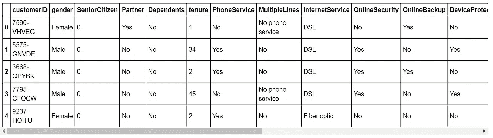

```
# Show the number of rows and columns in the data frame.
customers.shape
```

(7043, 21)

有 7，043 条客户记录，包含 20 个特征和 1 个目标变量。

数据变量的定义如下所示。

*   客户 ID:客户识别号。
*   性别:客户的性别(男性或女性)。
*   老年人:客户是否是老年人(0，1)。
*   合作伙伴:客户是否有合作伙伴(是，否)。
*   家属:客户是否有家属(是，否)。
*   任期:客户在公司工作的月数。
*   电话服务:客户是否有电话服务(是，否)。
*   多条线路:客户有多条线路(是，否，无电话服务)
*   互联网服务:客户互联网服务提供商(DSL、光纤、否)
*   在线安全:客户拥有在线安全(是、否、无互联网服务)
*   在线备份:客户有在线备份(是，否)。
*   设备保护:客户有设备保护(是，否)。
*   技术支持:客户有技术支持:(是，否)。
*   流式电影:客户有流式电影:(是，否)。
*   合同:合同条款。
*   无纸计费:客户拥有无纸计费。
*   付款方式:如何付款。
*   每月费用:每月付款金额。
*   总费用:付款总额。
*   流失:客户流失(否=保留，是=流失)

```
# View statistical details.
customers.describe()
```

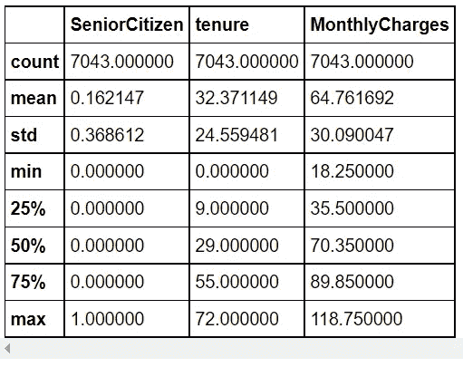

统计数据显示，最长任期为 72 个月，每月最高收费为 118.75 美元。

最低月费是 18.25 美元。

客户预计每月平均费用为 64.76 美元。我假设费用是以美元计算的。

```
# Show information about the dataframe.
customers.info()<class 'pandas.core.frame.DataFrame'>
RangeIndex: 7043 entries, 0 to 7042
Data columns (total 21 columns):
 #   Column            Non-Null Count  Dtype  
---  ------            --------------  -----  
 0   customerID        7043 non-null   object 
 1   gender            7043 non-null   object 
 2   SeniorCitizen     7043 non-null   int64  
 3   Partner           7043 non-null   object 
 4   Dependents        7043 non-null   object 
 5   tenure            7043 non-null   int64  
 6   PhoneService      7043 non-null   object 
 7   MultipleLines     7043 non-null   object 
 8   InternetService   7043 non-null   object 
 9   OnlineSecurity    7043 non-null   object 
 10  OnlineBackup      7043 non-null   object 
 11  DeviceProtection  7043 non-null   object 
 12  TechSupport       7043 non-null   object 
 13  StreamingTV       7043 non-null   object 
 14  StreamingMovies   7043 non-null   object 
 15  Contract          7043 non-null   object 
 16  PaperlessBilling  7043 non-null   object 
 17  PaymentMethod     7043 non-null   object 
 18  MonthlyCharges    7043 non-null   float64
 19  TotalCharges      7043 non-null   object 
 20  Churn             7043 non-null   object 
dtypes: float64(1), int64(2), object(18)
memory usage: 1.1+ MB# Check for NA or missing data.
customers.isna().sum()
customerID          0
gender              0
SeniorCitizen       0
Partner             0
Dependents          0
tenure              0
PhoneService        0
MultipleLines       0
InternetService     0
OnlineSecurity      0
OnlineBackup        0
DeviceProtection    0
TechSupport         0
StreamingTV         0
StreamingMovies     0
Contract            0
PaperlessBilling    0
PaymentMethod       0
MonthlyCharges      0
TotalCharges        0
Churn               0
dtype: int64# Show the number of customers retained and the number of customers # churned.
customers['Churn'].value_counts()
```

第 5174 号

是的 1869 年

留住 5174 个客户，流失 1869 个客户。

```
# Visualize the counts for customers retained and customers churned.
sns.countplot(customers['Churn'])
```

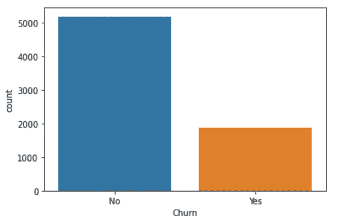

```
# Show percentages for customers staying and customers leaving.
retained = customers[customers.Churn == 'No']
churned = customers[customers.Churn == 'Yes']
num_retained = retained.shape[0]
num_churned = churned.shape[0]

# Print the percentage of customers that stayed with the company. 
print(num_retained / (num_retained + num_churned) * 100 , "**% o**f customers that stayed with the company.")

# Print the percentage of customers that left the company.
print(num_churned / (num_retained + num_churned) * 100,"**% o**f customers that left the company.")
```

73.460129206304%的客户留在该公司。26.5687079369588%的客户离开了公司。

我们发现 73.46%的顾客被保留(留在公司)，26.54%的顾客流失(离开公司)。

```
# Visualize the churn count for males and females.
sns.countplot(x='gender', hue='Churn', data = customers)
```

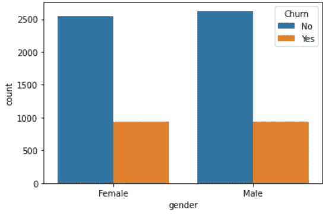

```
# Visualize the churn count for senior citizens.
sns.countplot(x='SeniorCitizen', hue='Churn', data = customers)
```

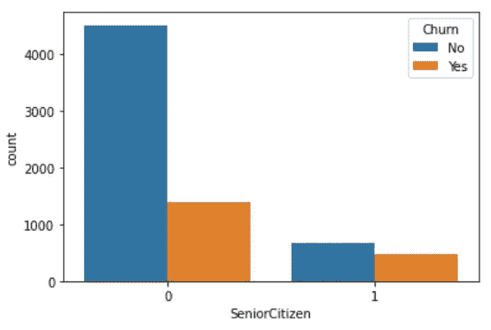

```
# Visualize the churn count for contract type.
sns.countplot(x='Contract', hue='Churn', data = customers)
```

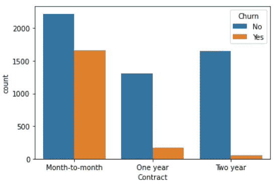

```
# Visualize the churn count for phone service.
sns.countplot(x='PhoneService', hue='Churn', data = customers)
```

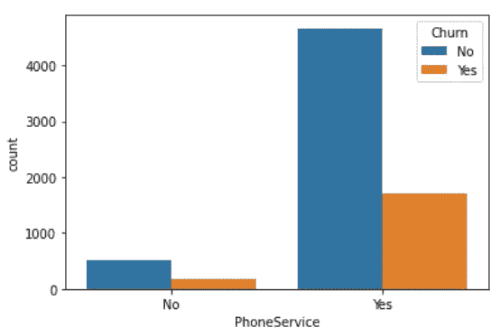

```
# Visualize the churn count for the type of internet service.
sns.countplot(x='InternetService', hue='Churn', data = customers)
```

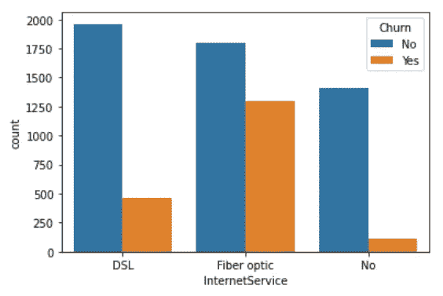

调查结果摘要包括以下内容:

*   73.46%的客户被保留，26.54%的客户被流失。
*   性别似乎在客户流失中不起作用。
*   大多数顾客是年轻人，不是老年人。
*   月合同的客户比一年或两年合同的客户更容易流失。
*   大多数顾客都有电话服务。
*   使用光纤互联网服务的客户比使用 DSL 或没有互联网服务的客户更容易流失。

```
# Visualize the tenure and monthly charge features to see if there  # are any differences for customer churn.
numerical_features = ['tenure', 'MonthlyCharges']
fig, ax = plt.subplots(1, 2, figsize=(16, 4))
customers[customers.Churn == 'No'][numerical_features].hist(bins=20, color="darkblue", alpha=0.5, ax=ax)
customers[customers.Churn == 'Yes'][numerical_features].hist(bins=20, color="tab:orange", alpha=0.5, ax=ax)
```

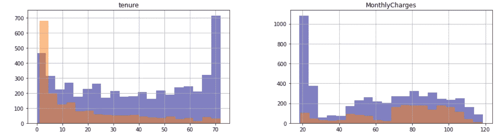

任期图(左侧)显示，大多数流失的客户在公司的任期为 1 至 9 个月，而大多数保留的客户的任期为 22 至 72 个月。

月费图表(在右边)显示，大多数留在该公司的忠实客户的月费在 18 到 30 美元之间。大部分顾客每月的费用在 70 到 110 美元之间。

**数据清理和规范化**

```
# Remove the following features because they add little value to the # model. Having unnecessary features increases the model complexity. 
cols = ['customerID', 'gender', 'PhoneService', 'Contract', 'TotalCharges']
customers = customers.drop(columns = cols, axis = 1)# Convert all the non-numeric columns to numerical data types.
**for** column **in** customers.columns:
   **if** customers[column].dtype == np.number:
      **continue**
   customers[column] = LabelEncoder().fit_transform(customers[column])# View the updated data set. 
customers.head()
```

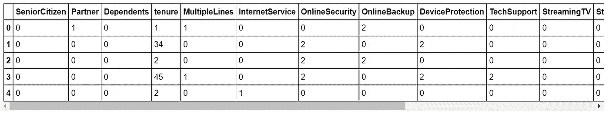

**将数据分成测试和训练数据集**

首先，我们需要将数据分为 x 值(我们将用来进行预测的数据)和 y 值(我们试图预测的数据)。

```
x_data = customers.drop('Churn', axis = 1) 
y_data = customers['Churn']

# Scale the x data to have values between 0 and 1 inclusively.
x_data = StandardScaler().fit_transform(x_data)
```

使用训练测试分割功能生成训练数据和测试数据。测试数据集将是原始数据集的 30%。

```
x_training_data, x_test_data, y_training_data, y_test_data = train_test_split(x_data, y_data, test_size = 0.3, random_state=42)
```

现在，我们将训练模型，进行预测，并评估四种不同模型的性能。

**逻辑回归模型**

```
# Create an instance of the classifier and assign it to a model      # variable.
model_lg = LogisticRegression()# Train the model using the fit method and training data. 
model_lg.fit(x_training_data, y_training_data)# Make predictions on the test data.
predictions_lr = model_lg.predict(x_test_data)# Calculate the Accuracy Score.
lg = accuracy_score(y_test_data, predictions_lr)
print(lg)
```

0.8088026502602934

```
# Show Confusion Maxtrix.
cm1 = confusion_matrix(y_test_data, predictions_lr)
sns.heatmap(cm1/np.sum(cm1), annot = **True**, fmt=  '0.2%', cmap = 'Reds')
```

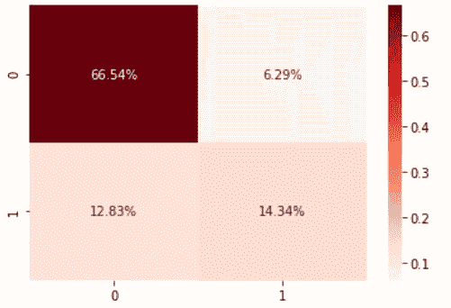

逻辑回归模型正确预测了 80.88%的客户将被保留或流失。

*   66.54%正确预测客户留存。
*   14.34%正确预测客户流失。

19.12%的客户被错误地预测为保留或流失。

*   6.29%错误预测客户流失。
*   12.83%错误预测要保留的客户。

**决策树模型**

```
# Create an instance of the classifier and assign it to a model     # variable.
model_dt = DecisionTreeClassifier(criterion = 'entropy', random_state=42)# Train the Model using the fit method and training data.
model_dt.fit(x_training_data, y_training_data)# Make predictions on the test data.
predictions_dt = model_dt.predict(x_test_data)# Calculate the Accuracy Score.
dt = accuracy_score(y_test_data, predictions_dt)
print(dt)
```

0.7283483199242783

```
# Show Confusion Maxtrix
cm2 = confusion_matrix(y_test_data, predictions_dt)
sns.heatmap(cm2/np.sum(cm2), annot = **True**, fmt=  '0.2%', cmap = 'Reds')
```

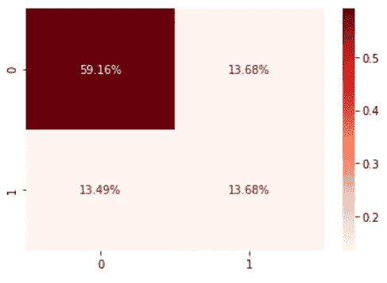

决策树模型正确预测了 72.84%的客户将被保留或流失。

*   59.16%正确预测客户留存。
*   13.68%正确预测客户流失。

27.17%的客户被错误地预测为保留或流失。

*   13.68%错误预测客户流失。
*   13.49%错误预测要保留的客户。

**随机福里斯特模型**

```
# Create an instance of the classifier and assign it to a model     # variable. 
model_rf = RandomForestClassifier(n_estimators=100, max_depth=10)
```

参数包括:

*   n_estimators 是森林中树木的数量
*   max_depth 是树的最大深度

```
# Train the model using the fit method and training data.
model_rf.fit(x_training_data, y_training_data)# Make predictions on the test data. 
predictions_rf = model_rf.predict(x_test_data)# Calculate the Accuracy Score.
rf = accuracy_score(y_test_data, predictions_rf)
print(rf)
```

0.7998106956933271

```
# Show Confusion Maxtrix.
cm3 = confusion_matrix(y_test_data, predictions_rf)
sns.heatmap(cm3/np.sum(cm3), annot = **True**, fmt=  '0.2%', cmap = 'Reds')
```

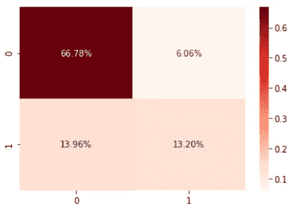

随机森林模型正确预测了 79.98%的客户将被保留或流失。

*   66.78%正确预测客户留存。
*   13.20%正确预测客户流失。

20.02%的客户被错误地预测为保留或流失。

*   6.06%错误预测客户流失。
*   13.96%错误预测要保留的客户。

**K 个最近邻居**

```
# Create an instance of the classifier and assign it to a model     # variable.
model_kn = KNeighborsClassifier(n_neighbors=9, leaf_size=20)# Train the model using the fit method and training data.
model_kn.fit(x_training_data, y_training_data)# Make predictions on the test data.
predictions_kn = model_kn.predict(x_test_data)# Calculate the Accuracy Score.
kn = accuracy_score(y_test_data, predictions_kn)
print(kn)
```

0.7662091812588736

```
# Show Confusion Maxtrix.
cm4 = confusion_matrix(y_test_data, predictions_kn)
sns.heatmap(cm4/np.sum(cm4), annot = **True**, fmt=  '0.2%', cmap = 'Reds')
```

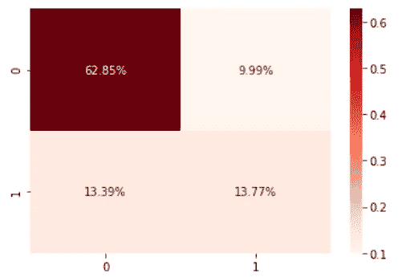

K 近邻模型正确预测了 76.62%的客户将被保留或流失。

*   62.85%正确预测客户留存。
*   13.77%正确预测客户流失。

23.38%的客户被错误地预测为保留或流失。

*   9.99%错误预测客户流失。
*   13.39%错误预测要保留的客户。

```
# Show Accuraccy Score by Model.
models = pd.DataFrame({
    'Model':['Logistic Regression', 'Decision Tree', 'Random Forest', 'KNeighbours'],
    'Accuracy_score' :[lg, dt, rf, kn]
})
models
sns.barplot(x='Accuracy_score', y='Model', data=models)

models.sort_values(by='Accuracy_score', ascending=**False**)
```

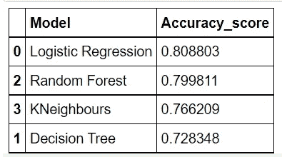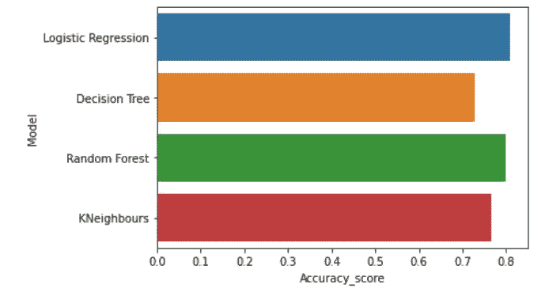

结论:逻辑回归模型具有最高的准确性得分。该模型正确预测了 81%的客户将被保留或流失，而错误预测了 19%的客户将被保留或流失。

大多数流失的客户在公司工作了 1 到 9 个月，而大多数保留的客户工作了 22 到 72 个月。公司可能会考虑向客户提供奖励，以留住他们至少 2 年。

大多数留在该公司的客户每月收费在 18 到 30 美元之间，而大多数流失的客户每月收费在 70 到 110 美元之间。该公司可能会考虑降低月租费，以留住客户并提高竞争力。

谢谢你看我的文章！如果您有任何问题或意见，请告诉我。

如果你喜欢阅读这样的故事，并想支持我成为一名作家，可以考虑报名成为一名媒体成员。会员资格让你可以无限制地接触媒体上的故事。你可以使用此链接[https://medium.com/@dniggl/membership](https://medium.com/@dniggl/membership)注册