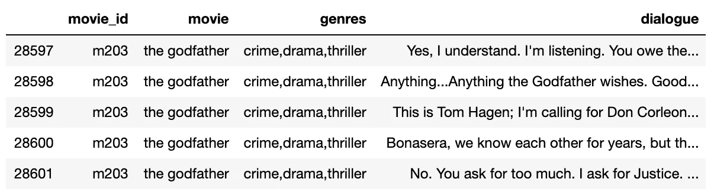
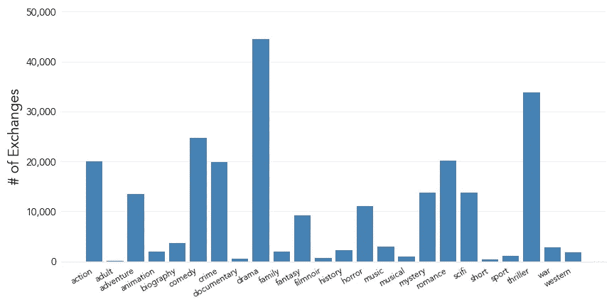
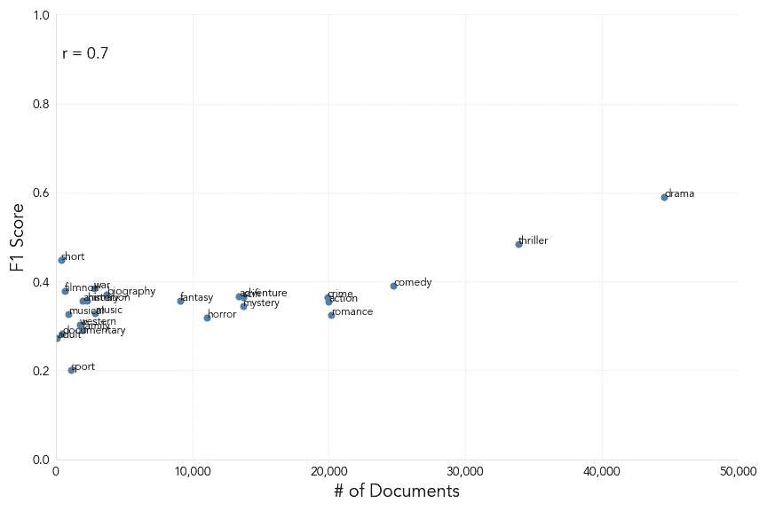

# 从电影对白中预测类型

> 原文：<https://pub.towardsai.net/predicting-genres-from-movie-dialogue-c6bc872af33?source=collection_archive---------4----------------------->

## [自然语言处理](https://towardsai.net/p/category/nlp)

## 多标签自然语言处理分类


在 [Unsplash](https://unsplash.com?utm_source=medium&utm_medium=referral) 上由 [Darya Kraplak](https://unsplash.com/@darya_kraplak?utm_source=medium&utm_medium=referral) 拍摄的照片

> “有一天，那一天可能永远不会到来，我会要求你为我做一个服务。但在那一天到来之前，就把这份正义当作我女儿结婚那天的礼物吧。”——堂·维托·柯里昂，《教父》(弗朗西斯·福特·科波拉，1972)

任何对电影稍有兴趣的人都有可能识别出产生上述台词的电影，尤其是推断出它的类型。这就是一句好名言的力量。

但是电影对白的威严是否也能在机器的耳朵里产生共鸣呢？本文旨在利用自然语言处理的特点建立一个分类模型，根据电影对白的交流来预测电影的类型。

所产生的模型将是多标签分类器的例子，因为数据集中的每个实例可以同时被分配零个或多个标签的正类。注意，这不同于多类分类器，因为可能的类的向量仍然是二进制的。

基于**概要**预测电影类型是多标签 NLP 模型领域中一个相对常见的例子。然而，使用电影**对话**作为输入的作品很少甚至没有。因此，这篇文章背后的动机是探索是否可以在电影对话中发现文本模式，以作为电影类型的指标。

施工过程分为三个主要阶段:

1.  编译、清理和预处理训练数据集
2.  训练数据的探索性分析
3.  建立和评估分类模型

# 第一部分:汇编训练数据集

该项目的数据是通过康奈尔大学的出版物获得的(在致谢部分注明)。

在提供的文件中，有三个数据集与项目相关:

*   **电影对话:**对话的交换被列为线路 id 和相应电影 id 的组合
*   **电影台词:**每行对白的文本及其对应的台词 ID
*   **电影标题元数据:**数据中包含的电影的属性，如标题和类型

为了从原始文件中编译一组分类的训练数据，我们需要提取必要的数据，将其转换成可工作的格式，并将其加载到数据库中，以便我们以后可以读取。

## 提取、转换和加载训练数据

用于产生最终训练集的 ETL 管道将包括以下步骤:

1.  将三个文本文件中的数据读入 pandas 数据帧
2.  为会话数据集中包含的每个交换分配一个会话 ID
3.  融合对话数据帧，使得每一行对话出现在具有相应对话 ID 的单独行上
4.  将融合的数据帧与行数据集结合，以检索每个行 ID 的实际文本
5.  通过对话 ID 连接单独的行，以便每个交换的整体以文本格式出现在单独的行上
6.  最后，将文本对话的数据帧与电影元数据相结合，以检索每个文本文档的类型，并将最终的数据帧加载到 SQLite 数据库中

一旦 ETL 管道已经在原始文件上运行，训练数据集将如下所示:



图 1:训练数据的示例行

## 重新格式化目标变量

考虑到建模阶段，我们需要将“流派”列重新格式化为一个目标变量，以便输入到机器学习算法中。

“流派”列中的标签以逗号分隔的字符串形式列出，因此要创建目标变量，我们可以使用一种不同的一次性编码。这包括在数据帧中为每个独特的流派标签创建单独的列，以指示该标签是否包含在主流派列中，1 表示是，0 表示否

```
genres = df['genres'].tolist()
genres = ','.join(genres)
genres = genres.split(',')
genres = sorted(list(set(genres)))
for genre in genres:
    df[genre] = df['genres'].apply(lambda x: 1 if genre in x else 0)
```

二进制类型列的集合将作为目标变量矩阵，其中每部电影可以被分配任意数量的 24 个唯一标签。

# 第二部分:对培训数据的探索性分析

既然我们已经将数据重新加工成合适的格式，那么在构建模型之前，让我们开始一些探索以获得一些见解。我们可以先来看看每部电影被分配到的独立类型标签的数量:


图 2:每种类型标签的电影数量

我们数据集中的大多数电影都被分配了 2-4 个类型标签。当我们考虑总共有 24 个可能的标签时，这突出了我们可以预期我们的目标变量矩阵包含的负面分类比正面分类多得多。

这为建模阶段提供了有价值的见解，因为我们可以在训练数据中观察到显著的**类不平衡**。要从数字上评估这种不平衡:

```
df[genres].mean().mean()
>>> 0.12317299038986919
```

以上表明只有 12%的数据集标签属于正类。在决定评估模型的方法时，应该特别注意这个因素。

让我们也评估一下每个流派标签的正面事例的数量:



图 3:每个流派标签的正面实例计数

除了之前确定的类别不平衡，上面的图表揭示了数据也有一个显著的**标签不平衡**，因为一些流派(如戏剧)比其他流派(如黑色电影)有更多的正面实例来训练模型。

这可能会对不同流派之间的模式成功产生影响。

## 讨论分析的结果

上面的分析揭示了关于我们的训练数据的两个关键见解:

1.  阶级分布严重不平衡，不利者占优势。

在这种模式的背景下，阶级失衡是很难修正的。校正类不平衡的典型方法是合成过采样:创建特征值接近真实实例的少数类的新实例。

然而，这种方法通常不适用于多标签分类问题，因为任何可信的合成实例都会显示相同的问题。因此，类别不平衡反映了现实情况，因为一部电影只被分配了所有可能类型中的一小部分。

在选择评估模型的性能指标时，我们应该记住这一点。例如，如果我们基于**准确性**(正确分类占总分类的比例)来判断模型，我们可以简单地通过将每个实例预测为负面来获得大约 88%的分数(考虑到只有 12%的训练标签是正面的)。

像**精度**(被正确分类的实际阳性的比例)和**召回**(被正确分类的阳性的比例)这样的度量标准在这种情况下更合适。

2.*阳性类别在标签中的分布不平衡。*

如果我们要使用当前的数据集来训练模型，我们必须接受这样一个事实，即模型可能能够比其他类型更准确地分类一些类型，仅仅是因为数据可用性的增加。

处理这一问题的最有效方法可能是回到数据集汇编阶段，寻找更多的训练数据来源，以修正标签不平衡。这是在改进模型时可以考虑的事情。

# 第三部分:构建分类模型

## 自然语言处理

目前，我们模型特征的数据仍然是提供它的原始文本格式。为了将数据转换成适合机器学习的格式，我们需要使用一些 NLP 技术。

将文本文档集转换成数字特征矩阵所涉及的步骤如下:

1.  清理文本以删除所有标点和特殊字符
2.  将每个文档中的单个单词分成标记
3.  对文本进行词汇匹配(将屈折词组合在一起，例如将单词“learning”和“learned”替换为“learn”)
4.  从标记中删除空白，并将其设置为小写
5.  删除所有停用词(如“the”、“and”、“of”等)
6.  将每个文档矢量化为字数
7.  对每个文档执行词频-逆文档频率(TF-IDF)变换，以基于语料库中的词频平滑计数

我们可以将文本清理操作(步骤 1–5)编写成一个函数:

```
def tokenize(text):
    text = re.sub('[^a-zA-Z0-9]', ' ', text)
    tokens = word_tokenize(text)
    lemmatizer = WordNetLemmatizer()
    clean_tokens = (lemmatizer.lemmatize(token).lower().strip() for token in tokens if token \
                    not in stopwords.words('english'))
    return clean_tokens
```

然后可以将它作为标记符传递给 scikit-learn 的`CountVectorizer`函数(步骤 6)，并用`TfidfTransformer`函数结束这个过程(步骤 7)。

## 实现机器学习管道

特征变量需要经历 NLP 变换，然后才能被传递到分类算法中。如果我们要在整个数据集上运行转换，从技术上讲会导致**数据泄漏**，因为计数矢量化和 TF-IDF 转换将基于来自训练集和测试集的数据。

为了解决这个问题，我们可以首先拆分数据，然后运行转换。然而，这将意味着对训练数据完成一次该过程，对测试数据再完成一次，对我们想要分类的任何看不见的数据再完成第三次，这将有些麻烦。

规避这个问题的最有效方法是将 NLP 转换和分类器作为步骤包含在单个**管道**中。使用决策树分类器作为估计器，初始基线模型的管道如下:

```
pipeline = Pipeline([
    ('vect', CountVectorizer(tokenizer=tokenize)),
    ('tfidf', TfidfTransformer()),
    ('clf', MultiOutputClassifier(DecisionTreeClassifier()))
    ])
```

注意，我们需要将估计量指定为一个`MultiOutputClassifier`。这是为了指示模型应该为每个实例的每个指定流派标签返回一个预测。

## 评估基线模型

如前所述，在评估模型的性能时，需要考虑训练数据中的类别不平衡。为了说明这一点，让我们来看看基线模型的准确性。

除了考虑类别不平衡，我们还需要调整一些评估指标，以适应多标签输出，因为与单标签分类不同，每个预测实例不再是严格的对或错。例如，模型对 24 个可能标签中的 20 个进行了正确分类的实例应该被认为比没有标签被正确分类的实例更成功。

对于有兴趣深入研究多标签分类模型评估方法的读者，我可以推荐 [*多标签性能度量的统一视图(吴&周，2017)*](http://proceedings.mlr.press/v70/wu17a/wu17a.pdf) 。

在多标签分类中，一个公认的准确性度量是**汉明损失**:误分类的预测标签总数的分数。从 1 中减去汉明损失得到一个准确度分数:

```
1 - hamming_loss(y_test, y_pred)
>>> 0.8667440038568157
```

86.7%的准确率最初看起来是一个很好的结果。然而，在我们打包并认为该项目成功之前，我们需要考虑前面讨论的班级不平衡可能意味着这个分数过于慷慨。

让我们将海明损失与模型的精确度和召回率进行比较。要返回对每个标签的正面类别数进行加权的标签的平均分数，我们可以将`average=’weighted’`作为参数传递给函数:

```
precision_score(y_test, y_pred, average='weighted')
>>> 0.44485346325188513
recall_score(y_test, y_pred, average='weighted')
>>> 0.39102002566871064
```

精确度和召回率的保守得多的结果可能描绘了模型能力的更真实的画面，并表明精确度测量的慷慨是由于真实否定的丰富性。

考虑到这一点，我们将使用 **F1 分数**(精确度和召回率之间的调和平均值)作为评估模型的主要指标:

```
f1_score(y_test, y_pred, average='weighted')
>>> 0.41478130331069335
```

## 比较不同标签的性能

当探索训练数据时，我们假设由于跨标签的正面类别分布的不平衡，该模型对于一些流派比其他流派表现得更有效。让我们通过找到每个流派标签的 F1 分数并将其与该流派的培训文档总数进行对比来确定是否是这种情况。



图 4:培训报价数量和 F1 基线得分之间的关系

在这里，我们可以观察到一个标签的 F1 分数与其训练文档总数之间存在相对较强的**正相关**(皮尔逊系数为 0.7)，这证实了我们的怀疑。

如前所述，解决这个问题的最佳方法是在构建第二个版本的模型时收集更平衡的数据集。

## 改进模型:选择分类算法

让我们测试一些其他分类算法，看看哪种算法对训练数据产生的结果最好。要做到这一点，我们可以遍历一个配备了处理多标签分类的模型列表，并打印每个模型的加权平均 F1 分数。

在运行循环之前，我们给流水线增加一个额外的步骤:**奇异值分解** ( `TruncatedSVD`)。这是一种降维形式，它识别特征矩阵中最有意义的属性，并删除剩余的内容。它类似于主成分分析(PCA)，但可以用于稀疏矩阵。

我实际上发现，增加这一步稍微妨碍了模型的得分。然而，它极大地减少了计算运行时间，所以我认为这是一个值得的权衡。

我们还应该从通过单次训练和测试分割来评估模型，切换到使用来自**交叉验证**的平均分数，因为这将提供更可靠的性能测量。

```
tree = DecisionTreeClassifier()
forest = RandomForestClassifier()
knn = KNeighborsClassifier()models = [tree, forest, knn]
model_names = ['tree', 'forest', 'knn']for model in models:
    pipeline = Pipeline([
    ('vect', CountVectorizer(tokenizer=tokenize)),
    ('tfidf', TfidfTransformer()),
    ('svd', TruncatedSVD()),
    ('clf', MultiOutputClassifier(model))
    ])
    cv_scores = cross_val_score(pipeline, X, y, scoring='f1_weighted', cv=4, n_jobs=-1)
    score = round(np.mean(cv_scores), 4)
    scores.append(score)model_compare = pd.DataFrame({'model': model_names, 'score': scores})print(model_compare)
>>> model   score
>>> 0    tree  0.2930
>>> 1  forest  0.2274
>>> 2     knn  0.2284
```

令人惊讶的是，基线模型中使用的决策树实际上产生了所有测试模型中的最佳得分。在我们进行超参数调整时，我们将把它作为我们的估计值。

## 改进模型:调整超参数

作为构建最佳模型的最后一步，我们可以运行交叉验证**网格搜索**来找到参数的最有效值。

因为我们使用管道来拟合模型，所以我们可以定义参数值，不仅测试估计器，还测试 NLP 阶段，如矢量器。

```
pipeline = Pipeline([
    ('vect', CountVectorizer(tokenizer=tokenize)),
    ('tfidf', TfidfTransformer()),
    ('svd', TruncatedSVD()),
    ('clf', MultiOutputClassifier(DecisionTreeClassifier()))
    ])parameters = {
    'vect__ngram_range': [(1, 1), (1, 2)],
    'clf__estimator__max_depth': [250, 500, 1000],
    'clf__estimator__min_samples_split': [1, 2, 6]
}cv = GridSearchCV(pipeline, param_grid=parameters, scoring='f1_weighted', cv=4, n_jobs=-1, verbose=10)
cv.fit(X, y)
```

网格搜索完成后，我们可以查看最终调整模型的参数和分数:

```
print(cv.best_params_)
>>> {'clf__estimator__max_depth': 500, 'clf__estimator__min_samples_split': 2, 'vect__ngram_range': (1, 1)}
print(cv.best_score_)
>>> 0.29404722954784424
```

超参数调整让我们将该车型的性能略微提高了 0.1 个百分点，最终 F1 得分为 29.4%。这意味着我们可以期望该模型能够正确地对不到三分之一的真阳性进行分类。

# 结束语

总之，我们能够建立一个模型，试图通过对话来预测电影的类型:

1.  操纵从康奈尔大学出版物获得的文本语料库以创建训练数据集
2.  采用 NLP 技术将文本数据转换成特征变量矩阵
3.  使用机器学习流水线构建基线分类器，并通过评估适用于具有显著类别不平衡的多标签分类环境的性能度量来改进模型

最终模型可用于生成新对话交换的预测。下面的例子引用了《T2》中《灵魂的狂欢》(赫克·哈维，1962) 的一段话:

```
def predict_genres(text):
    pred = pd.DataFrame(cv.predict([text]), columns=genres)
    pred = pred.transpose().reset_index()
    pred.columns = ['genre', 'prediction']
    predictions = pred[pred['prediction']==1]['genre'].tolist()
    return predictionsline = "It's funny... the world is so different in the daylight. In the dark, your fantasies get so out of hand. \
But in the daylight everything falls back into place again."print(predict_genres(line))
>>> ['family', 'scifi', 'thriller']
```

最后的结论是什么？我们能向 IMDb 提议采用我们的模式作为自动分类的手段吗？现阶段，大概不会。然而，这篇文章中创建的模型应该是一个足够好的起点，有机会在未来的版本中进行改进，例如，编译一个更大的数据集，在不同类型之间更加平衡。

对下载数据集、运行 ETL 管道或检查构建模型的代码感兴趣的读者可以在我的 [Github](https://github.com/harryroper96/movie_dialogue_clf) 的这个资源库中这样做。随时欢迎关于改进模型的反馈、问题和建议。

# 承认

克里斯蒂安·达内斯库-尼古列斯库-米齐尔。 [*康奈尔电影—对话文集*](https://www.cs.cornell.edu/~cristian/Cornell_Movie-Dialogs_Corpus.html) 。康奈尔大学 2011

Xi-朱武和周志华。 [*多标签绩效指标的统一视图*](http://proceedings.mlr.press/v70/wu17a/wu17a.pdf) *。* ICML 青奥会