# 用机器学习预测医疗保险费用

> 原文：<https://pub.towardsai.net/predicting-health-insurance-charges-with-machine-learning-313963dbb904?source=collection_archive---------0----------------------->

## [机器学习](https://towardsai.net/p/category/machine-learning)

“我强烈支持病人权利法案。决定应该由医生做出，而不是会计师。”

查尔斯·舒默


照片由来自 Pexels 的 Olya Kobruseva 拍摄

**健康保险政策**

当您拥有健康保险时，它会涵盖或最大限度地减少您为医疗保健服务支付的费用。多种因素会影响保险单的成本。其中包括以下内容:

1.年龄——老年人的保险费可能比年轻人高 3 倍。

2.地点——你居住的地方对你的保费有影响。竞争、州和地方规则以及生活成本的不同造成了差异。

3.烟草使用——保险公司可以向吸烟者收取比不吸烟者高 50%的费用。

4.个人与家庭——保险公司可以对涵盖配偶和/或家属的计划收取更高的费用。

5.计划类别-有五个计划类别，包括青铜级、白银级、黄金级、白金级和灾难级。这些类别基于您和计划分摊费用的方式。当您获得护理时，青铜计划通常每月保费较低，自付费用较高。白金计划通常保费最高，自付费用最低。

根据凯泽家庭基金会的数据，2020 年美国健康保险的年均成本为个人 7470 美元，家庭 21342 美元。

**健康保险索赔**

健康保险索赔是对被保险人已获得的医疗服务进行直接支付或补偿的请求。在被保险人或卫生保健提供者向他们的保险公司提交索赔后，获得健康保险福利或付款。

Change Healthcare 发现，2016 年美国医院提交的医疗保险索赔高达 3 万亿美元。这些指控中有 2620 亿美元最初被否认。

**预测医疗费用**

准确预测个人医疗保健费用的模型对保险公司、医疗保健提供者和保险单下的被保险人非常有益。准确的成本估算可以帮助医疗保险公司和医疗保健提供商规划未来，并优先分配医疗保健资源。此外，被保险人可以提前知道他们未来可能的费用，并可以帮助他们选择具有适当免赔额和保费的保险计划。

本文的目的是根据投保人的特征准确预测保险成本。此外，我们将确定影响保险成本的最重要的变量。健康保险公司可以使用这些估计值，根据预期的治疗费用来设定更高或更低的年度保费价格。

**路线图**

以下步骤将使用机器学习和 Python 来执行。

1.导入所需的软件库。

2.加载并导入数据集。

3.数据分析和探索。

4.特征选择。

5.将数据分为训练数据集和测试数据集。

6.将数据标准化。

7.根据训练数据训练模型。

8.根据测试数据进行预测。

9.评估模型的性能。

10.从评估中得出结论。

**程序**

目的:根据投保人的特征预测医疗保险费用。

**导入所需的软件库**

```
**import** pandas **as** pd
**import** numpy **as** np
**import** matplotlib.pyplot **as** plt
**import** seaborn **as** sns
**from** sklearn.preprocessing **import** StandardScaler
**from** sklearn.model_selection **import** train_test_split
**from** sklearn.linear_model **import** LinearRegression
**from** sklearn.ensemble **import** RandomForestRegressor
**from** sklearn.svm **import** SVR
```

**加载并导入数据集**

```
# Load the data on Google Colab 
**from** google.colab **import** files  # Use to load data on Google Colab
uploaded **=** files**.**upload()# Import the data set into a dataframe.
insurance **=** pd**.**read_csv('insurance.csv')
```

**数据分析和探索**

打印数据框的前 5 行。

```
insurance**.**head()
```

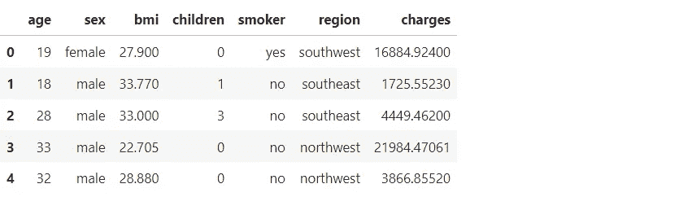

这个数据集是在 Kaggle 上找到的，可以通过这个[链接](https://www.kaggle.com/mirichoi0218/insurance)访问。数据集基于 Miri Choi 的医疗费用个人数据集。

下面描述了这些列和定义。

1.  年龄—投保人的年龄。
2.  性别—投保人的性别(女性、男性)。
3.  BMI——身体质量指数，提供对身体的了解，体重相对于身高的高低，体重的客观指数(kg / m ^ 2 ),使用身高与体重的比率，理想值为 18.5 至 25。
4.  子女——投保人的子女/受抚养人人数。
5.  吸烟者—投保人的吸烟状态(不吸烟者=否，吸烟者=是)。
6.  地区—投保人在美国的居住区(东北、西北、东南和西南)。
7.  费用—由健康保险支付的个人医疗费用(美元)。

显示有关数据列的信息。

```
insurance**.**info()<class 'pandas.core.frame.DataFrame'>
RangeIndex: 1338 entries, 0 to 1337
Data columns (total 7 columns):
 #   Column    Non-Null Count  Dtype  
---  ------    --------------  -----  
 0   age       1338 non-null   int64  
 1   sex       1338 non-null   object 
 2   bmi       1338 non-null   float64
 3   children  1338 non-null   int64  
 4   smoker    1338 non-null   object 
 5   region    1338 non-null   object 
 6   charges   1338 non-null   float64
dtypes: float64(2), int64(2), object(3)
memory usage: 73.3+ KB
```

总结:

*   有 1338 个保险记录，包含 7 个变量。
*   数据集没有任何空值或缺失值。
*   有分类和数字数据类型。

显示数据框的统计数据。

```
insurance**.**describe()
```


观察结果:

*   平均年龄 39 岁。
*   平均体重指数 30.66。
*   孩子的平均数量是 1。
*   平均索赔费用为 13，270 美元。

想象年龄和索赔费用之间的关系。

```
fig **=** plt**.**figure(figsize **=** (10, 6))
sns**.**barplot(y **=** 'charges', 
            x **=** 'age', 
            data **=** insurance,
            ci **=** **None**)

*# set labels*
plt**.**xlabel("Age", size**=**12)
plt**.**ylabel("Claim Charges ($)", size**=**12)
```

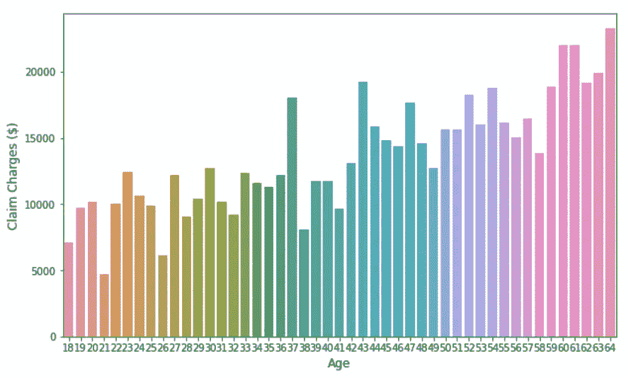

想象性别和索赔费用之间的关系。

```
fig **=** plt**.**figure(figsize **=** (6,4))
sns**.**barplot(y **=** 'charges', 
            x **=** 'sex', 
            data **=** insurance,
            ci **=** **None**)
plt**.**xticks(ticks**=**[0, 1], labels **=** ["Female", "Male"])

*# set labels*
plt**.**xlabel("Gender", size**=**12)
plt**.**ylabel("Claim Charges ($)", size**=**12)
```

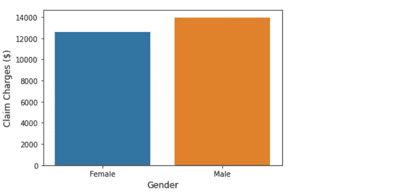

检查身体质量指数(身体质量指数)栏中的数值差异。

```
min(insurance**.**bmi), max(insurance**.**bmi)
(15.96, 53.13)
```

身体质量指数(身体质量指数)值有很大的差异。为了可视化此功能的数据，我们需要添加一个新的身体质量指数类变量，并创建具有特定身体质量指数值的组。

```
insurance["bmiclass"] **=** insurance**.**bmi
insurance**.**bmiclass **=** insurance**.**bmi**.**round()
insurance**.**head(5)insurance['bmiclass'] **=** insurance['bmiclass']**.**replace([16, 17, 18, 19, 20, 21], 1)
insurance['bmiclass'] **=** insurance['bmiclass']**.**replace([22, 23, 24, 25, 26, 27], 2)
insurance['bmiclass'] **=** insurance['bmiclass']**.**replace([28, 29, 30, 31, 32, 33], 3)
insurance['bmiclass'] **=** insurance['bmiclass']**.**replace([34, 35, 36, 37, 38, 39], 4)
insurance['bmiclass'] **=** insurance['bmiclass']**.**replace([40, 41, 42, 43, 44, 45], 5)
insurance['bmiclass'] **=** insurance['bmiclass']**.**replace([46, 47, 48, 49, 50, 51, 52, 53], 6)
insurance**.**head(5)
```

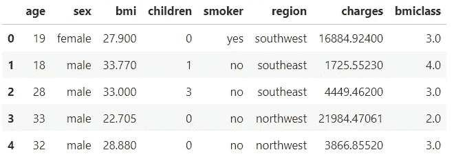

想象一下体重指数和索赔费用之间的关系。

```
fig **=** plt**.**figure(figsize **=** (6,4))
sns**.**barplot(y **=** 'charges', 
            x **=** 'bmiclass', 
            data **=** insurance,
            ci **=** **None**)
plt**.**xticks(ticks**=**[0, 1, 2, 3, 4, 5], labels **=** ["16 - 21", "22 - 27", "28 - 33", "34 - 39", "40 - 45", "46 - 53"]) 
*# set labels*

plt**.**xlabel("Body Mass Index", size**=**12)
plt**.**ylabel("Claim Charges ($)", size**=**12)
```

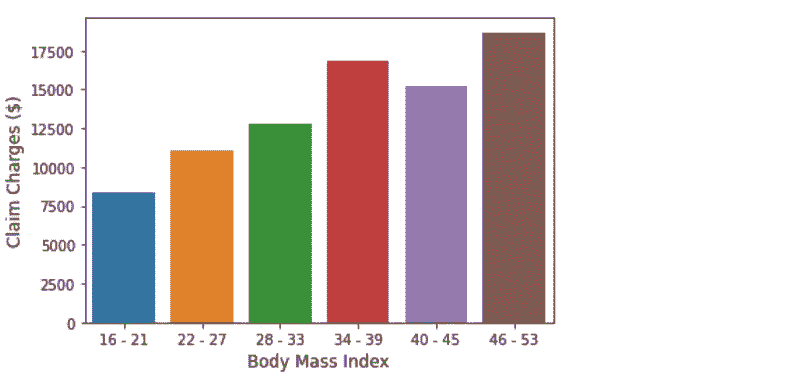

设想子女人数和索赔费用之间的关系。

```
fig **=** plt**.**figure(figsize **=** (6,4))
sns**.**barplot(y **=** 'charges', 
            x **=** 'children', 
            data **=** insurance,
            ci **=** **None**)

*# set labels*
plt**.**xlabel("Number of Children", size**=**12)
plt**.**ylabel("Claim Charges ($)", size**=**12)
```

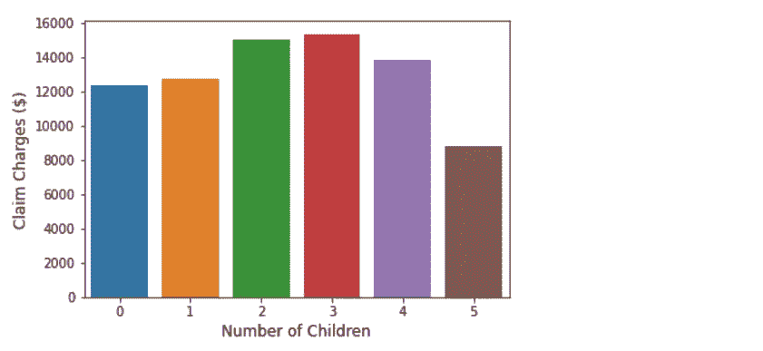

想象吸烟者/非吸烟者与索赔费用金额之间的关系。

```
fig **=** plt**.**figure(figsize **=** (6,4))
sns**.**barplot(y **=** 'charges', 
            x **=** 'smoker', 
            data **=** insurance,
            ci **=** **None**)

*# set labels*
plt**.**xlabel("Smoker", size**=**12)
plt**.**ylabel("Claim Charges ($)", size**=**12)
```

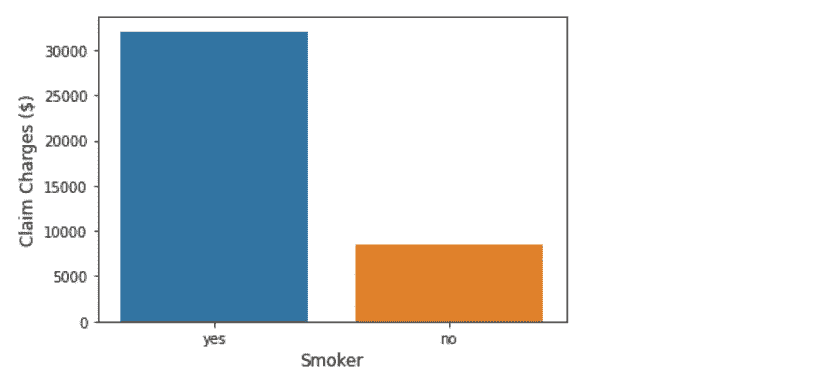

可视化地区和索赔费用金额之间的关系。

```
fig **=** plt**.**figure(figsize **=** (6,4))
sns**.**barplot(y **=** 'charges', 
            x **=** 'region', 
            data **=** insurance,
            ci **=** **None**)
plt**.**xticks(ticks**=**[0, 1, 2, 3], labels **=** ["Northeast", "Northwest", "Southeast", "Southwest"]) 

*# set labels*
plt**.**xlabel("Region", size**=**12)
plt**.**ylabel("Claim Charges ($)", size**=**12)
```

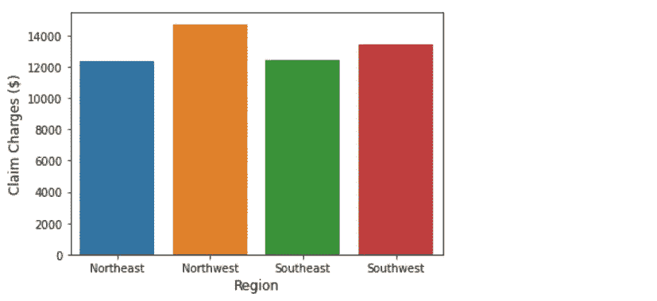

观察结果:

*   随着年龄的增长，索赔费用逐渐增加。
*   男性的索赔费用略高。
*   随着体重指数的增加，索赔费用也会增加。有趣的是，在 40-45 岁的身体质量指数群体中，索赔费用略有下降。
*   当保单下有 2 或 3 名子女时，索赔费用会更高。
*   吸烟者的索赔费用要高得多。
*   所有地区的索赔费用相似，西北航空公司的费用最高。

检查费用列中的值差异。

```
min(insurance**.**charges), max(insurance**.**charges)
(1121.8739, 63770.42801)
```

费用变量的值有很大的变化范围。

可视化索赔费用值的分布。

```
plt**.**figure(figsize**=**(6, 4))
sns**.**histplot(insurance['charges'])
```

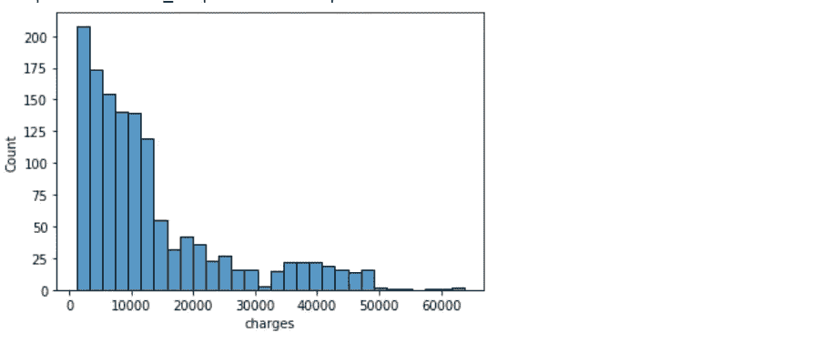

电荷值向轴的右侧倾斜。我们将在 sklearn 中使用最小和最大缩放来标准化电荷。这将把电荷的值转换到 0 和 1 之间的范围，这将使模型中的数据更容易处理。

```
column **=** 'charges'
insurance[column] **=** (insurance[column] **-** insurance[column]**.**min()) **/** (insurance[column]**.**max() **-** insurance[column]**.**min())
insurance**.**head()
```

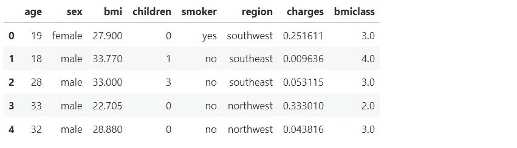

**功能选择**

我们需要将分类数据转换成数字数据。我们将使用一键编码进行转换。一种热门的编码技术是用二进制数字替换分类数据。转换后的列被赋予一个与这些值相对应的编号。

```
**from** sklearn **import** preprocessing
le **=** preprocessing**.**LabelEncoder()
insurance["sex"] **=** le**.**fit_transform(insurance["sex"])       *# 0 = female, 1 = male*
insurance["smoker"] **=** le**.**fit_transform(insurance["smoker"]) *# 1 = smoker, 2 = non-smoker*
insurance["region"] **=** le**.**fit_transform(insurance["region"]) *# 1 = northwest, 2 = southeast, 3 = southwest, 4 = northeast*
```

我们将使用皮尔逊相关法构建一个相关矩阵，用于测量特征和目标变量之间的线性关联。

```
plt**.**figure(figsize**=**(8,6))  
sns**.**heatmap(insurance**.**corr(), annot**=True**, fmt**=**'.0%', cmap**=**'Blues')
```

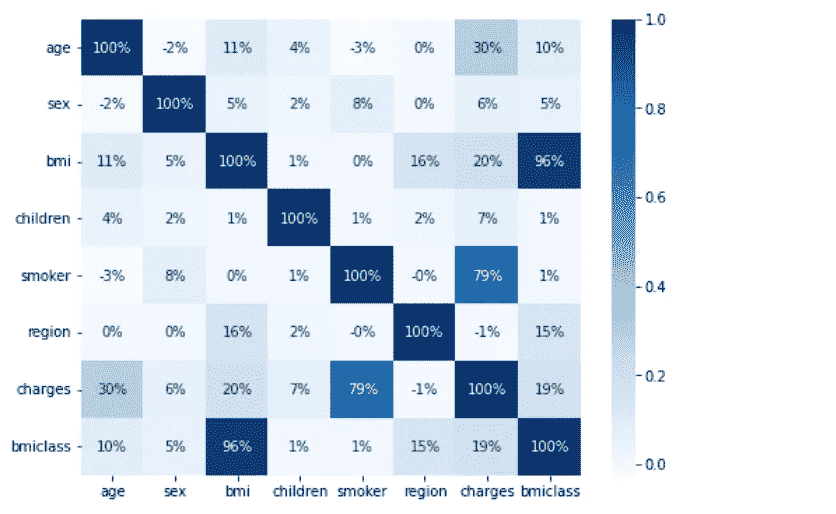

观察结果:

*   吸烟者和收费之间有很强的相关性。
*   年龄和费用之间的相关性很弱
*   身体质量指数和电荷之间的相关性很弱。

我们需要移除性别和区域特征，因为它们为该分析提供了极小的价值。我们还将删除身体质量指数类要素，因为身体质量指数已经出现在数据集中。

```
insurance**.**drop(['sex', 'region', 'bmiclass'], axis**=**1, inplace**=True**)
```

**将数据分成训练和测试数据集**

首先，我们需要将数据分为 x 值(我们将用来进行预测的数据)和 y 值(我们试图预测的数据)。

```
x_data **=** insurance**.**drop('charges', axis **=** 1)
y_data **=** insurance['charges']
```

我们将使用 train_test_split 函数来生成训练数据和测试数据。测试数据集将包括 25%的原始数据集。

```
x_training_data, x_test_data, y_training_data, y_test_data **=** train_test_split(x_data, y_data, test_size **=** 0.25, random_state**=**42)
```

**归一化数据**

我们需要对数据进行标准化，使其分布的平均值为 0，标准差为 1。规范化使要素之间更加一致，从而使模型能够更准确地预测输出。这是为数据集中的每个特征或列进行的。

```
sc **=** StandardScaler()
x_training_data **=** sc**.**fit_transform(x_training_data)
x_test_data **=** sc**.**fit_transform(x_test_data)
```

**我们现在将训练模型，进行预测，并评估三种不同机器学习模型的性能。**

我们将使用 R2 分数来评估基于回归的机器学习模型的性能。它也被称为决定系数。它通过测量数据集中的样本与模型所做预测之间的差异量来工作。

我们将使用均方根误差(RMSE)来衡量模型的性能。“根”表示平方误差是一种度量标准，它显示了模型的预测值与数据集中的实际值之间的平均距离。通过计算每个数据点的残差(预测值和真实值之间的差异)，计算每个数据点的残差的范数，计算残差的平均值，并取该平均值的平方根，可以找到 RMSE。该值越低，模型的性能越好。

**线性回归模型**

简单线性回归使用一个自变量来解释或预测因变量 Y 的结果，而多元线性回归使用两个或多个自变量来预测结果。当创建一个回归模型时，我们所要做的就是画一条最接近数据集中每一点的线。

我们将根据训练数据训练线性回归模型，并根据测试数据进行预测。

```
# Create model object.
model_lr **=** LinearRegression()
# Train the model on the training data.
model_lr**.**fit(x_training_data, y_training_data)
# Make predictions on the test data. 
predictions_lr **=** model_lr**.**predict(x_test_data)
```

使用测试数据计算线性回归模型的 R2 分数。

```
r2 = r2_score(y_test_data, predictions_lr)
print("R2 score :", r2)
```

R2 分数:0.76668636865

线性回归模型根据投保人的特征准确预测了 77%的保险索赔费用。

计算线性回归模型的均方根误差(RMSE)。

```
rmse **=** np**.**sqrt(np**.**mean(((predictions_lr **-** y_test_data)******2)))
print(rmse)
```

0.0949123371964687

RMSE 显示，线性回归模型的典型预测误差为 0.09，非常好。

**随机福里斯特模型**

随机福里斯特模型由大量单独的决策树组成，这些决策树作为一个整体运行。随机森林中的每棵树都会生成一个类别预测，拥有最多投票的类别将成为模型的预测。随机森林背后的基本思想是将许多决策树组合成一个模型。单独地，由决策树(或人类)做出的预测可能不准确，但是结合在一起，预测会准确得多。

我们将根据训练数据训练随机森林模型，并根据测试数据进行预测。

```
# Create model object. 
model_rf **=** RandomForestRegressor(n_estimators **=** 10, random_state **=** 0)
# Train the model on the training data.
model_rf**.**fit(x_training_data, y_training_data)
# Make predictions on the test data.
predictions_rf **=** model_rf**.**predict(x_test_data)
```

使用测试数据计算随机森林模型的 R2 分数。

```
# Calculate the R2 score.
r2 = r2_score(y_test_data, predictions_rf)
print("R2 Score :", r2)
```

R2 分数:0.82586888887

随机森林模型根据投保人的特征准确预测了 82%的保险索赔费用。

计算随机森林模型的均方根误差(RMSE)。

```
rmse **=** np**.**sqrt(np**.**mean(((predictions_rf **-** y_test_data)******2)))
print(rmse)
```

0.08277932950728627

RMSE 表明，随机森林模型的典型预测误差为 0.08，这是非常好的。

**支持向量机模型**

支持向量机(SVM)是有监督的机器学习模型，具有分析数据和识别模式的相关学习算法。支持向量机既可以用于分类问题，也可以用于回归问题。更具体地说，SVR 模型将数据点映射为空间中的点，并划分单独的类别，以便通过尽可能宽的开放间隙来划分它们。根据新数据点落入间隙的哪一侧，预测它们属于某个类别。

我们将在训练数据上训练支持向量机模型，并在测试数据上进行预测。

```
# Create model object. 
model_sv **=** SVR()
# Train the model on the training data.
model_sv**.**fit(x_training_data, y_training_data)
# Make predictions on the test data. 
predictions_sv **=** model_sv**.**predict(x_test_data)
```

使用测试数据计算支持向量机模型的 R2 分数。

```
r2 = r2_score(y_test_data, predictions_sv)
print("R2 Score :", r2)
```

R2 分数:0.73678676867

支持向量机模型根据投保人的特征准确预测了 74%的保险索赔费用。

计算支持向量机模型的均方根误差(RMSE)。

```
rmse **=** np**.**sqrt(np**.**mean(((predictions_sv **-** y_test_data)******2)))
print(rmse)
```

0.10006634144813659

RMSE 表明，支持向量机模型的典型预测误差为. 10，这是非常好的。

显示每个模型的准确度分数。

```
models **=** pd**.**DataFrame({
    'Model':['Linear Regression', 'Random Forrest', 'Support Vector Machine'],
    'Accuracy_score' :[lr, rf, sv]
})
models
sns**.**barplot(x**=**'Accuracy_score', y**=**'Model', data**=**models)

models**.**sort_values(by**=**'Accuracy_score', ascending**=False**)
```

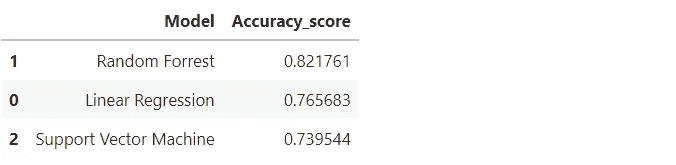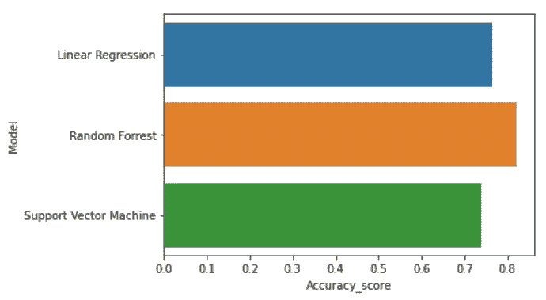

结论:所有的模型都很好地预测了基于投保人特征的保险索赔费用。随机森林模型的准确度最高。该模型正确预测了 82%的保险索赔费用。这个模型的典型预测误差也是 0.08。这项研究可以通过更大的保险数据集和调整模型的超参数来改进。

非常感谢你阅读我的文章！如果您有任何意见或反馈，请在下面添加。

如果你喜欢阅读这样的故事，并想支持我成为一名作家，可以考虑报名成为一名媒体成员。会员资格让你可以无限制地接触媒体上的故事。你可以使用此链接[https://medium.com/@dniggl/membership](https://medium.com/@dniggl/membership)注册