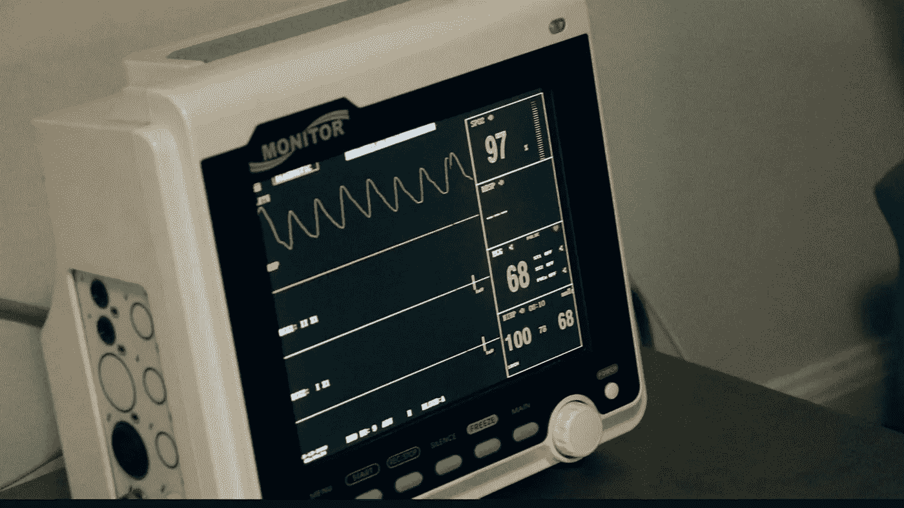
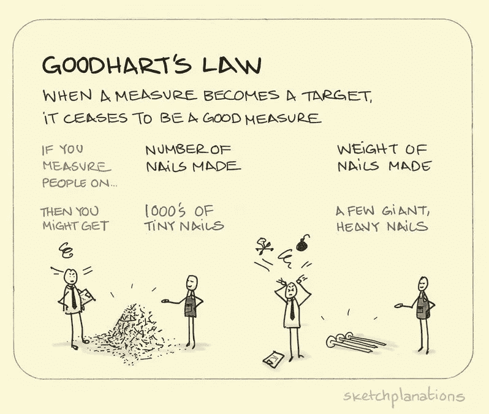

# 利用机器学习预测心脏病？不要！

> 原文：<https://pub.towardsai.net/predicting-heart-disease-using-machine-learning-dont-b5311faebcff?source=collection_archive---------1----------------------->

## [机器学习](https://towardsai.net/p/category/machine-learning)，[观点](https://towardsai.net/p/category/opinion)

来源: [Unsplash](https://unsplash.com/)

最近，我受邀担任一项数据科学竞赛的评委。学生们得到了“心脏病预测”数据集，这可能是 Kaggle 上的一个即兴版本。我以前见过这个数据集，经常遇到各种自称是数据科学大师的人在教天真的人如何通过机器学习来预测心脏病。

我相信“使用机器学习预测心脏病”是如何不将机器学习应用于问题的经典例子，特别是在需要大量领域经验的情况下。

让我来解开将机器学习应用于这个数据集的各种问题。

## 直接进入问题综合症

嗯，这是很多人犯的第一个错误。直接跳入问题，思考应用哪种机器学习算法。将 EDA 作为这个过程的一部分并不是“思考”这个问题。相反，这表明你已经接受了这个问题需要数据科学解决方案的观念。相反，在开始任何分析之前，需要问的一个相关问题是，“这个问题甚至可以通过机器学习的应用来预测吗？”。

## 盲目相信数据

这是第一点的延伸。直入问题意味着你盲目相信数据。人们假设数据是真实的，而不去仔细检查数据。例如，数据集只提供收缩压。如果你和任何医生甚至护理人员交谈，他们会告诉你仅仅收缩压并不能给出全面的情况。心脏舒张水平的报告也很重要。许多人甚至不会问这样的问题，“这些特性足以预测结果吗，或者还需要更多的特性。”

## 每位患者的数据不足

我们来看看上面的数据集。如果您注意到，一个患者的每个特征下只有一个数据点。这里的根本问题是血压、胆固醇、心跳等特征不是静态的。他们范围很广。一个人的血压每小时都在变化，每天都在变化，心跳也是如此。因此，当谈到预测问题时，没有人知道 135 毫米汞柱的血压是导致心脏病的因素之一还是 140 毫米汞柱，而数据集可能报告的是 130 毫米汞柱。理想情况下，需要对患者的每个特征进行多次测量。

> 现在让我们来看问题的关键

## 在没有领域经验的情况下应用算法

医疗保健中数据科学应用失败率高的一个原因是，应用算法的数据科学家没有足够的医学知识。

其次，在医疗保健领域，因果关系是非常重要的。进行了许多严格的临床和统计测试来推断因果关系。

在案例研究中，任何机器学习算法都只是试图将输入映射到输出，同时减少一些错误度量。此外，机器学习算法本身不是分类器。我们通过设置一些截止值或阈值使它们成为分类器。**同样，这个截止点不是决定推导因果关系**，而是获得“有利的度量”

加重这个问题的是低代码库的使用。这个案例研究是一个案例点的例子，说明为什么低代码库可能是危险的。低级代码库适合十几种甚至更多的算法。大多数人甚至不知道这些算法是如何工作的！他们根据 F1、精确度、召回率和准确度等指标挑选“最佳”算法。

专注于准确性度量的低代码库导致了‘古德哈特定律’——‘当一个度量成为目标时，它就不再是一个好的度量。’

演职员表:[草图解说](https://sketchplanations.com/goodharts-law)

如果你在预测，你在暗示因果关系。在医疗保健领域，仅仅预测是不够的。人们需要证明因果关系。机器学习分类器算法没有回答“因果关系”部分。

## 相信他们解决了一个真正的医疗保健问题

最后但并非最不重要的一点是，许多人认为，通过将 ML 算法拟合到*healthcare*数据集并获得一些准确性指标，他们已经解决了一个真正的医疗保健问题。没有什么比这更偏离事实了，尤其是在医疗保健领域。

## 总之:

也许有成千上万的商业问题真正需要数据科学/机器学习解决方案。但同时，一个人不应该陷入“对一个拿着锤子的人来说，一切看起来都像钉子”的陷阱把什么都看成钉子(数据科学问题)和机器学习算法(锤子)可能会适得其反。应用于商业问题的数据科学中 80%的失败率可以归因于此。

好的数据科学家就像好的医生。好医生建议在开大剂量药物或手术之前先进行保守治疗。类似地，一个优秀的数据科学家在盲目地将一打 ML 算法应用于问题之前，应该先问一些相关的问题。

医生:外科::数据科学家:机器学习

欢迎您的评论和意见。

你可以联系我

[领英](http://www.linkedin.com/in/venkat-raman-Analytics)

[推特](https://twitter.com/venksaiyan)