# 用机器学习模型预测心力衰竭存活率——第一部分

> 原文：<https://pub.towardsai.net/predicting-heart-failure-survival-with-machine-learning-models-part-i-7ff1ab58cff8?source=collection_archive---------0----------------------->

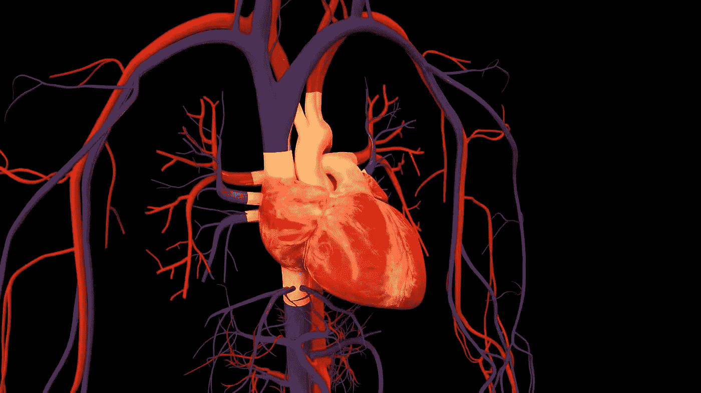

来源:[壁纸洞穴](https://wallpapercave.com/w/wp2314623)

## [数据科学](https://towardsai.net/p/category/data-science)，[机器学习](https://towardsai.net/p/category/machine-learning)

## 一步一步的 pythonic 式的生存数据分析，以及领域级的解释。

# 前言

心血管疾病是心脏和血管的疾病，通常包括心脏病发作、中风和心力衰竭[1]。根据世界卫生组织(世卫组织)的数据，在过去的十五年里，缺血性心脏病和中风等心血管疾病已经成为全球范围内的主要死亡原因[2]。

# 动机

几个月前，一个新的心力衰竭数据集被上传到 [Kaggle](https://www.kaggle.com/andrewmvd/heart-failure-clinical-data) 上。该数据集包含 299 名匿名患者的健康记录，有 12 个临床和生活方式特征。任务是使用这些特征来预测心力衰竭。

通过这篇文章，我的目标是记录我在这个任务上的工作流程，并把它作为一个研究练习来展示。因此，这自然会涉及一些领域知识，参考期刊论文，并从中获得见解。

*警告:这篇文章将近 10 分钟长，当你向下滚动时，内容可能会变得有点密集，但我鼓励你尝试一下。*

# 关于数据

该数据集最初由 Ahmed 等人在 2017 年发布[3]，作为对他们在巴基斯坦费萨拉巴德心脏病研究所和联合医院的心力衰竭患者存活率分析的补充。Chicco 和 Jurman 随后在 2020 年访问并分析了该数据集，以使用一系列机器学习技术预测心力衰竭[4]。Kaggle 上的数据集引用了这些作者和他们的研究论文。

数据集主要由 105 名女性和 194 名男性心力衰竭患者的临床和生活方式特征组成。您可以在下图中找到每个功能的解释。

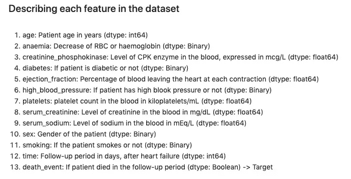

图 1-数据集中 299 名患者的临床和生活方式特征(作者)

# 项目工作流程

工作流程会非常简单——

1.  **数据预处理—** 清理数据、输入缺失值、根据需要创建新特征等。
2.  **探索性数据分析—** 这将涉及汇总统计、绘制关系、绘制趋势等。
3.  **模型构建—** 构建基线预测模型，之后至少 2 个分类模型进行训练和测试。
4.  **超参数调整—** 微调每个模型的超参数，以达到可接受的预测指标水平。
5.  **整合结果—** 以清晰简洁的方式展示相关调查结果。

*整个项目可以在我的*[*GitHub*](https://github.com/ani-rudra-chan/Heart-Failure-Survival-Project.git)*资源库中作为 Jupyter 笔记本找到。*

## 让我们开始吧！

# 数据预处理

让我们看看报纸。csv 文件转换成数据帧—

```
df = pd.read_csv('heart_failure_clinical_records_dataset.csv')
```

`df.info()`是一种快速获取 dataframe 数据类型摘要的方法。我们看到数据集没有丢失或虚假的值，并且足够干净，可以开始数据探索。

```
<class 'pandas.core.frame.DataFrame'>
RangeIndex: 299 entries, 0 to 298
Data columns (total 13 columns):
 #   Column                    Non-Null Count  Dtype  
---  ------                    --------------  -----  
 0   age                       299 non-null    float64
 1   anaemia                   299 non-null    int64  
 2   creatinine_phosphokinase  299 non-null    int64  
 3   diabetes                  299 non-null    int64  
 4   ejection_fraction         299 non-null    int64  
 5   high_blood_pressure       299 non-null    int64  
 6   platelets                 299 non-null    float64
 7   serum_creatinine          299 non-null    float64
 8   serum_sodium              299 non-null    int64  
 9   sex                       299 non-null    int64  
 10  smoking                   299 non-null    int64  
 11  time                      299 non-null    int64  
 12  DEATH_EVENT               299 non-null    int64  
dtypes: float64(3), int64(10)
memory usage: 30.5 KB
```

但在此之前，让我们重新排列和重命名一些特性，添加另一个名为`chk`(稍后在 EDA 中会有用的*)的特性，并用标签替换分类特性中的二进制值(再次使用*，在 EDA* 中会有用)。*

```
df = df.rename(columns={'smoking':'smk',
                        'diabetes':'dia',
                        'anaemia':'anm',
                        'platelets':'plt',
                        'high_blood_pressure':'hbp',
                        'creatinine_phosphokinase':'cpk',
                        'ejection_fraction':'ejf',
                        'serum_creatinine':'scr',
                        'serum_sodium':'sna',
                        'DEATH_EVENT':'death'})df['chk'] = 1df['sex'] = df['sex'].apply(lambda x: 'Female' if x==0 else 'Male')
df['smk'] = df['smk'].apply(lambda x: 'No' if x==0 else 'Yes')
df['dia'] = df['dia'].apply(lambda x: 'No' if x==0 else 'Yes')
df['anm'] = df['anm'].apply(lambda x: 'No' if x==0 else 'Yes')
df['hbp'] = df['hbp'].apply(lambda x: 'No' if x==0 else 'Yes')
df['death'] = df['death'].apply(lambda x: 'No' if x==0 else 'Yes')df.info()<class 'pandas.core.frame.DataFrame'>
RangeIndex: 299 entries, 0 to 298
Data columns (total 14 columns):
 #   Column  Non-Null Count  Dtype  
---  ------  --------------  -----  
 0   sex     299 non-null    object 
 1   age     299 non-null    float64
 2   smk     299 non-null    object 
 3   dia     299 non-null    object 
 4   hbp     299 non-null    object 
 5   anm     299 non-null    object 
 6   plt     299 non-null    float64
 7   ejf     299 non-null    int64  
 8   cpk     299 non-null    int64  
 9   scr     299 non-null    float64
 10  sna     299 non-null    int64  
 11  time    299 non-null    int64  
 12  death   299 non-null    object 
 13  chk     299 non-null    int64  
dtypes: float64(3), int64(5), object(6)
memory usage: 32.8+ KB
```

我们观察到，`sex`、`dia`、`anm`、`hbp`、`smk`和`death`是类别特征(*宾语*)，而`age`、`plt`、`cpk`、`ejf`、`scr`、`time`和`sna`是数值特征( *int64 或 float64* )。除了`death`之外的所有特征都将是潜在的预测器，而`death`将是我们的预期 ML 模型的目标。

# 探索性数据分析

## A.数字特征的汇总统计

由于我们的数据集有许多数字特征，借助于`df.describe()` ( *通常，这种方法给出最多 6 位小数的值，因此最好通过* `df.describe().round(2)` *)* 将其四舍五入为两位，这将有助于查看手头数据的一些聚合度量

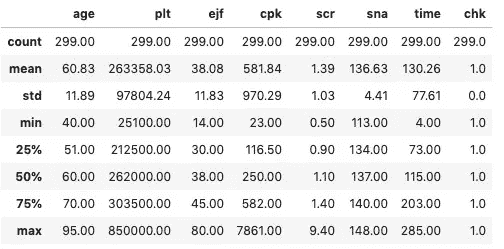

*   **年龄**:我们可以看到患者的平均年龄是 60 岁，大多数患者(< 75%)在 70 岁以下，40 岁以上。他们心力衰竭后的随访时间也从 4 天到 285 天不等，平均为 130 天。
*   **血小板** : *这是一种负责修复受损血管的血细胞。*正常人的血小板计数为 150，000–400，000 千血小板/毫升血液[5]。**在我们的数据集中，75%的患者的血小板计数都在这个范围内。**
*   **射血分数** : *这是对每次收缩中从心室中泵出的血液量的度量(单位为%)。复习一下人体解剖学——心脏有 4 个腔室，其中心房接收来自身体不同部位的血液，心室将血液泵回心脏。左心室是最厚的腔室，将血液泵送到身体的其他部位，而右心室将血液泵送到肺部。*在健康成人中，该分数为 55%，射血分数降低的心力衰竭意味着该值为<40%【6】。在我们的数据集中， **75%的患者具有该值< 45%** ，这是意料之中的，因为他们首先都是心力衰竭患者。
*   **肌酸酐磷酸激酶** : *这是一种存在于血液中的酶，有助于修复受损组织。高水平的 CPK 意味着心力衰竭或损伤。*男性的正常水平为 55–170 微克/升，女性为 30–135 微克/升【7】。在我们的数据集中，由于所有患者都患有心力衰竭，**平均值(550 mcg/L)和中位数(250 mcg/L)都高于正常值。**
*   **血清肌酸酐** : *这是肌肉新陈代谢的一部分产生的废物，尤其是在肌肉分解过程中。这种肌酐被肾脏过滤，升高的水平表明心输出量不良和可能的肾衰竭*【8】。正常水平在 0.84 到 1.21 毫克/分升之间[9]，在我们的数据集中，平均值和中值都在 1.10 毫克/分升以上，这**非常接近正常范围的上限**。
*   **血清钠** : *这是指血液中的钠水平，135 mEq/L 的高水平被称为高钠血症，这被认为是心力衰竭患者的典型症状* [10]。在我们的数据集中，我们发现平均值和中位数是 **> 135 mEq/L** 。

直观显示这些统计数据的一个简洁方法是使用`boxenplot`来显示数值的分布和分布(*中间的线是中值，末端的菱形是异常值*)。

```
fig,ax = plt.subplots(3,2,figsize=[10,10])
num_features_set1 = ['age', 'scr', 'sna']
num_features_set2 = ['plt', 'ejf', 'cpk']
for i in range(0,3):
    sns.boxenplot(df[num_features_set1[i]], ax=ax[i,0], color='steelblue')
    sns.boxenplot(df[num_features_set2[i]], ax=ax[i,1], color='steelblue')
```

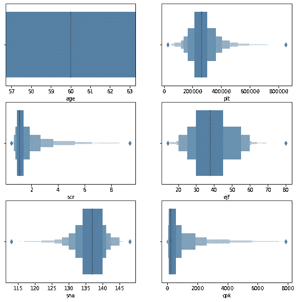

图 2 —显示数据集数字特征的汇总统计数据

## B.分类特征的汇总统计

属于每个生活方式分类特征的患者数量可以用一个简单的`bar plot`进行总结。

```
fig = plt.subplots(figsize=[10,6])bar1 = df.smk.value_counts().values
bar2 = df.hbp.value_counts().values
bar3 = df.dia.value_counts().values
bar4 = df.anm.value_counts().values
ticks = np.arange(0,3, 2)
width = 0.3
plt.bar(ticks, bar1, width=width, color='teal', label='smoker')
plt.bar(ticks+width, bar2, width=width, color='darkorange', label='high blood pressure')
plt.bar(ticks+2*width, bar3, width=width, color='limegreen', label='diabetes')
plt.bar(ticks+3*width, bar4, width=width, color='tomato', label='anaemic')plt.xticks(ticks+1.5*width, ['Yes', 'No'])
plt.ylabel('Number of patients')
plt.legend()
```

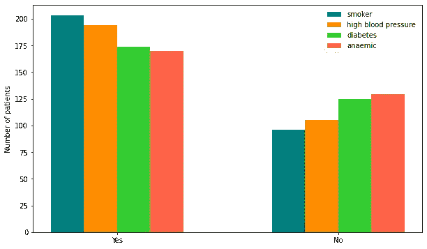

图 3——每种生活方式分类特征的患者总数

使用 pandas 中的`crosstab`功能可以生成额外的摘要。显示了分类特征`smk`的示例。结果可以根据吸烟者总数(*“指数”*)或死亡总数(*“列”*)进行标准化。因为我们的兴趣是预测生存，我们对死亡标准化。

```
pd.crosstab(index=df['smk'], columns=df['death'], values=df['chk'], aggfunc=np.sum, margins=True)pd.crosstab(index=df['smk'], columns=df['death'], values=df['chk'], aggfunc=np.sum, margins=True, normalize='columns').round(2)*100
```

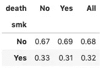

我们看到 68%的心力衰竭患者不吸烟，而 32%的患者吸烟。在死亡的人中，69%不吸烟，31%吸烟。在**幸存**的人中，67%不吸烟，33%吸烟。在这一点上，很难说吸烟的心力衰竭患者有更大的死亡机会。

以类似的方式，让我们总结其余的分类特征，并对死亡结果进行标准化。

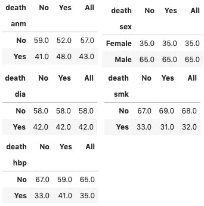

*   65%的男性和 35%的女性心脏病患者死亡。
*   48%死亡的患者贫血，而 41%存活的患者也贫血。
*   42%死亡的患者和 42%存活的患者是糖尿病患者。
*   31%的死者是吸烟者，而 33%的幸存者是吸烟者。
*   41%的死亡者患有高血压，而 33%的幸存者也患有高血压。

基于这些统计数据，我们得到了一个粗略的想法，即那些死去的人和幸存的人的生活方式特征分布几乎相似。这种差异在高血压的情况下最大，这可能对心脏病患者的生存有更大的影响。

## C.探索数字特征之间的关系

下一步是可视化特征之间的关系。我们从数字特征开始，编写一行代码，使用 seaborn 的`pairplot`绘制成对的特征图

```
sns.pairplot(df[['plt', 'ejf', 'cpk', 'scr', 'sna', 'death']], 
             hue='death', palette='husl', corner=True)
```

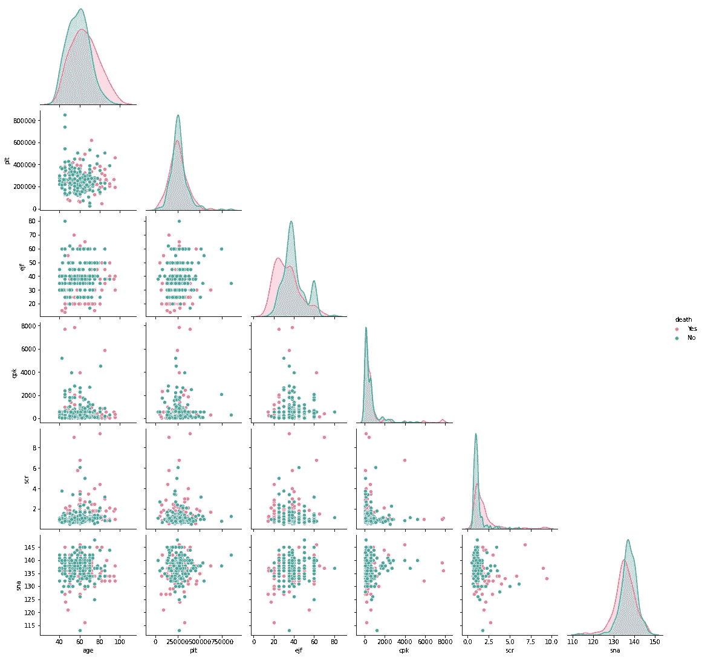

图 4-数据集中数值特征之间的成对散点图

我们观察到一些有趣的现象—

*   大多数死于心力衰竭的患者的射血分数似乎比幸存的患者低。他们的血清肌酐和肌酸磷酸激酶水平似乎也略高。他们也倾向于 80 岁以上。
*   特征之间没有强相关性，这可以通过计算 Spearman R 相关系数来验证(*我们考虑 Spearman，因为我们不确定从中提取特征值的总体分布*)。

```
df[['plt', 'ejf', 'cpk', 'scr', 'sna']].corr(method='spearman')
```

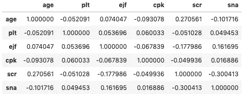

*   正如所观察到的，对于**年龄-血清肌酐**和**血清肌酐-血清钠**，相关系数为**适度鼓励**。从文献中，我们看到随着年龄的增长，血清肌酐含量增加[11]，这解释了它们的**略呈正相关**。文献还告诉我们[12]，在慢性肾脏疾病的情况下，钠与血清肌酐的比率较高，这意味着两者之间存在**负相关**。轻微的负相关系数也暗示了患者中肾脏问题的患病率。

## D.探索分类特征之间的关系

关联分类特征的一种方法是创建一个数据透视表，并以特征的子集为中心。这将为我们提供特定特征值子集的值的数量。对于这个数据集，让我们来看看生活方式的特征——吸烟、贫血、高血压和糖尿病。

```
lifestyle_surv = pd.pivot_table(df.loc[df.death=='No'], 
                                values='chk', 
                                columns=['hbp','dia'], 
                                index=['smk','anm'], 
                                aggfunc=np.sum)lifestyle_dead = pd.pivot_table(df.loc[df.death=='Yes'], 
                                values='chk', 
                                columns=['hbp','dia'], 
                                index=['smk','anm'], 
                                aggfunc=np.sum)fig, ax= plt.subplots(1, 2, figsize=[15,6])
sns.heatmap(lifestyle_surv, cmap='Greens', annot=True, ax=ax[0])
ax[0].set_title('Survivors')
sns.heatmap(lifestyle_dead, cmap='Reds', annot=True, ax=ax[1])
ax[1].set_title('Deceased')
```

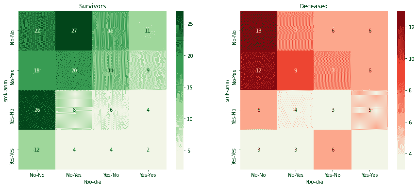

图 5—每个生活方式特征子集的患者数量热图

可以得出一些见解——

*   许多患者不吸烟，不贫血，也没有高血压或糖尿病。
*   很少有患者同时具备这四种生活方式。
*   许多幸存者要么只是吸烟者，要么只是糖尿病患者。
*   大多数死者没有生活方式的特征，或者最多是贫血。
*   许多死者患有贫血和糖尿病。

## E.探索所有功能之间的关系

将分类特征和数字特征组合成一个图的简单方法是绕过分类特征作为`hue`输入。在这种情况下，我们使用二元`death`特性并绘制 violin-plots 来可视化所有特性之间的关系。

```
fig,ax = plt.subplots(6, 5, figsize=[20,22])
cat_features = ['sex','smk','anm', 'dia', 'hbp']
num_features = ['age', 'scr', 'sna', 'plt', 'ejf', 'cpk']
for i in range(0,6):
    for j in range(0,5):
        sns.violinplot(data=df, x=cat_features[j],y=num_features[i], hue='death', split=True, palette='husl',facet_kws={'despine':False}, ax=ax[i,j])
        ax[i,j].legend(title='death', loc='upper center')
```

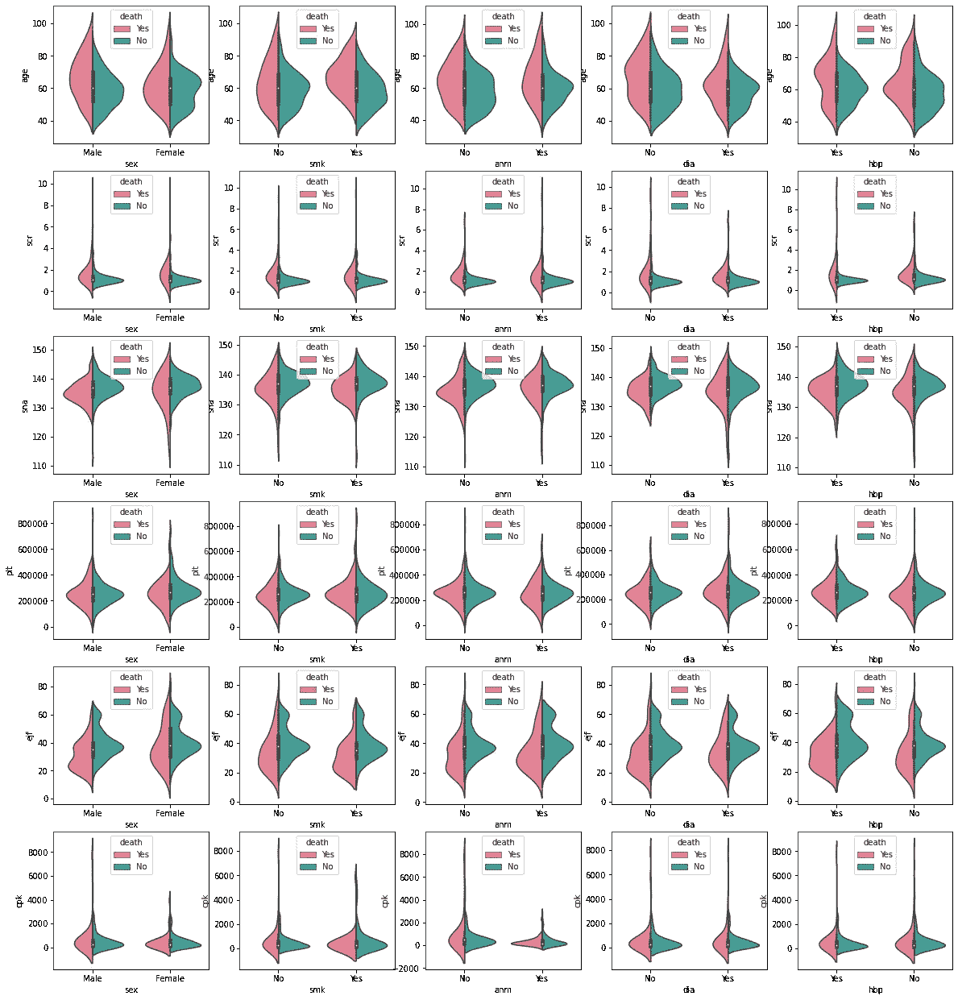

图 6-用于关联数据集中的数字和分类特征的紫线图

这是从这些图中得到的一些见解—

*   **性别**:死亡患者中，男性射血分数似乎低于女性。此外，肌酸酐磷酸激酶在男性中似乎高于女性。
*   **吸烟**:死亡的吸烟者的射血分数略低于死亡的非吸烟者。存活的吸烟者的肌酸酐磷酸激酶水平似乎高于存活的非吸烟者。
*   **贫血**:与非贫血患者相比，贫血患者往往具有较低的肌酸酐磷酸激酶水平和较高的血清肌酸酐水平。在贫血患者中，死亡患者的射血分数低于存活者。
*   **糖尿病**:糖尿病患者往往钠水平较低，同样，死亡患者的射血分数低于存活者。
*   **高血压**:高血压死亡患者的射血分数似乎比无高血压死亡患者的射血分数变化更大。

*我希望你觉得这有用。构建 ML 模型、调整超参数以及整合结果的步骤将在下一篇文章中展示。*

*再见！*

# 参考

*【1】*[*https://www . who . int/心血管 _ 疾病/world-heart-day/en/*](https://www.who.int/cardiovascular_diseases/world-heart-day/en/)

*【2】*[*https://www . who . int/gho/mortality _ burden _ disease/causes _ death/top _ 10/en/*](https://www.who.int/gho/mortality_burden_disease/causes_death/top_10/en/)

*[3] Ahmad T，Munir A，Bhatti SH，Aftab M，Ali Raza M .心力衰竭患者的生存分析:案例研究。数据集。*[【https://plos.figshare.com/】](https://plos.figshare.com/)*文章/生存 _ 分析 _ 心力衰竭 _ 患者 _ 病例 _ 研究/ 5227684/1。*

*[4] Chicco 和 Jurman，BMC 医学信息学和决策(2020) 20:16*

*【5】*[*https://www . Hopkins medicine . org/heart _ vascular _ institute/centers _ Excellence/women _ cardio vascular _ health _ center/patient _ information/health _ topics/platelets . html*](https://www.hopkinsmedicine.org/heart_vascular_institute/centers_excellence/women_cardiovascular_health_center/patient_information/health_topics/platelets.html)

*【6】*[*https://www . uw health . org/health/topic/special/heart-failure-with-reduced-ejection-fraction-systolic-heart-failure/tx 4090 ABC . html #:~:text = A % 20 normal % 20 ejection % 20 fraction % 20 is，fraction % 20 is % 2040% 25% 20 or % 20 less。*](https://www.uwhealth.org/health/topic/special/heart-failure-with-reduced-ejection-fraction-systolic-heart-failure/tx4090abc.html#:~:text=A%20normal%20ejection%20fraction%20is,fraction%20is%2040%25%20or%20less.)

*【7】*[*https://www . labpedia . net/肌酸激酶-CK-肌酸磷酸激酶-cpk/*](https://www.labpedia.net/creatine-kinase-ck-creatine-phosphokinase-cpk/)

*[*https://www . online jcf . com/article/s 1071-9164(02)25410-X/full text #:~:text = We % 20 相信% 20 更多% 20 可能，容忍% 20 住院% 20 心脏% 20 衰竭% 20 治疗。*](https://www.onlinejcf.com/article/S1071-9164(02)25410-X/fulltext#:~:text=We%20believe%20the%20more%20likely,tolerate%20inpatient%20heart%20failure%20treatment.)*

**【9】*[*https://www . mayo clinic . org/tests-procedures/肌酐-test/about/PAC-20384646 #:~:text = Results % 20 of % 20 the % 20 肌酐% 20 血液，以及% 20 women % 2C % 20 和%20by%20age。*](https://www.mayoclinic.org/tests-procedures/creatinine-test/about/pac-20384646#:~:text=Results%20of%20the%20creatinine%20blood,and%20women%2C%20and%20by%20age.)*

**【10】Abebe TB，Gebreyohannes EA，Tefera YG，Bhagavathula AS，Erku DA，Belachew SA 等(2018)心力衰竭患者的预后:钠水平是否起显著作用？《公共科学图书馆综合》第 13 卷第 11 期:e0207242**

**【11】条 JY，塞门斯 JB，小马萨瑞，劳伦斯-布朗 MM。老龄化人口中年龄对血清肌酐水平的影响:与血管外科手术的相关性。心血管外科 2002；10(5):445–451.doi:10.1016/s 0967–2109(02)00056-x**

*[https://doi.org/10.1161/HYPERTENSIONAHA.113.03093](https://doi.org/10.1161/HYPERTENSIONAHA.113.03093)*