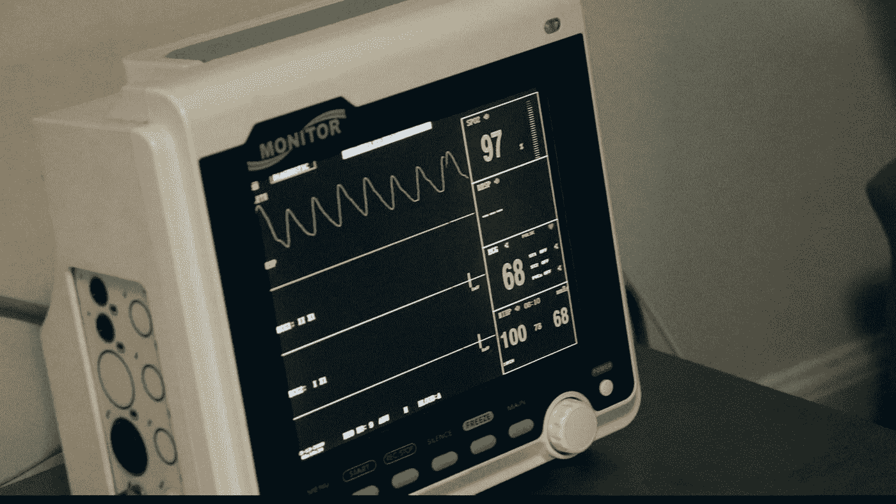
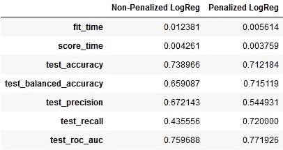
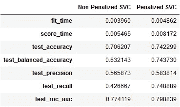

# 用机器学习模型预测心力衰竭存活率——第二部分

> 原文：<https://pub.towardsai.net/predicting-heart-failure-survival-with-machine-learning-models-part-ii-15f92db2ce1f?source=collection_archive---------1----------------------->



Jair Lázaro 在 [Unsplash](https://unsplash.com?utm_source=medium&utm_medium=referral) 上的照片

## 第二部分分步走查来分析和预测心力衰竭患者的生存率。

# 前言

在之前的[帖子](https://medium.com/towards-artificial-intelligence/predicting-heart-failure-survival-with-machine-learning-models-part-i-7ff1ab58cff8)中，我们查看了 299 名患者的心力衰竭数据集，其中包括一些生活方式和临床特征。那篇文章致力于探索性的数据分析，而这篇文章则致力于构建预测模型。

# 动机

激励人心的问题是——*‘心力衰竭患者存活的机会有多大？’。通过这次演练，我试图回答这个问题，同时给出一些关于处理不平衡数据集的见解。*

*这个项目的代码可以在我的*[*GitHub*](https://github.com/ani-rudra-chan/Heart-Failure-Survival-Project.git)*资源库中找到。*

# 快速回顾

在之前的帖子中，我们看到—

*   年龄与血清肌酐略有正相关，而血清钠与血清肌酐略有负相关。
*   大多数死亡的患者没有并发症，或者至多患有贫血或糖尿病。
*   死亡患者的射血分数似乎低于存活患者。
*   死亡患者的肌酐磷酸激酶水平似乎高于存活患者。

*(查看之前的* [*帖子*](https://medium.com/towards-artificial-intelligence/predicting-heart-failure-survival-with-machine-learning-models-part-i-7ff1ab58cff8) *以获得所用术语的入门知识)*

# 概述

1.  处理阶级不平衡
2.  选择机器学习模型
3.  绩效衡量
4.  数据准备
5.  分层 k 倍交叉验证
6.  模型结构
7.  巩固成果

# 1.处理阶级不平衡


Christophe Hautier 在 [Unsplash](https://unsplash.com?utm_source=medium&utm_medium=referral) 上拍摄的照片

在戴上我们的安全帽之前，让我们快速地看一下目标职业的平衡。我们查看原始数据集中死者和幸存者的比例。

```
print('% of heart failure patients who died = {}'.format(df.death.value_counts(normalize=True)[1]))
print('% of heart failure patients who survived = {}'.format(df.death.value_counts(normalize=True)[0]))% of heart failure patients who died = 0.3210702341137124
% of heart failure patients who survived = 0.6789297658862876
```

我们看到 32%的患者死亡，而 68%的患者存活。这显然是一个不平衡的数据集！。在这种情况下，无论我们选择哪种模式，都必须考虑这种不平衡。

处理不平衡数据在现实世界中很常见，这些由[德国 Lahera](https://medium.com/u/188db6757ee?source=post_page-----15f92db2ce1f--------------------------------) 和 [DataCamp](https://www.datacamp.com/community/tutorials/diving-deep-imbalanced-data?utm_source=adwords_ppc&utm_campaignid=1455363063&utm_adgroupid=65083631748&utm_device=c&utm_keyword=&utm_matchtype=b&utm_network=g&utm_adpostion=&utm_creative=332602034364&utm_targetid=dsa-429603003980&utm_loc_interest_ms=&utm_loc_physical_ms=9300858&gclid=Cj0KCQjw7ZL6BRCmARIsAH6XFDLT64HZpoAKxUUiFfYmcTOZIPQrFWafF_WdPCsxtg7wy6LN2S3lC3UaAn8QEALw_wcB) 撰写的[文章](https://medium.com/strands-tech-corner/unbalanced-datasets-what-to-do-144e0552d9cd)是了解它们的好地方。

解决这个问题的技术概述是这样的— **您可以为少数类(比例较小的类)的错误分类分配一个惩罚，通过这样做，允许算法学习这个惩罚。另一种方法是使用采样技术:要么对多数类进行下采样，要么对少数类进行过采样，或者两者都进行** [1]。

在我们的练习中，我们将尝试通过以下方式来处理这种不平衡—

1.  使用**分层 k-fold 交叉验证**技术来确保我们的模型的总指标不会过于乐观(意思是:好得难以置信！)并反映训练和测试数据中固有的不平衡；
2.  使用带有简单加权方案的**惩罚模型**(而不是 SMOTE 之类的采样技术)，该简单加权方案是类频率的倒数。

通过遵循这些步骤，我们将观察不平衡对模型预测的影响，并尝试得出一些见解！

# 2.选择机器学习模型


照片由[丹妮卡·坦尤科](https://unsplash.com/@danidums?utm_source=medium&utm_medium=referral)在 [Unsplash](https://unsplash.com?utm_source=medium&utm_medium=referral) 上拍摄

在这篇文章中，我们将考虑手头的问题是一个**监督分类问题**并且看两个基本的线性模型——

1.  **逻辑回归(LogReg)**
2.  **支持向量机(SVM)**

我们坚持使用这些工具，因为它们有一些巧妙的技巧来处理不平衡的目标标签，并且易于理解。随意尝试其他算法，如*随机森林、***【神经网络】*等。在监督模型和*k-最近邻*、 *DBSCAN、*等中。，在无监督的模型中。*

# *3.绩效衡量*

**

*查尔斯·德鲁维奥在 [Unsplash](https://unsplash.com?utm_source=medium&utm_medium=referral) 上拍摄的照片*

*任何预测模型都必须通过某些预测指标来评估其性能。在此之前，让我们先定义我们的案例类型—*

1.  ***真阳性(TP)** :模型预测死亡，患者死亡时；*
2.  ***真阴性(TN)** :模型预测存活且患者存活时；*
3.  ***假阳性(FP)** :模型预测死亡但患者存活；*
4.  ***假阴性(FN)** :模型预测存活，但患者死亡。*

*使用这些案例类型，我们定义了以下 5 个预测指标—*

1.  ***回忆**:这也称为*真阳性率*或模型对真阳性的*敏感度*。它被计算为 *TP/(TP + FN)。**
2.  ***Precision** :这是模型预测的真阳性有多精确的度量。它被计算为 *TP/(TP+FP)。**
3.  ***准确性:**这是模型整体性能的综合度量，计算方式为 *(TP+TN)/(TP+TN+FP+FN)。**
4.  ***平衡精度**:这是模型对每个类别进行分类的能力的综合度量。它是敏感性(TPR)和特异性(TNR)的平均值，给出为(TPR + TNR)/2。*
5.  ***ROC AUC** :这是由不同预测阈值的真阳性率和假阳性率生成的受试者工作特征曲线(ROC)下的面积。对于随机预测值，这个值是 0.5，我们的模型必须比这个值更好。*

*定义了这些指标之后，重要的是概述我们期望我们的模型具有的性能。我们期望预测模型有—*

1.  ***高召回** —模型必须能够预测尽可能多的死亡；*
2.  ***高精度** —模型预测的死亡人数必须精确，即尽可能与观察到的死亡人数相匹配；*
3.  ***高平衡精度** —该模型必须能够同样好地预测死亡和存活，即该模型必须对尽可能多的死亡敏感，同时对死亡和存活的预测要具体；*
4.  ***高精度** —模型必须具有很高的整体精度；*
5.  *【ROC AUC 高-模型在曲线下的总面积必须大于任何随机预测值 0.5。*

# *4.数据准备*

**

*Bonnie Kittle 在 [Unsplash](https://unsplash.com?utm_source=medium&utm_medium=referral) 上拍摄的照片*

## *缩放数据*

*我们的主要数据准备将是特征缩放。我们用数字特征来做这件事，因为它们是在不同的尺度上测量的。我们在`sklearn.preprocessing`中使用`StandardScaler()`方法，并调整数值，使其平均值为 0，方差为 1。*

```
*cat_feat = df[['sex', 'smk', 'dia', 'hbp', 'anm']]
num_feat = df[['age', 'plt', 'ejf', 'cpk', 'scr', 'sna']]predictors = pd.concat([cat_feat, num_feat],axis=1)
target = df['death']from sklearn.preprocessing import StandardScalerscaler = StandardScaler()
scaled_feat = pd.DataFrame(scaler.fit_transform(num_feat.values),
                           columns = num_feat.columns)
scaled_predictors = pd.concat([cat_feat, scaled_feat], axis=1)*
```

**(我们在当前分析中去掉了* `time` *特征)**

# *5.分层 k 倍交叉验证*

**

*Sergi Viladesau 在 [Unsplash](https://unsplash.com?utm_source=medium&utm_medium=referral) 上拍摄的照片*

## *快速入门*

*现在，我们选择的这些模型有一定程度的随机性，尤其是在求解系数的时候。这意味着每次运行模型时，我们的结果都会有一些变化。为了确保我们最小化这种随机性，防止欠拟合或过拟合，我们多次运行模型，并计算我们选择的指标的平均值。*

***k 倍交叉验证**是一种众所周知的迭代验证方法，尤其是对于可能无法完美代表被研究人群的小数据集。数据集被分成 k 个子集，模型在前 k-1 个子集上被训练，并在最后第 k 个子集上被测试。这个过程重复 k 次，并计算性能测量的平均值[2]。*

***分层 k 倍交叉验证**在目标标签不平衡时提供帮助。由于通常对不平衡目标的 k-fold 交叉验证可能导致一些训练集只有一个目标标签进行训练，因此进行了分层。换句话说，先前的过程被重复，但是这一次，确保目标标签的比例在每个训练集中被保持[3][4]。*

*我们使用来自`sklearn.model_selection`的`StratifiedKFold`和`cross_validate`进行 10 重交叉验证，之后我们统计列出的指标。*

*(*我发现* [*杰森·布朗利*](https://medium.com/u/f374d0159316?source=post_page-----15f92db2ce1f--------------------------------)*[*machinelearningmastery.com*](https://machinelearningmastery.com/)*是一个非常有用的资源，可以了解更多关于这个***

# **6.模型结构**

****

**由[paweczerwi324ski](https://unsplash.com/@pawel_czerwinski?utm_source=medium&utm_medium=referral)在 [Unsplash](https://unsplash.com?utm_source=medium&utm_medium=referral) 拍摄的照片**

## **逻辑回归**

***逻辑回归是一类线性回归模型，通常适用于预测二元结果。它给出线性输入的非线性输出。其核心是逻辑函数(sigmoid 函数),并且在回归系数的适当更新之后，基于该函数分配类别概率。***

**为了强调来自不平衡目标类别的偏差的影响，我们运行了带有和不带有惩罚的逻辑回归模型。在实例化逻辑回归模型时，可以通过 `class_weight=’balanced’` 简单地启用惩罚。**

```
**#Stratified 8 fold cross validation
strat_kfold = StratifiedKFold(n_splits=10, shuffle=True)#Instantiating the logistic regressor
logreg_clf = LogisticRegression() #To enable penalization, assign 'balanced' to the class_weight parameterx = scaled_predictors.values
y = target.values#Running the model and tallying results of stratified 10-fold cross validation
result = cross_validate(logreg_clf, x, y, cv=strat_kfold, scoring=['accuracy','balanced_accuracy', 'precision', 'recall', 'roc_auc'])** 
```

**我们来看看非惩罚和惩罚逻辑回归模型的预测结果。**

```
**pd.concat([pd.DataFrame(result1).mean(),
           pd.DataFrame(result2).mean()],axis=1).rename(columns={0:'Non-Penalized LogReg',1:'Penalized LogReg'})**
```

****

**一些有趣的观察—**

*   **这两个模型的总体精度几乎相同，都在 72%左右，相当不错。**
*   **但是当我们观察平衡精度时，我们看到了一个主要的不同。惩罚 LogReg 对两类都敏感(71%)，而非惩罚 LogReg 则不太敏感(66%)。**
*   **与非惩罚 LogReg (67%)相比，惩罚 LogReg 的**精度**较低，数值不够高。**
*   **对死亡的最大跳跃不敏感性或**回忆**出现在惩罚 LogReg (72%)中，而非惩罚 LogReg (44%)。**
*   **0.76–0.77 的 **ROC AUC** 仍然优于随机分类器。**

## **支持向量分类器**

**SVC 是非参数分类器，其使用特征空间中的超平面来尝试将数据点分成彼此接近的类别。在 Youtube 上观看 StatQuest 的这个 [*视频*](https://www.youtube.com/watch?v=efR1C6CvhmE&t=3s) *可以获得清晰的解释！***

**从上一篇文章中的 EDA 中，我们看到在散点图的外围发现了相当多被分类为死亡的数据点。我们或许可以假设线性核不能够充分分离这些数据点，而是采用**径向基函数**核。**

**我们以与之前相同的方式实例化了一个惩罚 SVC 和一个非惩罚 SVC，并评估了在预测不平衡类时出现的偏差。**

```
**#Stratified 10 fold cross validation
strat_kfold = StratifiedKFold(n_splits=10, shuffle=True)#Instantiating the SVC 
svc_clf = SVC(kernel='rbf')
x = scaled_predictors.values
y = target.values#Running the model and tallying results of stratified 10-fold cross validation
result3 = cross_validate(svc_clf, x, y, cv=strat_kfold, scoring=['accuracy','balanced_accuracy','precision','recall','roc_auc'])** 
```

**我们比较了 SVC 模型的两个变体的预测结果。**

```
**pd.concat([pd.DataFrame(result3).mean(),
           pd.DataFrame(result4).mean()],axis=1).rename(columns={0:'Non-Penalized SVC',1:'Penalized SVC'})**
```

****

**一些有趣的观察—**

*   **被罚 SVC 的总体**精度** (74%)和**平衡精度** (74%) 大于未罚 SVC。**
*   **与 LogReg 模型不同，**精度**对于 SVC 的两种变化都较低。**
*   **受惩罚的 SVC (75%)比不受惩罚的 SVC (43%)对死亡的敏感度或回忆(T19)有最大的提高。**
*   **0.77-0.80 的 ROC AUC 仍然比随机分类器要好。**

# **7.巩固成果**

**在这项工作结束时，重要的是，我们要总结迄今为止取得的成果，并对这一过程中获得的见解有所了解。**

*   **在这个 299 名心力衰竭患者的数据集中，68%存活，而 32%没有存活；**
*   **5 个生活方式特征和 5 个临床特征表征了该数据集，并被用作生存的潜在预测因子；**
*   **与存活者相比，大多数死亡患者没有并发症，射血分数较低，肌酐磷酸激酶水平较高；**
*   **当传统的线性分类模型如逻辑回归和支持向量机用于预测生存率时，数据集中的不平衡会影响性能；**
*   **10 重交叉验证和逆频率惩罚方案提高了这些模型的预测性能；**
*   **在预测该数据集的死亡时，罚 SVC 比罚 LogReg 稍好；**
*   **使用所提供的 10 个特征，这两个模型具有很好的能力(> 70%)来区分可能存活的人和可能死亡的人。**
*   **给定心力衰竭患者的病史(5 种生活方式和 5 种临床史)，这两个模型在预测患者存活方面具有至少 70%的准确性。**

**可以提升该项目的价值的一些有趣的方面是 PCA 和 CATPCA 以消除高度相关的特征、超参数测试、尝试无监督的机器学习模型等。**

***这个项目到此结束，我希望这两个帖子对你有用。非常欢迎反馈！***

***再见！***

# **参考**

**[1][https://statistics . Berkeley . edu/sites/default/files/tech-reports/666 . pdf](https://statistics.berkeley.edu/sites/default/files/tech-reports/666.pdf)**

**[https://machinelearningmastery.com/k-fold-cross-validation/](https://machinelearningmastery.com/k-fold-cross-validation/)**

**[3][https://sci kit-learn . org/stable/modules/generated/sk learn . model _ selection。StratifiedKFold.html](https://scikit-learn.org/stable/modules/generated/sklearn.model_selection.StratifiedKFold.html)**

**[https://machinelearningmastery.com/k-fold-cross-validation/](https://machinelearningmastery.com/k-fold-cross-validation/)**