# 预测姓名性别:从笔记本到生产

> 原文：<https://pub.towardsai.net/predicting-name-gender-from-notebook-to-production-99e51d2aabd7?source=collection_archive---------2----------------------->

## [机器学习](https://towardsai.net/p/category/machine-learning)

## 基于计数向量机和逻辑回归的文本分类探索


由 [Dainis Graveris](https://unsplash.com/@dainisgraveris?utm_source=medium&utm_medium=referral) 在 [Unsplash](https://unsplash.com?utm_source=medium&utm_medium=referral) 上拍摄的照片

> 免责声明——我确实意识到性别是可变的，名字是一个微弱的性别预测。Quis 中的功能是出于科学好奇心而创建的，而本文是出于教育目的。欢迎所有反馈:)

我开发了 [Quis](https://quis.co) ，这是一个联系人应用程序，可以按时间顺序对联系人进行排序，并在地图上看到他们，还有其他实验功能。其中一个功能是**按性别过滤联系人的能力**，即使联系人数据库中没有该信息。

这个过滤器是由一个**轻量级监督机器学习模型实现的，更准确地说，是一个结合了逻辑回归的计数矢量器，它对来自世界各地的数十万个名字进行了训练，嵌入在应用**中。

话真多！本文将分解整个过程，从在 Jupyter 笔记本中训练模型到将其部署到生产中。整个代码很短，在这里可以找到。

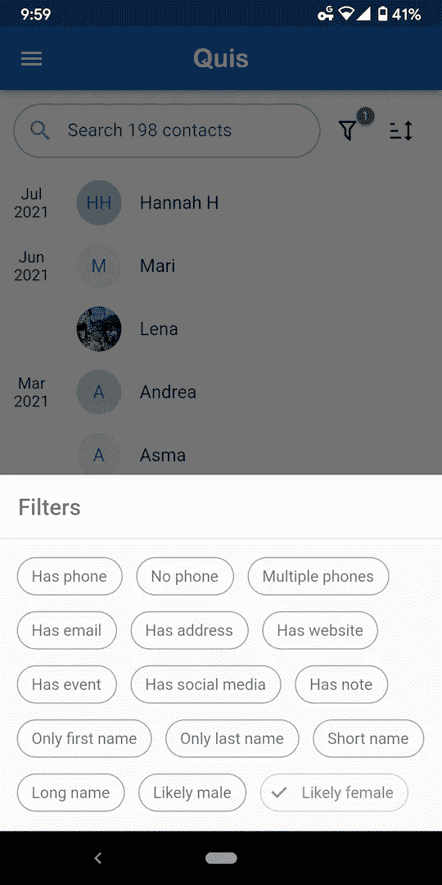

本文中描述的带有性别过滤器的联系人应用 Quis 的屏幕截图。你自己试试吧！在[安卓](https://play.google.com/store/apps/details?id=co.quis.quis)或 [iOS](https://apps.apple.com/us/app/quis-contacts/id1558252000) 上免费下载。

# 先决条件

如果你不熟悉 [Python/Jupyter 笔记本](https://realpython.com/jupyter-notebook-introduction/)、[熊猫](https://www.learndatasci.com/tutorials/python-pandas-tutorial-complete-introduction-for-beginners/)和 [Scikit-Learn](https://scikit-learn.org/stable/tutorial/basic/tutorial.html) ，先看看那些介绍吧。

# 问题是

世界上有数百万个名字，你无法像智能手机那样将它们全部存储在资源有限的环境中——假设 100 万个名字平均包含 10 个字符，则需要 1，000，000 x (10 + 1)字节≈ 10 MB。此外，你可能会偶然发现从未见过的名字，比如说[卡丽熙](https://www.google.com/search?q=khaleesi)或[阿纳金](https://www.google.com/search?q=anakin)，并且仍然想预测他们的性别。

解决方案是训练一个模型，它学习*长什么样*女性和男性的名字。

# 机器学习过程

一个有监督的机器学习项目通常由 5 个步骤组成。

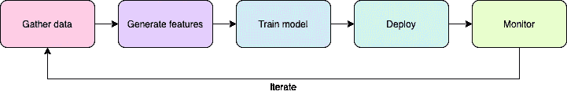

# 步骤 1 —收集培训数据

第一步也是最关键的一步是收集训练数据。

在姓名性别的情况下，网络上有多个免费的数据集，例如从 1930 年到 2015 年美国的 95，000 个名字的[这个数据集](https://data.world/howarder/gender-by-name)，或者从 182 个国家的 177，000 个名字的[这个](https://dataverse.harvard.edu/dataset.xhtml?persistentId=doi:10.7910/DVN/YPRQH8) [0】，我们将在这里使用。所以继续下载名为`wgnd_noctry.tab`的 CSV 文件。

## 探索数据

创建新的 Jupyter 笔记本。让我们加载数据并预览其内容:

```
# import pandas
**import pandas as pd**# read CSV into a pandas dataframe **df = pd.read_csv('wgnd_noctry.csv')**# print shape (number of rows and columns) **df.shape**
```


```
# display 5 random rows
**df.sample(5)**
```

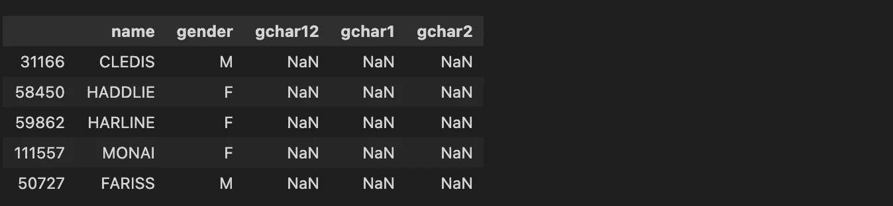

## 预处理

我们的目标是预测给定`name`(输入`X`)的`gender`(输出或**标签** `y`)。此外，我们需要一些预处理来清理原始数据。

```
# exclude rows where gender is undefined
**df = df[df.gender.isin(['M', 'F'])]**# define input
**X = df.name**# define labels (feminine = 0, masculine = 1)
**y = df.gender == 'M'**
```

## 分割训练和测试数据

在有监督的机器学习问题中，我们总是留出一部分(通常在 10%到 20%之间)数据集进行测试——这允许我们计算模型的准确性，并验证我们的模型是否如预期的那样工作。Scikit-Learn 为此提供了便利的功能。

```
# relevant sklearn import
**from sklearn.model_selection import train_test_split**# set aside 10% of the dataset for test **X_train, X_test, y_train, y_test = \
    train_test_split(X, y, test_size=0.1)**# inspect resulting shapes
**X_train.shape, y_train.shape, X_test.shape, y_test.shape**
```

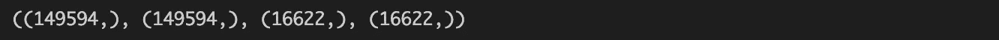

(n，)表示大小为 n 的向量

# 步骤 2-生成要素

收集数据后，下一步是构建用作模型输入的要素。在这种情况下，许多特征可能会浮现在脑海中:字母的数量、元音的数量、姓名是以`a`还是`o`结尾(对西班牙语或意大利语姓名有用)、是否以辅音结尾，等等。

但我们将自动构建数以千计的功能，而不是手工设计。怎么会？使用一种叫做**计数矢量器**的东西。计数矢量器是一种从语料库中自动构建词汇和特征的方法。更准确地说，一个(*p*–*q*)-char count 矢量器通过收集出现在语料库中的 **n-grams** 生成特征，其中 *p ≤ n ≤ q* ，换句话说就是大小在 *p* 和*q*之间的**子串。**

我们来举一个具体的例子。假设我们有五个名字:克里斯、克里斯蒂娜、马里乌斯、玛尔塔和马提亚斯。然后,( 2–4)字符计数矢量器将学习以下词汇。

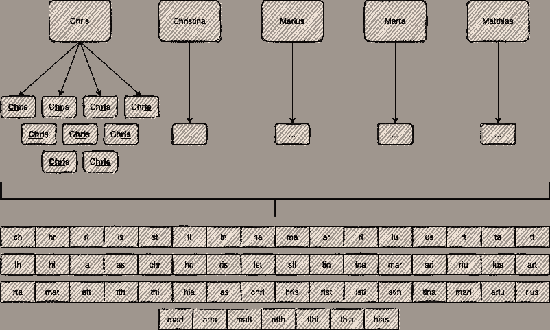

词汇表是在训练示例中找到的二元模型、三元模型和四元模型的集合。

有了这个词汇表，计数矢量器可以将任何名字(无论是否在语料库中)转换成一个大型稀疏矢量`v`，其中`v(i)`是单词`i`在名字中出现的次数。例如，姓名 Rita 和 Laetitia 将被转换成大小为 55 的向量，如下所示:

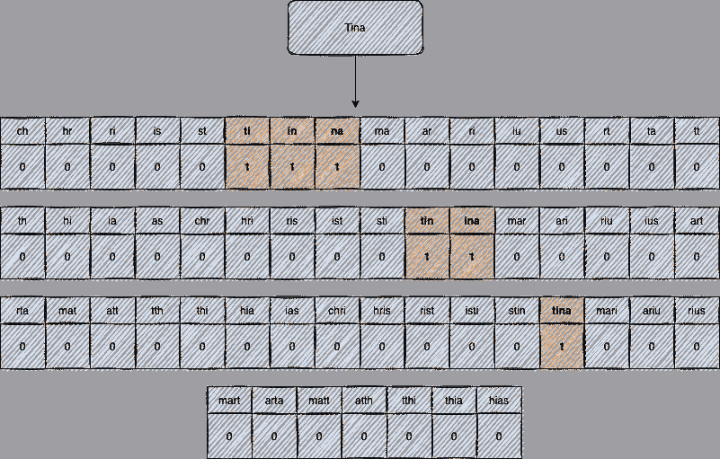

“Tina”这个名字包含三个二元模型、两个三元模型和一个四元模型。

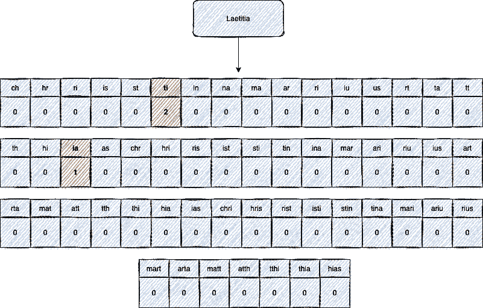

“Laetitia”这个名字包含了两次双字母“ti”。它包括我们的词汇中没有的其他 n-grams，如“lae”。

这个*整个*过程可以使用 Scikit-Learn 在 3 行中完成。

```
# relevant sklearn import
**from sklearn.feature_extraction.text import CountVectorizer**# configure our count vectorizer **vec = CountVectorizer(
    min_df=50,
    ngram_range=(2, 5),
    analyzer='char',
    preprocessor=lambda x: f'^{x.lower().replace(" ", "")}$',
)**# train it **vec.fit(X_train)**
```

您会注意到几个参数:

*   `min_df`是语料库中作为词汇表一部分的单词的最小出现次数。(例如，如果`khal`在卡丽熙这个名字中只出现过一次，我们就将它丢弃)。`min_df`有助于[过度拟合](https://en.wikipedia.org/wiki/Overfitting)，并减少我们的词汇和模型的大小。
*   `ngram_range`是令牌中的最小和最大字符数。
*   `analyzer='char'` 表示我们使用字符级标记化，而不是单词级标记化。
*   `preprocessor`是在构建词汇表之前应用于每个名称的函数。这里我们添加了一个前导`^`和一个尾随`$`，这是表示开始和结束的常见做法。这很重要，因为例如，名字末尾的字母`a`与中间的字母`a`非常不同。

让我们来探讨一下所学的词汇。提示:调用`.fit()`后由 Sckit-Learn 估计器学习的参数总是以下划线为后缀。

```
len(vec.vocabulary_)
```


```
sorted(list(vec.vocabulary_))[:20]
```

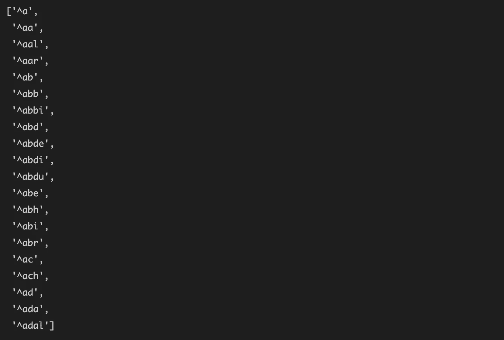

# 步骤 3 —模型架构

由于我们的计数矢量器，我们现在可以将训练集中的 150，000 个姓名转换为 8414 个数字特征。

我们需要训练一个模型，将这 8414 个数字转换成一个预测，该预测表示一个名字是阴性( *p* = 0)还是阳性( *p* = 1)。有许多架构可供选择:逻辑回归、[决策树](https://towardsdatascience.com/decision-tree-from-scratch-in-python-46e99dfea775)、神经网络、支持向量机等等。然而，因为我们将在步骤 4 中序列化模型并将其嵌入到应用程序中，所以我们希望它尽可能地轻量级，并将使用**逻辑回归**。

逻辑回归模型的形式是`f(x1, ... xn) = sigmoid(k1*x1 + k2*x2 + ... + kn*xn + b)`，其中`[sigmoid](https://en.wikipedia.org/wiki/Sigmoid_function)(x) = 1 / (1 + exp(-x))`总是在 0 和 1 之间，可以解释为概率。该模型通过一个称为[随机梯度下降(或 SGD)](https://en.wikipedia.org/wiki/Stochastic_gradient_descent) 的迭代过程，通过逐渐减小其对输入给它的训练样本的预测误差，来学习其**参数** `k1`、`k2`、…、`kn`(称为**权重**)和`b`(称为**偏差**)。

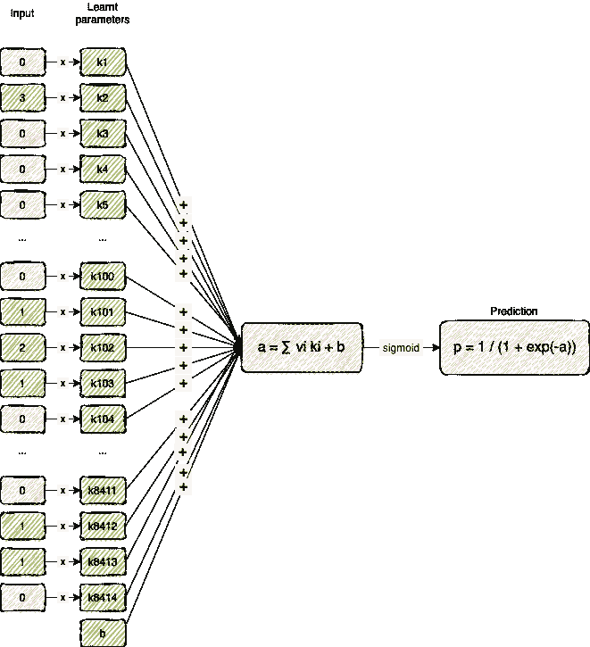

逻辑回归模型将向量(例如，计数矢量器的输出)映射到概率。

为了避免两步过程——首先训练计数矢量器，然后是逻辑回归——我们可以使用 Scikit-Learn **管道**。管道将连续的步骤包装到一个模型中，这样您只需调用`.fit()`一次。

```
# relevant sklearn imports
**from sklearn.linear_model import LogisticRegression
from sklearn.pipeline import Pipeline**# same as before **vec = CountVectorizer(...)**# logistic regression with default parameters but more iterations
# for the SGD to converge **clf = LogisticRegression(max_iter=500)**# a pipeline to wrap sequential named steps **pipeline = Pipeline([('vectorizer', vec), ('logreg', clf)])**# build the vocabulary and train the model in a single command **pipeline.fit(X_train, y_train)**
```

我们现在可以预测性别了！

```
# some masculine names **pipeline.predict([
    'jeff', 'elon', 'bernard', 'bill', 'mark', 'warren', 'larry',
    'sergey', 'mukesh', 'amancio', 'zhong', 'steve', 'ma', 'carlos',
])**
```

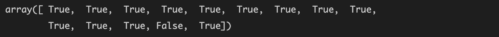

```
# some feminine names **pipeline.predict([
    'francoise', 'alice', 'mackenzie', 'julia', 'miriam',
    'jacqueline', 'yang', 'susanne', 'gina', 'iris',
])**
```

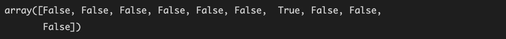

它似乎干得不错。你可以注意到，对于用拉丁字符(`Ma`和`Yang`)转录的中文名字来说，这并不是很好，但[是预期的](https://qr.ae/pGS44W)。

我们也可以计算原始概率来获得一种信心。下面的例子表明，它勉强把`Françoise`做对了，但是对`Gina`作为一个女性化的名字很有信心。

```
# get raw probabilities instead **pipeline.predict_proba([
    'francoise', 'alice', 'mackenzie', 'julia', 'miriam',
    'jacquline', 'yang', 'susanne', 'gina', 'iris',
])**
```


*可选。*我们可以进一步探索，看看模型认为哪些 n-grams 是典型的阳性和阴性。

```
# *pipeline.named_steps.vectorizer.vocabulary_* is the learned
# vocabulary, mapping n-gram to its index in the vocabulary, but we
# need the inverse
**inverted_index = {
    v: k
    for k, v in pipeline.named_steps.vectorizer.vocabulary_.items()
}**# *pipeline.named_steps.logreg.coef_* are the weights (called
# k1 ... k8414 previously) learned by the logistic regression
**sorted_ngrams = sorted(
    enumerate(pipeline.named_steps.logreg.coef_[0]),
    key=lambda x: x[1]
)**# large negative parameters indicate typically feminine n-grams
**[inverted_index[ngram[0]] for ngram in sorted_ngrams[:10]]**
```

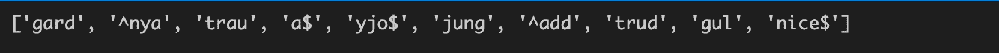

我们可以认出 *-nice* ，一个表示胜利的女性后缀，后缀-a 可能是世界上最常见的女性后缀，前缀 Nya-常见于斯瓦希里语名字中。

```
# large positive parameters indicate typically masculine n-grams
**[inverted_index[ngram[0]] for ngram in sorted_ngrams[-10:]]**
```

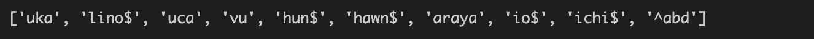

我们可以认出 *Abd-* ，它是许多男性阿拉伯名字的前缀，日语后缀-ichi，以及-io 和-lino，它们是意大利语和西班牙语中常见的男性后缀。

最后，我们可以评估模型在测试集上**有多准确**；换句话说，它预测正确性别的频率。

```
# relevant sklearn import
**from sklearn.metrics import accuracy_score**# predict gender of test names
**y_pred = pipeline.predict(X_test)**# compute accuracy
**accuracy_score(y_test, y_pred)**
```


87%的准确率——对于我们的第一次尝试来说还不错，但肯定还可以提高。

# 步骤 4 —部署

许多书籍和在线教程都没有涉及到这一步，然而这却是至关重要的一步。一旦你在笔记本上训练了一个模型，你如何在生产中使用它？

最简单的方法是使用`joblib`(对 Python 的`pickle`的改进)序列化您的模型:

```
# in your notebook
**from joblib import dump
dump(pipeline, 'model.joblib')**# in prod
**from joblib import load
pipeline = load('model.joblib')**
```

然而，它有两个明显的缺点:如果您的笔记本和 prod 中的 Scikit-Learn 版本不同，它可能会中断，并且它假设您的生产环境使用 Python。

像 [ONNX](https://onnx.ai/) 这样更精细的解决方案已经被开发出来，但是因为我们有意保持我们的模型简单，我们将做一些不同的事情:**手动序列化它**。我们需要保存参数——模型学习到的东西，如词汇和逻辑回归权重和偏差——并编写我们自己版本的计数矢量器和逻辑回归。现在，您应该能够做到所有这些了！

```
# vocabulary, found in *pipeline.named_steps.vectorizer.vocabulary_* **_VOCABULARY = {
    ^j': 514,
    'ji': 4676,
    'il': 4255,
    'll': 5228,
    'li': 5126,
    'is': 4450,
    's$': 7010,
    '^ji': 576,
    ...
}**# logistic regression weights (k1 ... k8414) and bias, found in
# *pipeline.named_steps.logreg.coef_* and# *pipeline.named_steps.logreg.intercept_* **_WEIGHTS = [
    0.16934584,
    -0.04714591,
    -0.48276778,
    ...,
    0.17204447,
    -0.00234139,
    -0.35968848,
]**
**_BIAS = 0.19512928**# a count vectorizer is nothing more than an n-gram counter
**def count_ngrams(name):
    num_ngrams = len(_VOCABULARY)
    vector = [0] * num_ngrams
    normalized_name = f'^{name.lower().replace(" ", "")}$'
    name_length = len(normalized_name)
    for n in range(2, 6):
        for i in range(name_length - n + 1):
            ngram = normalized_name[i : i + n]
            if ngram in _VOCABULARY:
                vector[_VOCABULARY[ngram]] += 1
    return vector**# a logistic regression is nothing more than a few additions and
# multiplications feeding into a sigmoid
**from math import exp****def logreg(vector):
    num_ngrams = len(_VOCABULARY)
    sigmoid_input = _BIAS + sum(
        _WEIGHTS[i] * vector[i] for i in range(num_ngrams)
    )
    return 1.0 / (1.0 + exp(-sigmoid_input))**# our model!
**def model_predict(name):
    return logreg(count_ngrams(name))**# sanity check
**expected = pipeline.predict_proba(['elizabeth'])[0][1]
actual = model_predict('elizabeth')
print(actual == expected)**
```


当然，在实践中，您可以将这些代码翻译成编写服务器的语言。

这样的模型需要多大的空间？

```
space ≈ sizeof(_VOCABULARY) + sizeof(_WEIGHTS)
      ≈ 8414 * (
           average_length(ngram) * sizeof(char) + sizeof(double)
           + sizeof(double)
        )
      ≈ 8414 * (3.5 * 1 + 4 + 4)
      ≈ 100 kB
```

这比存储一个详尽的列表节省了**100 倍的空间**,非常适合嵌入到智能手机应用程序中。

# 步骤 5 —监控和迭代

在将模型部署到生产环境中之后，应该对其进行监控，以衡量其实际性能。不幸的是，我们的模型并不完美，需要迭代才能变得更好。这里有几个问题和改进的思路。

*   87%的准确率无疑可以通过玩模型架构来提高。例如，我们可以尝试用另一种分类器替代逻辑回归，或者使用计数矢量器[超参数](https://en.wikipedia.org/wiki/Hyperparameter_(machine_learning))。(如果这样做，记得使用[验证集](https://en.wikipedia.org/wiki/Training,_validation,_and_test_sets#Validation_data_set)。)
*   有些名字在一些国家是阳性的，而在另一些国家是阴性的(比如`Alexis`或`Andrea`，在美国通常是阴性的，而在法国和意大利分别是阳性的)。您可以将国家作为一个特征添加到模型中。或者，你可以在每个国家培训**一个模特。**
*   词汇表的大小可能仍然太大，这是模型大小的一个问题，可能会引入[过度拟合](https://en.wikipedia.org/wiki/Overfitting)。一种解决方案是增加**正则化**，例如，通过增加`min_df`或减少`ngram_range`。
*   当前的数据集包含数十万个名称，无论其受欢迎程度如何，这些名称都被同等对待。然而，事实上，通用名的错误比不常用名的错误更糟糕，因为它们会影响更多的用户。可能的解决方法包括从训练集中删除最不常用的名字，并使用名字流行度作为**样本权重**。
*   像`Alex`和`Leslie`这样的名字男女通用。我们可以为中性或无性别的名字引入第三个标签类别**。**

# 整个代码

在 [GitHub](https://gist.github.com/joachimvalente/b0b98375e53c0237a11edfa040fa358b) 上找到笔记本。

# 参考

> [0]拉福，胡里奥；Lax-Martinez，Gema，2018，《WGND 1.0》，[https://doi.org/10.7910/DVN/YPRQH8](https://doi.org/10.7910/DVN/YPRQH8)，哈佛数据世界，V1，UNF:6:bu iqbd/6 H9 bup 1 zi 2 pnwa = =[file UNF]