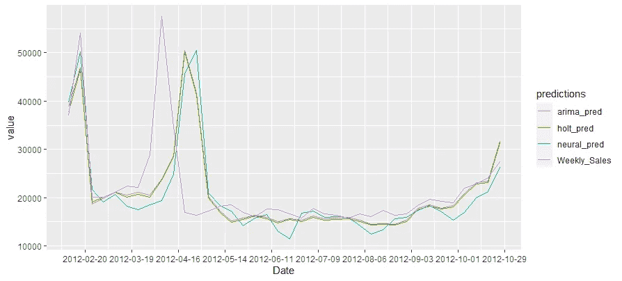
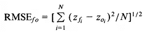
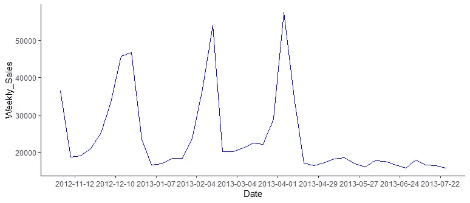

# 使用 R 编程预测销售额

> 原文：<https://pub.towardsai.net/predicting-sales-using-r-programming-84b66d11c35d?source=collection_archive---------0----------------------->

在本文中，我将预测一家跨国零售公司的销售额。这个数据集可以在 Kaggle 上找到。我们已经获得了每周销售数据，我们根据这些数据训练模型，并使用最佳模型来预测未来日期的每周销售值。


**所需库**:

```
library(dplyr)
library(forecast)
library(reshape)
library(ggplot2)
library(tidyverse)
```

原始数据集包含大约 45 家商店和 99 个部门的数据。为了简化计算，我刚刚考虑了 1st store 的 1st 部门的数据。我将数据分为两部分——基于日期的 sample_ train 和 sample_test。数据集包含以下字段:

*   商店——商店编号
*   部门——部门编号
*   日期—星期
*   Weekly_Sales —给定商店中给定部门的销售额
*   IsHoliday —该周是否为特殊假日周

```
dept1_train <- train %>% filter(Store == "1" & Dept == "1")
dept1_test <- test %>% filter(Store == "1" & Dept == "1")
dept1_test$ Weekly_Sales <- 0dept1_train$Date <- as.Date(dept1_train$Date , format = "%Y-%m-%d")
sample_train <- dept1_train %>% filter(Date < as.Date("2012-02-06"))
sample_test <- dept1_train %>% filter(Date >= as.Date("2012-02-06"))summary(sample_train)Store        Dept        Date             Weekly_Sales        
 Min.   :1   Min.   :1   Min.   :2010-02-05   Min.   :14537     
 1st Qu.:1   1st Qu.:1   1st Qu.:2010-08-06   1st Qu.:16329          
 Median :1   Median :1   Median :2011-02-04   Median :18820          
 Mean   :1   Mean   :1   Mean   :2011-02-04   Mean   :22777                  
 3rd Qu.:1   3rd Qu.:1   3rd Qu.:2011-08-05   3rd Qu.:23388                  
 Max.   :1   Max.   :1   Max.   :2012-02-03   Max.   :57258IsHoliday      
   Mode :logical  
   FALSE:97       
   TRUE :8summary(sample_test)Store        Dept        Date             Weekly_Sales        
 Min.   :1   Min.   :1   Min.   :2012-02-10   Min.   :15723   
 1st Qu.:1   1st Qu.:1   1st Qu.:2012-04-14   1st Qu.:16645        
 Median :1   Median :1   Median :2012-06-18   Median :18243          
 Mean   :1   Mean   :1   Mean   :2012-06-18   Mean   :21784                  
 3rd Qu.:1   3rd Qu.:1   3rd Qu.:2012-08-22   3rd Qu.:22057                  
 Max.   :1   Max.   :1   Max.   :2012-10-26   Max.   :57592IsHoliday      
    Mode :logical  
    FALSE:36       
   TRUE :2
```

对于样品 _ 训练日期范围从 2010 年 2 月 5 日到 2012 年 2 月 3 日，对于样品 _ 测试日期范围从 2012 年 2 月 10 日到 2012 年 10 月 26 日。我为 sample_train 的 weekly_sales 数据创建了一个时间序列。

**时间序列**:在连续的等间隔时间点获取的序列。

```
ts_train_uni <- ts(sample_train$Weekly_Sales , start = c(2010,5) , frequency = 52)
```

起点是 2010 年 2 月的第一周。频率=52 表示它是周数据。

我用来训练数据集的三个模型是 ARIMA、霍尔特温特斯和内塔。

**ARIMA** :自回归*综合移动平均线*

它描述了数据点之间的相关性，并考虑了值的差异。显示平稳性的模型是显示数据随着时间的推移而保持不变的模型。大多数经济和市场数据显示趋势，所以差异是用来消除任何趋势或季节性结构。本例中的季节差异为 1。

```
arima_model <- auto.arima(ts_train_uni , seasonal.test = "seas"   )
arima_pred = forecast(arima_model , h = 38)
arima_pred <- as.data.frame(arima_pred$mean)
```

**Holt Winters**:Holt-Winters 预测算法允许用户平滑时间序列，并使用该数据预测感兴趣的区域。未知参数通过最小化预测误差的平方来确定。

```
holt_model <- HoltWinters(ts_train_uni)
p <- predict(holt_model , 38 , prediction.interval = TRUE)
p <- as.data.frame(p)
```

**nnetar** :单隐层滞后输入的前馈神经网络，用于预测单变量时间序列。

```
neural <- nnetar(ts_train_uni)
neural_pred <- forecast(neural , h=38)
neural_pred <- as.data.frame(neural_pred)
```

在各种模型的帮助下预测值之后，我使用 tidyverse 包中的 add_column 函数将预测值追加到 sample_test。

```
pred_data <- sample_test %>%add_column(arima_pred = arima_pred$x , holt_pred = p$fit , neural_pred = neural_pred$`Point Forecast`  )
```

然后，我使用 ggplot 函数绘制 sample_test 的 weekly_sales 数据的值，并将其与我们的模型在同一时期预测的值进行比较。这将有助于我们分析模型的结果。

```
pred_data %>% gather(key = "predictions" , value = "value" , -c(Store , Dept , IsHoliday ,Date))%>% 
    ggplot(aes(x = Date ,y =  value , colour = predictions)) + geom_line() + scale_x_date(date_breaks = "4 week")
```



紫线代表的实际 weekly_sales 数据在开始时有两个峰值，在结束时销售额再次增加。所有模型都捕捉到了第一个峰值。然而，没有一个模型准确地捕捉到第二个峰值。Arima 和 HoltWinters 的模型与 weekly_sales 数据的其他分布一致，而神经网络模型与实际的周数据相差甚远，可以安全地拒绝。为了计算哪个模型是正确的选择，我们必须找出均方根误差(RMSE)。

**RMSE** 是一种常用的衡量模型或估计器预测值与观察值之间差异的方法。它是残差(预测误差)的标准偏差。其计算方式如下:



```
for (j in 6:ncol(pred_data)) {

  error <- pred_data[4] - pred_data[j]

  y <- error ^2
  z<- colMeans(y)

  rmse[j] <- sqrt(z)

}>rmse[6] #arima

9097.075> rmse[7] #holtwinters

9106.965> rmse[8] #nnetar

10123.48
```

正如所料，Arima 和 holtwinters 的 rmse 低于 nnetar，因为 Arima 的 rmse 最低。我用这个模型来预测未来的价值。

因此，对 2012 年 11 月 2 日至 2013 年 7 月 26 日期间的预测是

```
ts_train_uni <- ts(dept1_train$Weekly_Sales , start = c(2010,5) , frequency = 52)

 arima_model <- auto.arima(ts_train_uni , seasonal.test = "seas"   )
 arima_pred1 = forecast(arima_model , h = 39)
 arima_pred1 <- as.data.frame(arima_pred1$mean)
 plot(forecast(arima_model , h=39)) #arima plot
 dept1_test$Weekly_Sales <- arima_pred1$x
 dept1_test <- subset(dept1_test , select = -arima)
 dept1_test$Date <- as.Date(dept1_test$Date)ggplot(dept1_test , aes(x = Date , y = Weekly_Sales) ) +     geom_line(color = "blue") + theme_classic() +
   scale_x_date(breaks = "4 weeks")
```



预测销售价值

这个部门在十二月、二月和四月的销售额较高。关于这个部门销售的产品种类，没有提供任何信息。我们已经得到了关于各种假期的信息。此外，包括这些假期在内的周在评估中的权重是非假期周的五倍，并且在此期间折扣很大。因此，我们可以在这几个月中看到这些峰值。

```
The table below shows the head of the  range of values at 80% and 95% confidence intervals for arima model.Point Forecast     Lo 80    Hi 80     Lo 95      Hi 95
       36424.86   27138.911  45710.81 22223.227 50626.49
       18689.54   7514.632  29864.45  1598.993 35780.09
       19050.66   7875.752  30225.57  1960.113 36141.21
       20911.25   9736.342  32086.16  3820.703 38001.80
       25293.49  14118.582  36468.40  8202.943 42384.04
       33305.92  22131.012  44480.83 16215.373 50396.47
```

*因此，我们能够使用机器学习模型预测销售价值，并找出不同置信区间的范围。95%的置信区间表示实际值有 95%的机会在低 95 和高 95 的范围内。在下一篇文章中，我将使用 RShiny 开发一个交互式工具，该工具用于通过单击按钮来预测值。如果你喜欢这篇文章，请鼓掌并评论。谢谢:)*