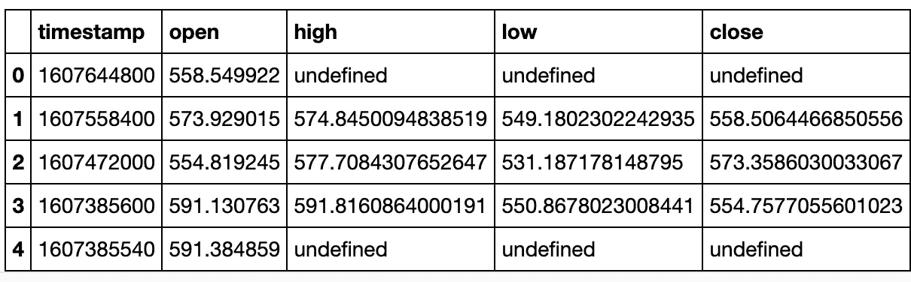
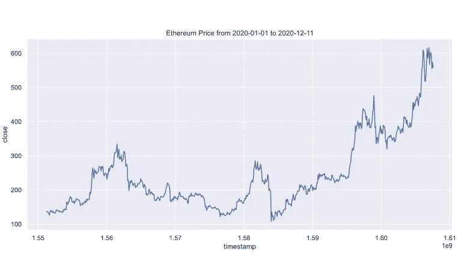
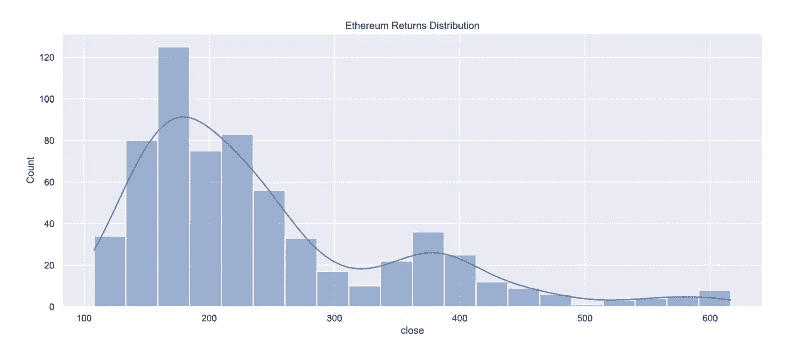
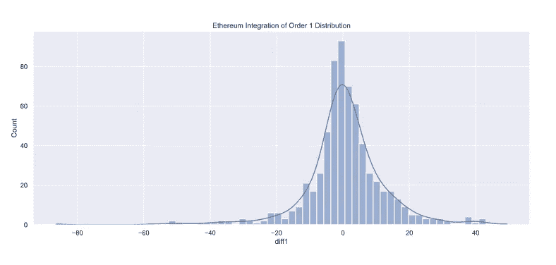
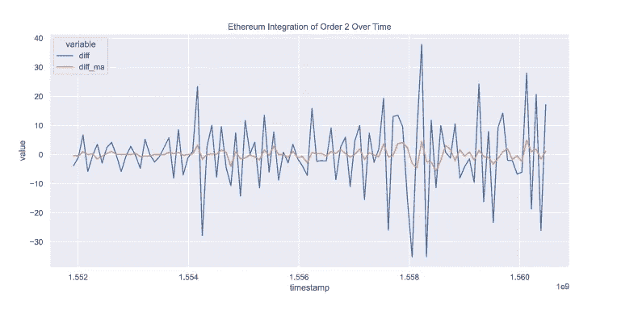
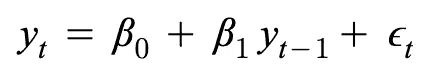
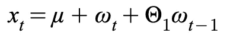
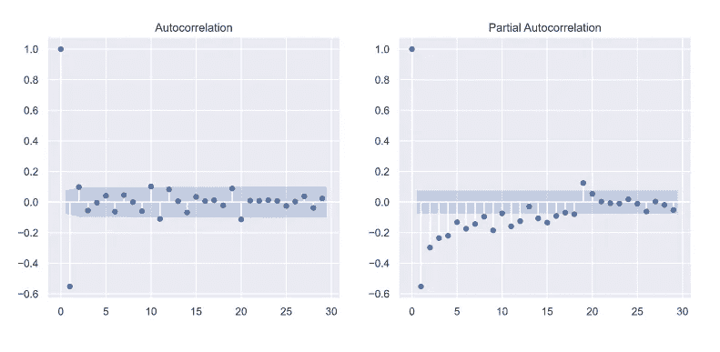
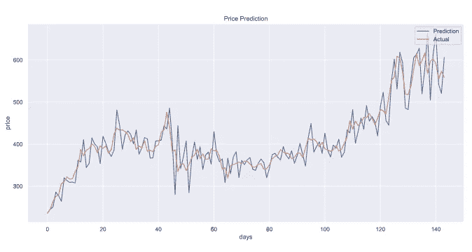

# 用人工智能预测未来

> 原文：<https://pub.towardsai.net/predicting-the-future-with-ai-be0bd1296d92?source=collection_archive---------3----------------------->

## [数据可视化](https://towardsai.net/p/category/data-visualization)，[未来](https://towardsai.net/p/category/future)

## *利用 ARIMA 模型对以太坊每日价格进行时间序列分析*

照片由 [h heyerlein](https://unsplash.com/@heyerlein?utm_source=medium&utm_medium=referral) 在 [Unsplash](https://unsplash.com?utm_source=medium&utm_medium=referral) 上拍摄

*我们能预测未来吗？*大多数人会说不会。让我们改变一下问题的措辞:*过去的数据能告诉我们一些关于未来的事情吗？*这似乎更直观，这也是**时间序列分析**试图回答的问题。

因此，亲爱的读者，在这里我向你介绍一些我认为对时间序列分析很重要的技术。今天，考虑到这一点，我们将使用 ARIMA 模型来分析以太坊的每日价格。

首先，与每个数据科学项目一样，我们需要了解我们正在研究的领域。让我们从这个开始:

## **以太坊是什么？而我们为什么要分析它？**

以太坊是最著名的加密货币之一。如果你不知道什么是加密货币，这里是我的快速全景概述:一种**加密货币**是一种使用一种叫做**区块链技术的货币系统。**这项技术让人们可以虚拟地拥有某些东西——就像你可以物理地拥有一样。我们为什么关心？嗯，不仅区块链是一项创新技术，而且市场对它有一些极端的反应。尽管预测市场走势并不简单，但我们可以通过研究在这个过程中走得更远。此外，加密货币为研究时间序列分析提供了一个完美的环境。

# 好了，让我们开始分析吧

在整篇文章中，我将假设您已经掌握了一些计算机科学、统计学和 Python 的知识。然而，我会检查这个分析的每一部分，所以如果你没有这些主题的重要背景，我认为你仍然可以享受这个项目并从中学习。

在整个分析过程中，我将使用 Python。你可以在下面的 Github repo 下找到完整的 Jupyter 笔记本以及所有的代码和注释:[https://github.com/leonardosavasta/ethereum_analysis.git](https://github.com/leonardosavasta/ethereum_analysis.git)。您还可以找到包含数据的 CSV 文件。

首先，让我们将数据导入 Pandas。

我们将数据导入 Pandas，这只是一个用于操作数据的 Python 库

数据集的前 5 行

# **数据探索**

我们将花一些时间进行我们称之为数据探索的工作。为什么？因为我们想在开始创建模型之前了解我们的数据。在数据科学中，我们的目标是从我们拥有的数据中洞察某个主题。通常，我们会创建一个模型来根据我们的数据预测值或自动决策。但是如果我们不明白我们首先要处理的是什么，我们怎么能创建一个好的模型呢？

理解我们数据的一个好方法是通过可视化。让我们从一个简单的每日价格图表开始:

以太坊收盘价(美元)

我们看到数据的波动性很大(从数学角度来说，我们有很高的方差)。我们也可以看到某种上升趋势。

让我们创建一个价格直方图:

以太坊收盘价柱状图

这里，我们去掉了时间成分。我们想看看我们所说的价格的“T2”分布。如你所见，这里很乱。我们的大部分价格在 100 美元到 300 美元之间，但是我们有一条向右的长尾(右偏)。这种分布不是我们所说的“*正态*或“*高斯*”分布，这使得分析起来很有挑战性。

## 综合

让我给你展示一种叫做整合的技术。整合是一个花哨的术语，用来描述一天与下一天的价格差异。别担心，这和微积分里的积分没关系。所以现在，我们不绘制价格，而是绘制价格的每日变化:

我们计算 1 阶和 2 阶的积分

订单 1 的整合

瞧啊。多美啊。结果是，当我们执行集成时，我们“*归一化*我们的数据。我们的分配不再混乱。这是我们可以利用的数据。为什么？大多数统计模型和公式都设计为使用正态分布。积分是一种使我们的分布标准化的技术(对时间序列数据特别有效)。有时，即使在应用集成之后，我们的数据可能仍然不正常。在这种情况下，我们可以再次积分并得到变化的*变化*——这被称为二阶积分。正如你可能猜到的，你可以积分任意多次来得到一个正态分布。

让我们看看订单 2 在我们的发行版中的集成情况:

2 阶积分

非常好。二阶积分去除了一些异常值。

当我们绘制这个时间图时，我们得到了这样一幅图:

以太坊时间序列的积分阶 2

这里我们看到了随着时间的推移，整合的效果。我们排除了价格的上升趋势，这个序列看起来完全是随机的。换句话说，以太坊每日价格的*变化*看起来是随机的。这导致了时间序列分析中的一个重要问题——平稳性:

## 平稳性——什么？为什么呢？

为了分析时间序列数据(比如我们的价格)，我们需要我们的时间序列是平稳的。平稳性有一个正式的数学定义。但是对于那些想跳过这一点的人来说，这里有一个简单的定义——在任何时间点看起来随机的图表，没有明确的趋势或季节性，很可能是*平稳的*。

如果你感兴趣，这里有一个关于平稳性的更正式解释的链接:【https://people.duke.edu/~rnau/411diff.htm

只要看一眼图表，你就可能知道它是否是静止的。然而，作为数据科学家，我们希望量化这些决定(我们需要证明我们的研究)。一种被称为**迪基-富勒测试**的统计测试给我们一个时间序列是非平稳的概率(在这里，我重复一遍，它是非平稳的概率*)。因此，如果你想要一个平稳的时间序列，就像我们一样，你希望得到一个非常低的值。*

*从理论上讲，你永远无法说一个时间序列是否是平稳的，这就是为什么我们要处理概率。你可以决定什么概率让你舒服(或者用更统计学的术语来说，当你拒绝你的假设时)。*

*如果我们将 Dickey-Fuller 测试应用于我们的原始价格时间序列，我们得到:*

**此代码打印的值为 0.8506393361925488。**

*所以我们有 85%的把握这个时间序列不是平稳的。让我们看看综合时间序列:*

**此代码打印值 2.0959246928695642e-14。**

*太棒了。这个值对我们来说已经足够低了，我们可以称这个时间序列为平稳的用于我们的研究。*

*我们的目标是执行价格预测，为此，我们将使用**监督学习**。由于我们在探索中发现我们的时间序列在积分后是平稳的，所以我们可以使用**自回归积分移动平均**模型 **(ARIMA)** 。我们来谈谈那是什么。*

# *自回归综合移动平均(ARIMA)*

*在整合数据后，ARIMA 将自回归模型与移动平均模型结合起来。我们已经讨论过积分，所以我将快速回顾一下自回归和移动平均。*

*自回归模型是一种使用历史值作为预测值的回归。根据定义，它假设我们可以根据历史数据预测时间序列的当前值。如果您想更深入地了解这一特定模型的数学，下面是数学函数:*

**

*一阶自回归模型*

*这里有一个更正式的解释链接[https://online.stat.psu.edu/stat501/lesson/14/14.1](https://online.stat.psu.edu/stat501/lesson/14/14.1)*

*均线模型也类似。我们试图使用以前的预测误差作为预测值来预测当前值。这是数学符号:*

**

*一阶移动平均模型*

*这里有一个进一步解释它的链接:[https://online.stat.psu.edu/stat510/lesson/2/2.1](https://online.stat.psu.edu/stat510/lesson/2/2.1)*

*ARIMA 模型集成了时间序列，然后将自回归模型与移动平均模型相结合来创建预测。*

*让我们看看我们的代码是什么样子的:*

*首先，我们划分数据，只使用前 500 天来训练我们的模型，剩下的时间用于测试。从一开始就留出一部分数据集进行测试是一个很好的做法，这样可以减少我们的偏见。*

***现在，ARIMA 模型有三个参数:***

*   *第一个是您希望在模型的自回归部分使用的历史数据点的数量*
*   *第二个参数是您想要使用的积分顺序。为此，我们已经讨论过我们将使用二阶。*
*   *第三个是您希望在模型的移动平均部分使用的历史错误的数量。*

## *我们如何识别这些参数？*

*我们已经讨论了为什么我们使用二阶积分。现在，我们来谈谈如何找到第一个和第三个参数。*

***自相关***

*自相关告诉我们历史价格与当前价格的相关程度。如果 x 是我们在 t 时刻的价格，我们想知道我们的价格在 t-1，t-2 时刻的相关程度。为了找到我们的第三个参数(我们的移动平均线模型的阶)，我们想要确定超过某个阈值的与我们的当前价格自相关的历史价格的数量。令人欣慰的是，一个简单的库将帮助我们做到这一点，但首先，让我解释一下我们的第一个参数。*

***部分自相关***

*如果 x 是我们在时间 t 的价格，我们可能会发现我们在时间 t-2 的价格(比如 p2)和我们在时间 t-1 的价格(比如 p1)与 x 相关。我们还知道 p2 和 p1 本身也是相关的。这意味着 p2 可能仅由于**传递性**而与 x 相关。偏相关函数会告诉我们，去掉传递性之后，我们的历史价格与当前价格的相关程度。在显著性阈值以上部分相关的历史价格的数量给了我们第一个参数(自相关顺序)。*

***这里是我们在 Python 中如何做的。***

*我们得到下面的图表:*

**

*自相关和偏自相关*

*我们的第一个元素(在 t-0)的值总是 1，因为它是当前价格。在自相关图中，我们只有 2 个历史价格点超过了显著性阈值。另一方面，我们的部分自相关图显示，我们有 9 个元素超过了显著性阈值。*

*我们找到参数(2，2，9)。*

# *现在，让我们来测试一下！*

*通常在测试一个模型时，我们随机分离数据作为测试环境的一部分，但是时间序列是不同的。由于我们数据的连续性很重要(时间是一个因素)，我们将最后 150 个左右的值分开进行测试。此外，随着我们远离上一个训练数据点，我们模型的性能将会下降。或者换句话说，我们对明天价格的预测会比我们对下周的预测更准确。*

***构建我们的测试环境***

*我们将在前 500 个数据点上训练我们的模型。然后，我们将预测下一个值，并将其添加到我们的预测序列中。然后我们获得实际价格并再次训练。我们迭代我们的测试数据。*

*这个过程允许我们为每天的测试数据测试我们的模型，总是提前一天预测。我们的模型预测综合数据，因此我们现在需要将这些预测转换为实际价格。下面的函数从我们的集成数据中返回真实值。*

*使用该函数，我们可以在预测中反转积分并绘制图表:*

**

*提前一天的价格预测与实际价格*

*我们的模型可以适度预测以太币美元的价格变化。正如我们在图表中看到的，在许多情况下，该模型未能正确预测价格。在某些情况下，我们预测了方向，但低估了运动的程度。其他时候，我们是准确的。我们可以从 ARIMA 模型中期待这一点。毕竟，预测未来不是一项简单的任务，但希望时间序列分析能给我们一些以前没有的洞察力。*

## *接下来呢？*

*其他模型也有广泛的研究，包括用于时间序列分析的深度学习(神经网络)。我将留下一篇文章的链接，这篇文章探索了一种不同的方法。希望跟随这个项目为您分析时间序列数据打下了良好的基础。*

*[https://towards data science . com/how-to-use-deep-learning-for-time-series-forecasting-3f8a 399 cf 205](https://towardsdatascience.com/how-to-use-deep-learning-for-time-series-forecasting-3f8a399cf205)*