# 涡扇发动机剩余使用寿命预测

> 原文：<https://pub.towardsai.net/predicting-the-remaining-useful-life-of-turbofan-engine-f38a17391cac?source=collection_archive---------0----------------------->

## [数据科学](https://towardsai.net/p/category/data-science)，[机器学习](https://towardsai.net/p/category/machine-learning)

## NASA 提供的 PHM08 挑战数据集的应用

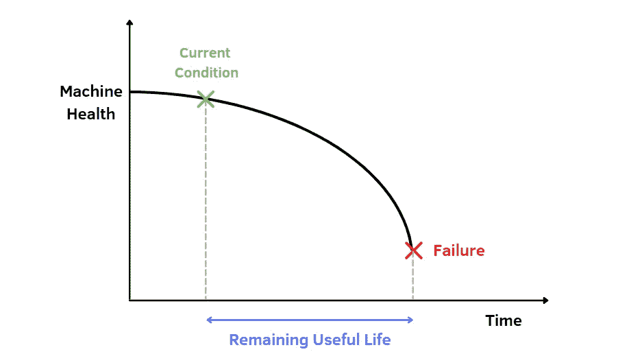

作者插图

日益增长的数据量和技术进步导致机器维护策略的重大变化。监控机器状态的可能性出现了**预测性维护** (PM)。PM 是在过去十年中发展起来的，其特点是使用通过**传感器**收集的机器历史时间序列数据。使用可用的数据，可以通过机器学习和深度学习方法提供有效的解决方案。预测性维护可以最大限度地减少停机时间，最大限度地延长设备寿命。

PM 的一个关键部分是剩余使用寿命的预测**(RUL)。这是什么？它是机器组件在失去功能之前执行其任务的剩余时间。它也可以定义为从当前时间到组件使用寿命结束的持续时间(可以是分钟、小时或天)。这种估计可以避免失败。事实上，在出现故障的情况下，修复受损零件的成本很高。出于这个原因，公司试图通过对设备进行定期检查来防患于未然。**

**我猜你在问自己为什么你会对预测性维护感兴趣。答案是，有各种各样的公司使用预测性维护来分析他们客户的数据，并做出允许做出决定性决策的预测。实际上，我在数据科学实习期间遇到了这个话题，我越来越意识到 PM 如何应用于许多环境中，例如制造业、汽车公司和飞机。**

**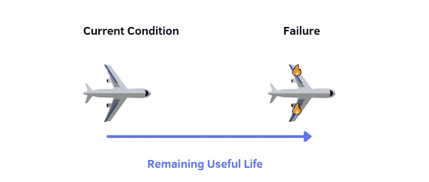**

**剩余使用寿命。作者插图。**

**在这篇文章中，**我将关注飞机**。我将使用 NASA 数据仓库中的一个流行数据集，名为**。这是 2008 年在第一届预测和健康管理会议上首次引入的挑战竞赛的数据集合。这是一个多变量时间序列，包含 **218 个涡轮风扇发动机**，其中每个发动机数据都有来自 **21 个传感器**的测量值。每台发动机开始正常运转，以故障告终。目标是预测组件的 RUL。下面是建立预测性维护算法的步骤。如果你过去已经用不同的数据集创建了一个机器学习模型，你会发现唯一的区别是你需要一个额外的任务。**您必须计算剩余使用寿命**值，这些值需要与预测值进行比较。****

# ****目录:****

1.  ****[**导入数据**](#f7da)****
2.  ****[**计算剩余使用寿命**](#8bf1)****
3.  ****[**特征选择**](#74cf)****
4.  ****[**最大最小归一化**](#297c)****
5.  ****[**预测模型**](#198f)****

# ****1.输入数据****

****让我们导入以下步骤中需要的库:****

****一旦库被导入，我们就可以加载数据集 PHM08。数据集在 [Kaggle](https://www.kaggle.com/behrad3d/nasa-cmaps) 中可用，已经分为训练集和测试集，由 26 列组成:****

*   ****单位数****
*   ****周期时间****
*   ****操作设置 1，2，3****
*   ****传感器测量值 1，…，21****

****每行代表一个操作周期中拍摄的快照。****

****在创建了包含所有列名的向量之后，我们可以导入训练集，该训练集以文本文件的形式提供，列之间用空格分隔。****

****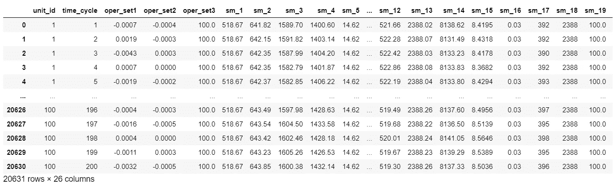****

****从输出中，我们可以观察到**有许多行具有相同的单元号**，称为 unit_id。例如，unit_id=1 的行表示特定发动机的生命周期，直到在变量 time_cycle 引用的时间内观察到的降级状态。**一般来说，每台发动机的最后一个循环代表故障点。******

****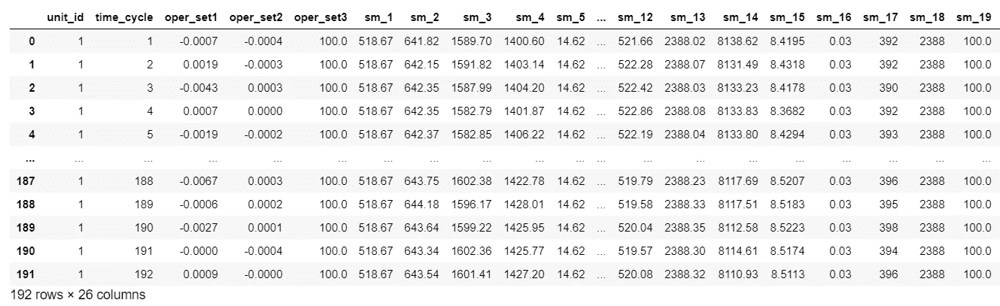****

****当 time_cycle 等于 1 时，引擎总是健康的，而在其他时间周期中，引擎的性能会变得更差。然后，unit_id=1 的发动机在时间周期 192 失效。所有训练集中总共有 100 个引擎。此外，已经可以观察到**一些传感器测量值随着时间的推移而增加**，这将有助于构建预测算法，而其他测量值保持不变或变化很小。****

****现在，我们对测试集和测试集的 RUL 值做同样的事情。测试数据与训练数据具有相似的结构。**唯一的区别是，我们不知道故障何时发生。**RUL _ FD 001 . txt 仅提供每个发动机最后一个时间周期的 RUL 值。在 unit_id 等于 1 的引擎的情况下，它可以在发生故障之前运行其他 112 个时间周期。****

****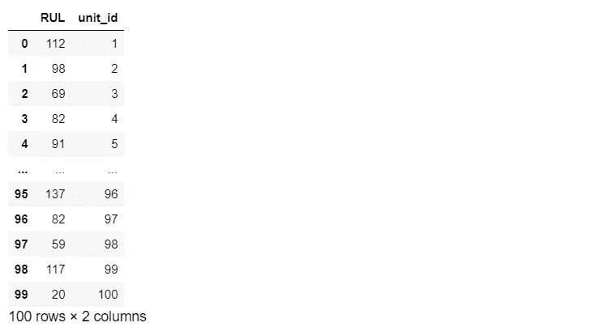****

****定型集和测试集都包含特征变量，但缺少目标变量。我们需要它来完成我们的监督任务，以了解预测值与实际值之间的差距。****

# ****2.计算剩余使用寿命****

****计算剩余使用寿命的方法有很多。一种方法是首先获得每个单元 id 的最大时间周期，然后进行以下差分:****

********

****为了找到训练数据的每个单元 id 的最大时间周期，我们需要按照单元 id 对数据进行分组，并按照时间周期进行过滤。然后，我们创建一个由两列组成的数据帧，其中最大时间周期对应于一个唯一的单元 id。****

****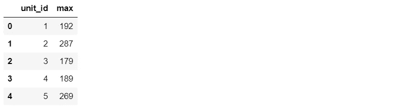****

****在我们合并最后获得的数据帧和训练集之后。这样，我们可以将 RUL 作为目标变量。****

****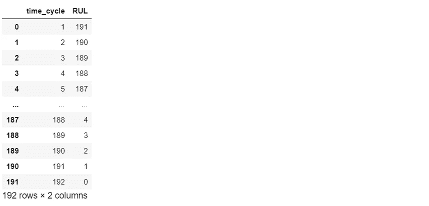****

****从输出中，我们可以看到单位 id 等于 1 的数据的 RUL 随着时间的推移而减小。RUL 越小，失败的风险越高。当 RUL 为零时，意味着发动机出现故障。****

****一旦我们为训练数据计算了 RUL，我们也需要为测试数据添加 **RUL 列。由于 **RUL_FD001.txt 仅提供每个发动机**最后一个时间周期的 RUL 值，因此相应测试集的测试数据和 RUL 的大小不同。因此，我们的想法是将 RUL 值分配给每个单元 id 的最后一行，并在上面的每一行中增加一个值，直到到达该特定引擎的第一个时间周期。******

**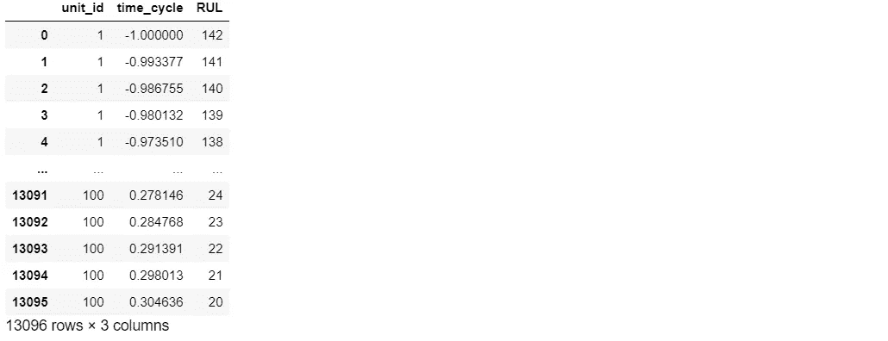**

**要检查计算是否正确，最好将 RUL 真值与单位 id 等于某个数字的测试数据进行比较:**

**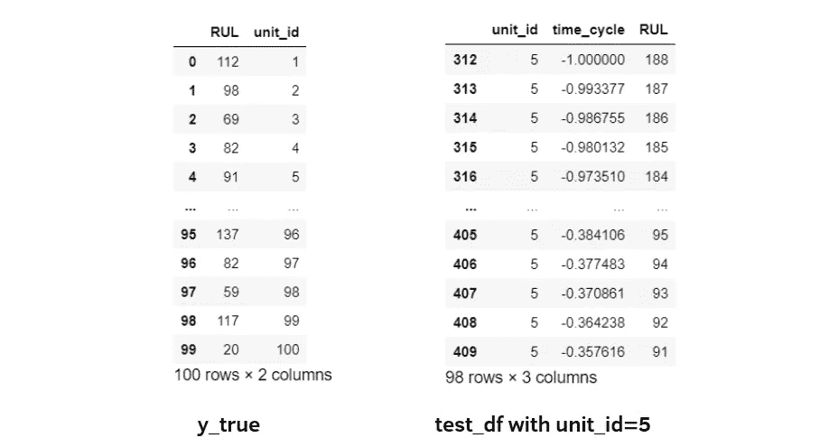**

**y_true 和 test_df 的比较**

**在本例中，查看 y_true 数据帧，对于单位 id=5 的引擎的最后一个时间周期，RUL 等于 91。在更新的测试数据中，我们在特定发动机的最后一行中有相同的值，而在上面的行中，我们每次增加一个单位的 RUL。**

# **3.特征选择**

**为了快速显示训练集中的所有特征，我们可以绘制每个变量的直方图:**

**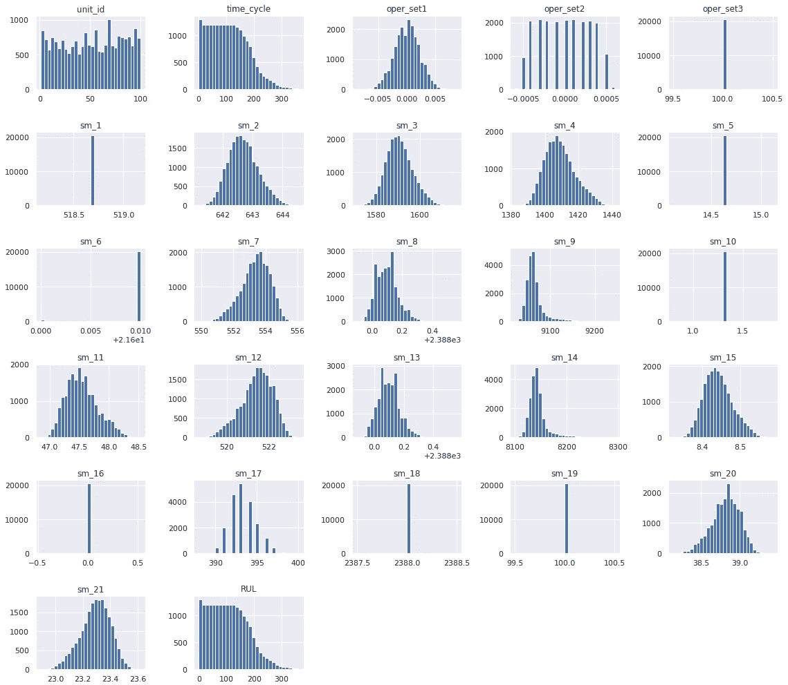**

**从这个输出中，我们可以观察到有许多正态分布的特性。其他一些变量是右偏或左偏的。此外，很明显，操作设置 3 和传感器测量值 1、5、6、10、16、18、19 总是具有相同的值，这意味着它们不是重要的变量。检查最重要变量的另一种方法是查看相关矩阵:**

**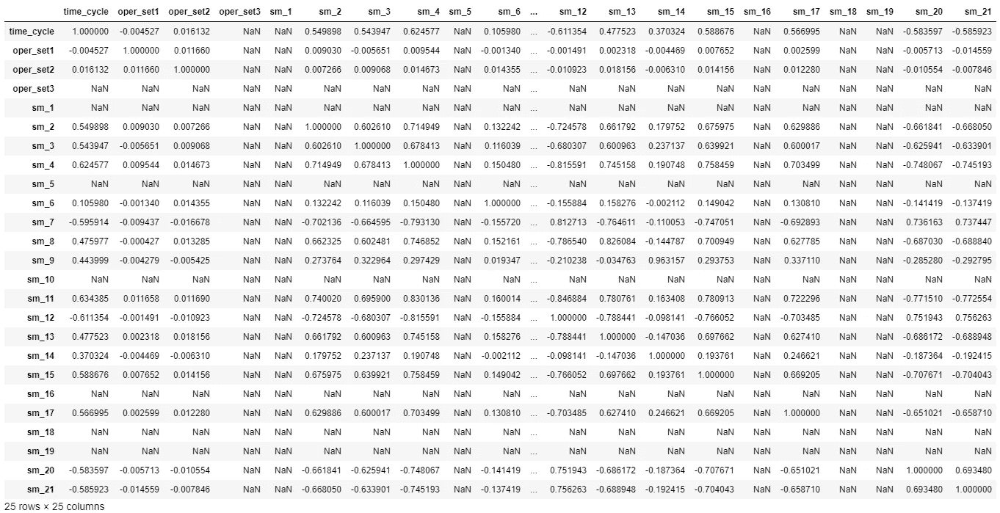**

**从相关矩阵中，我们可以观察到，有些变量与其他变量的系数始终为**:操作设置 3、传感器测量值 1、5、10、16、18 和 19。这些 NAN 值可以解释为变量之间缺乏相关性。例如，时间周期和传感器测量值 1 之间的 NAN 相关系数意味着当时间周期改变时，sm 1 不变。这意味着我们应该从训练集和测试集中移除这些变量，从而证实之前通过查看直方图获得的发现。为了突出这些方面，我们还可以绘制 RUL 与特征变量的关系。****

**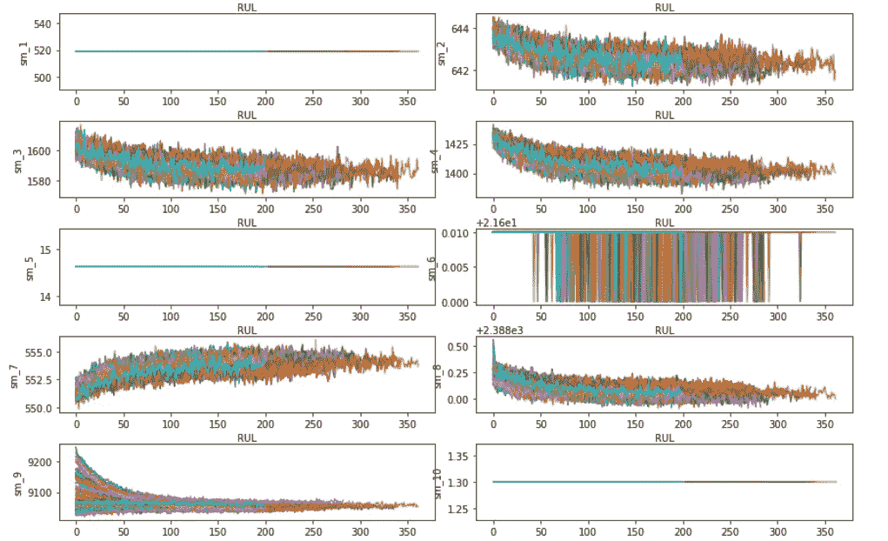**

**以上，我只展示了获得的部分情节。如果您看一下这些图形工具，很明显，当剩余使用寿命发生变化时，一些传感器测量值并没有显示出明显的变化。然后，这些传感器测量将不会在模型中被选择。**

# **4.最大最小归一化**

**一旦我们只选择了数据集的重要特征，我们就可以对数据进行规范化。这一步对于避免依赖测量单位的选择很重要。事实上，特征变量具有不同的取值范围，可能会降低模型的性能。一种方法是将数据转换到-1 和 1 之间的较小范围内。所应用的技术是 sklearn 模块中提供的最大-最小归一化。**

**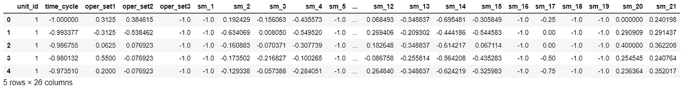**

**在最大-最小归一化之后，我们可以将训练和测试集分成特征和目标变量。**

# **5.预测模型**

**经过许多步骤，我们终于可以在训练数据上建立一个模型。选择的模型是梯度推进，这是一个决策树的集合。应用它很有趣，因为它的特点是强大的性能和高度的可解释性。让我们导入库:**

**现在，我们可以在训练集上训练模型，并在测试集上评估它:**

**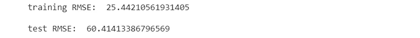**

**该模型的性能似乎相当好，即使在训练集和测试集上的性能之间存在差异。解释模型性能的另一个工具是“特征重要性”，这是表示每个特征变量如何对模型做出贡献的分数。因此，我们可以绘制特征重要性:**

**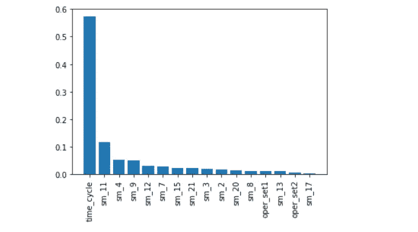**

**对模型贡献最大的特征是 time_cycle。其他重要变量是传感器测量值 11、4、9，而其余特征在模型中不太相关。很明显，操作设置 1 和 2 在模型中并不重要，最好尝试将它们从训练集和测试集中删除。**

**另一种使模型表现更加公正的方法是进行 k 倍交叉验证。想法是将数据集分成 k 个部分，k-1 个用于训练，剩下的一个用于测试，以避免过度拟合。事实上，肯定有数据集的部分不具有代表性，并可能导致误解的结果。**

****

**平均均方根误差似乎比之前获得的结果(60.4)好得多。然后，我们通过对数据集进行更多次的训练和测试，获得了更好的性能。**

# **最终想法:**

**恭喜你！现在您对预测性维护的真正含义有了一个概念。一个实际的例子是理解这些概念如何在现实中应用的唯一方法。**

**困难的任务是了解如何管理数据集的许多要素，以及必须选择或移除哪些要素。有许多可能的解决方案，而不是只有一个。很多其他的机器学习和深度学习模型都可以用在这个回归问题上。**

**这里的 GitHub 代码是。感谢阅读。祝您愉快！**

****你喜欢我的文章吗？** [***成为会员***](https://eugenia-anello.medium.com/membership) ***每天无限获取数据科学新帖！这是一种间接的支持我的方式，不会给你带来任何额外的费用。如果您已经是会员，*** [***订阅***](https://eugenia-anello.medium.com/subscribe) ***每当我发布新的数据科学和 python 指南时，您都可以收到电子邮件！*****