# CT 图像中 CT 切片相对位置的预测

> 原文：<https://pub.towardsai.net/prediction-of-relative-locations-of-ct-slices-in-ct-images-99f2bc8402e1?source=collection_archive---------1----------------------->

## 使用主成分和弹性网| [向 AI](https://towardsai.net) 回归

## 使用对非常高维数据的回归技术来预测 CT 切片在人体轴上的相对位置


回归是机器学习中最基本的技术之一。简单来说就是‘通过其他独立的分类/连续变量来预测一个连续变量’。挑战来了，当我们有高维，即太多的独立变量。在本文中，我们将讨论一种使用主成分和 ElasticNet 对高维数据进行回归建模的技术。我们还将看到如何保存该模型以供将来使用。

## 获取数据和问题定义

我们将使用 Python 3.x 作为编程语言，使用“sci-kit learn”、“seaborn”作为本文的库。

这里使用的数据可以在 [UCI 机器学习库](https://archive.ics.uci.edu/ml/datasets/Relative+location+of+CT+slices+on+axial+axis)找到。数据集名称为“轴向轴数据集上 CT 切片的相对位置”。该文件包含各种患者(男性&女性)的医学 CT 扫描图像的提取特征。特征本质上是数字的。按照 UCI 的说法，目标是“预测 CT 切片在人体轴上的相对位置”。

让我们探索数据集，以便更清楚地理解它


图 1

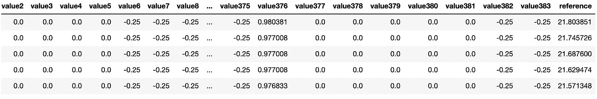

图 2

从上面的数据集中，我们可以看到名为' value0 '，' value1 '，..“值 383”包含每个患者的 CT 扫描图像的特征值。最后一个变量是“reference”。这个“参考”是我们的目标变量，它包含 CT 切片的相对位置。

所以，我们的问题是预测其他特征的“引用”。总共有 384 个特征(独立变量，如“值 0”、“值 1..等等)并且总的数据集大小是 53500。由于我们的目标变量‘reference’本质上是连续的，这是一个回归问题。

## 分析数据

由于有太多的功能，我们的任务变得更加复杂。在这里，选择正确的一组非常重要。所有这些特性都同样重要吗？或者这些是相互关联的？我们将努力找到这些答案。

首先，我们需要删除不必要的变量**‘patient id**’，分离特征和目标变量。

```
df = df.drop(['patientId'], axis=1)
df_y = df['reference']
df_x = df.drop(['reference'], axis=1)
```

因此，数据框“df_y”是我们的目标变量，数据框“df_x”包含所有特征。

主成分分析(PCA)可以揭示很多细节，减少特征数量。让我们看看如何做到这一点。


图 3

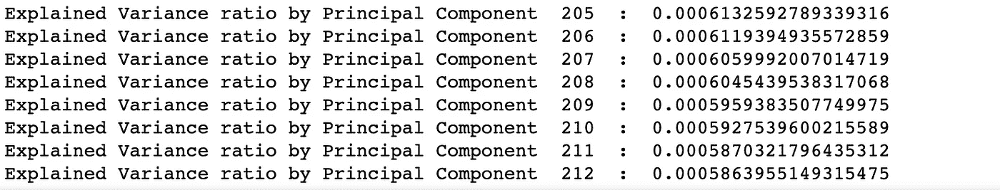

图 4

我们做了主成分分析，它可以容纳高达 95%的数据差异。结果表明，总共有 212 个主成分(PC)负责 95%的方差。

“pca_vectors”看起来像这样:

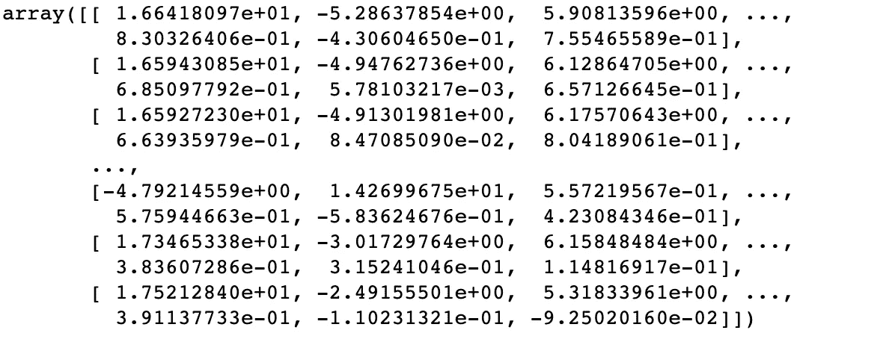

图 5

我们可以把这些 PC 当做功能。因此，通过这种方式，我们能够将维度从 384 减少到 212(维度减少了近 44.7 %)。

我们可以减少更多，但可能不得不牺牲解决方案的准确性。出于这个原因，我们将在这里停下来，使用这些电脑作为我们的功能。请记住，电脑是虚拟功能，并不实际存在，也就是说，不可能在物理上与数据相似。此外，这些 PC 中的每一个都彼此不相关，因此多重共线性问题消失了。

我们现在将看到，这些电脑是如何解释我们的目标变量'参考'。我们将使用前 3 个(最重要的)和后 3 个(最不重要的)电脑做一个“*回归图*”。(因为这些是按解释的差异百分比降序排列的)

回归图

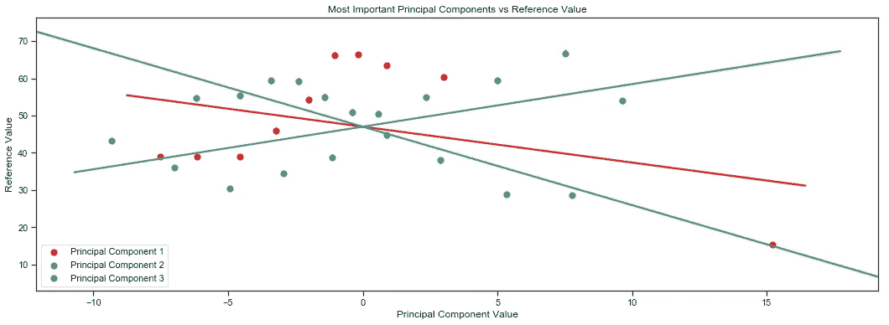

图 6

我们可以看到，前 3 个 PC 相当占优势，并影响着“参考”。接下来是最后 3 件。

回归图

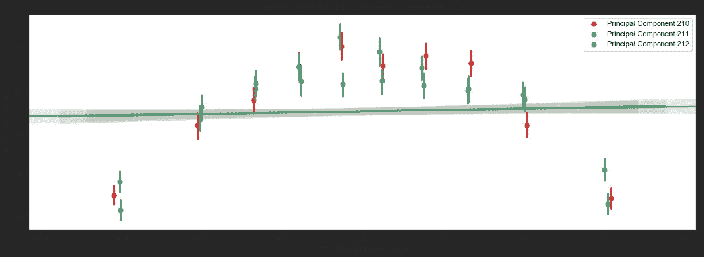

图 7

由于回归线几乎平行于 x 轴，我们可以说最后 3 个是最不重要的。

## 构建机器学习模型

现在，是做实际工作的时候了，即建立模型。我们已经有了一个特性集。我们将使用正则化的线性回归模型。在处理大量特征时，ElasticNet 提供了更好的准确性。这是“套索”和“山脊”回归之间的权衡。它的正则化参数由α*(α)给出。*当α = 1 时，它变成“套索”,当α = 0 时，它变成“脊”。为了更准确，我们应该将α设置在 0 和 1 之间。α是这里的超参数。

首先，我们应该将数据分成训练集和测试集

我们应该对最佳超参数进行交叉验证。我们将把α值保持在测试范围内(0.1，0.3，0.5，0.7，1.0)

让我们看看准确性

```
print('R2 value : ', r2_en)
```

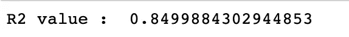

这个模型解释了几乎 85%的差异。这个挺好的。

让我们看看系数、α值和截距的值

```
print('Intercept: ', regr_en.intercept_) 
print('Alpha: ', regr_en.alpha_) 
print('Coefficients: ' , regr_en.coef_)
```

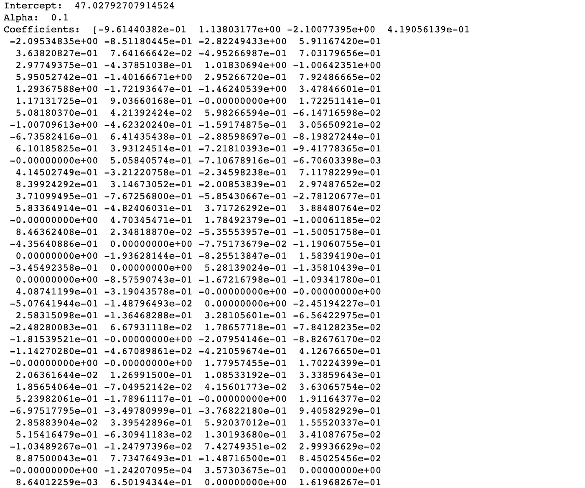

图 8

## 分析结果

根据线性回归方法，我们得到了 85%的准确率。现在，我们将看看它是如何受到最重要和最不重要的电脑的影响的，就像前面的分析一样。

我们将使用我们的模型估算的*【参考】*值，而不是原始值，绘制*【回归图】*(与之前的分析不同)。

使用前 3 台电脑

回归图

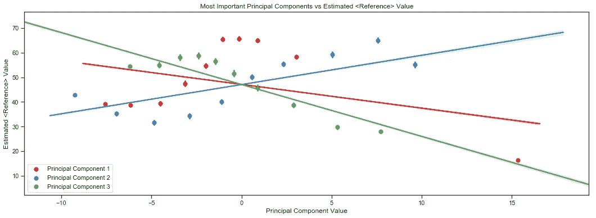

图 9

使用最后 3 台电脑

回归图

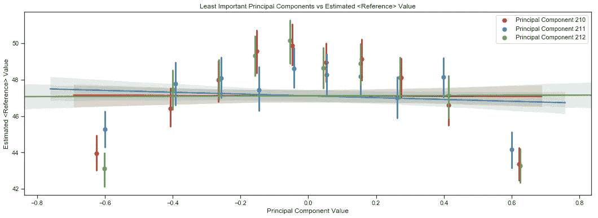

图 10

与图 7 相比，我们在图 10 中看到了显著的改进。这意味着估计值表现良好。

我们可以得到如下测试数据的估计残差或误差

```
residuals = test_y - regr_en.predict(test_x)
```

现在，我们将看到*【残差图】*的测试数据

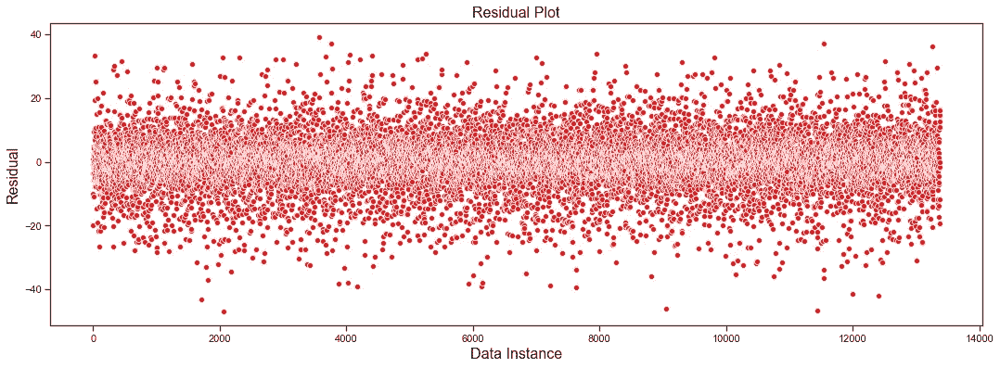

图 11

我们可以看到‘残积’没有模式，完全是随机的。根据线性回归方法，它表明是一个好模型。

## 为生产就绪模型构建管道

为了在生产中使用，我们需要以机器学习流水线的方式构建模型。

我们可以使用这个管道模型预测任何实时数据实例

```
pl_test_x[20:21]
```

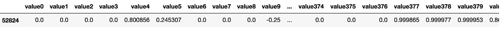

图 12

原始数据集中的“引用”值

```
pl_test_y[20:21].values
```

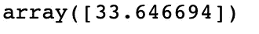

图 13

现在，让我们使用我们的模型预测“参考”值，并与原始数据集值进行比较

```
pl_model.predict(pl_test_x[20:21])
```

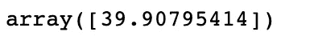

图 14

有一个可以忽略的偏差。

## 持久化模型以供将来使用

我们可以在模型中持久化，并按需加载它以备将来使用

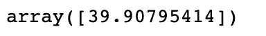

图 15

## 结论

我们学习了如何使用主成分来描述特征和相关性，建立回归模型和预测值。还有其他回归模型。这篇文章的读者可以尝试一下。Jupyter 笔记本可以在 Github 上找到。

## 参考

[1]主成分分析—[https://towards data science . com/a-一站式主成分分析-5582fb7e0a9c](https://towardsdatascience.com/a-one-stop-shop-for-principal-component-analysis-5582fb7e0a9c)

[2]弹性网，套索&脊回归—[https://medium . com/@ Yong Deng/regression-analysis-Lasso-Ridge-and-Elastic-Net-9 e 65 DC 61 d6d 3](https://medium.com/@yongddeng/regression-analysis-lasso-ridge-and-elastic-net-9e65dc61d6d3)

最近，我写了一本关于 ML([https://twitter.com/bpbonline/status/1256146448346988546](https://twitter.com/bpbonline/status/1256146448346988546))的书