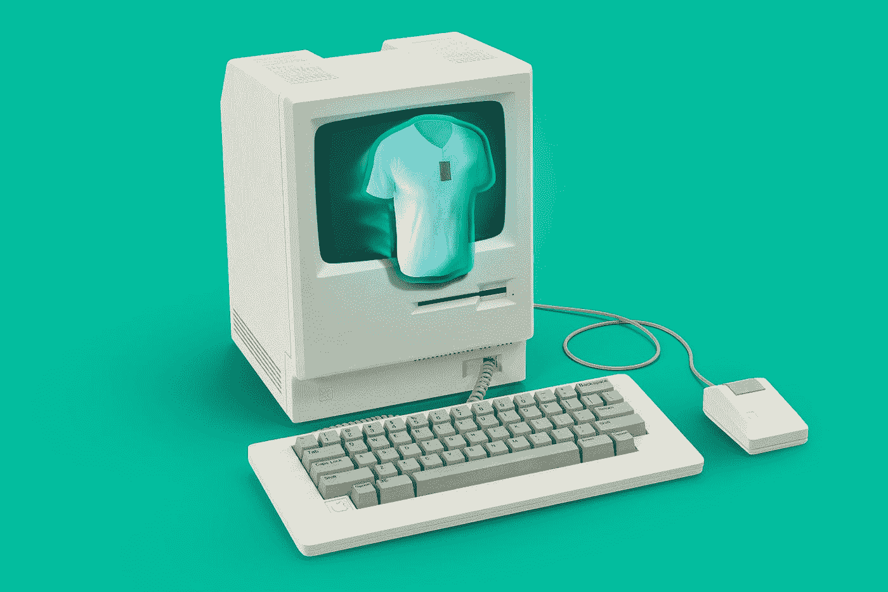
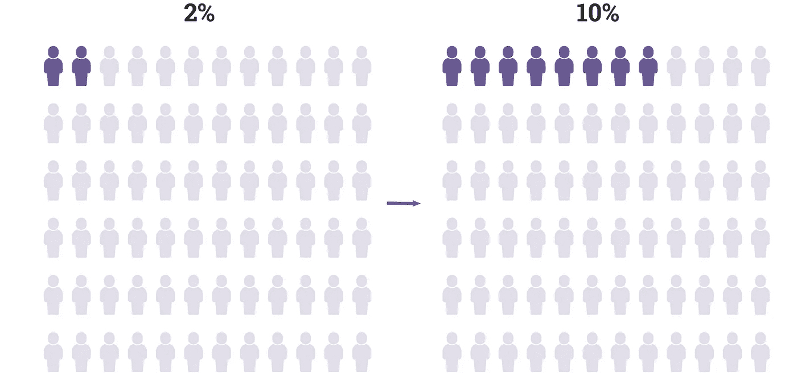
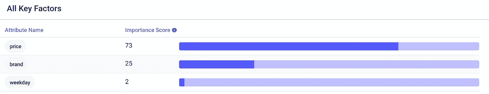
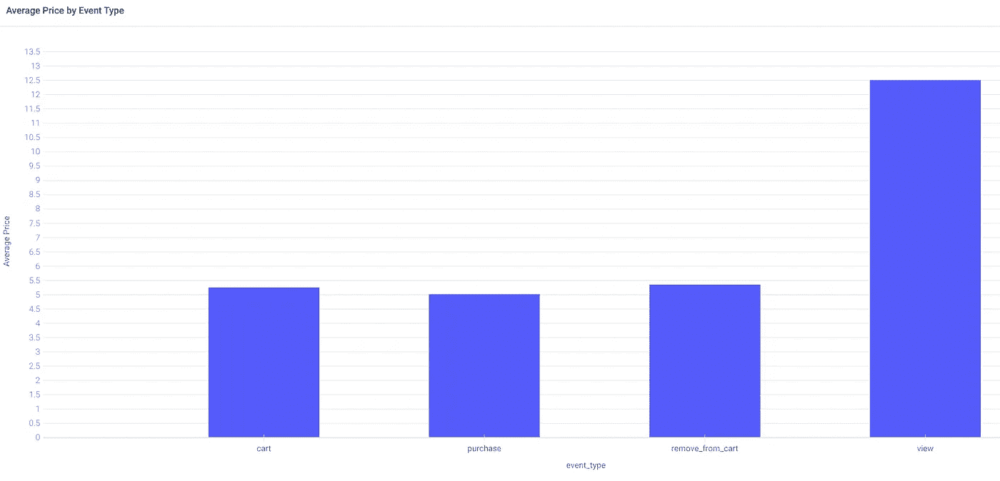
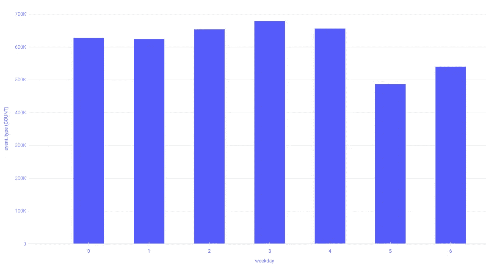

# 电子商务的预测洞察力

> 原文：<https://pub.towardsai.net/predictive-insights-for-e-commerce-f1569f61b29b?source=collection_archive---------4----------------------->

## [数据科学](https://towardsai.net/p/category/data-science)

## 电子商务的人工智能。



照片由[晨酿](https://unsplash.com/@morningbrew?utm_source=medium&utm_medium=referral)在 [Unsplash](https://unsplash.com?utm_source=medium&utm_medium=referral) 上拍摄

普通的电子商务商店转化了不到 3%的访问者。随着来自亚马逊等零售商和超过 50 万家 Shopify 商店的竞争压力不断增加，吸引访客变得越来越难，零售商需要最大限度地吸引访客。



如果你有一个典型的转化率，几乎所有的访问者都浪费了。即使你成功吸引了 10，000 名访客，其中 9，800 人也不会转变。在这里，我们将探讨如何使用数据来提高转化率。

# 数据

例如，我们将分析来自化妆品商店的[电子商务数据](https://www.kaggle.com/mkechinov/ecommerce-events-history-in-cosmetics-shop)，其中包含购物者事件(当访问者查看产品、将产品添加到购物车、从购物车中移除产品或购买产品时)和产品信息。

因为数据非常大，所以它被分为五个 CSV，从 2019 年 10 月到 2020 年 2 月。为了简单起见，我将只下载 2020 年 1 月的数据集。

您可以下载所有这些数据，并使用 Python 中的以下代码“连接”它们以获得一个大数据集:

```
df = pd.concat(["2019-Oct.csv", "2019-Nov.csv", "2019-Dec.csv", "2020-Jan.csv", "2020-Feb.csv"], ignore_index=True)
```

来分析一周中的某一天对转化的影响(也许人们在工作日累了忙了就转化少了？)，我们需要做一个新的专栏。我们可以用`.weekday()`函数来做这件事。

```
df['weekday'] = df['event_time'].apply(lambda s: str(datetime.strptime(str(s)[0:10], "%Y-%m-%d").weekday()))
```

## 格式

要在任何表格数据中找到预测性见解，您需要一个 **KPI** 和**属性。**我们的 KPI 是`event_type`列，可以是*视图*、*购物车*、 *remove_from_cart* 或*采购*，我们的属性是所有其他列，包括我们创建的`weekday`列。

让我们将数据帧转换回 CSV 格式，这样我们就可以上传到 Apteo:

```
df.to_csv(‘data.csv’,index=False)
```

# 分析

在 Apteo 中，我们选择前面提到的 KPI，`event_type`。现在，我们可以看到每个属性是如何影响 KPI 的。

事实证明，我们的`weekday`属性没有太大的影响，产品`price`和`brand`是`event_type`的非常强的预测器。



通常情况下，用户*查看*的产品价格较高，而用户*购买*的产品价格较低。



如果我们考虑购物者的心理，这是有道理的。我们自然会被高档奢侈品所吸引，无论是经销店的兰博基尼、手表店的劳力士，还是像乔治·阿玛尼这样的高端化妆品。

然而，仅仅因为我们更多地看高端商品，并不意味着我们买得更多。事实上，超过 90%的消费者仍然是“寻找便宜货的人”

购物者寻找便宜货的天性解释了为什么品牌和价格如此重要:购物者首先要以最低的价格寻找最好的品牌。

## 对比效应

由于所谓的对比效应，即使只是展示高端商品也会有助于低价商品的销售。

书中给出了对比效果的一个流行例子[是的！:50 个经过科学验证的有说服力的方法](https://www.amazon.com/Yes-Scientifically-Proven-Ways-Persuasive/dp/1416576142) : Williams-Sonoma 公司有一个售价 275 美元的面包机，但没有卖出去，当他们在旁边增加一个售价 429 美元的面包机时，售价 275 美元的面包机销量几乎翻了一番。

## 周末潜水

通过绘制工作日的总事件数，我们可以看到站点何时最繁忙。



上图中，工作日表示为 0–6，即周一至周日。我们可以看到，平日的交通流量明显较高，周末则较低。

许多 Quora 回答证实了这一趋势，并给出了一些解释:

*   很多人在工作日上班时浏览互联网。
*   人们周末外出放松。

# 摘要

分析这个电子商务数据集向我们表明，化妆品购物者正在寻找价格最低的最佳品牌，拥有昂贵品牌的洞察力非常重要——即使他们没有被买得那么多，因为相比之下，他们让其他优惠看起来像便宜货。

通过分析你的电商 KPI，你可以看到哪些属性是最重要的，如何进行相应的优化。