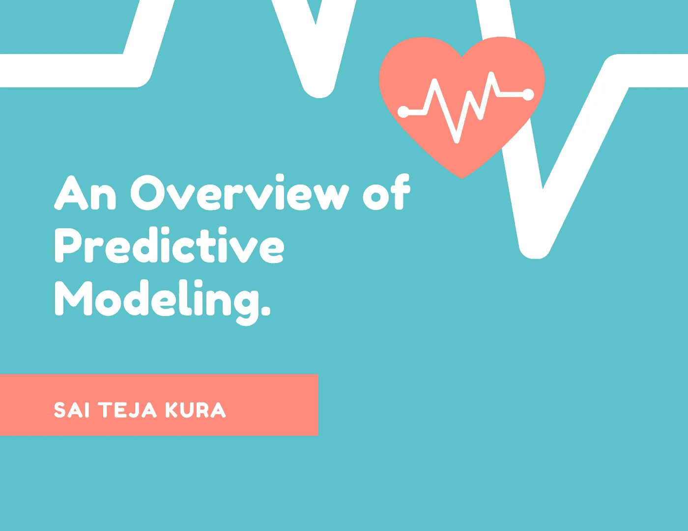
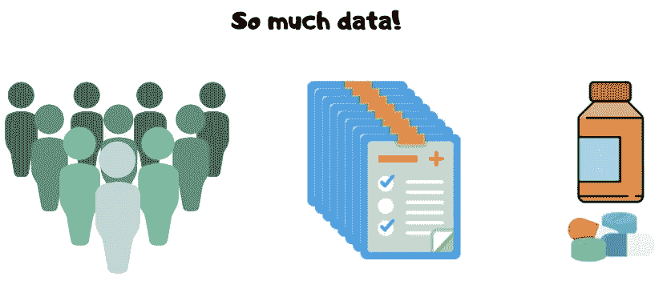
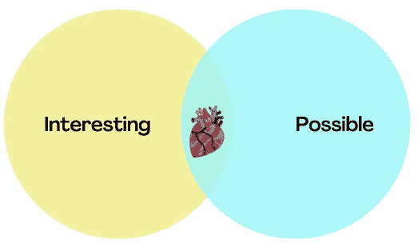
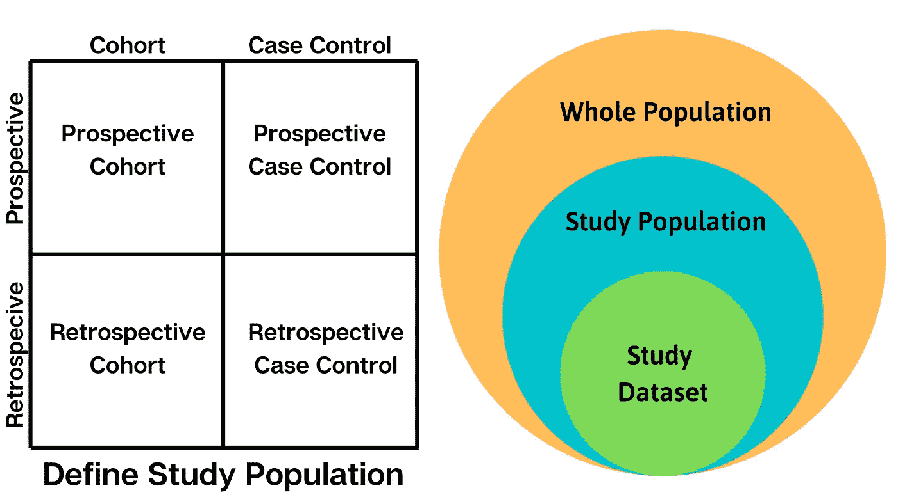
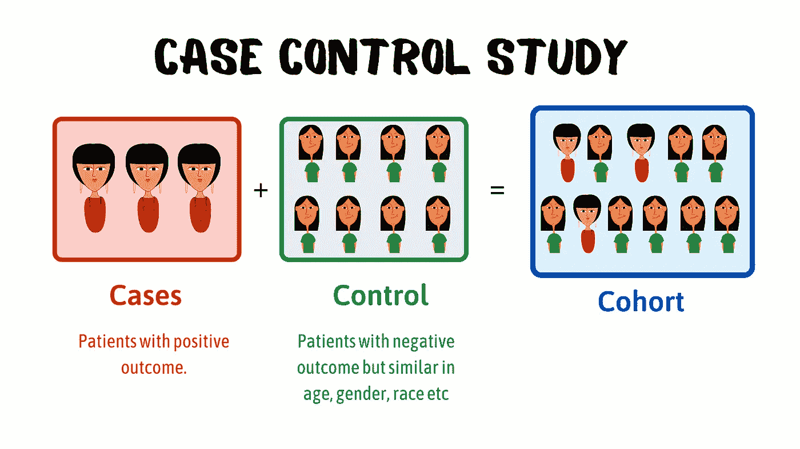
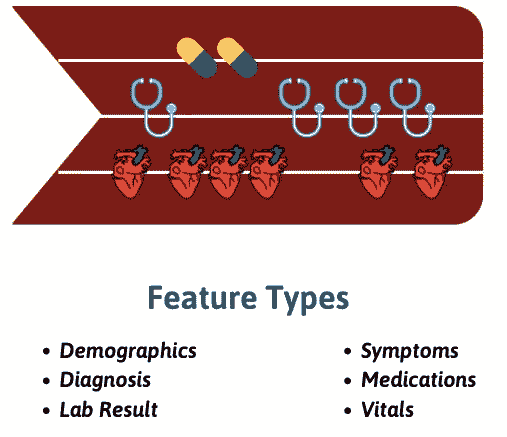
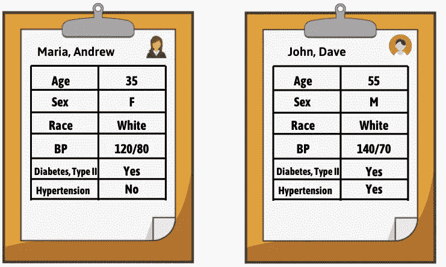
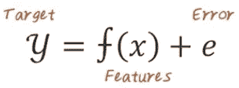
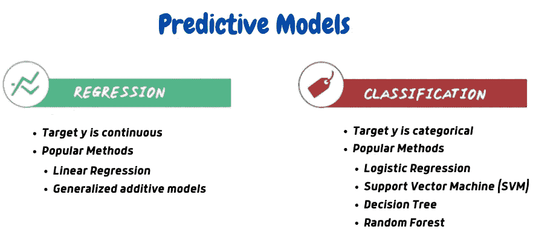
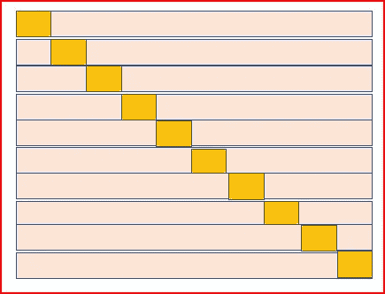

# 医疗保健分析中的预测建模

> 原文：<https://pub.towardsai.net/predictive-modeling-in-healthcare-analytics-463c5ef0ceca?source=collection_archive---------0----------------------->

## [数据科学](https://towardsai.net/p/category/data-science)

## 让我们了解如何在医疗保健系统中建立一个良好的预测模型。

使用 Canva 设计

测试！最近，我们大多数人都经常听到这个词。对新冠肺炎患者的检测不足导致了全世界病例的漏报。这也使健康人群面临被感染的风险。现在，如果我们可以利用以前的临床数据预测一个人感染某种疾病的几率会怎么样？这就是预测建模发挥作用的地方。

预测建模是对历史数据进行建模以预测未来事件的过程。例如，通过使用患者的电子健康记录(EHR ),我们可以创建一个模型来预测患者是否有心力衰竭的风险。在本文中，我将尝试并解释我们如何使用 EHR 快速开发一个好的预测模型。

> 根据 CMS.gov 的说法，**电子健康记录** (EHR)是患者**医疗**历史的**电子**版本。

## 什么使得预测建模具有挑战性？

我们有数百万患者、他们的诊断信息、临床数据等等。所有的数据结合在一起会带来巨大的挑战。预测建模的另一个挑战是要建立大量的模型。预测建模流程中的每一步都有许多不同的选项。选择合适的很重要！

使用 Canva 设计。

# 预测建模管道

预测建模不是一个单一的算法，而是一个包含多个步骤的计算管道。首先，我们决定预测目标，例如，患者在未来几年内是否会发生心力衰竭。其次，我们为研究构建了相关患者的队列(一组具有共同特征的人)。第三，我们为研究定义所有潜在的相关特征。第四，我们选择仅与目标预测相关的特征。第五，我们计算预测模型，然后评估预测模型。我们重复这个过程几次，直到我们对结果满意。

使用 Canva 设计。

## 1)预测目标

通常有许多目标，调查人员希望利用他们掌握的数据进行预测。然而，只有其中的一部分是可能的。因此，我们应该选择一个预测目标，解决调查者感兴趣的主要问题，并利用现有数据回答可能的问题。在这篇文章中，我们将调查心力衰竭的发病，这是一个有趣的和潜在的可能的目标。

使用 Canva 设计

你可能会想… **为什么我们需要创建一个预测心力衰竭的模型？** 早期发现心力衰竭有很多好处。首先，心力衰竭是一种非常复杂的疾病。它有许多潜在的不同临床特征。我们还可以降低住院费用。我们还可以尝试和发明新的早期干预，可以减缓心力衰竭的进展，提高生活质量，降低死亡率。从长远来看，我们可以改善现有的心力衰竭预防临床指南。

## 2)队列构建

队列建设是关于定义**研究人群**。让我们考虑一下在印度预测心力衰竭的案例。收集全印度人口的数据是不合适的。我们需要找出相关人群(研究人群)来收集数据。有心力衰竭风险的人群。实际上，很难从整个研究人群中收集数据。因此，我们将只收集研究人群的子集并进行分析。你可能会问**我们如何定义研究人群？**

我们可以使用下图所示的矩阵来定义研究人群。

使用 Canva 设计。

## 前瞻性与回顾性

在**回顾性研究**中，对患病人群进行采样，并收集他们过去的数据。
*例子* —一组 100 名患有心脏病的人可能会被问及他们的生活方式和病史，以研究疾病的起源。

在**前瞻性研究**中，对人群(有心力衰竭风险)进行取样并跟踪一段时间，然后收集他们的数据。
*例* —对一组 100 名具有心力衰竭高危因素的人进行为期 5 年的研究，以了解他们是否会患上这种疾病。

## 队列研究与病例对照研究

在**队列研究**中，我们选择了一组面临特定风险的患者来构建队列。
在*前瞻性队列*的情况下，我们对选定的患者进行随访，确定患病和未患病的患者，并对他们进行比较。
在*回顾性队列*的情况下，我们分析所选患者的病史。

在病例对照研究中，我们确定两组患者，即**病例**和**对照**，并将它们组合起来构建队列。

使用 Canva 设计。

## 3)特征构建

特征构建任务基于患者的 EHR 数据为每个患者计算**特征向量表示**。EHR 数据可以被视为随时间推移的多个*事件序列*(例如，一个患者可以在不同日期有多个高血压诊断)。为了将这样的事件序列转换成特征变量，**规定了一个观察窗口**(例如一年)。那么窗口内的所有事件被聚集成一个或一小组值。

使用 Canva 设计。

## 4)特征选择

在要素构建步骤中，我们根据观察窗口中收集的原始数据构建要素。我们可以构建许多特征，但并非所有特征都与预测目标相关。特征选择的目标是找到**真正相关的特征**，帮助预测目标。考虑下面显示的两个病人图表。

使用 Canva 设计。

我们可以看到人口统计(年龄、种族、性别)和生命体征(血压)以及诊断(高血压和糖尿病)等特征。然而，在现实中，这个病人图表并不那么简单。事实上，我们可以从给定的 EHR 数据集构建超过 10k 个要素。并非所有这些都与预测目标相关。特征选择的目标是识别满足特定目标条件的特征。

## 5)预测模型

预测模型是一个**函数**，它将患者的*输入特征*映射到*输出目标*。例如，如果我们知道患者过去的诊断、药物治疗、实验室结果，并且如果我们还知道功能，那么我们可以评估患者患心力衰竭的可能性。根据目标值，模型可以是**回归**或**分类**模型。

在*回归*的情况下，目标值 y 为**连续**。例如，如果我们想预测病人将承受的费用，我们可以使用回归模型。

在*分类*的情况下，目标值 y 为**分类**。例如，如果我们想预测患者是否患有心力衰竭，我们可以使用分类模型。

## 6)绩效评估

最后一步是评估我们的模型有多好。基本的想法是使用一些训练样本来开发我们的模型，但是在看不见的例子上测试这个模型。需要注意的是
1。**训练错误**没用。
通过使用不能很好地概括测试样本的复杂模型，我们可以很容易地减少我们的训练错误。
2。**测试误差**是*关键*指标。
测试误差是模型在测试样本上的真实性能的更好近似。
经典的评估方法是**交叉验证。**

## 交叉验证

交叉验证的主要思想是迭代地将数据集分成训练集和验证集。我们将在训练集上构建模型，在验证集上测试模型，并重复这个过程几次。最后，在迭代中汇总性能。有三种常用的交叉验证方法。
1。留 1 CV
2。k 倍 CV
3。随机简历。

**留 1 CV** 在这种情况下，我们一次取一个样本作为我们的验证集，使用剩余的样本集作为训练集，并多次重复上述过程。

**K 倍 CV** 在这种情况下，我们使用 K 个样本作为我们的验证集，使用剩余的(n-k)个样本作为训练集，并多次重复上述过程，而不是一次取一个样本。我们将数据集分成 k 个子集，迭代地选择每个子集作为验证集。

**随机 CV** 我们将样本随机分成训练集和验证集。这种方法的一个缺点是，由于随机选择，一些观察值可能永远不会成为验证集的一部分，这与上面两种方法不同，在上面两种方法中，每个样本都是验证集的一部分。

# 结论

在本文中，我试图解释在医疗保健领域执行预测建模的方法。我的主要目的是解释在特定领域的真实世界中典型的数据科学项目所涉及的过程。术语可能有所不同，但核心结构保持不变。我希望你今天带回家一些新概念！

如果想联系，**在**[**LinkedIn**](https://www.linkedin.com/in/saiteja-kura-49803b13b/)**上联系我。**