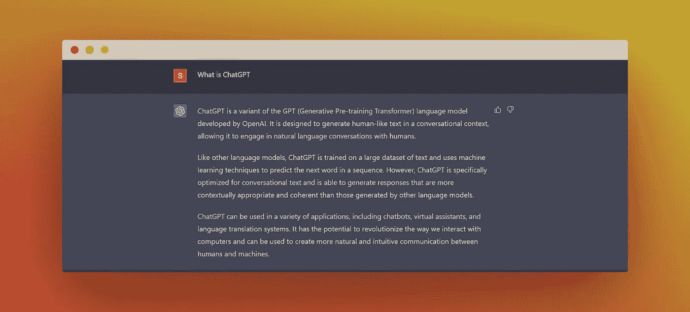
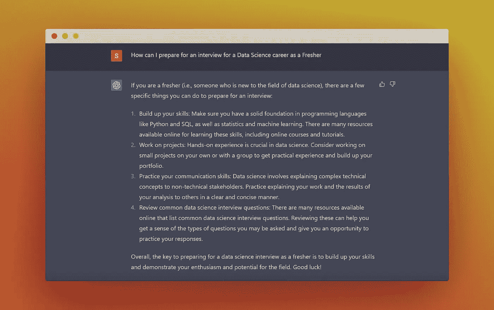
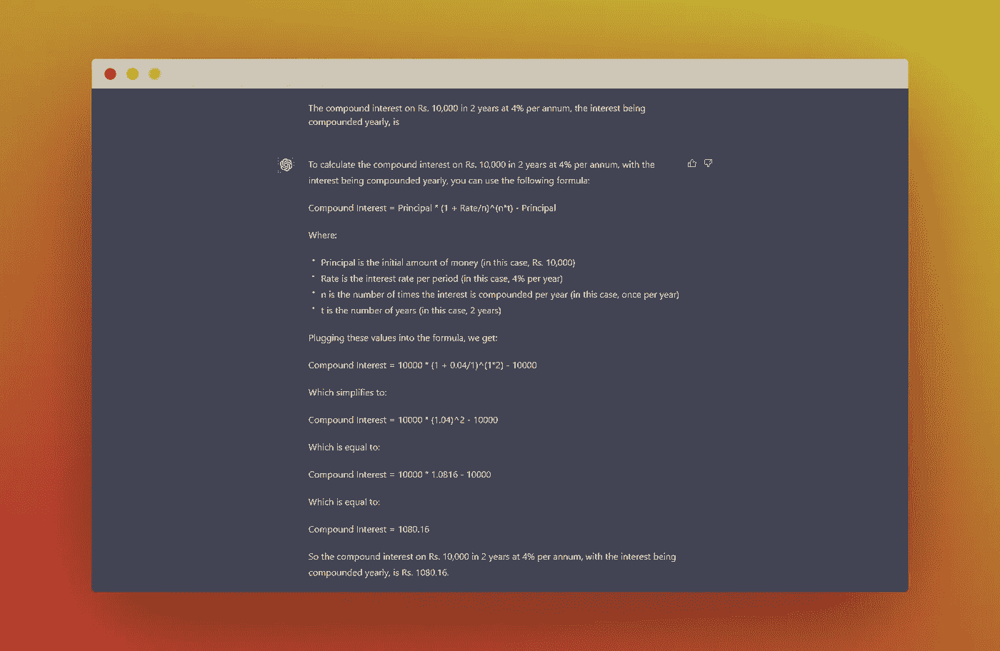
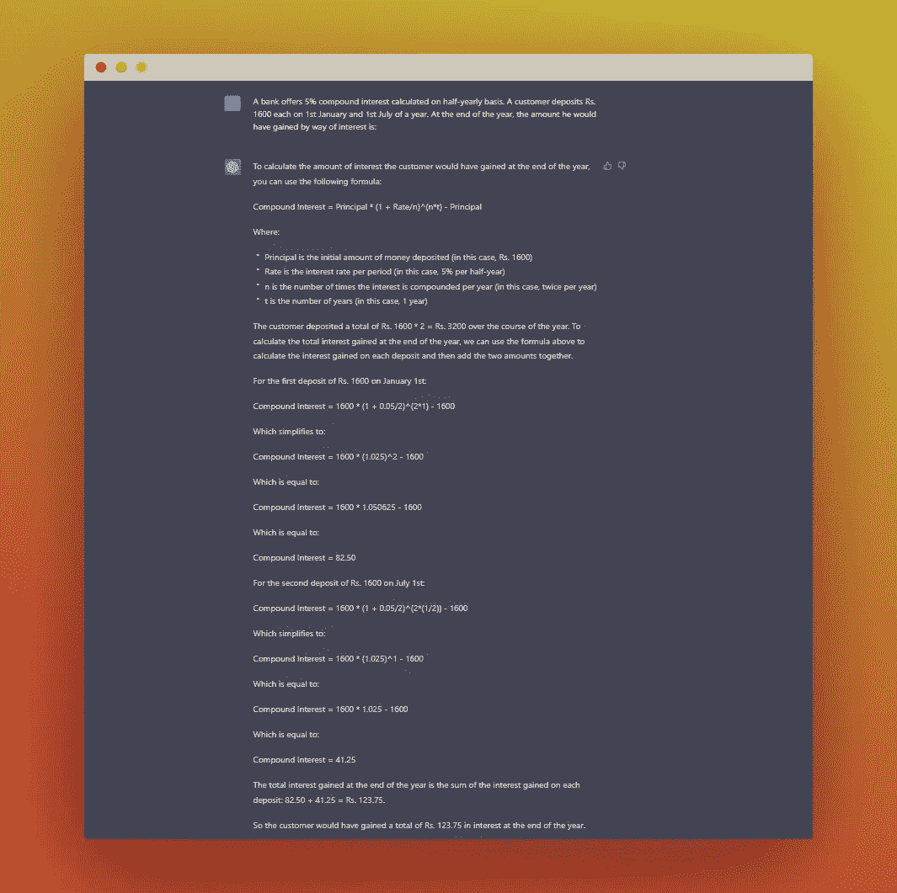
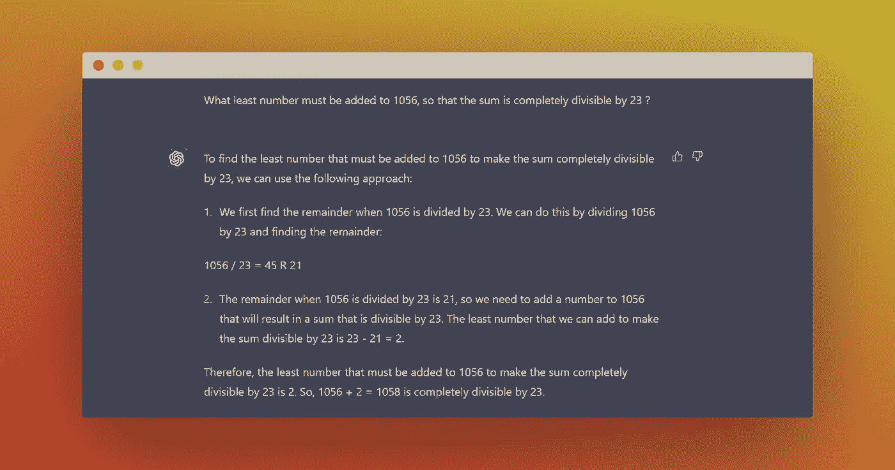
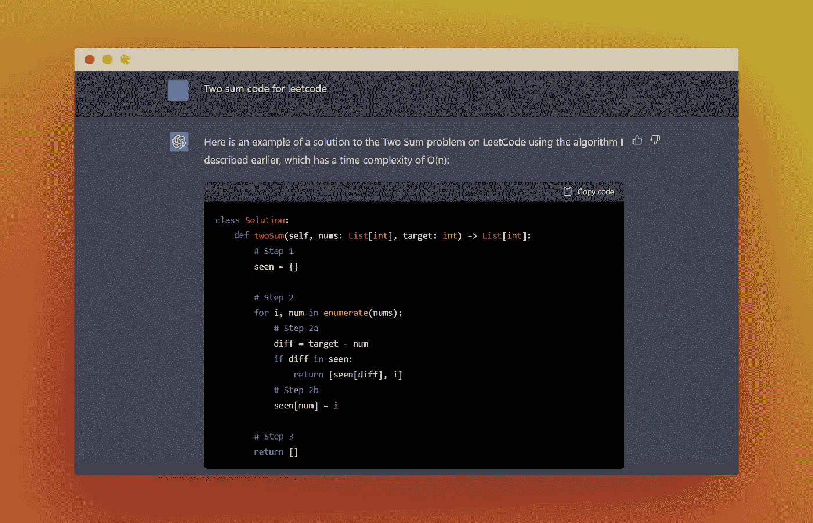
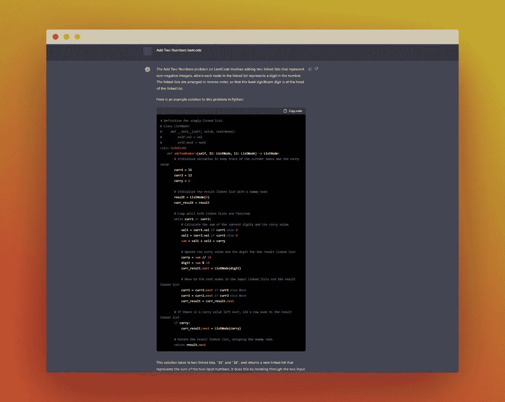
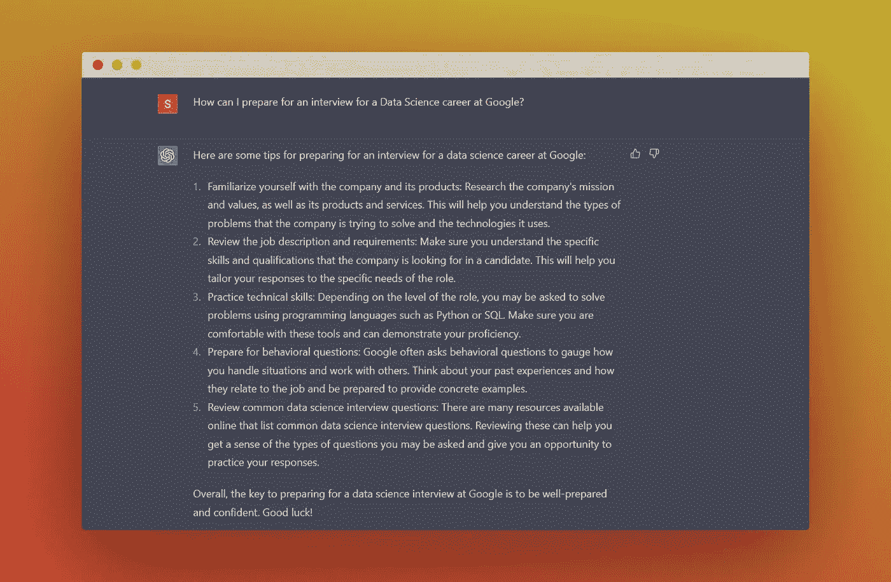
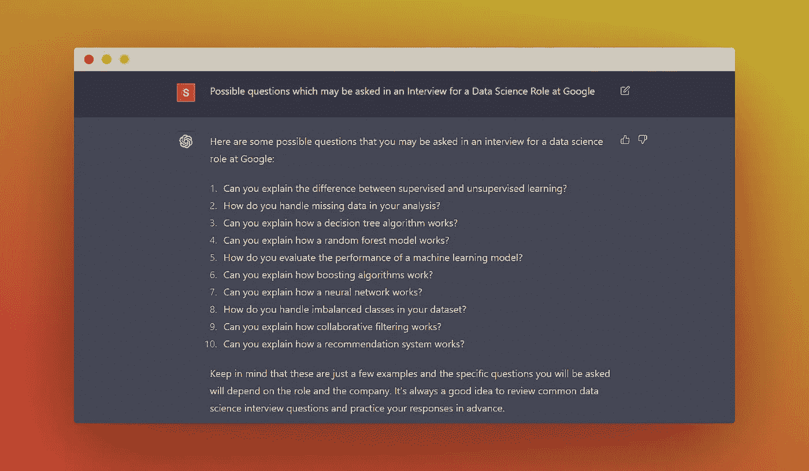

# 用 ChatGPT 为 Google 的数据科学面试做准备

> 原文：<https://pub.towardsai.net/preparing-for-data-science-interview-at-google-with-chatgpt-45f6b7a43373?source=collection_archive---------2----------------------->

## 这将有助于您准备 ChatGPT AI 的面试。

作者图片

ChatGPT 及其令人印象深刻的功能最近引起了人们的兴奋，因为他们考虑未来技术可能拥有的可能性和进步。许多人对 ChatGPT 的独特功能着迷，并渴望看到它和其他前沿技术如何随着时间的推移继续发展和改进。通过 ChatGPT 和类似的模型，我们可以看到人工智能和自然语言处理在我们日常生活中发挥更重要作用的未来，使我们能够以更直观和更像人类的方式与机器互动。无论是通过虚拟助手、聊天机器人还是其他创新应用，ChatGPT 及其继任者都有可能显著改变我们与技术交流和互动的方式。

# 什么是 ChatGPT？

ChatGPT 是由 OpenAI 开发的 GPT(生成式预训练转换器)语言模型的变体。它旨在在对话上下文中生成类似人类的文本，允许它与人类进行自然语言对话。与其他语言模型一样，ChatGPT 在大型文本数据集上接受训练，并使用机器学习技术来预测序列中的下一个单词。然而，ChatGPT 专门针对对话文本进行了优化，可以生成比其他语言模型生成的响应更符合上下文且更连贯的响应。ChatGPT 可用于各种应用，包括聊天机器人、虚拟助理和语言翻译系统。它有可能彻底改变我们与计算机的交互方式，并可用于在人类和机器之间创建更自然和直观的交流。

作者图片

在练习并弄清楚 ChatGPT 是如何工作的之后，我决定为什么不利用它来练习面试或者只是提高我的技术能力。假设以下场景:一位应聘者正在准备数据科学职位的面试作为一名大一新生，作为一名初学者，我问了 ChatGPT 一个最基本的问题:

## 大一新生如何准备数据科学职业的面试？

**ChatGPT 的回应:**

作者图片

> 如果你是一名新生(即数据科学领域的新人)，你可以做一些具体的事情来准备面试:
> 
> 增强你的技能:确保你在 Python 和 SQL 等编程语言以及统计学和机器学习方面有坚实的基础。网上有很多学习这些技能的资源，包括在线课程和教程。
> 
> 项目工作:实践经验在数据科学中至关重要。考虑独自或与团队一起做一些小项目，以获得实践经验并建立自己的作品集。
> 
> 练习你的沟通技巧:数据科学包括向非技术利益相关者解释复杂的技术概念。练习用清晰简洁的方式向他人解释你的工作和你的分析结果。
> 
> 回顾常见的数据科学面试问题:网上有许多资源列出了常见的数据科学面试问题。回顾这些可以帮助你了解可能会被问到的问题类型，并给你一个练习回答的机会。
> 
> 总的来说，作为一名大一新生，准备数据科学面试的关键是增强你的技能，展示你对该领域的热情和潜力。祝你好运！

跟随 ChatGPT 的脚步，对于大一新生来说，最重要的练习是利用 Python 或 SQL 等数据科学语言来提高解决问题的能力。然而，在学习语言之前明确地进行编程可能没有那么有效。因此，我们将通过使用 ChatGPT 练习定量智能和定量推理来巩固基础和提高批判性思维技能。

# 定量能力:

在这篇博客中，我将使用 [Indiabix 网站](https://www.indiabix.com/)来接收学习基础知识的问题，但是如果我迷路了，并且没有关于某个特定问题的相关解释，那么实际的问题是我们是否可以信任 ChatGPT 来准确地处理能力倾向问题。以下是一些与能力倾向问题相关的示例:

**ChatGPT 的回应:**

作者图片

作者图片

作者图片

结果:在我向 ChatGPT 提出的 6 个不同类型的问题中，它只能回答一个正确的答案，这也是一个简单的数字系统问题。

这些结果确实令人惊讶。ChatGPT 在解决定量能力倾向问题时有很多计算错误，但不要认为 ChatGPT 提供了欺诈性或随机的答案。ChatGPT 解决每个问题的过程是可信的，但在解决问题的过程中可能会忽略，但我们必须记住，ChatGPT 不是为回答学术问题而构建的人工智能，它建立在现实世界的数据上，而学术问题假设了许多基本的事情。

尽管如此，最后，你可能需要根据你的能力来练习能力倾向问题；然而，询问特定的问题，例如复利、平均值、中位数等的公式，可能是学习和发展 ChatGPT 的最佳方式。

# 编程:

ChatGPT 是 OpenAI 的 GPT 语言范式的变体，似乎已经被程序员积极地讨论，并在许多博客中用于产生代码。ChatGPT 似乎被广泛认为是创建了正确的代码。ChatGPT 旨在用于聊天机器人和其他对话式人工智能系统，它可以解释和创建类似于人类书写的文本。程序员最有可能使用 ChatGPT 为一系列应用程序编写代码，而且结果非常令人满意。然而，需要强调的是，ChatGPT 和其他语言模型有其局限性，并不总是能产生正确或合适的结果，尤其是在需要更复杂语言理解的情况下。下面是我从 Leetcode 上拿的一些编程问题和 ChatGPT 给出的解决方案，

**ChatGPT 的回应:**

1.  leetcode 的两个和码(在 ChatGPT 中输入)

作者图片

2.将两个数字 leetcode 相加(在 ChatGPT 中输入)

作者图片

然而，ChatGPT 生成的代码的准确性可能取决于用户如何与模型交互。例如，如果用户向 ChatGPT 提供清晰简洁的指令，模型将有可能生成准确的代码。但是，如果指令不明确或不完整，ChatGPT 可能会很难生成满足用户需求的代码。此外，ChatGPT 和其他语言模型具有局限性，可能不总是产生准确或适当的结果，特别是在需要更高级语言理解的任务中。总的来说，在使用 ChatGPT 和其他语言模型生成代码或其他类型的输出时，仔细考虑它们的输入和限制是很重要的。

# 面试准备:

在这一步中，最好选择一个特定的组织来更好地理解 ChatGPT 的响应，并对我们正在准备的内容有一个明确的目的。以下是我问 ChatGPT 的问题。它有助于人们理解潜在的本质方面以及培养其思维能力的过程。

如何准备谷歌数据科学职业的面试？

**ChatGPT 的回应:**

作者图片

以下是准备谷歌数据科学职业面试的一些技巧:

1.  熟悉公司及其产品:研究公司的使命和价值观，以及它的产品和服务。这将有助于你了解该公司试图解决的问题类型及其使用的技术。
2.  查看职位描述和要求:确保你了解公司在候选人身上寻找的特定技能和资格。这将有助于你根据该职位的具体需求来调整你的回答。
3.  练习技术技能:根据角色的级别，可能会要求你使用 Python 或 SQL 等编程语言来解决问题。确保你能熟练使用这些工具，并能证明你的熟练程度。
4.  为行为问题做好准备:谷歌经常问行为问题，以衡量你如何处理情况和与他人合作。想想你过去的经历，以及它们与工作的关系，并准备好提供具体的例子。
5.  回顾常见的数据科学面试问题:网上有许多资源列出了常见的数据科学面试问题。回顾这些可以帮助你了解可能会被问到的问题类型，并让你练习回答。

总的来说，准备谷歌数据科学面试的关键是做好充分准备，充满自信。祝你好运！

在比较我们之前的问题时，作为一名大一新生，我应该如何准备数据科学职业的面试，其具体问题是，我应该如何准备谷歌数据科学职业的面试？简单地问一个精确的、面向目标的问题提高了人工智能的反应；人工智能没有给出更宽泛的答案，而是提供了更具体的解决方案，比如要关注的特定领域以及经常使用的编程语言。现在回答下面的问题:

**在谷歌数据科学职位的面试中可能会被问到的问题**

**ChatGPT 的回应:**

作者图片

以下是你在谷歌数据科学职位的面试中可能会被问到的一些问题:

1.  你能解释一下监督学习和非监督学习的区别吗？
2.  你如何处理分析中缺失的数据？
3.  你能解释一下决策树算法是如何工作的吗？
4.  你能解释一下随机森林模型是如何工作的吗？
5.  你如何评估机器学习模型的性能？
6.  你能解释一下助推算法是如何工作的吗？
7.  你能解释一下神经网络是如何工作的吗？
8.  如何处理数据集中不平衡的类？
9.  你能解释一下协同过滤是如何工作的吗？
10.  你能解释一下推荐系统是如何工作的吗？

请记住，这些只是几个例子，您将被问到的具体问题将取决于角色和公司。回顾常见的数据科学面试问题并提前练习您的回答总是一个好主意。

让我们稍微思考一下我们的问题，

**这里有 50 个可能会在谷歌数据科学职位的面试中被问到的问题:**

**ChatGPT 的回应:**

1.  能否解释一下什么是数据科学，在行业中是如何使用的？
2.  你如何着手探索和理解一个新的数据集？
3.  能否描述一个你合作过的机器学习模型，并解释其工作原理？
4.  您如何处理分析中缺失或不完整的数据？
5.  你如何评价一个机器学习模型的性能？
6.  你能描述一下你不得不处理一个大型数据集的时候，以及你是如何着手分析它的吗？
7.  你能在机器学习的背景下解释偏差-方差权衡吗？
8.  你能描述一下你处理过的一个具有挑战性的机器学习问题，以及你是如何解决的吗？
9.  你如何着手为机器学习模型选择特征？
10.  你能解释过度拟合的概念以及如何减轻它吗？
11.  如何处理机器学习数据集中不平衡的类？
12.  你能描述一下你曾参与的一个项目吗？在这个项目中，你不得不与非技术人员交流你的发现。
13.  你如何着手为机器学习问题选择正确的评估标准？
14.  你能描述一下你不得不处理大量数据的时候以及你是如何做到的吗？
15.  能否解释一下正则化的概念，以及它是如何用在机器学习中的？
16.  你能描述一下你不得不与团队合作解决数据相关问题的时候吗？
17.  能否解释一下交叉验证的概念，以及在机器学习中是如何使用的？
18.  如何处理数据集中的异常值？
19.  你能描述一个你用过的需要特征工程的机器学习模型吗？
20.  你能解释一下集成学习的概念，以及如何用它来提高模型性能吗？
21.  你如何处理数据集中的类不平衡？
22.  你能描述一下你不得不使用数据可视化来交流你的发现的时候吗？
23.  能否解释一下深度学习的概念，以及它与其他机器学习技术有何不同？
24.  对于给定的问题，你如何着手选择正确的机器学习算法？
25.  你能描述一下你在工作中不得不使用自然语言处理(NLP)的时候吗？
26.  能否解释一下迁移学习的概念，以及如何应用在机器学习中？
27.  如何处理数据集中缺失或不完整的数据？
28.  你能描述一下你不得不在工作中使用无监督学习的时候吗？
29.  对于给定的机器学习问题，你如何着手选择正确的评估指标？
30.  您能解释一下增强的概念以及如何使用它来提高模型性能吗？
31.  如何处理数据集中不平衡的类？
32.  你能描述一下你不得不在工作中使用强化学习的时候吗？
33.  你如何着手为机器学习模型选择正确的特征？
34.  您能解释一下特征选择的概念以及如何使用它来提高模型性能吗？
35.  如何处理数据集中的异常值？
36.  你能描述一下你不得不使用特征工程来提高模型性能的时候吗？
37.  对于给定的问题，你如何着手选择正确的机器学习算法？
38.  你能解释过度拟合的概念以及如何减轻它吗？
39.  你怎么

ChatGPT 用于生成与数据科学相关的一系列问题的答案。然而，该模型在第 39 个问题之后停止提供答案。这可能是因为 ChatGPT 是为聊天机器人和其他对话式人工智能系统设计的，可能不太适合连续回答大量问题。或者，对于 ChatGPT 来说，问题变得太难或太具体而无法处理。无论如何，这一系列问题似乎是为了帮助人们了解更多关于数据科学的知识，并探索 ChatGPT 的功能。这些问题可能会涵盖广泛的主题，并挑战模型对数据科学概念的理解。总的来说，ChatGPT 和其他语言模型似乎可以成为学习和探索的有用工具，但了解它们的局限性并恰当地使用它们是很重要的。

# 我学到的教训:

1.  在我看来，ChatGPT 是一个将增强我们思维过程的 AI。在日常生活中使用它也会增加问题的清晰度和我们对任何概念的感知。
2.  当涉及到技术难点和解决方案时，开放式询问可能用处不大；相反，提出精确的问题。
3.  内容生成:ChatGPT 可以用来创建看起来像人类书写的文本，然后可以用来为网站或社交媒体生成内容。
4.  文本摘要:ChatGPT 可以用来创建能够将大段文本压缩成更短、更简洁的摘要的系统。