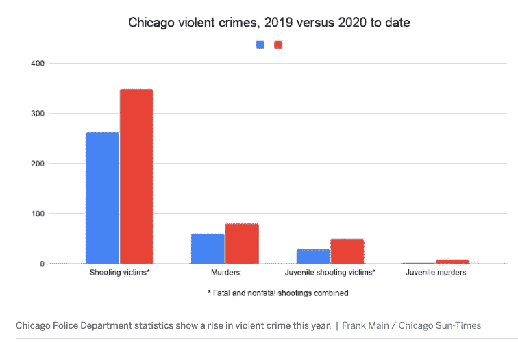
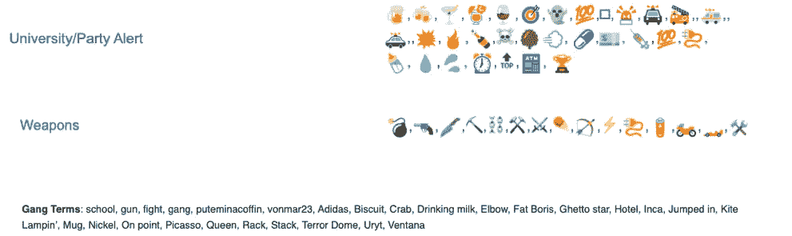
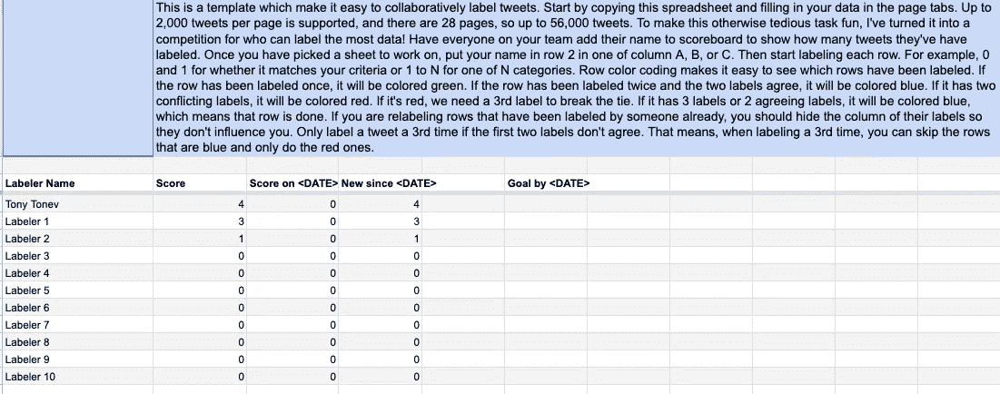
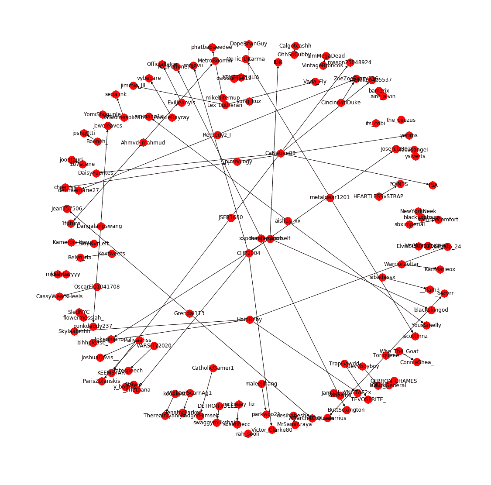
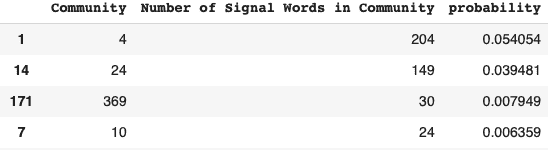
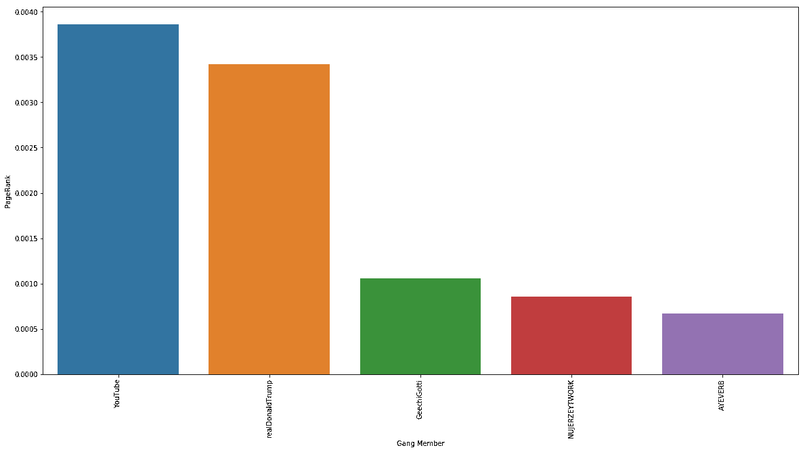
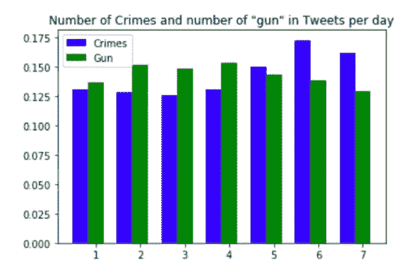
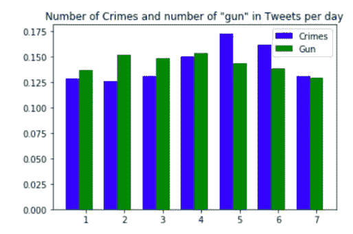
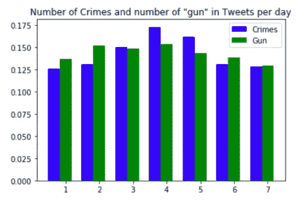

# 通过分析推文预防帮派暴力

> 原文：<https://pub.towardsai.net/preventing-gang-violence-via-analyzing-tweets-f8898da2756a?source=collection_archive---------2----------------------->

> “有些人认为加强学校安全可以阻止暴力，但这种反动措施只能解决部分问题。相反，我们必须在暴力行为发生之前识别威胁、降低风险并保护儿童和员工。”——Jeniffer Peters，Voice4Impact 创始人

(包括高阳、托尼·托涅夫和阿拉法特·本·侯赛因供稿)

芝加哥被认为是美国 T2 黑帮最猖獗的城市，拥有来自近 60 个派系的 10 万多名活跃成员。**帮派**争斗和报复在**芝加哥**很常见。与 2019 年相比，到目前为止，2020 年芝加哥的凶杀案上升了 43%。

## 我们可以用人工智能来减少帮派暴力吗

人们注意到，帮派经常使用 twitter 与帮派成员交流，并威胁其他帮派成员。帮派语言是图标和一些帮派术语的混合。

帮派语言示例

# 我们能否建立一个 AI 模型来理解帮派在谈论什么，并防止帮派暴力？

团队将工作分成两部分:

1.  实施机器学习算法，以理解帮派语言，并检测与帮派暴力相关的威胁性推文。
2.  找出威胁性推特和实际帮派暴力之间的联系。

# 第 1 部分:检测暴力团伙语言和有影响力的成员

目标是将推文分类为威胁性或非威胁性，这样威胁性的推文可以被发送给干预专家，然后由他们决定采取什么行动。

## 第一步:协同标注推文

首先，创建了一个工具来更快地标记推文，并训练机器学习模型。我们只收到了原始推文。在网上搜索，我们发现了 [LightTag](https://www.lighttag.io/) ，这是一款专门为此设计的产品，但一旦你超过了可笑的低免费标签数，它就是一款付费产品。

我们需要一个更简单的解决方案，它能满足我们的所有需求，除此之外别无它用。因此，我们求助于一个值得信赖的老朋友:谷歌电子表格。一个定制的谷歌电子表格被制作出来(模板[在这里公开](https://docs.google.com/spreadsheets/d/1V_xAMF9455Ztv2dfev8on5GDWMGtXm4oHeZjH8nX5Yw/edit#gid=0))。它的特点是有一个记分牌，这样标注者就可以因为他们的贡献而获得积分，还有一个机制，至少有两个人给每条推文标注，以确保标注的质量。

托尼·托涅夫制作的模板

为了确保我们标签的质量，我们决定在每条推文中至少需要两个标签，如果它们不一样，就需要第三个标签来打破平局。行颜色编码可以很容易地看出哪些行已经完成。如果该行已经被标记过一次，它将被标为绿色。如果该行被标记了两次，并且两次标记不一致，它将被标为红色。同样在记分板页面上，有多少推文被标记一次，被标记两次有冲突的标签，以及在每个页面上完成的计数。

## 第二步:对具有暴力倾向的推文进行情感分析(带有概率值)

情绪分析团队建立了一个机器学习模型来预测推文是否具有威胁性。但首先，我们需要解决不平衡数据集的挑战，其中超过 90%的推文提要是不具威胁性的，以及小规模标签数据集的稀缺。我们测试了多种技术，包括专门为不平衡数据集设计的损失函数、欠采样、现有单词嵌入算法的迁移学习和集成模型。然后，我们结合暴力信号词库，得出针对每条推文的概率值(推文更倾向于使用暴力词的概率)。

## 第三步:发现 twitter 帮派网络中有影响力的成员

接下来，我们想找出网络中有影响力的成员。网络分析产生了一个有向图，通过使用 [**格文纽曼算法**](https://en.wikipedia.org/wiki/Girvan%E2%80%93Newman_algorithm) ，网络中的社区也可以被发现。利用每个节点的 [**PageRank**](https://www.prchecker.info/check_page_rank.php) 值，识别出有影响力的成员。

**建立有效的推文网络分析的 5 个步骤**

1.  使用 python 的 networkX，使用推文的提及和作者创建了一个图表

网络分析。阿拉法特·本·侯赛因的文章

节点代表推文中的提及/推文作者。边缘 A →B 表示 B 在 A 发布的推文中被提及。

2.成千上万的推文被用来创建一个有向图，并使用**格文纽曼算法**，网络中的社区被检测到。此外，使用每个节点的 **PageRank** 值，可以识别网络中有影响力的成员。该值对于网络分析并不重要，但如果试图追踪网络中任何有影响力的帮派成员，则该值会很有用。

3.社区中的成员要么是作者，要么是被提及者。因此，这些推文随后会根据提及或作者姓名标记上社区号。

4.计算所有社区中信号关键词的总数，以及各个社区的信号词的总数。

5.最终结果是一个包含社区标签和使用暴力词汇概率的推特数据集——基于社区内相对于所有社区的信号词的使用。例如，在下图中，来自社区 1 的成员是推文中的作者或被提及者，他们更有可能倾向于使用暴力关键词。因此，包含来自该社区的作者/提及的推文在上下文中更加暴力。

**此外，网络分析可以洞察哪些成员在社区中更有影响力。通过查看社区成员的 PageRank 值，可以得到一个概念。PageRank 越大，会员的影响力就越大。**

页面等级与帮派成员

# 第二部分:实际暴力和推特之间的关联

接下来，我们想了解实际犯罪和在威胁性推文中提到“枪”之间是否有任何关联。

下面是同一天、一天和两天轮班的两个指标之间的相关性。

同一天

一天一班

两天轮班

通过这种分析，我们可以看到，在 2 天轮班的威胁性推特中，犯罪数量和使用枪支之间存在相关性。这对当局防止帮派暴力非常有用。

## 奥姆德纳

这个项目是通过 [**奥姆德纳**](http://www.omdena.com) 完成的——这是一个创新平台，通过自下而上的协作的力量，为现实世界的问题构建人工智能解决方案。

我要感谢詹妮弗·彼得斯、菲尔·安德鲁和吉姆·康纳的专家建议。

以下是积极参与这个项目的合作者(按字母顺序排列):

亚历山大·巴甫洛夫·拉斯科伦斯基、阿拉法特·本·侯赛因、李北·费布里扬、埃鲁姆、埃米尔·邦奇-阿瑟、希泰什·高塔姆、科埃纳·蒙亚伊、奥芬茨·赖斯、拉斐尔·埃切维里亚、拉蒙·翁蒂韦罗斯、萨基斯里·文卡特桑、萨米尔·谢里弗、金英、托尼·托内夫、耶米希·基富利、梅穆纳特·阿约克·易卜拉欣、赛·普拉文、高阳