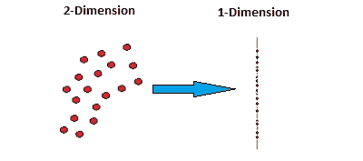
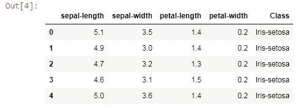

# 基于 Python 的主成分分析降维方法

> 原文：<https://pub.towardsai.net/principal-component-analysis-in-dimensionality-reduction-with-python-1a613006d531?source=collection_archive---------0----------------------->

## [数据科学](https://towardsai.net/p/category/data-science)

## 将高维特征简化为低维特征


主成分分析投影。作者的照片

在本文中，我们将讨论处理大量特征中出现的过拟合问题的特征约简方法。当高维数据适合模型时，它有时会混淆相似信息的特征。找出对目标变量影响更大的主要特征/组成部分，以及那些具有最大方差的组成部分。二维特征转换成一维特征，使得计算将更快。



在机器学习中，维度是数据集中特征的数量。随着数据中添加的维度越多，就会以指数方式产生更多的维度空间，这将导致更多的处理成本 ***【维度诅咒】*** 。

> ***为什么要降低维度？***

*   我们知道训练大规模数据需要更多的计算能力和时间。
*   对于大维度数据，可视化是不可能的。
*   更多的维度意味着更多的存储空间问题。

[](/data-preprocessing-concepts-with-python-b93c63f14bb6) [## Python 中的数据预处理概念

### 一种为机器学习估值器准备数据的稳健方法

pub.towardsai.net](/data-preprocessing-concepts-with-python-b93c63f14bb6) [](/correlation-and-its-types-in-statistics-7a723dcfd12d) [## 统计学中的相关性及其类型

### 统计学有助于理解机器学习中的行为

pub.towardsai.net](/correlation-and-its-types-in-statistics-7a723dcfd12d) 

> ***我们可以使用两种技术来降低维度，如下所示:***

1.  特征选择:这些是向后消除、向前选择和双向消除。
2.  特征提取:这些是主成分分析(PCA)，线性判别分析(LDA)，核 PCA 和其他。

主成分分析将 n 个特征减少到 n≤p 个分量特征，这些分量特征最能解释数据集的方差。

主成分是数据集中原始预测值的线性组合(正交变换)。

如果有许多主成分，那么第一个 PC1 具有最大方差，然后是 PC2、PC3…方差减少。PC1 和 PC2 的相关性为零。

PCA 的处理限制是，它一次获取存储器中的所有数据。因此，需要大内存，为了避免这种一次性内存使用，增量 PCA 开始发挥作用，该过程使用微型批处理，其结果几乎与 PCA 的结果相匹配。

python 的例子:

导入必要的库

```
import numpy as np
import pandas as pd
```

从 url 读取数据集

```
url = "[https://archive.ics.uci.edu/ml/machine-learning-databases
/iris/iris.data](https://archive.ics.uci.edu/ml/machine-learning-databases/iris/iris.data)"names=['sepal-length','sepal-width','petal-length','petal-
         width','Class']df = pd.read_csv(url,names=names)
```

使用 head 方法查看前 5 行。

```
df.head()
```



将数据分为独立要素和从属要素。

```
X=df.drop('Class',1)
y = df['Class']
```

现在，在训练集和测试集中划分特征。

```
from sklearn.model_selection import train_test_split
X_train, X_test, y_train, y_test = train_test_split(X,y,test_size = 0.2)
```

使用标准标量来标准化数据集值。

```
from sklearn.preprocessing import StandardScaler
sc = StandardScaler()
X_train = sc.fit_transform(X_train)
X_test = sc.transform(X_test)
```

现在，这是我们这篇文章的播放器，使用来自分解类的 PCA。

```
#Apply PCA
from sklearn.decomposition import PCA
pca = PCA()
X_train = pca.fit_transform(X_train)
X_test = pca.transform(X_test)
```

在此之后，我们必须知道所有主成分的方差

```
explained_variance = pca.explained_variance_ratio_
print(explained_variance)#output:
array([0.71580568, 0.24213308, 0.03690989, 0.00515135])
```

我们可以使用 n_components 参数来使用主分量的个数。

```
#Try out with only 1 PCA
#Apply PCA
from sklearn.decomposition import PCA
pca = PCA(n_components=1)
X_train = pca.fit_transform(X_train)
X_test = pca.transform(X_test)
```

[](/fully-explained-ensemble-techniques-example-with-python-b83e50310841) [## 用 Python 完整解释了整体技术示例

### 基于几种决策树的机器学习方法

pub.towardsai.net](/fully-explained-ensemble-techniques-example-with-python-b83e50310841) 

现在我们可以在算法中使用这些 x_train 和 x_test 值。

```
from sklearn.ensemble import RandomForestClassifier
classifier = RandomForestClassifier()
classifier.fit(X_train,y_train)#output:RandomForestClassifier(bootstrap=True, class_weight=None,
            criterion='gini', max_depth=None, max_features='auto',
            max_leaf_nodes=None, min_impurity_decrease=0.0,
            min_impurity_split=None, min_samples_leaf=1,
            min_samples_split=2, min_weight_fraction_leaf=0.0,
            n_estimators=10, n_jobs=None,oob_score=False,
            random_state=None, verbose=0, warm_start=False)
```

现在，我们将预测我们的模型，并检查其准确性。

```
y_pred = classifier.predict(X_test)
from sklearn.metrics import accuracy_score
print('Accuracy of this model is' , accuracy_score(y_test,y_pred))#output:
Accuracy of this model is 0.9333333333333333
```

> ***结论:***

主成分分析在处理高维数据时非常有效。PCA 的丰富之处在于它减少了训练时间。

我希望你喜欢这篇文章。通过我的 [LinkedIn](https://www.linkedin.com/in/data-scientist-95040a1ab/) 和 [twitter](https://twitter.com/amitprius) 联系我。

# 推荐文章

1.  [NLP —用 Python 从零到英雄](https://medium.com/towards-artificial-intelligence/nlp-zero-to-hero-with-python-2df6fcebff6e?sk=2231d868766e96b13d1e9d7db6064df1)

2. [Python 数据结构数据类型和对象](https://medium.com/towards-artificial-intelligence/python-data-structures-data-types-and-objects-244d0a86c3cf?sk=42f4b462499f3fc3a160b21e2c94dba6)

3. [Python:零到英雄带实例](https://medium.com/towards-artificial-intelligence/python-zero-to-hero-with-examples-c7a5dedb968b?source=friends_link&sk=186aff630c2241aca16522241333e3e0)

4.[用 Python 全面讲解 SVM 分类](https://medium.com/towards-artificial-intelligence/fully-explained-svm-classification-with-python-eda124997bcd?source=friends_link&sk=da300d557992d67808746ee706269b2f)

5.[用 Python 全面解释 K-means 聚类](https://medium.com/towards-artificial-intelligence/fully-explained-k-means-clustering-with-python-e7caa573176a?source=friends_link&sk=9c5c613ceb10f2d203712634f3b6fb28)

6.[用 Python 全面解释线性回归](https://medium.com/towards-artificial-intelligence/fully-explained-linear-regression-with-python-fe2b313f32f3?source=friends_link&sk=53c91a2a51347ec2d93f8222c0e06402)

7.[用 Python 全面讲解逻辑回归](https://medium.com/towards-artificial-intelligence/fully-explained-logistic-regression-with-python-f4a16413ddcd?source=friends_link&sk=528181f15a44e48ea38fdd9579241a78)

8.[Python 时间序列基础](https://medium.com/towards-artificial-intelligence/basic-of-time-series-with-python-a2f7cb451a76?source=friends_link&sk=09d77be2d6b8779973e41ab54ebcf6c5)

9. [NumPy:用 Python 零到英雄](https://medium.com/towards-artificial-intelligence/numpy-zero-to-hero-with-python-d135f57d6082?source=friends_link&sk=45c0921423cdcca2f5772f5a5c1568f1)

10.[机器学习中的混淆矩阵](https://medium.com/analytics-vidhya/confusion-matrix-in-machine-learning-91b6e2b3f9af?source=friends_link&sk=11c6531da0bab7b504d518d02746d4cc)