# 主成分分析

> 原文：<https://pub.towardsai.net/principal-component-analysis-pca-7e104a77a254?source=collection_archive---------0----------------------->

## [数据挖掘](https://towardsai.net/p/category/data-mining)

## 降维技术

## 数据挖掘历史

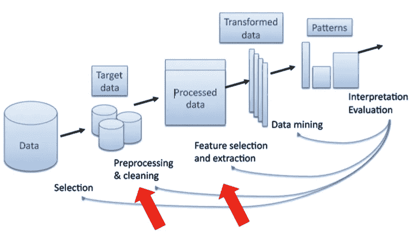

[来源](http://recommender-systems.readthedocs.io/en/latest/_images/Kdd-process.png)

在数据挖掘过程中，我们得到原始数据。在可视化或解释数据之前，我们必须确保在数据可用于分析之前，对数据应用了某些细化方法。这个细化过程包括预处理或清理数据，例如从数据中删除空值或空白值。接下来是特征选择或特征提取技术，其在 PCA 中使用，其中根据需要忽略或移除贡献最小的特征。最后一个阶段是数据转换，用户将应用归一化技术来缩放同一范围内的所有要素。

## 什么是 PCA？

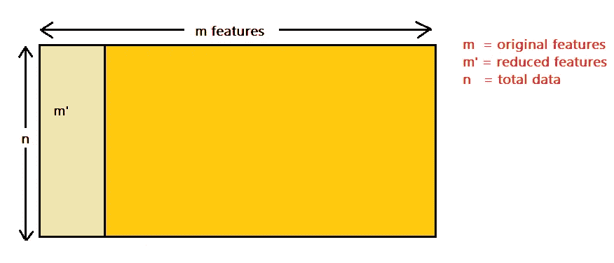

作者图片

在当前世界中，当我们执行数据分析任务时，我们分析复杂的数据，即多维数据。在分析数据之后，我们绘制它并观察一些模式，或者利用它来训练其他机器学习模型。维度可以被认为是一种视图，利用它我们可以从任意轴观察空间中的一点。随着点的维度增加，它变得难以可视化，并且对其执行计算变得复杂。因此，有必要对维度进行检查，我们需要找到减少维度的方法。为了解决这个问题，我们引入了 PCA。

主成分分析是无监督学习算法。PCA 实现了降维技术。PCA 的目标是在开发模型时移除不相关的特征。PCA 提取对输出有贡献的最相关的特征。

## 我们为什么需要它？

*   去除不相关的特征。
*   提高模型的预测精度。
*   促进存储和计算成本的降低。
*   提高对数据和模型的理解。

## 特征值和特征向量的修正

在我们试图理解 PCA 的处理流程之前，我们先来复习一下高中数学科目特征值和特征向量。

考虑下面给出的矩阵 A，将其乘以 n*1 矩阵 x，我们得到的输出可以表示为一个标量乘以矩阵 x 的乘积。

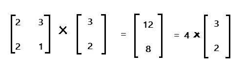

作者图片

特征值问题是具有以下格式的任何问题:

**A*X = λ*X**

**A = n*n 矩阵**

**X = n*1 个非零矩阵**

**λ =标量**

这个方程有解的 **λ** 的任何一个值称为 A 的特征值，与这个值对应的向量 X 称为 A 的特征向量。

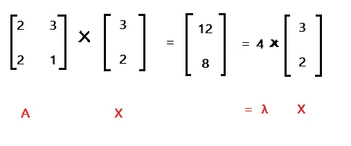

作者图片

因此，(3，2)是方阵 **A** 的特征向量，4 是 **A** 的特征值

**给定矩阵 A，我们如何计算 A 的特征向量和特征值？**

AX = λX

AX - λIX =0

[A* - λI] * X =0

根据特征向量的规则，X 的值总是非零的，因此我们可以使|A - λI | = 0。

**例题求解:**

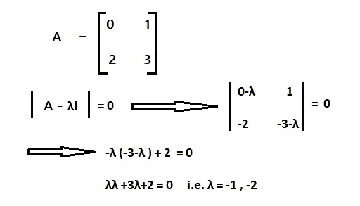

作者图片

现在我们需要找到 X，它表示对应于特征值λ = -1 和λ = -2 的特征向量，使得

AX = λX

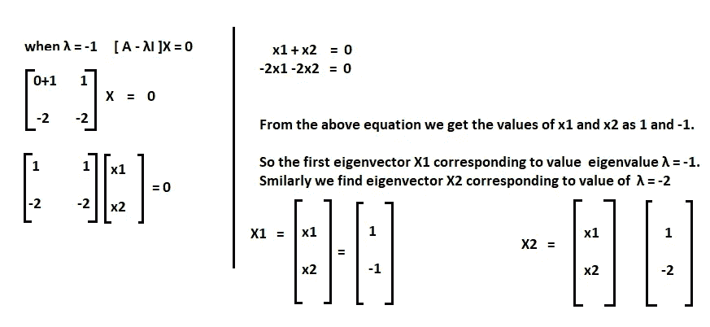

作者图片

所以特征值和特征向量的概念是在 PCA 中实现的。

## **协方差公式**

协方差是一种在给定的一组特征之间寻找关联的方法。它帮助我们识别独立组件之间的依赖关系，这对于生成输出是必不可少的。

考虑两个要素 X 和 Y，它们有一个 100 条记录的数据集。为了求协方差，我们计算 X 和 y 的平均值。

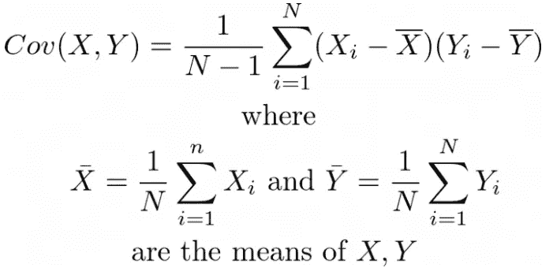

[来源](https://miro.medium.com/max/700/1*hawqb3jJUW4UrHT7ERjHow.png)

## PCA 中的步骤

**第一步:归一化所有特征**

标准化特征意味着我们必须确保所有特征都在相同的比例或范围内。例如，如果我有一个包含厘米和米值的列 X1 和列 X2，那么使用这些特征预测模型是不可行的。在继续数据集的分析部分之前，我们必须以厘米或米为单位转换要素。在实时场景中，我们使用均值归一化方法来确保所有特征都在相似的范围内放大。

这里，我们从每个要素的给定数据集计算平均值，然后从平均值中减去特定要素的每个数据，因此任何给定要素的数据值的范围为[-1，1]。

下面是给我们的数据集，它具有特征 x1 和 x2。我们计算了 x1 和 x2 的平均值，并将数据转换为归一化形式。

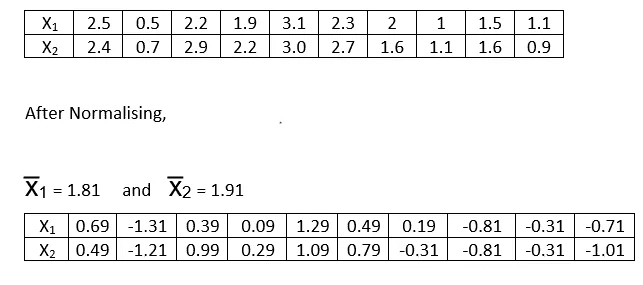

作者图片

**步骤 2:创建协方差矩阵**

协方差矩阵由矩阵中的特征*特征项组成。它用于查找对输出要素有贡献的自身要素和其他要素的协方差。因此特征 X1 和 X2 的矩阵将如下所示。

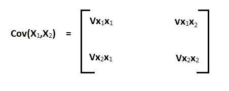

作者图片

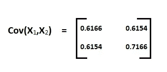

作者图片

**步骤 3:特征值和特征向量的计算**

使用特征值和特征向量的规则 **|A — λI | = 0，**我们将找到给定矩阵 a 的特征值和特征向量，其由 Cov(X₁、X₂表示)计算如上。

利用上述方法，我们得到了特征值**λ**₁**t23】和 **λ** ₂以及相应的特征向量。**

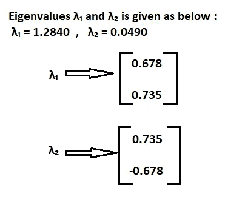

作者图片

**步骤 4:按照特征值降序排列特征向量**

在计算了特征值和对应的向量之后，我们在一个特征值按降序排列的表中创建一个由这两者组成的表。然后，我们继续计算总方差，它将等于特征值的总和。

总方差= 1.2840 + 0.0490 = 1.333

将特征值 **λ** ₁除以总方差，我们得到

(1.2840/1.333) = 0.963 = 96.3%

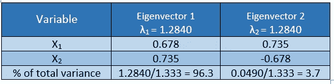

作者图片

**上述值表示特征λ₁成为我们的 PC1。**

将特征值 **λ** ₂除以总方差，我们得到

(0.0490/1.333) = 0.037 = 3.7%

**上述值表示特征λ** ₂ **成为我们的 PC2。**

使用上述计算，我们可以得出结论，PC1 对输出的贡献超过 96%。因此，我们可以利用与 **λ** ₂相关联的特征向量来计算新的或更新的集合。

**步骤 5:变化矩阵(V)的创建**

在找到主分量之后，我们然后利用与 PC 相关联的特征向量，并且创建表示变化矩阵(V)的矩阵。在上面的步骤 4 中，我们发现 PC1 是比 PC2 更重要的组件。我们使用它的特征向量创建变化矩阵。

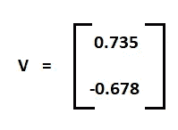

作者图片

**第六步:找到新的数据集。**

在确定最重要的主成分之后，我们希望使用新的特征来重组数据集，这将减少维度，同时提高模型的性能和准确性。

**新数据=数据*特征向量**

**Y = X*V**

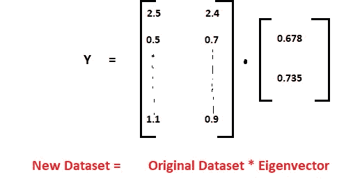

作者图片

**应用**

*   人脸识别
*   图像合成
*   基因表达分析
*   数据整理
*   数据分类
*   趋势分析
*   要素分析
*   噪声降低