# 带 Python 示例的主成分分析(PCA)——教程

> 原文：<https://pub.towardsai.net/principal-component-analysis-pca-with-python-examples-tutorial-67a917bae9aa?source=collection_archive---------0----------------------->


来源:由 [Radek Grzybowski](https://unsplash.com/@rgrzybowski) 在 [Unsplash](https://unsplash.com/photos/eBRTYyjwpRY) 上对原作的衍生

## [数据科学](https://towardsai.net/p/category/data-science)、[编辑](https://towardsai.net/p/category/editorial)、[编程](https://towardsai.net/p/category/programming)

## 关于主成分分析(PCA)的深入教程，包含数学和 Python 编码示例

最后更新，2021 年 1 月 8 日

**作者:**萨妮娅·帕维斯，[罗伯托·伊里翁多](https://mktg.best/vguzs)

[](https://members.towardsai.net/) [## 加入我们吧↓ |面向人工智能成员|数据驱动的社区

### 加入人工智能，成为会员，你将不仅支持人工智能，但你将有机会…

members.towardsai.net](https://members.towardsai.net/) 

**本教程的代码可在**[**Github**](https://github.com/towardsai/tutorials/tree/master/principal_component_analysis)**上获得，其完整实现也可在**[**Google Colab**](https://colab.research.google.com/drive/12wfYg3mHOvVw2TZk3SPsC4naMJhcMkA2?usp=sharing)**上获得。**

## 目录

1.  [简介](#f641)
2.  [维度的诅咒](#82ac)
3.  [降维](#2000)
4.  [相关性及其测量](#08f8)
5.  [功能选择](#7295)
6.  [特征提取](#85da)
7.  [线状特征提取](#7524)
8.  [主成分分析](#5e9a)
9.  [PCA 背后的数学](#993b)
10.  [PCA 是如何工作的？](#3628)
11.  [PCA 的应用](#8885)
12.  [用 Python 实现 PCA](#5d0a)
13.  [结论](#a31f)

> 📚查看我们用 Python 编写的[卷积神经网络](https://towardsai.net/p/deep-learning/convolutional-neural-networks-cnns-tutorial-with-python-417c29f0403f)教程。📚

# 介绍

当实现 [**机器学习算法**](https://towardsai.net/p/machine-learning/machine-learning-algorithms-for-beginners-with-python-code-examples-ml-19c6afd60daa) 时，包含更多的特性可能会导致性能问题恶化。增加特征的数量并不总是能提高分类精度，这也被称为维数灾难。因此，我们通过选择较低维度特征的最佳集合来应用维度缩减以提高分类精度。

主成分分析(PCA)对于数据科学、[](https://mld.ai/mldcmu)**机器学习、数据可视化、统计学等定量领域都是必不可少的。**

**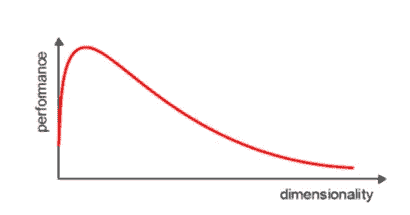**

**图 1:维数灾难。**

**有两种技术可以进行降维:**

*   **特征选择**
*   **特征抽出**

**了解向量、矩阵、转置矩阵、特征值、特征向量和其他知识对于理解降维的概念至关重要。**

# **维度的诅咒**

**对于大多数算法来说，数据集中的维数成为实现合理效率的严重障碍。增加特征的数量并不总能提高精度。当数据没有足够的特征时，模型可能会欠拟合，而当数据有太多特征时，模型可能会过拟合。因此，它被称为维数灾难。对于数据科学家来说，维数灾难是一个惊人的悖论，它基于 n 维空间的爆炸式增长——随着维数 n 的增加。**

## **稀疏**

**数据的稀疏性是指数据稀少或分散的特性。它缺乏密集性，并且它的大部分变量单元格不包含实际数据。基本上充满了“空”或“不适用”值。**

**随着维数的增加，n 维空间中的点经常变得稀疏。点与点之间的距离会随着维度数量的增加而扩大。**

**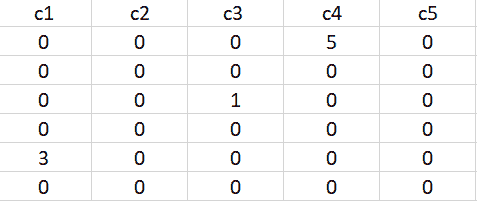**

**图 2:数据稀疏。**

## **维数灾难的含义**

**维数灾难的含义很少:**

*   **随着特征数量的增加，优化问题将不可行。**
*   **由于 n 维空间中固有点的绝对规模，随着 n 保持增长，识别特定点(或甚至附近点)的可能性继续下降。**

# **降维**

**降维消除了数据集的某些特征，并创建了一组有限的特征，其中包含了更高效、更准确地预测目标变量所需的所有信息。**

**减少特征的数量通常也减少了学习过程的输出可变性和复杂性。协方差矩阵是降维过程中的一个重要步骤。检查不同特征之间的相关性是一个关键过程。**

# **相关性及其测量**

**机器学习中有一个相关性的概念，叫做多重共线性。当一个或多个自变量彼此高度相关时，多重共线性存在。多重共线性使得变量之间高度相关，这使得变量的系数高度不稳定[ [8](https://online.stat.psu.edu/stat501/book/export/html/981) ]。**

**系数是回归的一个重要组成部分，如果这是不稳定的，那么回归结果将会很差。多重共线性通过使用方差膨胀因子(VIF)来确认。因此，如果怀疑存在多重共线性，可以使用方差膨胀因子(VIF)进行检查。**

**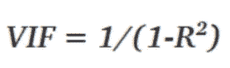**

**图 3: VIF 方程。**

**来自 VIF 的规则:**

*   **VIF 为 1 表示完全独立于任何其他变量。**
*   **介于 5 和 10 之间的 VIF 表示高度共线性[ [4](https://online.stat.psu.edu/stat462/node/180/) ]。**
*   **我们越接近 1，预测建模的场景就越理想。**
*   **每个自变量对每个自变量进行回归，我们计算 VIF。**

**热图在理解变量之间的相关性方面也起着至关重要的作用。**

**任何两个量之间的关系类型在一段时间内是不同的。**

**相关性从 **-1** 到 **+1** 不等**

**准确地说，**

*   **接近+1 的值表示正相关。**
*   **接近-1 的值表示负相关。**
*   **接近 0 的值表示完全没有相关性。**

**下面的热图显示了我们将如何关联哪些功能高度依赖于目标功能并考虑它们。**

## **协方差矩阵和热图**

**协方差矩阵是降维的第一步，因为它给出了强相关特征数量的概念，并且它通常是降维的第一步，因为它给出了强相关特征数量的概念，以便可以丢弃那些特征。**

**它也给出了所有独立特征的细节。它提供了所有不同特征对之间的相关性的概念。**

****虹膜数据集中强相关特征的识别****

**导入所有必需的包:**

```
import numpy as np
import pandas as pd
from sklearn import datasets 
import matplotlib.pyplot as plt
```

**加载虹膜数据集:**

```
iris = datasets.load_iris()
iris.data
```

**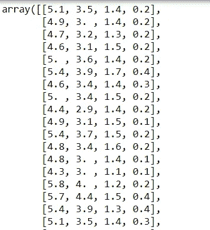**

**图 4:虹膜数据集。**

**列出所有功能:**

```
iris.feature_names
```

****

**图 Iris 数据集的特征。**

**创建协方差矩阵:**

```
cov_data = np.corrcoef(iris.data.T)cov_data
```

**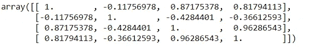**

**图 Iris 数据集的协方差矩阵。**

**绘制协方差矩阵以使用热点图识别要素之间的相关性:**

```
img = plt.matshow(cov_data, cmap=plt.cm.rainbow)
plt.colorbar(img, ticks = [-1, 0, 1], fraction=0.045)for x in range(cov_data.shape[0]):
    for y in range(cov_data.shape[1]):
        plt.text(x, y, "%0.2f" % cov_data[x,y], size=12, color='black', ha="center", va="center")

plt.show()
```

**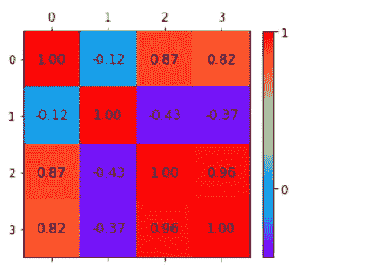**

**图 7:关联矩阵的热图。**

**热图表示中的关联:**

*   **其中**第一个**和**第三个**特征。**
*   **在第一个**特征**和第四个**特征**之间。**
*   **在第三**和第四**特征**之间。****

**独立功能:**

*   **第二个**特征几乎独立于其他特征。****

**这里，相关矩阵及其图形表示给出了关于潜在的特征数量减少的想法。因此，可以保留两个特征，并且除了这两个特征之外，可以减少其他特征。**

**有两种降维方法:**

*   **特征选择**
*   **特征抽出**

**降维可以忽略不太重要的成分。**

# **特征选择**

**在特征选择中，通常选择原始特征的子集。**

**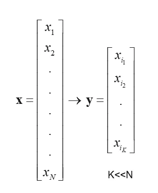**

**图 8:特性选择。**

# **特征抽出**

**在特征提取中，发现了一组新的特征。这是通过现有特征的一些映射找到的。此外，映射可以是线性的，也可以是非线性的。**

**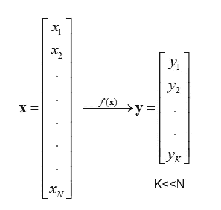**

**图 9:特征提取。**

# **线性特征提取**

**线性特征提取计算简单，分析可追踪。**

**广泛使用的线性特征提取方法:**

*   ****主成分分析(PCA)** :它寻求一种投影，尽可能多地保留数据中的信息。**
*   ****线性鉴别分析(LDA)** :-它寻找一个能最好地鉴别数据的投影。**

# **主成分分析**

**主成分分析(PCA)是一种探索性的方法，用于将数据集的维度降低到 2D 或 3D，在探索性数据分析中用于制作预测模型。主成分分析是数据集的线性变换，其定义了新的坐标规则，使得:**

*   **数据集的任何投影的最大方差出现在第一轴上。**
*   **第二个轴上的第二大方差，依此类推。**

**我们可以将主成分分析(PCA)用于以下目的:**

*   **减少数据集中的维数。**
*   **在高维数据集中寻找模式**
*   **为了可视化高维数据**
*   **忽略噪音**
*   **改进分类**
*   **获取简洁的描述**
*   **尽可能多地捕捉数据中的原始差异**

**总之，我们可以将**主成分分析(PCA)** 定义为将大量变量转化为数量较少的不相关变量，称为主成分(PCs)，以尽可能多地捕捉数据的方差。**

**PCA 是卡尔·皮尔逊和哈罗德·霍特林在 1901 年发明的，作为主轴定理[[1](https://zenodo.org/record/1430636#.X6HvO4hKguU)][[2](https://pdfs.semanticscholar.org/e0be/f0bd8e07de281230ae5df28daabb4047e8f0.pdf)][[3](https://citeseerx.ist.psu.edu/viewdoc/download?doi=10.1.1.325.1383&rep=rep1&type=pdf)]的类比。**

**从数学上讲，PCA 的主要目标是:**

*   **找到数据的标准正交基。**
*   **按重要性顺序对维度进行排序。**
*   **丢弃低重要性维度。**
*   **关注不相关和高斯成分。**

****PCA 涉及的步骤****

*   **标准化 PCA。**
*   **计算协方差矩阵。**
*   **求协方差矩阵的特征值和特征向量。**
*   **在缩放后的数据上绘制矢量。**

## **需要 PCA 的问题示例**

**一个班里有 100 名学生，他们有不同的特征，比如年级、年龄、身高、体重、头发颜色等等。**

**大多数描述学生的特征可能是不相关的。因此，找到学生的关键特征是至关重要的。**

**基于对学生不同特征观察的一些分析:**

*   **每个学生都有一个数据向量来定义他的身高，比如(身高，体重，发色，年级等等)。)或者(181，68，黑，99，…).**
*   **每一列都是一个学生向量。所以，n = 100。**
*   **它创建了一个 *m*n* 矩阵。**
*   **每个学生都位于一个 m 维向量空间中。**

****要忽略的特性****

*   **共线要素或线性相关要素。例如腿的尺寸和高度。**
*   **恒定的噪声特征。例如头发的厚度**
*   **不变的特征。例如齿数。**

****要保留的特征****

*   **非共线要素或低协方差。**
*   **变化很大的特征，高方差。例如等级。**

# **PCA 背后的数学**

**在启动五氯苯甲醚之前，理解相关的数学知识至关重要。特征值和特征向量在主成分分析中起着重要的作用。**

## **特征向量和特征值**

**协方差矩阵(或相关性)的特征向量和特征值描述了 PCA 的来源。特征向量(主成分)决定新属性空间的方向，特征值决定其大小。**

**PCA 的主要目的是通过将数据投影到更小的子空间来降低数据的维数，其中特征向量形成轴。然而，特征向量只定义了新轴的方向，因为它们的大小都是 **1** 。因此，为了决定哪个(些)特征向量，我们可以丢弃而不会在子空间构造中丢失太多信息，并检查相应的特征值。具有最高值的特征向量包含更多关于数据分布的信息。**

## ****协方差矩阵****

**经典的 PCA 方法计算协方差矩阵，其中每个元素代表两个属性之间的协方差。两个属性之间的协方差计算如下:**

**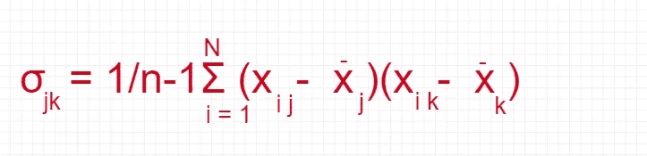**

**图 10:计算两个属性之间协方差的等式。**

**创建矩阵:**

```
import pandas as pd
import numpy as npmatrix = np.array([[0, 3, 4], [1, 2, 4], [3, 4, 5]]) 
matrix
```

**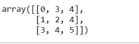**

**图 11:矩阵。**

**将矩阵转换为协方差矩阵:**

```
np.cov(matrix)
```

**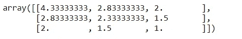**

**图 12:协方差矩阵。**

**协方差矩阵的一个令人兴奋的特征是矩阵的主对角线之和等于特征值之和。**

## ****相关矩阵****

**另一种计算特征值和特征向量的方法是使用相关矩阵。尽管矩阵是不同的，但它们将产生相同的特征值和特征向量(稍后显示),因为协方差矩阵的归一化给出了相关矩阵。**

**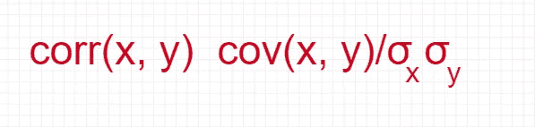**

**图 13:相关矩阵的等式。**

**创建矩阵:**

```
matrix_a = np.array([[0.1, .32, .2,  0.4, 0.8], 
             [.23, .18, .56, .61, .12], 
             [.9,   .3,  .6,  .5,  .3],  
             [.34, .75, .91, .19, .21]])
```

**转换成相关矩阵:**

```
np.corrcoef(matrix_a.T)
```

**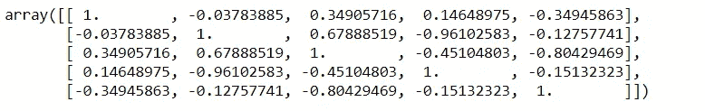**

**图 14:相关矩阵。**

# **PCA 是如何工作的？**

**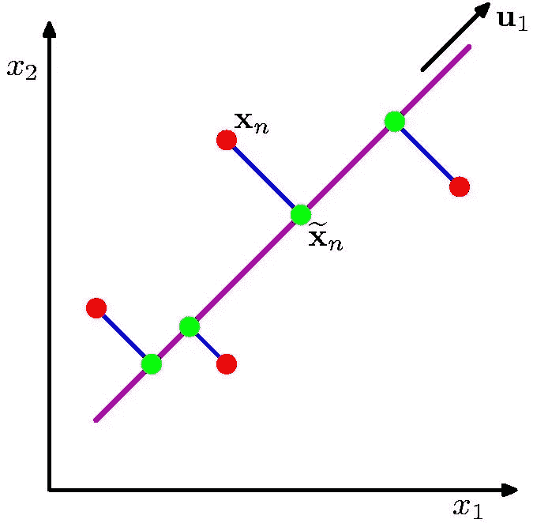**

**图 15:使用 PCA [ [5](https://www.cs.toronto.edu/~urtasun/courses/CSC411_Fall16/tutorial7.pdf) ]工作。**

**数据从高维到低维的正交投影，使得(来自图 15):**

*   **最大化投影线的方差(紫色)**
*   **最小化数据点和投影之间的 MSE(蓝色)**

# **主成分分析的应用**

**这些是 PCA 的典型应用:**

*   **数据可视化。**
*   **数据压缩。**
*   **降噪。**
*   **数据分类。**
*   **图像压缩。**
*   **人脸识别。**

# **用 Python 实现主成分分析**

**用 Python 实现虹膜数据集上的主成分分析；**

**加载虹膜数据集:**

```
import pandas as pd
import numpy as np
from sklearn.datasets import load_iris
from sklearn.preprocessing import StandardScaleriris = load_iris()
df = pd.DataFrame(data=iris.data, columns=iris.feature_names)df['class'] = iris.target
df
```

**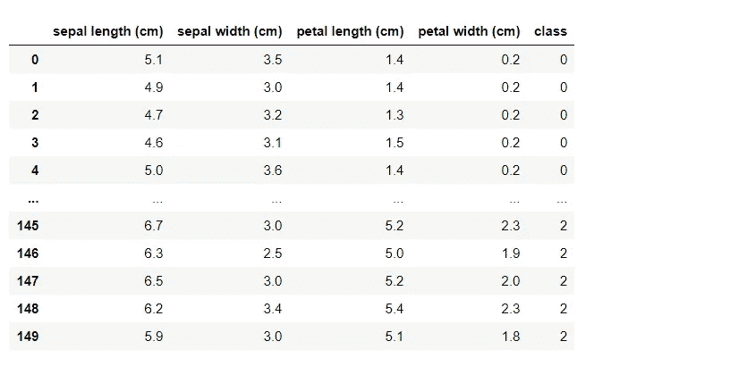**

**图 16:虹膜数据集。**

**获取 x 和 y 的值:**

```
x = df.drop(labels='class', axis=1).values
y = df['class'].values
```

**用协方差矩阵实现 PCA**

```
class convers_pca():
    def __init__(self, no_of_components):
        self.no_of_components = no_of_components
        self.eigen_values = None
        self.eigen_vectors = None

    def transform(self, x):
        return np.dot(x - self.mean, self.projection_matrix.T)

    def inverse_transform(self, x):
        return np.dot(x, self.projection_matrix) + self.mean

    def fit(self, x):
        self.no_of_components = x.shape[1] if self.no_of_components is None else self.no_of_components
        self.mean = np.mean(x, axis=0)

        cov_matrix = np.cov(x - self.mean, rowvar=False)

        self.eigen_values, self.eigen_vectors = np.linalg.eig(cov_matrix)
        self.eigen_vectors = self.eigen_vectors.T

        self.sorted_components = np.argsort(self.eigen_values)[::-1]

        self.projection_matrix = self.eigen_vectors[self.sorted_components[:self.no_of_components]]self.explained_variance = self.eigen_values[self.sorted_components]
        self.explained_variance_ratio = self.explained_variance / self.eigen_values.sum()
```

**x 的标准化:**

```
std = StandardScaler()
transformed = StandardScaler().fit_transform(x)
```

**具有两个组件的 PCA:**

```
pca = convers_pca(no_of_components=2)
pca.fit(transformed)
```

**检查特征向量:**

```
cov_pca.eigen_vectors
```

**检查特征值:**

```
cov_pca.eigen_values
```

**检查分类组件:**

```
cov_pca.sorted_components
```

**用几个成分绘制 PCA 图= 2:**

```
x_std = pca.transform(transformed)plt.figure()
plt.scatter(x_std[:, 0], x_std[:, 1], c=y)
```

**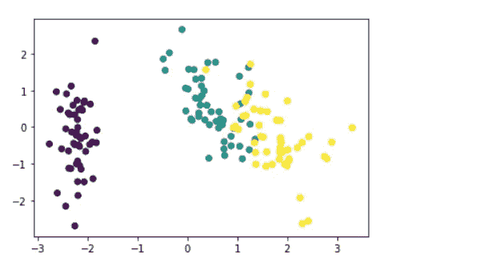**

**图 17: PCA 可视化。**

# **结论**

**海量数据集在各种学科中越来越普遍。为了解释这样的数据集，我们需要降低维数以保留最相关的数据。**

**PCA 解决了特征向量/值的问题。在线性回归和神经网络的训练阶段，我们应用 PCA 来消除共线性。PCA 类似于观察值的低维表示，它解释了方差的很大一部分[ [6](http://noiselab.ucsd.edu/ECE285/lecture10.pdf) ]。**

**我们可以使用 PCA 来减少变量的数量，避免多重共线性，或者相对于观察值的数量有太多的预测值。PCA 是 *p* 特征的线性组合，采用这些测量的线性组合对于减少视觉分析所需的绘图数量，同时保留数据中存在的大部分信息至关重要[ [7](https://uc-r.github.io/pca) ]。**

**特征约简是机器学习中必不可少的预处理步骤。因此，PCA 是预处理的必要步骤，并且对于数据中的压缩和噪声去除非常有用。它通过寻找比原始变量集更小的新变量集来降低数据集的维度。**

****免责声明:**本文表达的观点仅代表作者个人观点，不代表卡耐基梅隆大学或其他与作者(直接或间接)相关的公司的观点。这些文章并不是最终产品，而是当前思想的反映，是讨论和改进的催化剂。**

****除非另有说明，所有图片均来自作者。****

**通过[向 AI](https://towardsai.net/) 发布**

# **资源**

**[Google colab 实现](https://colab.research.google.com/drive/12wfYg3mHOvVw2TZk3SPsC4naMJhcMkA2?usp=sharing)。**

**[Github 库](https://github.com/towardsai/tutorials/tree/master/principal_component_analysis)。**

# **参考**

**[1] [皮尔逊，K.](https://en.wikipedia.org/wiki/Karl_Pearson) (1901)。[“在最接近空间点系统的直线和平面上”](https://zenodo.org/record/1430636)。*哲学杂志*。2(11):559–572。[doi](https://en.wikipedia.org/wiki/Doi_(identifier)):[10.1080/14786440109462720](https://doi.org/10.1080%2F14786440109462720)。**

**[2]主成分分析与优化:一个教程，Robert Reris 和 J. Paul Brooks，[https://pdfs . semantic scholar . org/e0be/f0b d8e 07 de 281230 AE 5 df 28 da abb 4047 e8f 0 . pdf](https://pdfs.semanticscholar.org/e0be/f0bd8e07de281230ae5df28daabb4047e8f0.pdf)**

**[3]主成分分析，马丁·休厄尔，伦敦大学学院，[https://citeseerx.ist.psu.edu/viewdoc/download?doi = 10 . 1 . 1 . 325 . 1383&rep = re P1&type = pdf](https://citeseerx.ist.psu.edu/viewdoc/download?doi=10.1.1.325.1383&rep=rep1&type=pdf)**

**[4]使用方差膨胀因子检测多重共线性，https://online.stat.psu.edu/stat462/node/180/[宾夕法尼亚州立大学](https://online.stat.psu.edu/stat462/node/180/)**

**[5]拉格朗日对偶与 PCA CS 411 教程，罗文洁多伦多大学，[https://www . CS . Toronto . edu/~ urta sun/courses/CSC 411 _ fall 16/Tutorial 7 . pdf](https://www.cs.toronto.edu/~urtasun/courses/CSC411_Fall16/tutorial7.pdf)**

**[6] ECE 285 和 SIO 209 物理应用的机器学习，第 10 讲，彼得·格斯托夫特，加州大学圣地亚哥分校，[http://noiselab.ucsd.edu/ECE285/lecture10.pdf](http://noiselab.ucsd.edu/ECE285/lecture10.pdf)**

**[7]主成分分析，UC Business Analytics R 编程指南，[https://uc-r.github.io/pca](https://uc-r.github.io/pca)**

**[8]第 12 课:多重共线性和其他回归陷阱，回归方法，宾夕法尼亚州立大学，[https://online.stat.psu.edu/stat501/book/export/html/981](https://online.stat.psu.edu/stat501/book/export/html/981)**

**[9] Python 数据科学手册，Jake VanderPlas，O'Reilly，[https://www . oreilly . com/library/view/Python-Data-Science/9781491912126/](https://github.com/jakevdp/PythonDataScienceHandbook)**