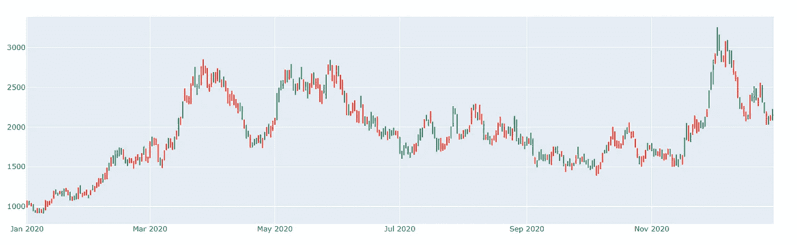
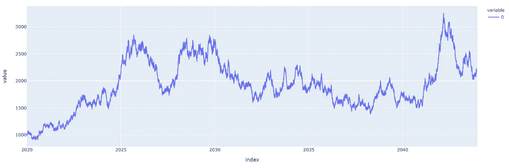
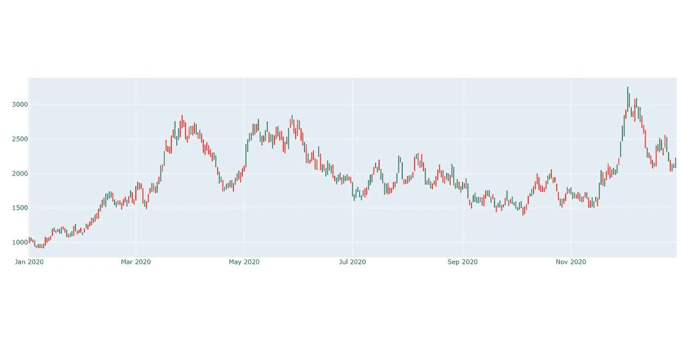

# 程序 OCHL 股票生成器

> 原文：<https://pub.towardsai.net/procedural-ochl-stock-generator-54ce041931be?source=collection_archive---------3----------------------->

## [量化金融，](https://towardsai.net/p/category/data-visualization)数据可视化，[编程](https://towardsai.net/p/category/programming)

## 程序化地生成用于模拟目的的合成股票数据。完整的代码可在我的回购[。](https://github.com/arditoibryan/Projects/blob/master/20210203_OCHL_Stock_Generator/v2.ipynb)

点击这里了解我、我的项目和我的最新文章。

技术分析最困难的部分之一是找到数据。持续下载历史股票数据并不像听起来那么容易:你需要从提供数据的公司获得一个 API 密匙，然后必须下载、解析、清理数据，只有这样你才能处理一些数据。事实上，简单地使用两三只股票作为样本是有趣的，但当你在尝试量化金融中的全部算法时，这有点限制性。



程序生成的 OCHL 股票价格

作为一个解决方案，我可以从零开始创建我的数据:这被称为**合成数据**。我在本文中发布的算法直接生成了一个包含随机股票价格的 pandas 数据框架，包括高、低、收盘和开盘价。我也包括这些指标的原因是，许多技术分析算法不仅基于数据的接近部分，而且需要更多。

## 算法构造

我构建这个模型的方式非常简单:我在一整年内每小时生成随机数据，然后通过查看一天中的 24 小时，提取当天的最高价和最低价，以及开盘和收盘时的价格，来获得 OCHL 指标。因此，我将有 4 个单独的列。

## 构建算法的步骤如下:

1.  安装依赖项
2.  导入库
3.  定义函数
4.  Groupby 函数
5.  OHCL 模拟器

## 1.安装依赖项

对于这个算法，我将使用图形库 Plotly。因为，有时候，库会因为新的更新而变得不稳定，所以我使用一个稳定的版本来避免错误。对于更高级和适应性更强的代码，您可能需要将 Plotly 升级到最新版本。

```
!pip install plotly==4.8
```

## 2.导入库

至于每一个算法，我会在开始的时候导入基本库。我将使用 pandas，NumPy 和 random 来执行模拟，并 Plotly 来绘制结果。

```
import plotly.express as px
import pandas as pd
import numpy as np
import random
from scipy.stats import skewnorm
import plotly.graph_objects as go
```

## 3.定义函数

为了以结构化的方式组织我的算法，我需要定义几个函数来保存部分代码。这些功能将有助于模拟。

```
#graphs all columns for x, uses df.index as y
def graph_stock(df, title):
  #time_column is a stringpd.options.plotting.backend = "plotly"
  #fig = px.line(df, x='time', y=['price', 'price_2'])
  fig = px.line(df, x=df.index, y=df.columns, title=title)
  fig.show()def graph_OCHL(df_OCHL, title):
  #fig_1 = px.line(df, x=df.index, y=df.columns, title=title)
  fig_2 = go.Figure(data=go.Ohlc(x=df_OCHL.index,
                      open=df_OCHL['open'],
                      high=df_OCHL['high'],
                      low=df_OCHL['low'],
                      close=df_OCHL['close']))
  fig_2.update(layout_xaxis_rangeslider_visible=False)
  fig_2.show()
```

现在是创建主函数的时候了:一个在被调用时可以执行整个模拟的代码。我将使用 8760 作为长度参数来使用这个函数，这意味着我将为一年中的每个小时生成随机值。因为结果很容易与最初的 1000 作为基础价格有所不同(1 年后，我可能会有 100，000，不太现实)，所以我将大幅减少我的随机分布值，使其接近 0。

```
def simulate_stock(initial_price, drift, volatility, trend, days): def create_pdf(sd, mean, alfa):
    #invertire il segno di alfa
    x = skewnorm.rvs(alfa, size=1000000) 
    def calc(k, sd, mean):
      return (k*sd)+mean
    x = calc(x, sd, mean) #standard distribution #graph pdf
    #pd.DataFrame(x).hist(bins=100) #pick one random number from the distribution
    #formally I would use cdf, but I just have to pick randomly from  the 1000000 samples
    #np.random.choice(x)
    return x def create_empty_df(days):
    #creare un empty DataFrame con le date
    empty = pd.DatetimeIndex(
        pd.date_range("2020-01-01", periods=days, freq="D")
    )
    empty = pd.DataFrame(empty)
    #si tagliano ore, minuti, secondi
    empty #si tagliano ore, minuti, secondi
    empty.index = [str(x)[0:empty.shape[0]] for x in   list(empty.pop(0))]
    empty #final dataset con values
    stock = pd.DataFrame([x for x in range(0, empty.shape[0])])
    stock.index = empty.index
    return stock #skeleton
  stock = create_empty_df(days) #initial price
  stock[0][0] = initial_price #create entire stock DataFrame
  x = create_pdf(volatility, drift, trend)
  for _ in range(1, stock.shape[0]):
    stock.iloc[_] = stock.iloc[_-1]*(1+np.random.choice(x))

  stock.index = pd.DatetimeIndex(stock.index)
  return stock
```

我将使用 OCHL 转换器提取一部分 24 小时股票价格的最高价、最低价、开盘价和收盘价。

```
def OCHL(group_values):
  min_ = min(group_values)
  max_ = max(group_values)
  range = max_ - min_
  open = min_+range*random.random()
  close = min_+range*random.random()
  return min_, max_, open, close
```

我现在可以进行整个模拟。这将生成存储在 df 变量中的一年的每小时数据。

```
df = simulate_stock(1000, 0, 0.01, 0, 8760)
```

## 4.Groupby 函数

一旦我模拟了一年的数据，我就可以最终提取 OCHL。为此，我将把数据按 24 份分组，然后使用 OCHL 转换器。

```
df_ = list()
#df.groupby(np.arange(len(df))//24).apply(OCHL) non funziona
#sarebbe il modo corretto, ma devo creare un nuovo df da 0
for a, b in df.groupby(np.arange(len(df))//24):
  group_values = np.array(b.values).flatten()
  low, high, open, close = OCHL(group_values)
  df_.append([low, high, open, close])#
df_OCHL = pd.DataFrame(df_, index=pd.Series(pd.date_range("2020-01-01", periods=365, freq="D")), columns=['low', 'high', 'open', 'close'])
```

## 5.执行模拟

最后，让我用图表显示结果:

```
#graph
graph_stock(df, "")
fig = go.Figure(data=go.Ohlc(x=df_OCHL.index,
                    open=df_OCHL['open'],
                    high=df_OCHL['high'],
                    low=df_OCHL['low'],
                    close=df_OCHL['close']))
fig.update(layout_xaxis_rangeslider_visible=False)
fig.show()
```



1 年内每小时变动的股票



一年内每日变动的股票，OCHL 格式

每次运行该算法时，都会生成一个新的随机 OCHL 作为变量 df_OCHL。您可以使用 pandas 导出它，用它执行分析，甚至决定生成数千个并连接它们。