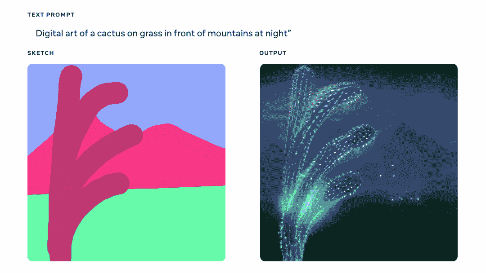
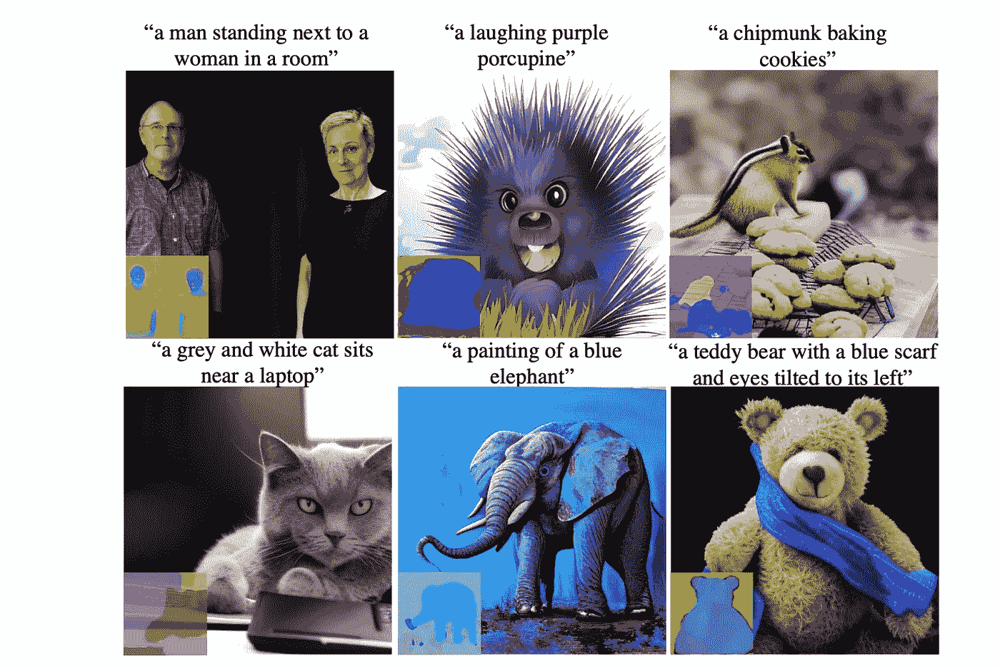
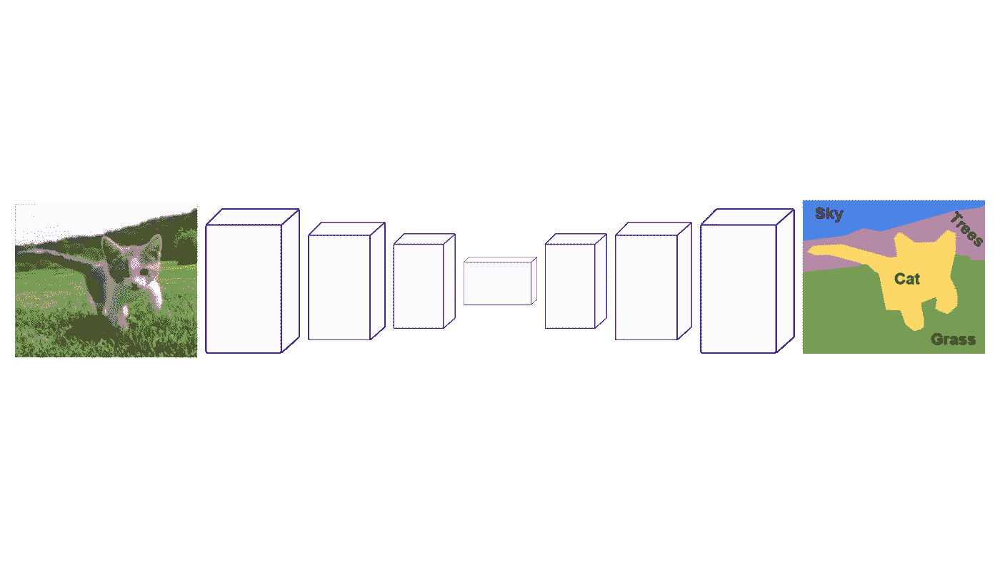
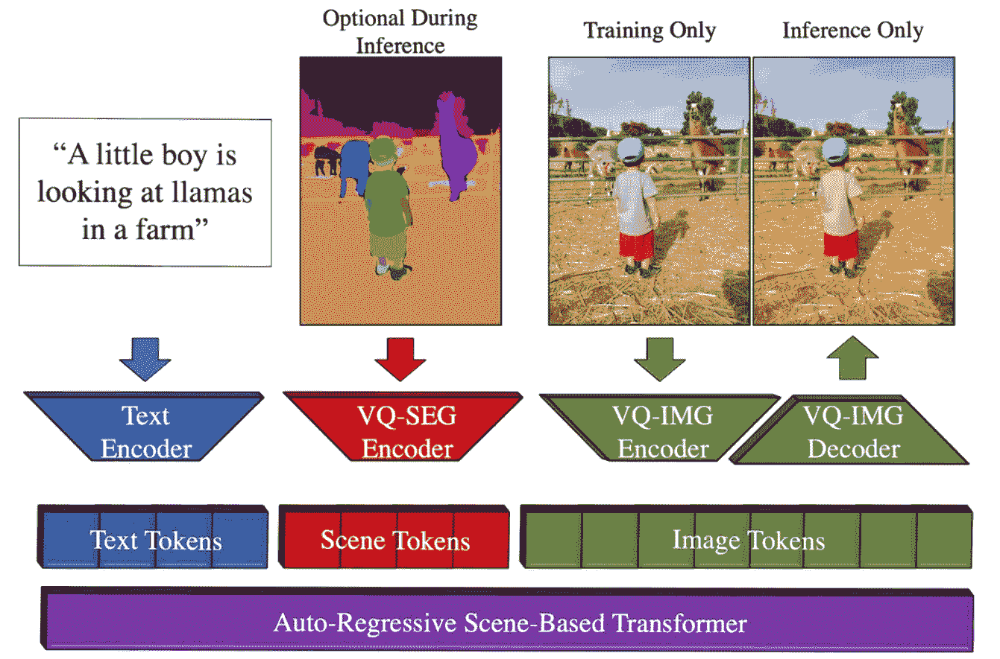

# 用文字和草图创作出令人惊叹的艺术品！

> 原文：<https://pub.towardsai.net/produce-amazing-artworks-with-text-and-sketches-128715500b84?source=collection_archive---------4----------------------->

## “制造一个场景”:文本和素描条件下的图像生成之间的奇妙融合。

> 最初发表于 [louisbouchard.ai](https://www.louisbouchard.ai/make-a-scene/) ，前两天在[我的博客上读到的！](https://www.louisbouchard.ai/make-a-scene/)

## 观看视频，了解更多结果！

这是大闹一场。这不是“又一场闹剧”。这个新模型的目标不是像 dalle 那样允许用户根据文本提示生成随机图像——这真的很酷——而是限制了用户对图像生成的控制。

图片来自 [Meta 的博文](https://ai.facebook.com/blog/greater-creative-control-for-ai-image-generation/)。

相反，Meta 希望推动创造性表达向前发展，将这种文本到图像的趋势与以前的草图到图像的模式相结合，导致“制作场景”:文本和草图条件下的图像生成之间的奇妙融合。这仅仅意味着，使用这种新方法，你可以快速勾画出一只猫，并写出你想要的图像，图像生成过程将遵循草图和文本的指导。它让我们更接近于能够在几秒钟内生成我们想要的完美插图。

你可以把这种多模态生成人工智能方法看作一个 Dalle 模型，对代有更多的控制，因为它也可以把一个快速草图作为输入。这就是为什么我们称之为多模态:因为它可以接受多种模态作为输入，比如文本和图像，在这种情况下是草图，而 Dalle 只接受文本来生成图像。多模态模型是一种非常有前途的东西——特别是如果我们匹配我们在网上看到的结果的质量——因为我们对结果有更多的控制，更接近一个非常有趣的最终目标，即在没有任何设计技能的情况下生成我们心目中的完美图像。

论文中的更多结果。

当然，这还处于研究状态，是一个探索性的 AI 研究概念。这并不意味着我们看到的是不可实现的。这只是意味着它将需要更多的时间来达到公众。

该领域的进展非常快，如果我很快看到它的现场直播或其他人的类似模型，我不会感到惊讶。我相信这样的草图和基于文本的模型甚至更有趣，特别是对于行业来说，这就是为什么我想在我的频道上报道它，即使结果有点落后于我们在网上看到的 Dalle 2。不仅对这个行业，对艺术家也是如此。有些人使用草图功能生成了比 Dalle 更意想不到的结果。

我们可以要求它生成一些东西，并绘制一个不代表这个特定事物的形式，如绘制一个花朵形状的水母，这可能不是不可能用 dalle 实现的，但如果没有草图指导，情况会复杂得多，因为模型只会复制它从现实世界的图像和插图中学到的东西。

所以主要的问题是，他们如何同时用文本输入(如 Dalle)和草图来指导一代人，并让模型遵循这两个指导方针？嗯，它与 Dalle 的工作方式非常非常相似，所以我不会过多地进入生成模型的细节，因为在过去的两个月里我已经介绍了至少五种不同的方法，如果你还没有看过这些方法，你绝对应该看看，因为这些模型像 [Dalle 2](https://youtu.be/rdGVbPI42sA) 或 [Imagen](https://youtu.be/qhtYPhPWCsI) 都非常棒。

通常情况下，这些模型需要数百万个训练样本来学习如何从文本中生成图像，这些文本带有从互联网上删除的图像及其标题形式的数据。

在这里，在训练期间，不是仅仅依赖于标题，生成我们图像的第一个版本并将其与实际图像进行比较，并对我们所有的图像重复这个过程无数次，我们还会给它一个草图。最酷的是，草图很容易生成用于训练:只需使用一个可以在线下载的预训练网络，并执行实例分割。

对于那些想知道细节的人来说，他们在 Imagenet 上使用一个免费的预训练 VGG 模型，所以与今天的网络相比，这是一个相当小的网络，超级准确和快速，产生这样的结果(见上图)…

称为分割图。他们只需对所有图像进行一次处理，然后获得这些地图来训练模型。

然后，使用这个地图以及标题来确定模型的方向，以生成初始图像。在推理的时候，或者当我们中的一个人使用它的时候，我们的草图会取代那些地图。

场景制作方法概述。图片来自报纸。

如我所说，他们用一个叫 VGG 的模特来制作假的训练草图。他们在图像生成过程中使用了变压器架构，这与 [Dalle-2](https://youtu.be/rdGVbPI42sA) 不同，如果您想了解更多关于它如何处理和生成图像的细节，我邀请您观看[我制作的视频](https://youtu.be/QcCJJOLCeJQ)来介绍用于视觉应用的变压器。

这种草图导向的转换器是与 Make-A-Scene 的主要区别，同时不使用 CLIP 这样的图像-文本排序器来测量文本和图像对，这也可以在 [my Dalle video](https://youtu.be/rdGVbPI42sA) 中了解到。相反，所有编码的文本和分割图都被发送到 Transformer 模型。该模型生成相关的图像令牌，由相应的网络编码和解码，主要用于产生图像。在训练期间使用编码器来计算产生的图像和初始图像之间的差异，但是只需要解码器来获取该变换器输出并将其变换成图像。

瞧！

这就是 Meta 的新模型如何能够获取草图和文本输入，并从中生成高清图像，从而对高质量的结果进行更多控制。正如他们所说，这只是这种新型人工智能模型的开始。这些方法将在质量和对公众的可用性方面不断改进，这是非常令人兴奋的。

正如 Meta 的博客文章所描述的，许多艺术家已经在他们自己的作品中使用该模型，我对我们什么时候也能使用它感到兴奋。

他们的方法不需要任何编码知识，只需要一手好的草图和一些及时的工程设计，这意味着通过文本输入的反复试验来调整公式和单词，以产生不同的更好的结果。

当然，这只是一个新的场景制作方法的概述，我邀请你阅读下面链接的完整论文，以获得它如何工作的完整概述。

我希望你喜欢这篇文章，下周我会带着另一篇精彩的论文来看你！

路易斯（号外乐团成员）

## 参考

梅塔的博文:[https://ai . Facebook . com/blog/greater-creative-control-for-ai-image-generation](https://ai.facebook.com/blog/greater-creative-control-for-ai-image-generation)
论文:Gafni，o .，Polyak，a .，Ashual，o .，Sheynin，s .，Parikh，d .，Taigman，y .，2022。有人类先验的基于场景的文本到图像生成。[https://arxiv.org/pdf/2203.13131.pdf](https://arxiv.org/pdf/2203.13131.pdf)
【我的时事通讯(一个新的人工智能应用每周向你的电子邮件解释！):[https://www.louisbouchard.ai/newsletter/](https://www.louisbouchard.ai/newsletter/)