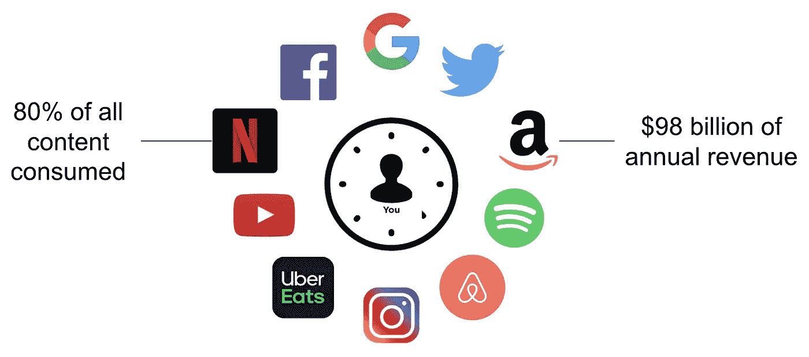
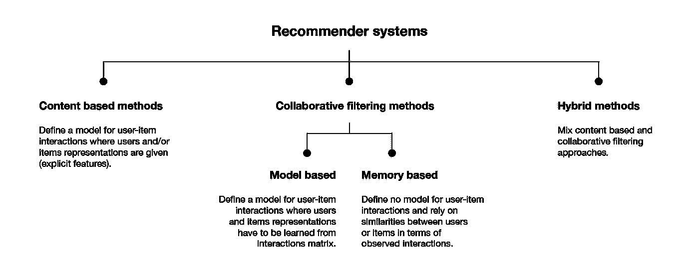
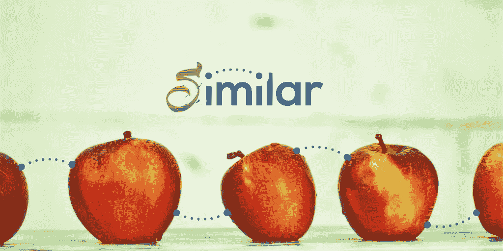

# 基于网页视觉相似性的产品推荐:机器学习/数据科学/深度学习

> 原文：<https://pub.towardsai.net/product-recommendation-based-on-visual-similarity-on-the-web-machine-learning-project-end-to-end-6d38d68d414f?source=collection_archive---------0----------------------->

## [机器学习](https://towardsai.net/p/category/machine-learning)


推荐系统

众所周知，谷歌、亚马逊、网飞等大型科技公司正在使用推荐系统，根据我们的观察名单提供推荐，他们正通过这些技术获得大量利润…

根据麦肯锡最近的一项研究，消费者在网飞上观看的节目中，高达 75%来自该公司的推荐系统，这不仅是因为消费者发现了更多的节目，而且推荐系统可以为该公司节省大量营销资金

> **我们将在本文中涉及的内容**

1.  什么是推荐系统？
2.  推荐系统的类型。
3.  什么是视觉相似？
4.  如何实现一个基于视觉相似性的推荐系统(Python)？
5.  使用 Streamlit 在 web 上实现。

> **那么让我们开始:**

在了解更多细节之前，如果你想看最终结果，请查看我的 YouTube 视频👉:- [**YouTube**](https://www.youtube.com/watch?v=JzEzBYtjBsE&t=68s&ab_channel=HimanshuTripathi)

> **什么是推荐系统？**



大型科技公司

一个**推荐系统**，或者一个**推荐系统**(有时用一个同义词如一个平台或者一个**引擎**来代替**系统**)，是一个信息过滤**系统**的子类，它试图预测一个用户对一个项目的“评分”或者“偏好”。

推荐系统通过基于用户提供的数据和照顾用户偏好和兴趣的其他因素过滤最重要的信息来处理大量存在的信息。它找出用户和项目之间的匹配，并估算出用户和项目之间的相似度以进行推荐。

用户和所提供的服务都从这类系统中受益。通过这些系统，质量和决策过程也得到改善。

> 为什么推荐系统很重要？


*   帮助用户找到他们感兴趣的项目。
*   帮助物品供应商将物品交付给正确的用户。
*   识别与用户最相关的产品。
*   个性化内容。
*   帮助网站提高用户参与度。

> **有什么可以推荐的？**

系统可以推荐许多不同的东西，如电影、书籍、新闻、文章、工作、广告等。网飞使用推荐系统向用户推荐电影和网络系列。同样，YouTube 推荐不同的视频。现在有许多广泛使用的推荐系统的例子。

> **推荐系统的类型。**



# 1.基于流行度的推荐系统

这是一种推荐系统，它的工作原理是流行或任何流行的东西。这些系统检查流行的或最受用户欢迎的产品或电影，并直接推荐它们。

例如，如果一个产品经常被大多数人购买，那么系统将知道该产品是最受欢迎的，因此对于每个刚刚签署该产品的新用户，系统也将向该用户推荐该产品，并且新用户也将购买该产品的机会变高。

## 优点

*   它没有冷启动问题，这意味着在业务的第一天，它还可以推荐各种不同过滤器的产品。
*   不需要用户的历史数据。

## 缺点

*   不个性化
*   该系统将向每个其他用户推荐完全基于受欢迎程度的同类产品/电影。

## 例子

*   谷歌新闻:通过趋势和最受欢迎的新闻过滤的新闻。
*   YouTube:趋势视频。

# 2.基于内容的推荐系统

这是另一种基于相似内容原理的推荐系统。如果用户正在观看电影，则系统将检查与用户正在观看的电影内容相似或类型相同的其他电影。在检查相似内容时，有各种用于计算相似性的基本属性。

基于内容的系统使用不同类型的方法来获得相似性

*   欧几里得距离
*   余弦相似度(我们将使用余弦相似度矩阵)
*   雅克卡相似性

# 3.协同过滤

它被认为是非常智能的推荐系统之一，可以处理不同用户之间的相似性，也可以广泛用于电子商务网站和在线电影网站。它会检查相似用户的口味并进行推荐。

相似性不限于用户的喜好，此外，还可以考虑不同项目之间的相似性。如果我们有大量关于用户和项目的信息，系统会给出更有效的推荐。

协同过滤主要使用两种方法

*   基于用户的最近邻协同过滤
*   基于项目的最近邻协同过滤

> **什么是视觉相似？**



视觉相似性检索“看起来相似”的图像，而不管图像内容如何。检索到的图像与选择的图像具有相似的视觉属性，例如可比较的颜色、纹理和形状。

为了获得图像的视觉相似性，我们将使用 CNN 并提取图像特征

> **如何实现基于视觉相似度的推荐系统(Python)。**

**基于视觉相似度的产品推荐**

这个实验的目标是做一个非常基本的推荐系统:对于一个给定的时尚产品，我们想要推荐看起来相似的产品。

这种推荐系统经常在浏览购物网站时使用。它们通常出现在产品页面上，就像“你可能也会喜欢”部分。

这种推荐系统背后的想法很简单:如果一个顾客通过浏览一个产品的页面表现出对该产品的兴趣，他也可能对类似的副产品感兴趣。

> **如何进行？**


我们将使用来自 Keras 的预训练 CNN 模型来提取图像特征。然后，我们将使用先前提取的图像特征来计算不同产品之间的相似性。

> **第一步:**

**下载数据集:**

我们将使用“风格彩色图像数据集”。我们可以从“Kaggle”下载数据集

数据集:——[https://www.kaggle.com/olgabelitskaya/style-color-images](https://www.kaggle.com/olgabelitskaya/style-color-images)

> **第二步:**

```
# imports
from keras.applications import vgg16
from keras.preprocessing.image import load_img,img_to_array
from keras.models import Model
from keras.applications.imagenet_utils import preprocess_input
from PIL import Image
import os
import matplotlib.pyplot as plt
import numpy as np
from sklearn.metrics.pairwise import cosine_similarity
import pandas as pd
```

> **#参数设置**

```
# parameters setupimgs_path = "/content/data/style"imgs_model_width, imgs_model_height = 224, 224nb_closest_images = 5 # number of most similar images to retrieve
```

> **#从 Keras 加载 VGG 预训练模型**

Keras 模块包含几个预训练的模型，可以很容易地加载。对于我们基于视觉相似性的推荐系统，我们需要加载一个卷积神经网络(CNN)来解释图像内容。在这个例子中，我们将加载在 imagenet 上训练的 VGG16 模型，imagenet 是一个大的带标签的图像数据库。如果我们采用整个模型，我们将得到一个包含属于某些类的概率的输出，但这不是我们想要的。我们希望检索模型能够从图像中获得的所有信息。为了做到这一点，我们必须删除 CNN 的最后几层，它们只用于类别预测。

> **#加载模型**

```
# load the model
vgg_model = vgg16.VGG16(weights='imagenet')# remove the last layers in order to get features instead of predictions
feat_extractor = Model(inputs=vgg_model.input,
outputs=vgg_model.get_layer("fc2").output)# print the layers of the CNN
feat_extractor.summary()
```

> **#获取图像路径:**

```
files = []
for x in os.listdir(imgs_path):
    if 'png' in x:
        # print(x)
        files.append(f"{imgs_path}/{x}")
        # break
```

> **#将一幅图像输入 CNN**


首先，我们观察当把一个图像放入 CNN 时我们得到什么输出。

**以下步骤是:**

*   **加载图像**
*   **准备将图像输入 CNN**
*   **获取与图像特征相对应的 CNN 输出**

```
# load an image in PIL format
original = load_img(files[1],target_size=(imgs_model_width,                           imgs_model_height))
plt.imshow(original)
plt.show()
print("image loaded successfully!")
```

> **#一个图像的特征提取**

```
# in PIL - image is in (width, height, channel)
# in Numpy - image is in (height, width, channel)
numpy_image = img_to_array(original)# convert the image / images into batch format
# expand_dims will add an extra dimension to the data at a particular axis
# we want the input matrix to the network to be of the form (batchsize, height, width, channels)
# thus we add the extra dimension to the axis 0.image_batch = np.expand_dims(numpy_image, axis=0)
print('image batch size', image_batch.shape)# prepare the image for the VGG model
processed_image = preprocess_input(image_batch.copy())
```

> **#把所有的图像输入 CNN**

我们能够对一幅图像进行特征提取。现在让我们为我们所有的图像这样做！

```
# load all the images and prepare them for feeding into the CNNimportedImages = []for f in files:
    filename = f
    original = load_img(filename, target_size=(224, 224))
    numpy_image = img_to_array(original)
    image_batch = np.expand_dims(numpy_image, axis=0)
    importedImages.append(image_batch)images = np.vstack(importedImages)
processed_imgs = preprocess_input(images.copy())
```

> **#提取图片特征**

```
imgs_features = feat_extractor.predict(processed_imgs)
print("features successfully extracted!")
imgs_features.shape
```

> **#计算余弦相似度**

现在我们有了每幅图像的特征，我们可以计算每对图像之间的相似性度量。

**我们将在这里使用余弦相似性度量。**

```
# compute cosine similarities between images
cosSimilarities = cosine_similarity(imgs_features)# store the results into a pandas dataframe
cos_similarities_df = pd.DataFrame(cosSimilarities,columns=files, index=files)
cos_similarities_df.head()
```

> **将预处理数据集保存为 csv 文件，以便我们以后使用**

```
cos_similarities_df.to_csv("model.csv")
```

> **#检索最相似产品**

**最后一步是实现一个函数，对于任何给定的产品，返回视觉上最相似的产品。**

```
def retrieve_most_similar_products(given_img):
    print("-"*50)
    print("original product:")
    original = load_img(given_img, target_size=(imgs_model_width,      imgs_model_height))
    plt.imshow(original)
    plt.show() print("-"*50)
    print("most similar products:") closest_imgs = df[given_img].sort_values(ascending=False)[1:nb_closest_images+1].index
    closest_imgs_scores = df[given_img].sort_values(ascending=False)[1:nb_closest_images+1] for i in range(0,len(closest_imgs)):
        original = load_img(closest_imgs[i], target_size=(imgs_model_width, imgs_model_height))
        plt.imshow(original)
        plt.show()
        print("similarity score : ",closest_imgs_scores[i])
```

> **使用 Streamlit 在 web 上实现。**


细流

**制作好预处理的 CSV 文件和数据源后，我们的文件目录看起来是这样的:**


**内容:-** 是数据文件(图片)

**Main:-** 运行应用程序的主文件(streamlit)

**模型:-** 预处理后的 CSV 文件

> **第一步:**
> 
> **#安装流线**

```
**pip install streamlit**
```

> **第二步:**
> 
> **#导入必要的库**

```
**import streamlit as st
from tensorflow.keras.applications import vgg16
from tensorflow.keras.preprocessing.image import load_img,img_to_array
from tensorflow.keras.models import Model
from tensorflow.keras.applications.imagenet_utils import preprocess_input****from PIL import Image
import os
import matplotlib.pyplot as plt
import numpy as np
from sklearn.metrics.pairwise import cosine_similarity
import pandas as pd**
```

> **#设定图像宽度和图像高度**

```
**imgs_model_width, imgs_model_height = 224, 224****nb_closest_images = 5**
```

> **#加载 CSV 文件**

```
**@st.cache
def load_data():
    df = pd.read_csv('model.csv')
    df.set_index("Unnamed: 0", inplace=True)
    return df**
```

> **#检索产品(主要功能)**

```
**def retrieve_most_similar_products(given_img,df):
    st.write("-"*50)
    st.success("original product:")** **original = load_img(given_img, target_size=(imgs_model_width,  imgs_model_height))
    plt.imshow(original)
    st.pyplot()** **st.write("-"*50) 
    st.error("most similar products:")
    given_img = "/"+given_img
    closest_imgs = df[given_img].sort_values(ascending=False)[1:nb_closest_images+1].index
    closest_imgs_scores = df[given_img].sort_values(ascending=False)[1:nb_closest_images+1]
    # st.write(closest_imgs[1][1:])
    for i in range(0,len(closest_imgs)):
        original = load_img(closest_imgs[i][1:], target_size=(imgs_model_width, imgs_model_height))
        plt.imshow(original)
        st.write("Simillarity",closest_imgs_scores[i])
        st.pyplot()
        plt.show()**
```

> **#用于加载图像**

```
[**@st**](http://twitter.com/st)**.cache()
def names():
    list_data = os.listdir('content/data/style')

    return list_data**
```

> **#主要功能**

```
**def main():
    st.sidebar.title("Himanshu Tripathi")

    st.sidebar.subheader('A recommender system, or a recommendation system, is a subclass of information filtering system that seeks to predict the "rating" or "preference" a user would give to an item. They are primarily used in commercial applications.')****activites = ['Product','About']
    choice = st.sidebar.selectbox("Select Actvity", activites)****if choice == 'Product':
        st.title("Product Recommendation System")

        name = names()
        n = st.selectbox("Select Image",name)
        if n is not None:
            path = "content/data/style/"+n
            df = load_data()

            retrieve_most_similar_products(path,df)
        else:
            st.error("Write the path name")****elif choice =='About':
        st.title("About Me")****st.success("Machine Learning and Data Science enthusiast, Android Developer, programmer and always willing to learn and work across new technologies and domains.")
        st.error("If you like the project Please Like Share and Subscribe")
        st.title("Please Like Share and Subscribe....")****if __name__ == '__main__':
 main()**
```

**在我的 YouTube 上查看更多有趣的机器学习、深度学习、数据科学项目👉:-**[**YouTube**](https://www.youtube.com/c/himanshutripathi)**(👍)**

**暂时就这样了👏👏。下一篇文章再见。**

**如果你觉得这篇文章有趣，有帮助，如果你从这篇文章中学到了什么，请鼓掌👏👏)**并留下反馈。****

****感谢阅读！****

> ****参考文献:-****

**[**https://www . ka ggle . com/olgabelitskaya/style-color-images/notebooks**](https://www.kaggle.com/olgabelitskaya/style-color-images/notebooks)**

**[**https://www . analyticssteps . com/blogs/what-are-recommendation-systems-machine-learning**](https://www.analyticssteps.com/blogs/what-are-recommendation-systems-machine-learning)**

****还有，让我们在**[**Linkedin**](https://www.linkedin.com/in/iamhimanshu0/)**[**Twitter**](https://twitter.com/iam_himanshu0)**[**insta gram**](https://instagram.com/iamhimanshu0/)**[**Github**](https://github.com/iamhimanshu0)**，以及** [**脸书**](https://www.facebook.com/iamhimanshu0) **。**********