# 使用机器学习 Python 预测员工的生产力

> 原文：<https://pub.towardsai.net/productivity-prediction-of-employees-using-machine-learning-python-24a327534f71?source=collection_archive---------0----------------------->

> 通常在工业中，分析、跟踪和预测员工的生产力是很重要的，因为公司依赖于他们的工人的生产力和表现。此外，各种因素在影响员工的生产力方面发挥着关键作用，如给予的激励、他们工作的领域、工作时间、工作日——正如人们通常认为的那样，它起着巨大的作用，他们工作的团队以及许多其他特征。由于公司需要良好的员工生产力，他们需要分析并关注这些特征。

在本文中，我们将根据各种特征来预测员工的生产率。


安德里亚斯·克拉森在 [Unsplash](https://unsplash.com?utm_source=medium&utm_medium=referral) 上拍摄的照片

## 资料组

本文中使用的数据集取自 Kaggle。我们可以在这里找到数据集[](https://www.kaggle.com/datasets/ishadss/productivity-prediction-of-garment-employees)**。该数据集包含服装行业 1197 名员工的信息。该数据集中使用的特征是—**

**数据集包含 1197 行和 15 列**

```
import pandas as pddf = pd.read_csv("garments_worker_productivity.csv")
df.head(5)
```

****属性信息**:**

**日期:年-月-日的日期**

**日:一周中的某一天**

**季度:一个月的一部分。一个月被分成四个季度**

**部门:与例程关联的部门**

**小组编号:与例程关联的小组编号**

**noofworkers:每个团队中的工人数量**

**noofstylechange:特定产品风格的变化次数**

**targetedproductivity:由管理机构为每个团队设定的每天的目标生产率。**

**smv:标准分钟值，它是分配给任务的时间**

**WIP:在制品。包括产品的未完成项目数**

**加班:表示每个小组的加班时间(分钟)**

**奖励:表示促成或激励特定行为的财务奖励金额(在 BDT)。**

**空闲时间:由于多种原因导致生产中断的时间**

**闲置人员:由于生产中断而闲置的工人数量**

**actual_productivity:工人交付的生产力的实际百分比。它的范围从 0 到 1。**

## **电子设计自动化(Electronic Design Automation)**

**让我们进行一些数据分析**

**将日期字符串列转换为日期对象—**

```
df["date"] = pd.to_datetime(df["date"])
```

**让我们看看部门的类型—**

```
df['department'].value_counts()
```

**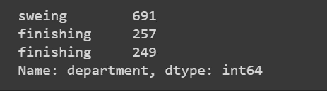**

**输出**

**在这里我们可以看到，空间在整理分裂成两个不同的类别。现在让我们合并它们。**

```
df['department'] = df['department'].apply(lambda x: 'finishing' if x.replace(" ","") == 'finishing' else 'sewing' )df.department.value_counts().plot.pie(autopct='%.2f %%')
```

**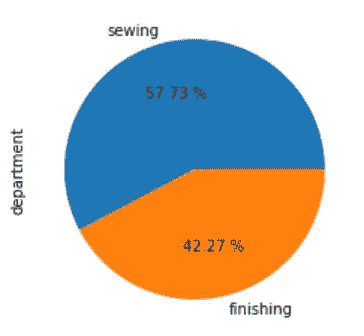**

**输出**

**正如我们所见，58%的员工从事缝纫工作，而 42%的员工从事整理工作。**

**我们来对比一下实际生产率和目标生产率，看看员工的表现。**

```
import seaborn as sns
import matplotlib.pyplot as pltplt.figure(figsize = (15,5))ax=sns.lineplot(y='targeted_productivity',x='date' ,color = "red", data =df,legend='brief')ax=sns.lineplot(y= 'actual_productivity',x='date',data=df, color="green", legend = 'brief')ax.set(ylabel = 'Productivity')plt.show()
```

**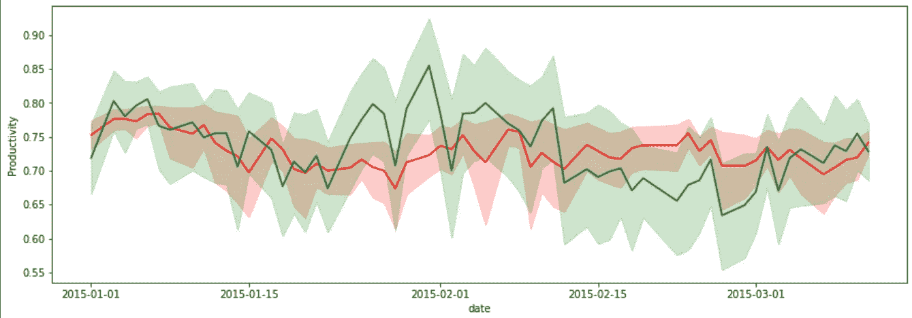**

**输出**

**正如我们所看到的，权衡并不一致，但总体生产力是有可能的。**

**现在让我们分析一下一周中的某一天或者某个团队或部门是否对生产力有显著影响。**

```
l = []l1=[]column_name = "day"for i in list(df[column_name].unique()):print( f"productivity on {i} is ",df[df[column_name] == i]["actual_productivity"].mean())l.append(df[df[column_name] == i]["actual_productivity"].mean())l1.append(i)dictionary = {"data":l,"keys":l1}sns.barplot( x = "keys" , y = "data", data = dictionary)
```

**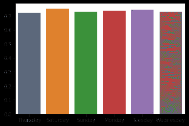**

**输出**

**我们可以看到生产率在几天内保持不变。让我们对其他特性重复同样的过程，用上面代码中的目标列名替换 column _ name**

**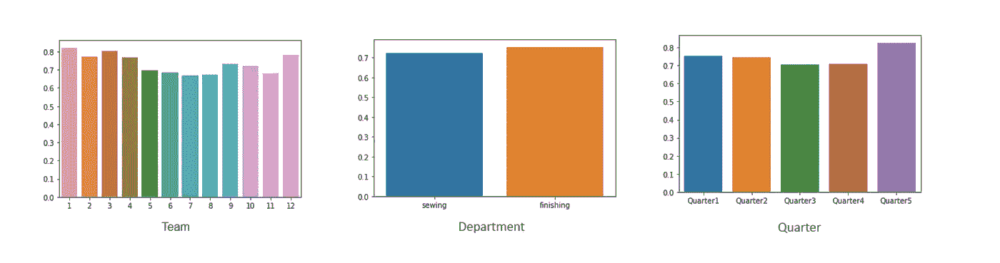**

**输出**

**正如我们在上面看到的，生产力不依赖于团队、类别、季度或日期。**

**让我们画出相关矩阵来看看相关的数量—**

```
corrMatrix = df.corr()fig, ax = plt.subplots(figsize=(15,15)) # Sample figsize in inchessns.heatmap(corrMatrix, annot=True, linewidths=.5, ax=ax)plt.show()
```

**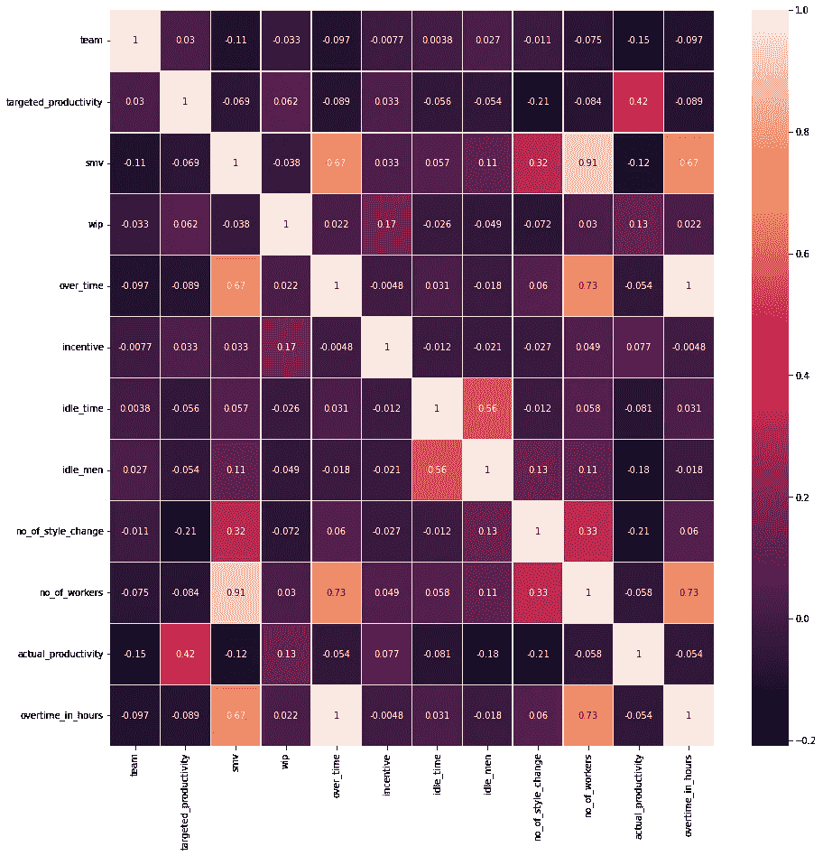**

**输出**

**所以从这些数据来看，很明显生产率主要取决于目标生产率，因为有了目标会激励和提高员工。**

**让我们准备最后的数据，开始预测。**

## **预处理数据**

**在进行预测之前，让我们做一些数据清理和预处理**

```
df.date
```

**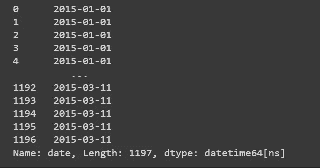**

**输出**

**所以我们有 3 个月的数据。在数据中，我们已经有一个日列，所以有一个月列就足够了，而不是完整的日期。**

```
df['month']=df['date'].dt.monthdf.drop(['date'],axis=1, inplace=True)
```

**现在让我们看看我们是否有任何缺失的值—**

```
# This will Display the percentage of missing values per column
df.isnull().sum() / len(df) * 100 
```

**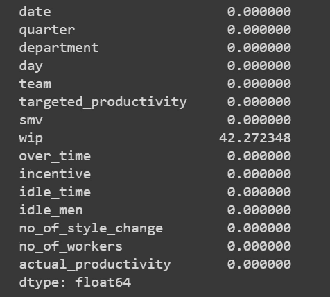**

**输出**

**所以我们只有一列— wip，它有 42%的缺失值。从现在开始，我们不填充它，而是删除这个列。**

```
df.drop(['wip'],axis=1, inplace=True)
```

**在数据中，您可以看到一些非数字列。因此，让我们对它们进行编码，因为大多数机器学习算法只能处理数字数据。**

**让我们用 MultiColumnLabelEncoder 对数据进行编码—**

```
!pip install MultiColumnLabelEncoder
```

**这里我们使用了 MultiColumnLabelEncoder，因为它对反转编码最有帮助。**

```
import MultiColumnLabelEncoderMcle = MultiColumnLabelEncoder.MultiColumnLabelEncoder()df = Mcle.fit_transform(df)
```

**所以我们的数据准备好了。让我们将数据分成独立和相关的列—**

```
x=df.drop(['actual_productivity'],axis=1)y=df['actual_productivity']
```

## **预测生产率**

**让我们使用 Python 中的回归算法来预测生产率。在此之前，让我们准备训练和测试数据—**

```
from sklearn.model_selection import train_test_splitx_train, x_test, y_train, y_test = train_test_split(x, y,train_size=0.8,random_state=0)
```

## **使用线性回归**

```
from sklearn.linear_model import LinearRegression
from sklearn.metrics import mean_squared_error
from sklearn.metrics import mean_absolute_error
from sklearn.metrics import r2_scoremodel_lr=LinearRegression()model_lr.fit(x_train,y_train)pred_test=model_lr.predict(x_test)print("test_MSE:",mean_squared_error(y_test, pred_test))
print("test_MAE:",mean_absolute_error(y_test, pred_test))
print("R2_score:{}".format(r2_score(y_test, pred_test)))
```

**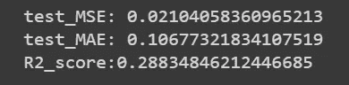**

**输出**

**让我们使用随机森林回归来提高性能。**

## **使用随机森林回归**

```
from sklearn.ensemble import RandomForestRegressormodel_rfe = RandomForestRegressor(n_estimators=200,max_depth=5)model_rfe.fit(x_train, y_train)pred = model_rfe.predict(x_test)
print("test_MSE:",mean_squared_error(y_test, pred))
print("test_MAE:",mean_absolute_error(y_test, pred))
print("R2_score:{}".format(r2_score(y_test, pred)))
```

**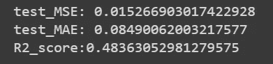**

**输出**

## **使用 XGBoost**

```
import xgboost as xgbmodel_xgb = xgb.XGBRegressor(n_estimators=200, max_depth=5,                          learning_rate=0.1)model_xgb.fit(x_train, y_train)pred3=model_xgb.predict(x_test)print("test_MSE:",mean_squared_error(y_test, pred3))
print("test_MAE:",mean_absolute_error(y_test, pred3))
print("R2_score:{}".format(r2_score(y_test, pred3)))
```

**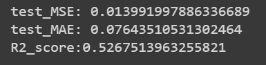**

**输出**

**因此，我们实现了 0.07 的平均绝对误差和 0.01 的均方误差，这表明我们的模型表现非常好。**

**所以在所有算法中，XGBoost 的表现还是不错的。这样，我们就可以预测员工的生产力。**

**快乐编码……**