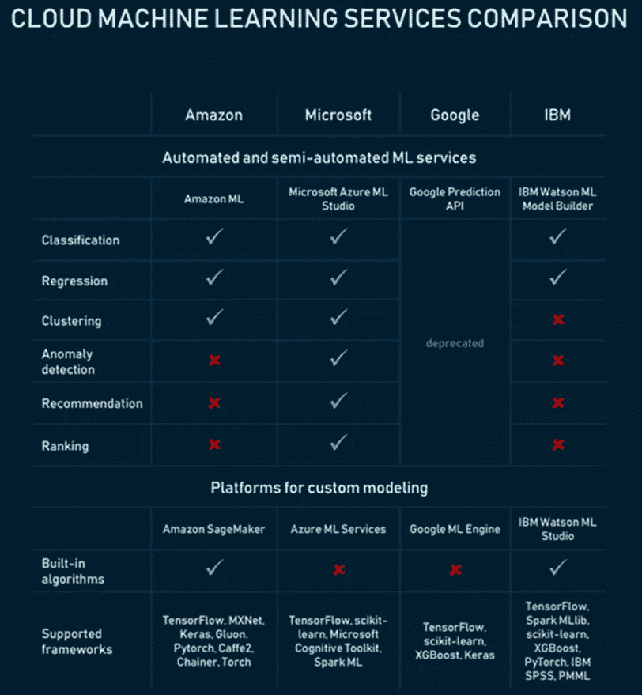

# 大型数据科学项目的生产力工具

> 原文：<https://pub.towardsai.net/productivity-tools-for-large-scale-data-science-projects-64810dfbb971?source=collection_archive---------0----------------------->

## 分析用于现实世界工业类型项目的不同生产力工具


照片由 [imgix](https://unsplash.com/@imgix?utm_source=medium&utm_medium=referral) 在 [Unsplash](https://unsplash.com?utm_source=medium&utm_medium=referral) 上拍摄

BJupyter notebook、R Studio 等数据科学专用 asic 生产力工具是小规模数据科学和机器学习项目的好工具。在这些类型的项目中，数据集通常非常简单，甚至可以在合理的时间内在笔记本电脑上进行模型构建、测试和评估。下面是两个使用 Jupyter notebook 和 R Studio 的小规模项目的例子:

1.  预测邮轮船员规模的机器学习模型:数据集和 Jupyter 笔记本可以在这里找到:[预测船舶船员规模的 ML 模型](https://github.com/bot13956/ML_Model_for_Predicting_Ships_Crew_Size)。
2.  模拟贷款状态的机器学习模型:数据集、R 脚本、样本输出可以在这里找到:[预测贷款状态的蒙特卡罗模拟](https://github.com/bot13956/Monte_Carlo_Simulation_Loan_Status)。

在现实世界的数据科学项目中，数据集可能非常复杂，要执行的任务可能涉及计算密集型问题，例如图像处理、语音分析，或者使用具有数百个特征和数千个观察值的复杂数据集构建深度学习模型。这些类型的问题需要先进的生产力工具来解决。本文将讨论大规模数据科学项目的生产力工具。

# 大规模数据科学项目的生产力工具

## 1.高性能计算

可以使用高性能计算(HPC)设施来执行高度密集的数据科学项目。HPC 是包含多个节点的计算机集群。HPC 可以串行或并行模式执行计算。为了使用 HPC 资源，数据科学家必须掌握以下技能:

**a)命令行或类 UNIX 界面(Linux)** :这是与计算机服务器交互所需要的。有几种基于 UNIX 的操作系统可用于 HPC。我最喜欢的是 Ubuntu。从下面的链接中找到更多关于 Ubuntu 的信息:

[](https://ubuntu.com/) [## 面向个人电脑、物联网设备、服务器和云的领先操作系统| Ubuntu

### 构建高性能、可扩展的平台。迁移到 Charmed OpenStack 如何显著降低总拥有成本…

ubuntu.com](https://ubuntu.com/) 

Ubuntu 提供了一个类似 windows 的 UNIX 系统，非常容易使用，特别是对于不熟悉命令行的个人。

下面给出了 HPC 所必需的一些基本 UNIX 命令:

```
**# make a new director**
$ mkdir**# what is my current directory**
$ pwd**# change director**
$ cd**# lists your files in current working directory**
$ ls**# copy file1 and save as file2**
$ cp file1 file2**# delete a file1**
$ rm file1**# search the string "r2 score" in file1**
$ grep "r2 score" file1**# launch an editor that lets you create and edit a file
$** emacs file1
```

关于基本 UNIX 命令的更多信息可以在这里找到:[http://mally.stanford.edu/~sr/computing/basic-unix.html](http://mally.stanford.edu/~sr/computing/basic-unix.html)

**b)关于批处理调度器的知识:**这是在 HPC 集群上以非交互方式运行作业所需要的。假设我们想要在 HPC 计算机上运行一个机器学习模型，该模型允许 MPI(节点间通信)进行消息传递。假设我们模型的 python 代码存储在名为“my_script.py”的文件中。要在 HPC 集群上运行它，我们可以在 Python 脚本所在的目录中创建以下批处理脚本，我们称之为“myjob.sh ”,如下所示:

```
#!/bin/bash#SBATCH --nodes = 3#SBATCH --tasks-per-node = 32#SBATCH --time = 02:00:00#SBATCH --job-name = my_script.pymodule load pythonsrun -n 96 python my_script.py
```

要在 HPC 上以批处理模式运行“my_script.py ”,我们使用 sbatch 命令从命令行提交批处理脚本，并等待它运行完成:

```
% sbatch myjob.sh
```

执行作业时，会在服务器上的当前工作目录中创建一个输出文件。然后，输出文件可用于后期处理和分析。一些服务器配备了软件，能够通过图形用户界面进行事后分析和结果可视化。如果这不可用，那么可以将输出文件传输到本地桌面进行后期分析。有许多软件应用程序可用于在本地目录和服务器上的目录之间传输文件。一个例子是 PuTTY，它是一个免费的开源终端仿真器、串行控制台和网络文件传输应用程序。它支持多种网络协议，包括安全拷贝(SCP)和安全外壳(SSH):【https://www.putty.org/】T4。

对于小公司来说，构建 HPC 计算平台可能非常昂贵。它还需要一个 HPC 技术人员团队来操作和维护该设施，并为数据科学家提供技术支持和培训。因为大多数公司无法维护这些设施，所以他们更多地依赖云服务作为生产力工具来满足他们的数据科学和机器学习项目需求。

## 2.云服务

在云计算领域，三大提供商是亚马逊、微软和 IBM。下图显示了不同云机器学习服务的比较、它们的能力以及它们的差异。



图片来源: [altexsoft](https://www.altexsoft.com/blog/datascience/comparing-machine-learning-as-a-service-amazon-microsoft-azure-google-cloud-ai-ibm-watson/)

如上图所示，平台能否提供内置算法，允许您构建、测试和部署机器学习模型。AWS 和 Azure 是最流行的构建和部署机器学习模型的云平台。数据科学家应该尝试学习如何使用云服务。下图显示，AWS、Azure 和 Linux (UNIX)是 2020 年最受欢迎的技能。这些都是高强度数据科学和机器学习项目的生产力工具。


Benjamin O. Tayo 的图片

总之，我们已经讨论了大规模数据科学项目的基本生产力工具。随着越来越多的公司使用先进的生产力工具来满足他们的数据科学和机器学习需求，对于任何对数据科学职业感兴趣的人来说，学习 HPC 等先进生产力工具和 AWS 或 Azure 等云服务的基础知识非常重要。