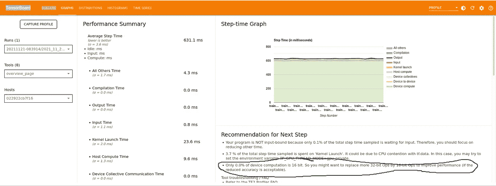
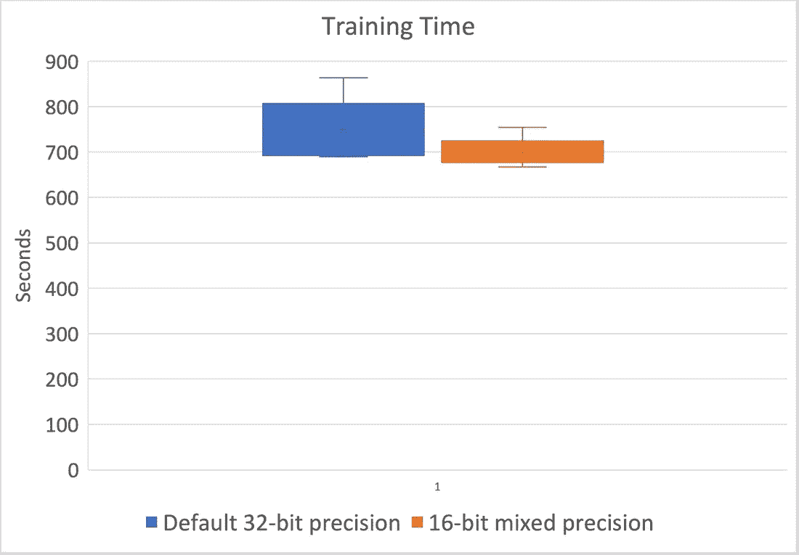
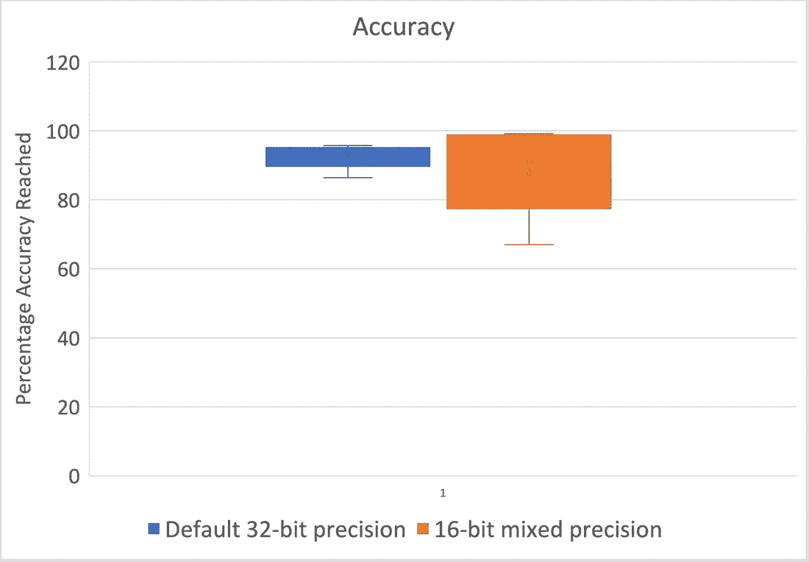

# 剖析神经网络以提高模型训练和推理速度

> 原文：<https://pub.towardsai.net/profiling-neural-networks-to-improve-model-training-and-inference-speed-22be473492bf?source=collection_archive---------1----------------------->

## [深度学习](https://towardsai.net/p/category/machine-learning/deep-learning)


由[尼古拉斯·霍伊泽](https://unsplash.com/@nhoizey?utm_source=medium&utm_medium=referral)在 [Unsplash](https://unsplash.com?utm_source=medium&utm_medium=referral) 上拍摄的照片

在之前的一篇[帖子](https://programmablerobots.substack.com/p/teaching-a-robot-to-read-sign-language-133d4a553eeb)中，我们研究了如何教会 Anki 矢量机器人识别人类手语。具体来说，我们用从 Vector 的相机中拍摄的 8500 幅人体标志图像的[标记数据集](https://www.kaggle.com/amitabhabanerjee/training-a-robot-to-understand-sign-language)训练了一个定制的卷积神经网络(CNN)。在这个视频中，我们演示了如何使用经过训练的 CNN 来检测人体信号。我们还探索了小型定制 CNN 模型和大规模公认的 RESNET 模型之间的权衡。其他研究人员也做了类似的努力；比如教 Anki Cozmo 学习人类手语的努力。

在这篇文章中，我们将根据训练模型所需的时间(训练速度)，以及使用该模型对图像进行分类所需的时间(推理速度)，找出优化该模型的方法。我们可以把这个过程分成几个步骤。

1.  **描述您现有的模型，并寻找改进的机会。**
2.  **对您的模型进行相应的更改，以实现预期的改进**
3.  **重新运行您的培训管道，重新描述，并评估您是否有所改进。**

**性能分析**

如果您的项目基于 Tensorflow，则分析模型的最简单方法是使用 TensorBoard Profiler。PyTorch 也有类似的[性能分析器](https://pytorch.org/blog/introducing-pytorch-profiler-the-new-and-improved-performance-tool/)。[这篇](https://www.tensorflow.org/guide/gpu_performance_analysis)文章向你展示了尝试优化 GPU 性能的步骤。在我们的具体案例中，我们将分析 RESNET 模型的性能，该模型被训练来学习人类手语识别语言。这个 [Colab 笔记本](https://colab.research.google.com/drive/1zDFm6qpvwbmMa1wxtDK3DXXCPrhQl7fk?usp=sharing)演示了如何在训练 RESNET 的同时运行 TensorBoard profiler。简而言之，我们对 RESNET 进行了 5 个纪元的训练，取得了 94%的准确率；同时，我们收集档案，以了解训练模型的性能。

这是分析器的一个快照。



图 TensorBoard 分析器的输出

从上述情况可以得出一些重要的观察结果。

1.  训练一个模型的每一步需要 631 毫秒。**一个步骤包括基于一段训练数据更新神经网络模型参数的一次迭代。**对于训练神经网络模型的每一步，CPU 都需要将模型参数卸载到 GPU 并启动计算。换句话说，对模型参数进行一轮更新所花费的时间是 631 毫秒。
2.  **大部分时间(~590 ms)属于设备计算时间**(参见浅绿色曲线)，这是 GPU 计算矩阵乘法以得出误差和导数以得出误差曲线梯度所花费的时间(如果您不了解 CNN 如何为该练习进行训练的细节，这没关系)。
3.  **大约 23 毫秒(3.7%)属于内核启动时间范畴。**这是 CPU 将数据卸载到 GPU 所需的时间。TensorBoard Profile 指出了在此步骤中可以进行的优化。我们将在后面讨论这种优化。
4.  TensorBoard Profile **注意到没有一个计算是基于浮点 16 (FP16)算法**(黑色圆圈中的注释)。这为改进提供了一个成熟的基础，我们将在这篇文章的下一部分讨论如何进行这种改进，以及它所带来的折衷。

**混合精度算术**

让我们先了解一下浮点 16 (FP16)和浮点 32 (FP32)运算的区别。

**FP16 vs FP32 运算**

使用 FP16 为我们带来了两个显著的计算优势

1.  在 FP16 上操作的计算速度(比如说将两个 FP16 数相乘)比 FP32 算法快很多倍。有两个原因:(I)您需要做的工作减少了 4 倍，以及(ii)许多处理器(如 Nvidia 的处理器)都有专门的单元来处理 FP16。
2.  我们在访问 FP16 数据时消耗的内存带宽要少得多，从而降低了在遇到计算瓶颈之前遇到内存访问瓶颈的可能性。

然而，使用 FP16 的后果是精度较低。因此，如果我们简单地使用 FP16 来表示神经网络的系数，由于数据精度的损失，训练阶段很可能不会收敛。

这导致了**混合精度训练**的引入。在混合精度训练中，我们在 FP16 中执行大多数操作，但在 FP32 中保留网络的一些核心部分(通常模型激活和梯度使用 16 位浮点格式存储，而模型权重和优化器状态使用 32 位精度 [1](https://programmablerobots.substack.com/#footnote-1) )，以便最大限度地减少信息损失。NVIDIA 的文档显示了混合精度训练如何实现 3 倍的速度提升，同时在训练时收敛到相同的精度水平。

**ML 库支持混合精度训练**

大多数 ML 库都内置了对混合精度的支持。例如，在 Tensorflow 中，启用混合精度训练只需添加以下行:

```
from tensorflow.keras import mixed_precision
policy = mixed_precision.Policy('mixed_float16')
mixed_precision.set_global_policy(policy)
```

在上面几行代码中，我们设置了一个全局策略来使用 FP16 的混合精度。一个解释 Tensorflow 复杂性的详细文档可以在[这里](https://www.tensorflow.org/guide/mixed_precision)找到。现在，我们需要衡量上述代码更改的效果。

**量化模型变化**

以下是一些关于如何科学地量化模型变化的原则:

1.  **进行比较:**确保你完全了解和理解你正在比较的东西。背景中经常会发生微妙的变化，这可能会影响我们在两个实验之间进行的任何比较。在这项工作的背景下，重要的是要检查训练是在相同类型的 GPU 上、在相同的训练数据集上、针对相同数量的时期执行的。
2.  **小心每次运行的变化:**当我们运行两个实验时，最终结果很少相同。这种差异是由系统中经常发生的多种随机过程造成的。因此，重要的是不要从一次实验来判断实验结果。相反，人们应该多次进行实验。多次实验得出的结果给了读者更高程度的信心。
3.  **使用多个数据点来比较和对比结果。****一旦我们获得了多次实验的结果，我们需要使用不同的方法来解释这些结果。通常，结果的平均值被用作唯一的比较点。然而，通常意味着是不够的。可用于比较的其他度量是 I)标准偏差，ii)中值，iii)百分位数:例如第 90 百分位数。**

****了解混合精度训练的效果****

**现在我们已经了解了如何比较实验结果，让我们比较 RESNET 模型在人类手语识别数据集上的训练性能。在这种情况下，我们希望比较以下内容:**

1.  **使用默认的 32 位精度为 RESNET 定型**
2.  **混合精度训练 RESNET。**

**训练在 5 个时期终止。(如果我们实际上正在训练一个部署在生产环境中的模型，我们将训练更多的历元，直到精度收敛。但是对于性能比较，5 个纪元就足够了)我们在这个 [Google Colab 笔记本](https://colab.research.google.com/drive/1zDFm6qpvwbmMa1wxtDK3DXXCPrhQl7fk?usp=sharing)的帮助下，对每组实验运行了五次迭代。这是结果。**

****

**图 2:将模型训练到 5 个时期的时间的盒须图**

****

**图 3:经过 5 个时期的训练后，模型在验证数据集上的准确度的盒须图**

**这些图通常被称为[盒须图](https://datavizcatalogue.com/methods/box_plot.html)。顶部和底部的条形表示最大值和最小值，而图中的彩色区域表示上四分位数(75%)和下四分位数(25%)之间的范围。借助这些图，我们可以得出以下结论。**

1.  **混合精度训练使得模型的训练时间更快，并且训练时间的方差更低。如果我们将平均值作为比较指标，混合精度训练要快 6%。**
2.  **混合精度训练在模型的精度上具有大得多的差异。在最坏的情况下，模型的准确度可能显著更差(与 32 位训练的 5 个时期后的 86%准确度相比，5 个时期后的 66%准确度的最坏情况)。更差的精度可能意味着模型需要训练到更高的历元数，或者模型重新训练…这两种选择都会增加训练时间。**

**顺便说一下，用混合精度训练的模型也将有更少的推理时间…但是我们将在随后的帖子中讨论这个问题。**

****

**如果你有任何问题或想法，请在下面的评论中留下。更多有趣的文章请关注我的刊物:[编程机器人](https://medium.com/programming-robots)。我也有一门借助 Vector 教授人工智能的在线课程，可以在:【https://robotics.thinkific.com】T2 找到，我将为有你这样的学生而感到荣幸。**