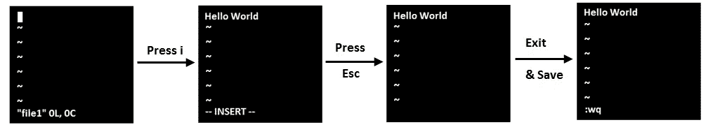
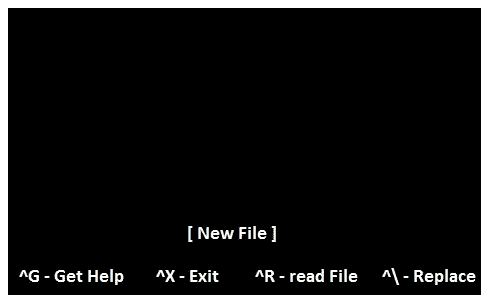

# 充分解释了 Linux 中 Cat、Touch、Vi/Vim 和 Nano 之间的区别

> 原文：<https://pub.towardsai.net/programming-1b3abb819e2e?source=collection_archive---------0----------------------->

## [编程](https://towardsai.net/p/category/programming)

## 理解文件创建的概念


由[加布里埃尔·海因策](https://unsplash.com/@6heinz3r?utm_source=medium&utm_medium=referral)在 [Unsplash](https://unsplash.com?utm_source=medium&utm_medium=referral) 上拍摄的照片

本文将消除在 Linux 中创建和编辑文件的所有困惑。Linux 是一个开源内核，成为一个带有开源软件的操作系统。

> ***Linux 历史***

这是新泽西州贝尔实验室的 UNIX 项目。五年后，该项目退出，但从事该项目的员工重新开始，并以开源方式开发了一个内核 UNICS，即单向信息和计算服务。

大约在 1975 年，UNIX 的第六版也作为开源软件推出。但许多科技巨头都制作了自己的付费版本。

```
UNIX
|
|--> IBM- AIX
|--> SUN Solaris
|--> Mac OS
|--> HP-UX
|--> Flavours of UNIX
```

Linux 是 Linus Torvald 用 Andrew Tanenbaum 教授教给他的学生的对 MINIX 的理解从零开始开发的。

还有一种 UNIX 风格叫做 Linux，它不同于 Linus Torvald 爵士制作的 Linux。这个 Linux 版本提供了更多的版本，如下所示:

```
UNIX
|
|-->Linux
      |
      |--> Redhat EL : Giving services
      |--> Fedora    : Group of organizations 
      |--> Debian
      |--> Others(Free)
              |
              |--> Ubuntu: Third most used OS
              |--> CentOS: faster than other Linux
              |--> Kali  : Used for Ethical hacking
```

> ***Linux 中的文件系统***

```
 Linux
                                |
                                |
                                / ---> Root Directory
                                |
     ----------------------------------------------------------
     |          |          |           |         |            |
   /root      /home      /boot       /etc      /usr         /bin
```

*   **/home:** 其他用户的主目录
*   **/root:**root 用户的主目录
*   **/boot:** 包含 Linux 的可引导文件
*   **/etc:** 包含所有配置文件
*   **/usr:** 默认情况下，软件安装在此目录中
*   **/bin:** 包含包括根用户在内的所有用户使用的命令
*   **/sbin** :包含唯一根用户使用的命令
*   **/dev:** 基本设备文件，包括终端设备或任何其他连接到系统的设备。

```
 **Windows**                     **Linux**
                               |
           * Administrator     |       * Root user
           * Folder            |       * Directory
           * File              |       * File
           * Software          |       * Package
```

> ***Cat、Touch、Vi/Vim、Nano 的区别***

*   Linux 是区分大小写的
*   普通用户使用美元($)符号，根用户使用井号(#)。

```
]$      -----> This is a normal userChange to root user
]$ sudo su    ------> Super user do switch user
]# #Change to the normal user again
]#exit
  or
]# ctrl+d
]$
```

在 Linux 中，我们可以用多种方式创建文件，但只能用某种类型的编辑器编辑内容。

**在 Linux 中创建文件的类型**

```
1\. Cat--------> majorly used for concatenating the files
2\. Touch------> Used to create an empty file
3\. Vi/Vim ----> Editor to change the file content
4\. Nano-------> Editor to change the file content
```

[](https://medium.com/pythoneers/new-features-in-python-3-10-2d9ce189946a) [## Python 3.10 中的新功能

### 更快更稳定的特性

medium.com](https://medium.com/pythoneers/new-features-in-python-3-10-2d9ce189946a) [](/introduction-to-hadoop-ecosystem-206b7f58f001) [## Hadoop 生态系统简介

### 大型数据集的分布式处理框架

pub.towardsai.net](/introduction-to-hadoop-ecosystem-206b7f58f001) 

现在，我们将简要讨论所有这些类型。

## Cat 命令

cat 命令是最通用的工具之一，但它确实是将标准输入复制到标准输出。它主要用于连接文件。

**卡特彼勒命令功能**

```
cat
 |
 |--> create file: creating a single file
 |--> concatenate file: to add more than one file into a single file
 |--> copy file: to copy the content of one file into another file
 |--> tac: to see the content in the bottom to top approach
```

使用 cat 命令创建文件并写入内容

```
]# cat >file1
  ------
  ------ctrl+d ----> to exit from the file
```

查看我们创建的文件的内容

```
]# cat file1
```

创建另一个文件并连接文件 1 和文件 2。

```
]# cat >file2
   -----
   -----
ctrl+d#concatenating these two files
]# cat file1 file2>file3
```

在串联之后，创建了文件 3，并且文件 1 和文件 2 的所有内容都在文件 3 中。

```
# to see the content of file3
]# cat file3
    -----      |----> content of file1
    -----      |----> content of file2
ctrl+d#to copy the content of file1 to file2
]# cat file1>file2
```

文件 2 的旧内容将被删除，文件 1 的所有内容将成为文件 2 中的副本。

## 触摸命令

它也用于创建文件，但主要用于更新时间戳。

```
touch
 |
 |--> create file: creating a single and multiple empty files
 |--> change all timestamps of a file
 |--> update only access time and modify time of a file
```

当我们用 touch 创建一个文件时，我们也获得了文件的时间戳。我们可以使用这三个函数来访问、修改和更改文件时间戳。

```
]# touch file1
           |
           |--> access time, date, time
           |--> modify time. date, time
           |--> change time, date, time
```

**时间戳树如下所示:**

*   **访问时间:**最后一次访问文件的时间和更改访问时间。看到这一点的命令如下所示:

```
]# touch -a filename
```

*   **修改时间:**最后一次访问文件的时间和修改时间。看到这一点的命令如下所示:

```
touch -m filename
```

*   **更改时间:**文件元数据最后一次更改的时间。

使用 stat 命令查看文件的时间戳，如下所示:

```
stat file1
```

要修改时间戳，只需再次打开文件并检查文件 1 的状态。

[](/are-you-switching-careers-to-data-science-and-machine-learning-5fab0b75470e) [## 你要转行做数据科学和机器学习吗？

### 分析角色和成为数据科学家的路线图

pub.towardsai.net](/are-you-switching-careers-to-data-science-and-machine-learning-5fab0b75470e) 

## Vi/Vim 命令

*   它还创建文件。
*   它用于编辑文件的内容。
*   它可以在所有版本的 Linux 上运行。

Vi 是一个标准，而 Nano 必须依赖于我们使用的 Linux 才能使用。Vi 编辑器比其他命令稍微复杂一点。

要保存并退出，我们有如下所示的命令:

*   :w —保存文件
*   :wq 或:x —保存并退出文件
*   :q —退出文件
*   :q！—让部队退出而不保存

要创建一个文件，我们使用 vi 命令，一个新的窗口框出现，写入内容如下所示:

```
]# vi file1
```



作者的照片

*   当编辑框出现时，按`i`作为插入，初始化编辑模式并写入新内容。
*   写完内容后，按下键盘上的`esc`，如果我们注意到底部的插页会消失。
*   现在要保存并退出文件，写`:wq`并回车。

要使用 cat 命令而不是 vi 来查看文件的内容，编辑器将再次打开。

## 纳米指令

*   它还用于创建文件。
*   它没有 Vi 编辑器复杂。

使用以下命令创建文件

```
]# nano file1
```



作者的照片

在这里，我们不需要像在 Vi 编辑器中那样按`i`之类的键。只需编写`ctlr+c`即可从编辑器窗口退出。

注意:创建文件的另一个命令只是为了传递消息，即 echo 命令。它用于向其他用户反映消息。

```
]# echo "Hello Everyone">file1
```

文件 1 是用一条消息创建的。

> ***结论***

这篇文章提供了很多关于 Linux 文件创建命令的信息。与基于 windows 的操作系统相比，Linux 是一个非常有用和强大的内核。

我希望你喜欢这篇文章。通过我的 [LinkedIn](https://www.linkedin.com/in/data-scientist-95040a1ab/) 和 [twitter](https://twitter.com/amitprius) 联系我。

# 推荐文章

```
1\. [NLP — Zero to Hero with Python](https://medium.com/towards-artificial-intelligence/nlp-zero-to-hero-with-python-2df6fcebff6e?sk=2231d868766e96b13d1e9d7db6064df1)
2\. [Python Data Structures Data-types and Objects](https://medium.com/towards-artificial-intelligence/python-data-structures-data-types-and-objects-244d0a86c3cf?sk=42f4b462499f3fc3a160b21e2c94dba6)
3\. [Python: Zero to Hero with Examples](https://medium.com/towards-artificial-intelligence/python-zero-to-hero-with-examples-c7a5dedb968b?source=friends_link&sk=186aff630c2241aca16522241333e3e0)
4\. [Fully Explained SVM Classification with Python](https://medium.com/towards-artificial-intelligence/fully-explained-svm-classification-with-python-eda124997bcd?source=friends_link&sk=da300d557992d67808746ee706269b2f)
5\. [Fully Explained K-means Clustering with Python](https://medium.com/towards-artificial-intelligence/fully-explained-k-means-clustering-with-python-e7caa573176a?source=friends_link&sk=9c5c613ceb10f2d203712634f3b6fb28)
6\. [Fully Explained Linear Regression with Python](https://medium.com/towards-artificial-intelligence/fully-explained-linear-regression-with-python-fe2b313f32f3?source=friends_link&sk=53c91a2a51347ec2d93f8222c0e06402)
7\. [Fully Explained Logistic Regression with Python](https://medium.com/towards-artificial-intelligence/fully-explained-logistic-regression-with-python-f4a16413ddcd?source=friends_link&sk=528181f15a44e48ea38fdd9579241a78)
8\. [Basics of Time Series with Python](https://medium.com/towards-artificial-intelligence/basic-of-time-series-with-python-a2f7cb451a76?source=friends_link&sk=09d77be2d6b8779973e41ab54ebcf6c5)
9\. [NumPy: Zero to Hero with Python](https://medium.com/towards-artificial-intelligence/numpy-zero-to-hero-with-python-d135f57d6082?source=friends_link&sk=45c0921423cdcca2f5772f5a5c1568f1)
10\. [Confusion Matrix in Machine Learning](https://medium.com/analytics-vidhya/confusion-matrix-in-machine-learning-91b6e2b3f9af?source=friends_link&sk=11c6531da0bab7b504d518d02746d4cc)
```