# 运行时调试 Rasa 聊天机器人的 VS 代码设置

> 原文：<https://pub.towardsai.net/programming-4ffca424730d?source=collection_archive---------2----------------------->

## [编程](https://towardsai.net/p/category/programming)

## 当您只想跟踪状态变化时

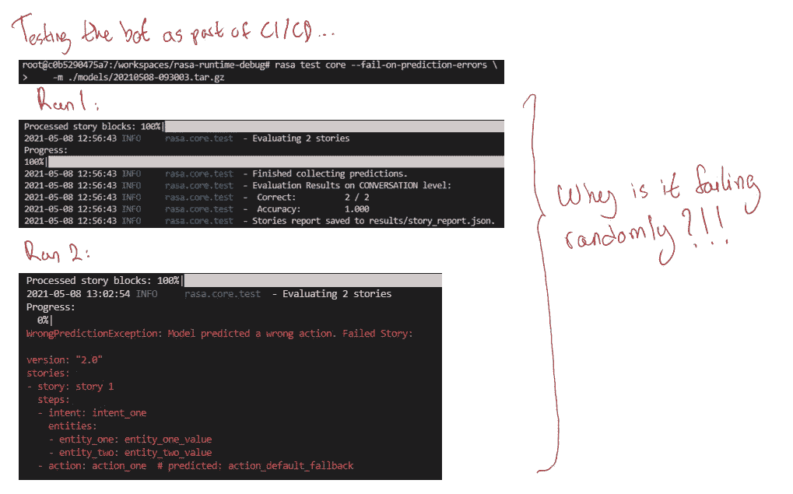

# 介绍

在本文中，我将分享我的基于 VS 代码的工作流程，以在运行时对 [Rasa](https://github.com/rasahq/rasa) 机器人进行故障诊断。这是一个有用的工作流程，可以知道您的 bot 在对话期间何时表现出非常奇怪的行为，并且在调试模式下运行 shell 无助于查明问题的根源。

重现本文中描述的结果的代码可以在[这里](https://github.com/hsm207/rasa_runtime_debug/)找到。

我假设读者熟悉组成 Rasa 聊天机器人的基本构件，并且已经为 Python 开发设置了 VS 代码。Rasa 游乐场非常有助于快速上手使用 Rasa 构建聊天机器人。要为 Python 开发设置 VS 代码，请参考这篇 Visual Studio 代码中的[Python](https://code.visualstudio.com/docs/languages/python)文章。

# 问题陈述

## 环境

这是用于创建机器人的环境:

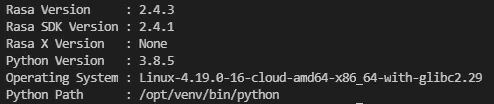

图 rasa 版本的输出

## Bot 设置

回购有完整的 bot 代码，所以在这一节中，我将只解释与本文目的相关的部分。

bot 使用默认的管道配置。另一方面，该政策是定制的，但非常简单:

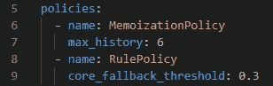

图 2:来自 config.yml 的核心模型

简而言之，机器人预测的下一个动作将基于它训练过的故事的精确匹配。如果没有精确匹配，那么它将预测`action_default_fallback`。

机器人只接受两个故事的训练，它们是:

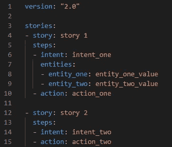

图 3:用于训练机器人的故事

没有测试故事。

## Bot 问题

给定前一节中描述的 bot 设置，我们期望对`rasa test core`的重复调用总是产生完美的结果。但在现实中，这叫:

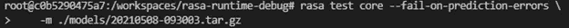

图 4:测试机器人核心模型的命令

有时会产生这样的结果:

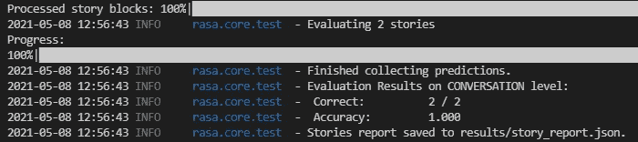

图 5:预期的完美结果

有时也会产生这样的结果:

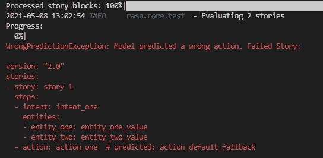

图 6:非常出乎意料的结果

随意！

核心模型使用记忆来预测下一步要采取的行动，并且正在对它已经记忆即训练的完全相同的故事进行测试。那么它怎么会随机失效呢？

## 诊断

这种奇怪的行为可能是以下原因之一(或两者都有！):

1.  `MemoizationPolicy` 模型中有一个 bug
2.  用于运行`rasa test`的代码中有一个 bug

代码看起来相当复杂，但是行为非常简单:给定一系列的状态，S1，S2，…，Sn，模型每次都会预测相同状态序列的动作 Y。

粗略地说，假设机器人是在故事 1 中用 MemoizationPolicy 训练的，我们希望机器人记住图 3 中第 6–9 行给出的`intent_one`后面总是跟有`action_one`。然而，对`rasa test`的调用意味着机器人正在抛硬币在`action_one`和`action_default_fallback`之间做出选择，尽管前面总是相同的状态。

验证`MemoizationPolicy`的行为比验证`rasa test`代码的正确性更容易，所以让我们把注意力集中在这一点上。

## 如何在运行时验证模型的行为

我们如何验证`MemoizationPolicy`是否像它预测的那样正常工作？

我们可以在设置了调试标志的情况下运行`rasa test`，即`-vv`，但这并没有真正的帮助:

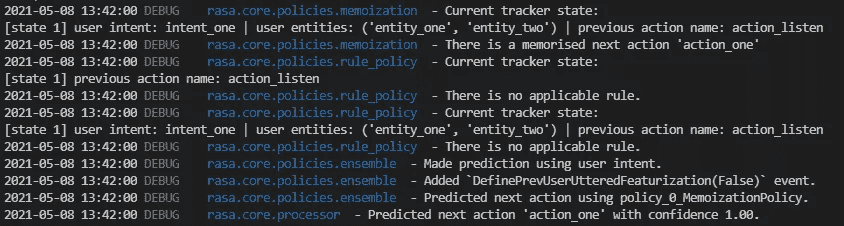

图 7:当`MemoizationPolicy works`时

图 8:当`MemoizationPolicy fails`时

从图 7 和图 8 中我们只能说，有时来自`MemoizationPolicy`的预测被选中，有时没有。这就像`MemoizationPolicy`和`RulePolicy`之间的优先级被随机翻转。

所以看起来我们别无选择，只能[从源代码](https://github.com/rasahq/rasa#development-internals)安装 rasa，并向`MemoizationPolicy`添加一些打印语句，这样我们就能找出问题所在。这不是一个坏主意，但从源代码安装有很多步骤和依赖，例如，使，诗歌和我们很懒。此外，我们已经安装了 Rasa，还没有计划做出任何有意义的代码贡献，所以经历这些步骤感觉像是多余的。

下一节将描述一种无需从源头安装 rasa 即可调查`MemoizationPolicy`的替代方法。

# 解决办法

## 概观

监控正在运行的程序的状态的 VS 代码方法是一个 4 步过程:

*   步骤 1:找到 rasa 的安装位置
*   步骤 2:在感兴趣的位置插入日志点
*   步骤 3:用调试器启动 rasa
*   步骤 4:在调试控制台中监视输出

## 步骤 1:找到 rasa 的安装位置

首先，我们需要弄清楚 rasa 安装在我们机器的什么位置。一种方法是检查`pip show`的输出:

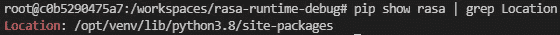

图 9:找出 Rasa 的安装位置

图 9 暗示 Rasa 安装在`/opt/venv/lib/python3.8/site-packages/rasa`。

## 步骤 2:在感兴趣的位置插入日志点

我们的目标是研究`MemoizationPolicy`政策是如何做出预测的，因此我们感兴趣的位置将是任何与此函数相关的代码。

当然，在我们可以插入 logpoints 之前，我们需要知道定义`MemoizationPolicy`的代码的确切位置，但是我们可以依靠 VS Code 的代码导航特性来有效地定位它，而不是手动浏览`/opt/venv/lib/python3.8/site-packages/rasa`来定位代码。

例如，我们可以只在`/opt/venv/lib/python3.8/site-packages/rasa`中搜索`MemoizationPolicy` 的提及:

图 10:使用搜索窗格查找 MemoizationPolicy 的定义位置

在这种情况下，没有那么多结果，我们很容易看到`MemoizationPolicy` 是在`memoization.py`中定义的。

如果有更多的结果，我们可以选择任何一个导入`MemoizationPolicy`的文件，突出显示它，然后进入它的定义。例如，在`agent.py`文件中:

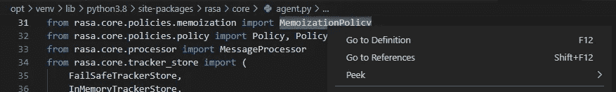

图 11:获得 MemoizationPolicy 定义的另一种方式

随着`memoization.py`的打开，我们可以使用 outline 窗格来获得`MemoizationPolicy` 类结构的概述，并获得观察状态变化的有趣位置的线索:

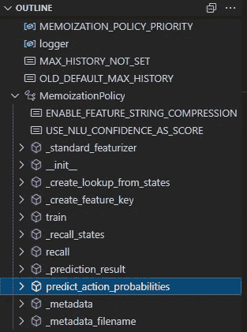

图 12:内存策略概述

假设我们的目标是验证`MemoizationPolicy`所做的预测，那么`predict_action_probabilities`函数看起来是一个开始探索的好地方:

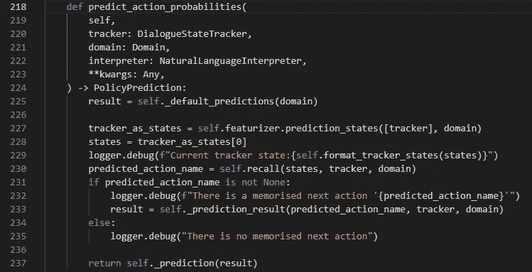

图十三:`predict_action_probabilities function`

即使没有完全理解进入`predict_action_probabilities`函数的每个参数，我们也可以看到它符合我们关于记忆如何工作的直觉，也就是说，有一个函数接受一个状态并返回一个预测的动作，即第 230 行中的`self.recall`。

因此，我们有必要记录`states`和`predicted_action_name`的值，以查看这些值在`rasa test`成功/失败时的表现。

要添加日志点，我们将光标放在想要记录的行上，并使用命令面板调用`Debug: Add Logpoint…`函数:

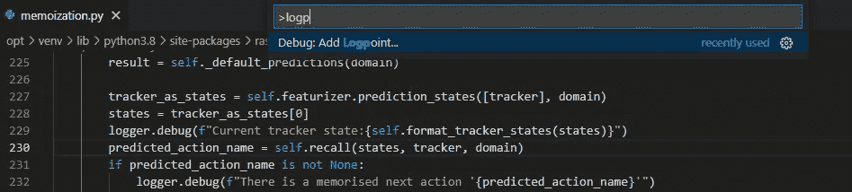

图 14:在 memoization.py 的第 230 行添加一个 logpoint

然后，我们键入希望在每次执行这一行时出现在日志中的消息:

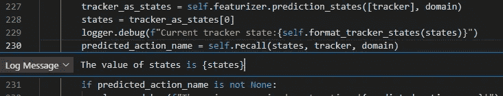

图 15:如何编写日志消息

图 15 显示每次点击第 230 行时，一条消息`The value of states is {states}`将被打印在日志中，其中`{states}`指的是第 228 行中`states`变量的值。

下图创建了一个日志点来记录`predicted_action_name`的值:

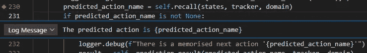

图 16:记录预测动作名称

## 步骤 3:用调试器启动 rasa

这一步的目的是启动`rasa test`并附带一个调试器。

为此，我们首先创建一个[启动配置](https://code.visualstudio.com/Docs/editor/debugging#_launch-configurations)来告诉 VS 代码使用调试器运行`rasa test`:

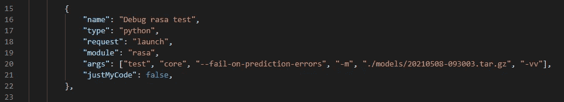

图 17:rasa 测试命令的启动配置

图 17 将`rasa test core`配置为在`20210508-093003.tar.gz`模型上以调试模式运行，并在出现任何预测错误时失败。它将这种配置命名为`Debug rasa test`。

要实际运行配置，从`Run and Debug` 窗格的下拉列表中选择`Debug rasa test`配置后，单击播放按钮。

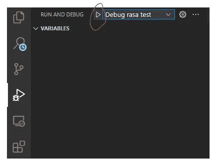

图 18:如何启动一个启动配置

注意，这种方法适用于任何 python 模块。例如，要使用调试器启动 rasa shell，我们应该编写:

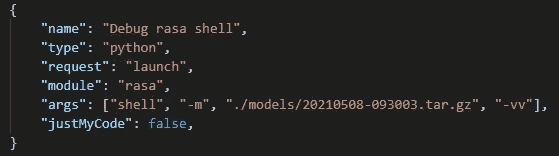

图 19:用调试器启动 rasa shell

## 步骤 4:在调试控制台中监视输出

在每次启动结束时，我们在调试控制台中检查每个日志点记录的消息。

例如，当测试成功完成时，当我们在上一节中添加的日志点第一次被命中时，会出现以下消息:

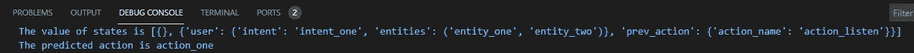

图 20:当 rasa 测试核心报告 100%准确时的记录点

我们可以将其与测试报告预测错误的情况进行比较:

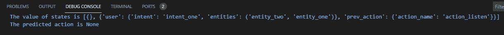

图 21:当 rasa 测试报告一个预测错误时的记录点

我们看到了什么？

我们看到，图 20 中的预测是`action_one`，这是我们预期的，但在图 21 中，它是`None`。除了实体的顺序之外，两个图中的状态是相同的。在图 20 中，我们看到`entity_one`出现在`entity_two`之前，而在图 21 中，情况正好相反。

因此，我们得出结论,`MemoizationPolicy`的实现对实体在状态列表中的记录顺序很敏感……这听起来像是一个错误的实现。

无论如何，我们已经通过观察选择的几个变量如何随时间变化，找出了`rasa test`中随机失败的原因。

# 结论

本文介绍了一种调试代码的技术，这种技术通过跟踪状态随时间的变化而不用打印语句。我希望你已经发现这是有用的。

注意:本文中描述的`MemoizationPolicy`行为确实是一个 bug，在撰写本文时[正在进行修复。](https://github.com/RasaHQ/rasa/issues/8623)