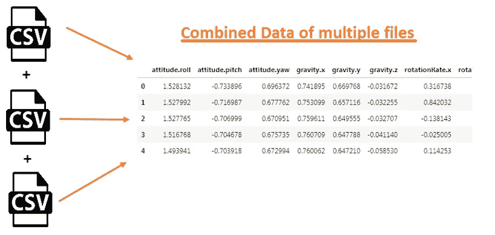
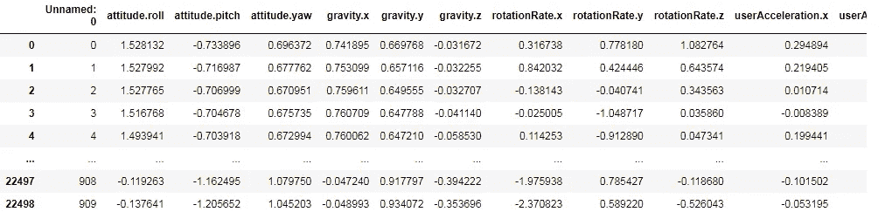
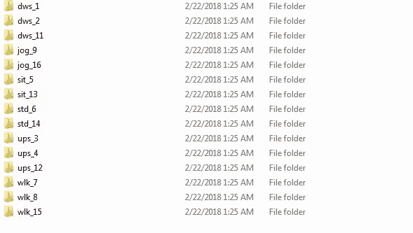
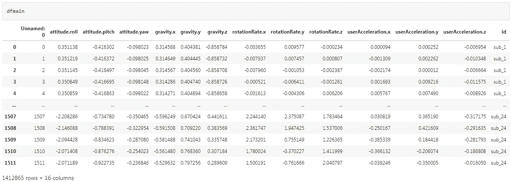
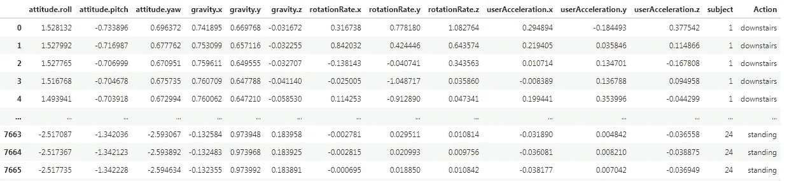
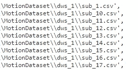
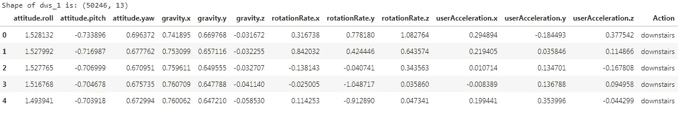

# 从本地机器读取多个 CSV 文件的不同技术

> 原文：<https://pub.towardsai.net/programming-85bbfe58b365?source=collection_archive---------1----------------------->

## [编程](https://towardsai.net/p/category/programming)

## 从一个文件夹中读取多个文件的 Python 示例



作者的照片

在本文中，我们将讨论一种不同的方法来读取文件夹中的多个 CSV 文件。读取操作非常简单，但是读取多个 CSV 文件有点麻烦。

在这里，一些方法被用来读取许多 CSV 文件，并将它们组合在一个数据帧中。

## iglob 方法

这个函数用于在递归中从路径目录中检索文件。这有点像匹配文件夹中的相同文件。当递归参数为 true 时，使用路径中的双星(**)。

文件夹中 CSV 文件的视图如下所示:


DWS_1 文件夹中的 CSV 文件。作者的照片

```
#Reading all CSV files and Concatenate Class-wisepath = r'C:\Users\Amit\MotionDataset\dws_1\**\*.csv'dws_1 = pd.concat((pd.read_csv(f) for f in iglob(path,
                   recursive=True)),ignore_index=True)path = r'C:\Users\Amit\MotionDataset\dws_2\**\*.csv'dws_2 = pd.concat((pd.read_csv(f) for f in iglob(path, 
                   recursive=True)), ignore_index=True)path = r'C:\Users\Amit\MotionDataset\dws_11\**\*.csv'dws_11 = pd.concat((pd.read_csv(f) for f in iglob(path,
                    recursive=True)), ignore_index=True)# Concatenate Down Walking CSV files
dwslist = [dws_1, dws_2, dws_11]  
final_dws = pd.concat(dwslist)
```



作者的照片

## 使用操作系统模块方法的 Google Colab

在这个方法中，我们使用了 google colab 在线交互式 python 笔记本，这是一个面向 python 和数据科学热心学习者的平台即服务(PaaS)。为了从 google drive 中读取数据，我们需要用下面的代码在 colab 中挂载这个驱动器。

```
**from** google.colab **import** drive
drive**.**mount('/content/drive')
```

此文件检索方法正在使用操作系统模块。os.walk 方法是从目录中读取文件的一种非常简单而古老的方法。这将从目录树中的所有文件夹读取并加载所有文件，如下所示:



作者的照片

```
*# Driver function*
**import** pandas **as** pd
**import** os
**import** seaborn **as** sns
dfmain **=** pd**.**DataFrame()
**for** (root,dirs,files) **in** os**.**walk('/content/drive/MyDrive/MotionDataset', topdown**=** **True**):
  **for**  i **in** files:    
    **if** ('.csv' **in** i) **and** ('(1)' **not** **in** i):
      *#print(root,i)*
      df **=** pd**.**read_csv(f'{root}/{i}')
      df['id'] **=** i**.**split('.')[0]
      df['action'] **=** root**.**split('/')[**-**1]
      df['main_action'] **=** root**.**split('/')[**-**1]**.**split('_')[0]
      dfmain **=** dfmain**.**append(df)
```



作者的照片

## 使用本地机器中的操作系统模块读取文件

该方法也使用 OS 模块，但来自本地机器。这是使用 os.listdir 方法读取当前工作目录中的文件。

```
dws_1 = pd.DataFrame()
os.chdir(old+'\\dws_1')
for i,file in enumerate(os.listdir(os.getcwd()), start=1):
    if file.endswith('.csv'):
        temp_df = pd.read_csv(file)
        temp_df['subject'] = i
        dws_1 = dws_1.append(temp_df)

dws_2 = pd.DataFrame()
os.chdir(old+'\\dws_2')
for i,file in enumerate(os.listdir(os.getcwd()), start=1):
    if file.endswith('.csv'):
        temp_df = pd.read_csv(file)
        temp_df['subject'] = i
        dws_2 = dws_2.append(temp_df)dws_11 = pd.DataFrame()
os.chdir(old+'\\dws_11')
for i,file in enumerate(os.listdir(os.getcwd()), start=1):
    if file.endswith('.csv'):
        temp_df = pd.read_csv(file)
        temp_df['subject'] = i
        dws_11 = dws_11.append(temp_df)
down_df = pd.concat([dws_1,dws_2,dws_11])
down_df['Action'] = 'downstairs'
```

从所有不同文件夹中读取所有文件后，我们可以将所有数据框连接到主数据框，如以下代码所示。

```
final pd**.**concat([down_df,up_df,jog_df,sit_df,walk_df,
                 std_df])**.**drop('Unnamed: 0',1)
final
```



作者的照片

[](/identifying-and-handling-missing-data-in-python-ebe114776f78) [## 在 Python 中识别和处理缺失数据

### 清理和转换数据

pub.towardsai.net](/identifying-and-handling-missing-data-in-python-ebe114776f78) [](/10-python-projects-with-description-to-enhance-the-knowledge-cbd37e207418) [## 10 个 Python 项目，通过描述来增强知识

### 初学者使用 Python 的应用和项目

pub.towardsai.net](/10-python-projects-with-description-to-enhance-the-knowledge-cbd37e207418) 

**全球方法**

这个方法就像一个从文件夹中读取文件的 iglob。在这种方法中，我们读取一种类型的所有 CSV 文件，并将它们连接到各自的类。

```
*# Here we are going to create a list of all csv files present in dws_1 folder*
dws_1_files**=**sorted(glob("D:\\MotionDataset\\dws_1\\sub_*.csv"))
dws_1_files
```



作者的照片

合并 dws_1 文件夹中的所有 CSV 文件

```
dws_1**=**pd**.**concat((pd**.**read_csv(file)**.**assign(Action**=**"downstairs")
          **for**  file **in** dws_1_files),ignore_index**=True**)
dws_1**.**columns#output:
Index(['Unnamed: 0', 'attitude.roll', 'attitude.pitch', 'attitude.yaw',
       'gravity.x', 'gravity.y', 'gravity.z', 'rotationRate.x',
       'rotationRate.y', 'rotationRate.z', 'userAcceleration.x',
       'userAcceleration.y', 'userAcceleration.z', 'Action'],
      dtype='object')
```

查看和调整 dws 类中的数据。

```
*#Dropping the unnamed column from dws_1 dataframe*
dws_1**.**drop(labels**=**["Unnamed: 0"],axis**=**1,inplace**=True**)# *Shape of dws_1 dataframe*
print("Shape of dws_1 is:",dws_1**.**shape)#output:
Shape of dws_1 is: (50246, 13)*# Top 5 rows of dws_1*
dws_1**.**head()
```



作者的照片

## 结论

这些方法是非常基本的，有助于从不同的文件夹中读取多个文件。

我希望你喜欢这篇文章。通过我的 [LinkedIn](https://www.linkedin.com/in/data-scientist-95040a1ab/) 和 [twitter](https://twitter.com/amitprius) 联系我。

# 推荐文章

1.[8 Python 的主动学习见解收集模块](/8-active-learning-insights-of-python-collection-module-6c9e0cc16f6b?source=friends_link&sk=4a5c9f9ad552005636ae720a658281b1)
2。 [NumPy:图像上的线性代数](/numpy-linear-algebra-on-images-ed3180978cdb?source=friends_link&sk=d9afa4a1206971f9b1f64862f6291ac0)3。[Python 中的异常处理概念](/exception-handling-concepts-in-python-4d5116decac3?source=friends_link&sk=a0ed49d9fdeaa67925eac34ecb55ea30)
4。[熊猫:处理分类数据](/pandas-dealing-with-categorical-data-7547305582ff?source=friends_link&sk=11c6809f6623dd4f6dd74d43727297cf)
5。[超参数:机器学习中的 RandomSeachCV 和 GridSearchCV](/hyper-parameters-randomseachcv-and-gridsearchcv-in-machine-learning-b7d091cf56f4?source=friends_link&sk=cab337083fb09601114a6e466ec59689)
6。[用 Python](https://medium.com/towards-artificial-intelligence/fully-explained-linear-regression-with-python-fe2b313f32f3?source=friends_link&sk=53c91a2a51347ec2d93f8222c0e06402)
7 全面讲解了线性回归。[用 Python](https://medium.com/towards-artificial-intelligence/fully-explained-logistic-regression-with-python-f4a16413ddcd?source=friends_link&sk=528181f15a44e48ea38fdd9579241a78)
充分解释了 Logistic 回归 8。[数据分发使用 Numpy 与 Python](/data-distribution-using-numpy-with-python-3b64aae6f9d6?source=friends_link&sk=809e75802cbd25ddceb5f0f6496c9803)
9。[机器学习中的决策树 vs 随机森林](/decision-trees-vs-random-forests-in-machine-learning-be56c093b0f?source=friends_link&sk=91377248a43b62fe7aeb89a69e590860)
10。[用 Python 实现数据预处理的标准化](/standardization-in-data-preprocessing-with-python-96ae89d2f658?source=friends_link&sk=f348435582e8fbb47407e9b359787e41)