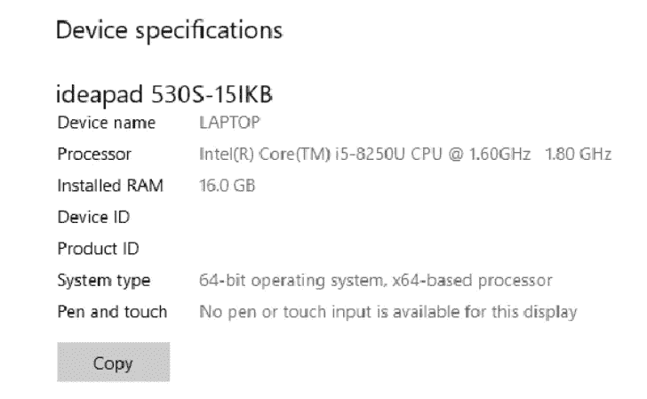
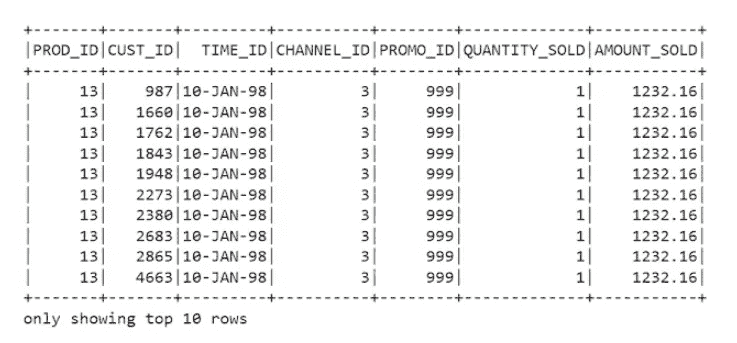
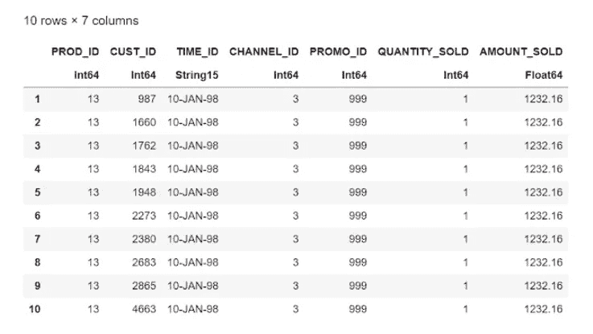

# 朱莉娅能取代 Python 吗？数据比较

> 原文：<https://pub.towardsai.net/programming-dc4d40c3e083?source=collection_archive---------0----------------------->

## [编程](https://towardsai.net/p/category/programming)

Julia 语言的创造者声称 Julia 非常快，性能出色，因为它不像 Python 那样遵循两种语言理论，它是一种编译语言，而 Python 是编译和解释的融合。深入了解这两种语言在幕后是如何运作的会很有意思，但是这篇博客的目的并不是深入研究这些差异的理论细节。


作为一名数据工程师，我与生俱来的行为就是理解 Julia 在被 GBs 或 TBs 的数据集轰炸时是如何表现的。因为我谈论的是几千兆或几千兆的数据集，所以很明显我不能马上将 python 与 Julia 或甚至丰富的 Pandas 库进行比较，因为我们都知道处理永远不会完成，因为 Python 非常慢。所以这个博客的范围是在 Julia 和 PySpark 之间做比较，我知道对一些人来说这是不公平的，但是请原谅我。博客背后的灵感是发生在 2022 年 1 月的关于朱莉娅的推特播客。

> **#注:我是在我的个人笔记本电脑上做的，这样两种语言的性能可以在相同的基础上进行测量。**

**我的系统配置:**



**演示中使用的软件:**

我使用了一个 6.5 GB 大小的 CSV 文件， **python 3.6** 和 **spark 2.3.3** ，以及 **Julia 1.7.1** 所有的软件都安装在我的本地系统上。

在这个分析中，没有执行任何数据操作，只有基本的读/写操作以保持简单明了。

1.  **Pyspark**

```
 *#import libraries and connect to spark session*
from datetime import datetime
t1 = datetime.now() 
import findspark findspark.init(‘D:\spark-2.3.3-bin-hadoop2.7’) import pyspark from pyspark.sql 
import SparkSession 
print(‘modules imported’) 
spark= SparkSession.builder.appName(‘BigData’).getOrCreate() print(‘app created’) *#read the source dataset* 
sales_df= spark.read.csv(r”D:\python_coding\Sales Data\sales_data.csv”, inferSchema=True) sales_df.show(10) *#write dataset to target csv file* sales_df.write.format(‘csv’) \ 
        .option(‘header’,’true’) \ 
        .save(‘D:\python_coding\Sales Data\spark_emp.csv’, mode=’overwrite’) t2 = datetime.now() print(str((t2 — t1).total_seconds() * 1000) + ‘ milliseconds’) *#Time taken by Pyspark for Read Write operation of 6.5GB csv file: 344340.066 milliseconds*
```

**输出:**



**2。朱莉娅**

```
 *#import libraries* 
using CSV 
using DataFrames 
using Dates d1=now() *#read the source dataset* sales=CSV.read("D:\\python_coding\\Sales Data\\sales_data.csv",DataFrame) *#print first 10 rows of julia dataframe*
first(sales,10)*#write dataframe as csv file* 
CSV.write("D:\\python_coding\\Sales Data\\julia_sale.csv.csv", sales) 
d2=now() print(d2-d1) 
*#Time taken by Julia for Read Write operation of 6.5GB csv file: 453396 milliseconds*
```

**输出:**



Julia 处理 6.5GB 数据的时间约为 **453396 毫秒**，而 Pyspark 的处理时间为 **344340.066 毫秒**。

时间差大约在 109055.934 毫秒或 109.055934 秒或 2 分钟左右，这似乎相当不错，因为 **Julia** 几乎已经接近并行计算框架 **Pyspark 的性能速度。**

而且谁知道未来的子宫里有什么，有一天 **Julia** 可能会成为 **Spark** 处理大数据的替代品。一切皆有可能，可能性无穷无尽。

我希望我已经用这个特定用例的事实和数据以理性的方式表达了我的观点。如果我错过了什么，请分享您的反馈，我将非常乐意包括这些要点。

总结一下:

*   使用的软件:Python 3.6，spark 2.3.3，Julia 1.7.1。
*   数据集大小为 6.5GB。

> 笔记本和数据集的 Github 链接:[https://github . com/VIV 07/python dataengg/tree/main/python vsjulia](https://github.com/viv07/PythonDataEngg/tree/main/PythonVSJulia)

礼遇:[https://letscodewithvivek . blogspot . com/2022/02/Julia-vs-python-data-comparison . html](https://letscodewithvivek.blogspot.com/2022/02/julia-vs-python-data-comparison.html)

请关注我的博客@【https://letscodewithvivek.blogspot.com/】T5