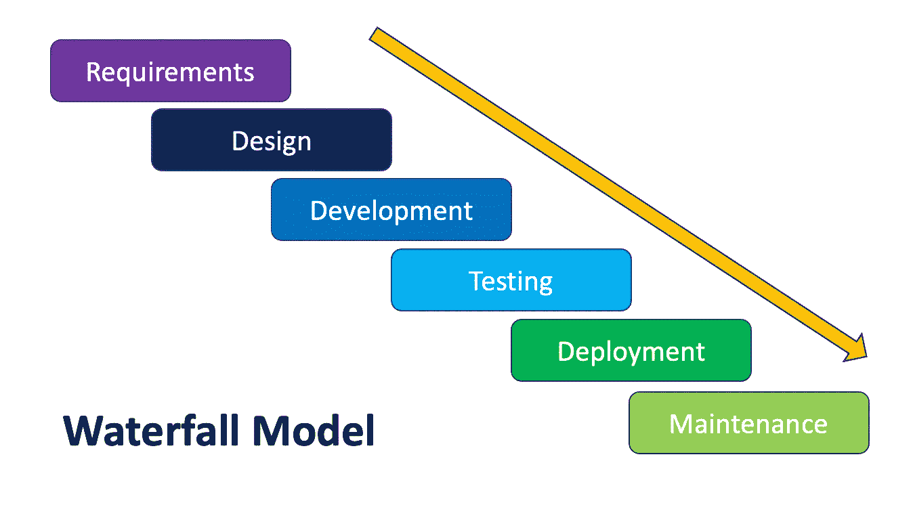
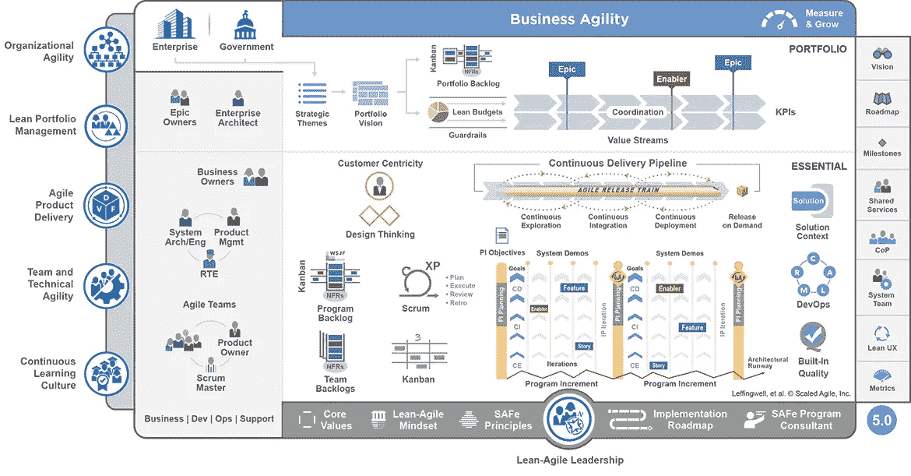
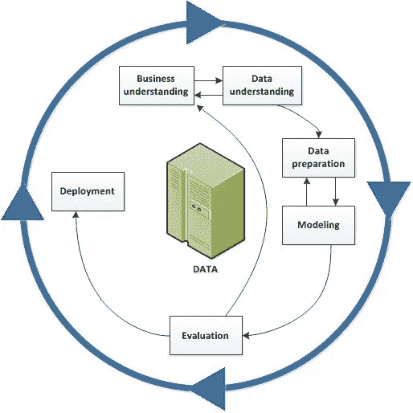

# 项目管理技术

> 原文：<https://pub.towardsai.net/project-management-techniques-62c80857343?source=collection_archive---------3----------------------->

## [项目管理](https://towardsai.net/p/category/project-management)

## 瀑布、敏捷、CRISP-DM 和混合方法。

在过去的几十年里，项目管理已经发展并适应了不断变化的市场需求。我们将回顾瀑布、Scrum、看板、SAFe、CRISP-DM 和混合方法的优缺点。

由[达里娅·内布里亚希娜](https://unsplash.com/@epicantus?utm_source=unsplash&utm_medium=referral&utm_content=creditCopyText)在 [Unsplash](https://unsplash.com/s/photos/planner?utm_source=unsplash&utm_medium=referral&utm_content=creditCopyText) 上拍摄的照片

项目管理方法各不相同，从一端的预测技术到另一端的经验迭代实践。每种方法都有一个有效的用例。因此，理解每种方法背后的概念及其利弊非常重要。使用正确的方法来管理计划是成功交付的关键。

# 瀑布

瀑布方法是一种预测模型，也是最常见的项目管理方法。顾名思义，从概念化到交付的活动流程遵循一组明确定义的步骤，每个步骤之后都有阶段门来验证完成情况，以便项目可以进入下一步。

## 在以下情况下使用它:

*   项目的结果可以提前用非常确定的可操作的术语来定义。例如，升级整个组织的基础设施。
*   团队中的技能是孤立的。这意味着你有一个专家团队，比如业务分析师、测试人员、开发人员，他们不能以至少 50%的效率完成彼此的工作。

## 优点:

*   由于项目的最终状态是提前定义好的，涉众对项目的可交付成果(包括最终结果)有一个清晰的理解。
*   每一步都被很好地定义，所以中间团队确切地知道什么时候该做什么。这有助于规划、管理资源使用和维护带宽。

## 缺点:

*   在一个持续时间较长的项目中，业务需求可能会在实施期间发生变化。这种模型不能很好地处理变更，任何实质性的变更都可能使项目脱轨。
*   如果管道中的项目排序不当，将导致盛宴或饥荒局面。团队中的某些成员会被来自多个项目的需求所淹没，一旦这一步结束，他们就没有任何工作可做了。

# 敏捷

敏捷方法本质上是迭代的。它们被设计成具有可延展性，并随着业务需求的变化而快速调整。敏捷的程度可以从像 Scrum 那样的几个星期到极限编程不等，极限编程提倡实时代码开发。

[可扩展的敏捷框架](https://www.scaledagileframework.com/)

## 在以下情况下使用它:

*   如果项目细节不确定，最好使用 Scrum 或扩展敏捷实践。随着这些实践的每一次迭代，团队可以学习并决定改变或追求方向。
*   团队成员有能力并愿意根据需要身兼数职。团队中的每个人都必须是多技能的，并且应该准备好执行必要的任务来实现团队目标。

## 优点:

*   敏捷实践允许频繁回顾，并且是自我修复的。改变方向的成本是最小的。
*   像看板这样的实践，非常适合像中断-修复这样的任务，有非常清晰和精确的积压管理。

## 缺点:

*   虽然敏捷实践可以很好地处理变更管理，但它在管理时间和预算方面表现不佳。这些实践无法回答“构建 x 需要多少成本？”。在最好的情况下，我们可以提出一个具有高度可变性的时间和预算范围，这使得项目很难获得批准。
*   具有非敏捷思维的团队成员和利益相关者可能会让敏捷的采用成为痛苦的经历。

# 数据驱动

标准的项目管理技术瀑布或敏捷并不适合数据驱动的项目(人工智能，ML，数据科学)。标准实践是面向应用程序开发以及利益相关者的参与。而在数据驱动的项目中，从数据分析和 ML 模型中学习必须被注入到应用程序中，因此需要不同的方法。

IBM:数据挖掘生命周期

> **CRISP-DM:数据挖掘的跨行业标准流程**
> 
> 作为一种**方法**，它包括对项目典型阶段的描述，每个阶段涉及的任务，以及对这些任务之间关系的解释。
> 
> 作为一个**流程模型**，CRISP-DM 提供了数据挖掘生命周期的概述。

## 在以下情况下使用它:

*   该项目主要是关于分析数据，建立 ML 模型，并最终部署和集成，以实现价值。CRISP-DM(数据挖掘的跨行业标准过程)方法非常适合数据相关的项目，
*   数据驱动的工作可以是遵循标准项目交付模型的大型项目的一部分。对于项目的数据驱动部分，不要遵循相同的项目交付模型。根据手头的任务，使用多种交付方法是完全可以的。

## 优点:

*   这个过程被设计为在部署之前多次迭代学习-模型-训练-测试周期。
*   在数据驱动的项目中，歧义是给定的，它将会存在。迭代帮助我们从模糊性中学习，以导出一个模型，该模型将以一定的置信度进行预测。

## 缺点:

*   因为我们在这里处理的是高度模糊的问题，所以可能要花相当多的时间在绘图板上。您应该为意外的延迟和/或结果的可信度做好计划。
*   习惯于传统交付模式的利益相关者的不合理期望会给交付团队带来不必要的压力。

## 混合模式—在实践中

在实践中，你将使用一个适合你工作环境的模型，它可能不是纯粹的。混合模式已经成为现实，并且运行良好。虽然一开始你可能不知道项目的一切，但是知道足够多是明智的。这有助于管理:交付预期、时间安排和成本。

在全面了解项目之后，可以使用任何一种敏捷方法分阶段执行。如果项目的任何部分都是数据驱动的，那么在基本的界面设计完成后，CRISP-DM 是该部分工作的最佳模型。

*原载于 2020 年 12 月 28 日*[*https://www . emerging . careers*](https://www.emerging.careers/blog/2020/12/28/project-management-techniques)*。*