# 公共交通票价模型不透明——以下是票价计算的一些关键见解

> 原文：<https://pub.towardsai.net/public-transportation-fare-model-is-not-transparent-heres-some-key-insights-for-fare-calculation-69bd7fc579e5?source=collection_archive---------4----------------------->

## [数学](https://towardsai.net/p/category/mathematics)

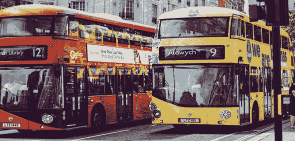

来源:https://unsplash.com/photos/_vBjaSqDJrY

确定公共交通系统的票价非常具有挑战性，并且总是倾向于社会服务或公共福利。

虽然在这篇文章中有多种公共交通方式，但我将采用公共汽车票价模型。

随着货币和燃料价格的波动以及备件成本的增加，公共交通的运营成本也在上升。但是由于经济条件和政治压力，提高票价并不总是可能的。

因此，当经营成本不断上升，而车费却没有相应增加时，情况会是:

利润率开始下降，当利润率下降时，它会直接打击公共汽车的运营商/所有者。这就是为什么随着成本的增加，票价的成比例增加总是可取的，以平衡利润和收入。

但与此相关的另一个问题是，如果为了弥补收入损失而频繁提高票价，那么对于那些从很远的地方过来、乘坐多辆联运巴士的人来说，交通成本就会变得非常高。有时它变得如此之高，以至于他们根本不想旅行。相反，他们留在家乡，在那里工作。

所以，从长远来看，这些人的人均收入也会下降。当人均收入下降时，就会打击个人储蓄和经济增长率。

所以，增加票价涉及多个方面，不能频繁行使。

这就要求对客运票价的自动增加采取一种合理的方法，这种方法既能对投入成本的市场波动作出反应，同时又不会使一般乘客感到经济不适。因此，我们必须在某处取得平衡。

公共汽车通常由私人出资者拥有和经营。但为了防止它们向乘客任意收费，票价是由政府控制的。

我们将讨论如何在公共交通系统中确定票价的基本方法之一。

虽然还有一些方法，但我将把重点放在“基于公式的经验方法”上，因为这是最广泛使用的方法之一。

在我开始使用实证方法之前，让我给出一个公共汽车运输系统成本的大致分类。

现在，让我们分别计算每个组件的乘数。

乘数描述了与每个组件相关的数值，该数值是为进一步计算而导出的。

1.燃料成本的燃料乘数

为了计算燃料乘数，我们需要考虑两个因素，第一个是燃料价格增长率，第二个是效率方程。

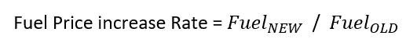

这代表了自上次票价调整以来燃油价格上涨了多少倍。

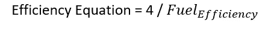

这表示公共汽车的当前燃料效率。这根据不同道路和交通条件下公交车的燃油效率而不断变化。

数字 4 是通过使用线性回归的另一种方法计算的，我们现在不讨论这种方法。我计划写一篇单独的文章来讨论这个问题。

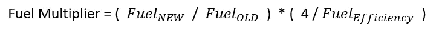

2.运行和维护成本的 WPI(批发价格指数)乘数

这代表了自上次票价调整以来，WPI 增加了多少倍。

3.工作人员和其他费用的 CPI 乘数

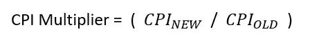

这代表自上次票价调整以来，消费物价指数上升了多少倍。

4.资本成本的投资乘数

投资乘数=

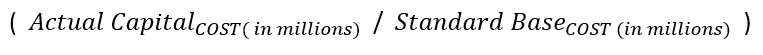

这代表了公共汽车的实际资本成本相对于作为基线的标准成本的变化程度。

让我进一步阐述这一点。

假设购买公车的实际花费是 300 万，而政府当局为该类公车设定的标准或基线是 250 万，那么我们的投资乘数就变成 3/2.5 = 1.2

因此，加价的最终经验公式如下:

票价调整乘数= 0.5 *燃料乘数(+) 0.1 *消费物价指数乘数(+) 0.25 *消费物价指数乘数(+)

0.15 *投资乘数

其中乘以乘数的 0.5、0.1、0.25 和 0.15 代表上表中描述的各个成本组成部分的份额。

这也可以表示为:

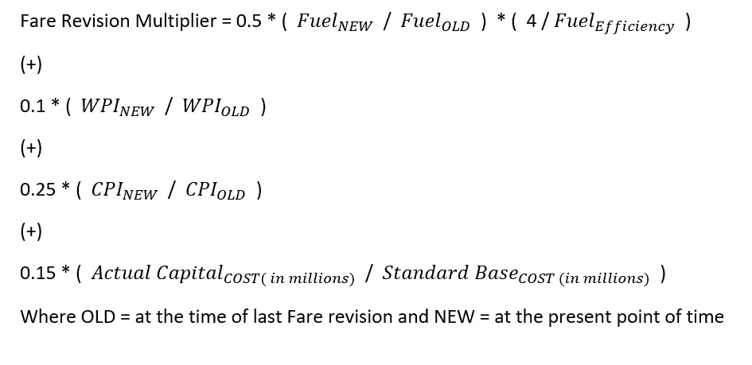

来源:[https://unsplash.com/photos/0SkI8mNcVsI](https://unsplash.com/photos/0SkI8mNcVsI)和[https://unsplash.com/photos/s8u1Gv2uF3o](https://unsplash.com/photos/s8u1Gv2uF3o)

现在让我们考虑一个描述一个案例的例子。

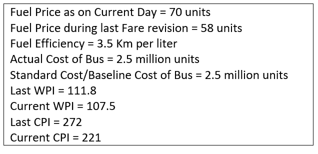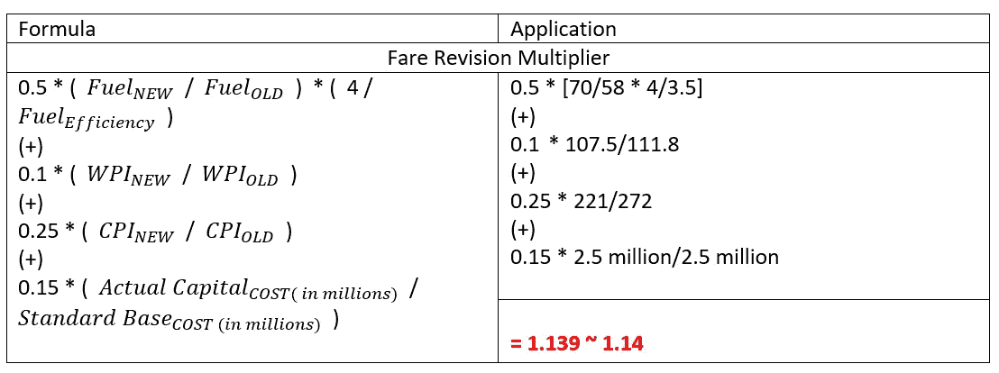

根据以上计算的票价修正乘数，计算不同票价等级/阶段的新票价

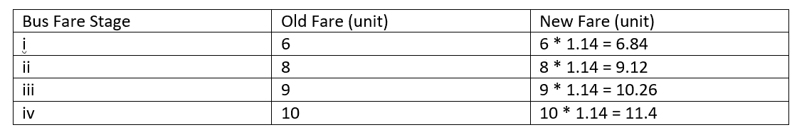

下表描述了在不同乘数范围内计算的票价修订(新票价)。

票价阶段和票价任意选择，可根据需要定制。

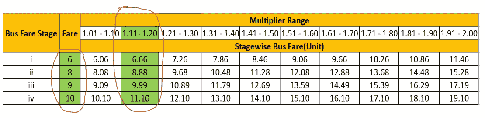

标准票价值是通过**将每列中较低的乘数范围乘以基本票价值**计算出来的。例如，对于第一阶段票价，第一列乘数范围 1.01 乘以票价值 6。

即— 1.01 * 6 = 6.06

同样，对于第二列乘数范围，它是 1.11 * 6 = 6.66。

对于第二阶段票价和第二列乘数范围，它是 1.11 * 8 = 8.88，以此类推。

根据插图中计算的乘数，即 1.14，它位于 1.11-1.20 的范围内，因此上表中绿色突出显示的是修改后的新票价。

免责声明-有多种方法来计算票价，并根据情况和环境使用。在这里，我展示了一种最简单的计算方法。但是，每个国家或州都有自己的标准计算方法。但这肯定会给理解基本概念提供一些见解。

我的结论是。

希望您喜欢这个模型。

你可以在 LinkedIn 上关注我: [Supriya Ghosh](https://www.linkedin.com/in/supriya-ghosh)

还有推特: [@isupriyaghosh](https://twitter.com/isupriyaghosh)