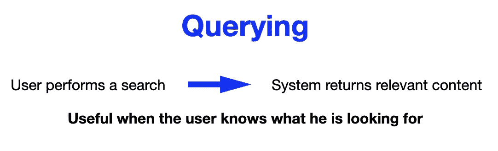
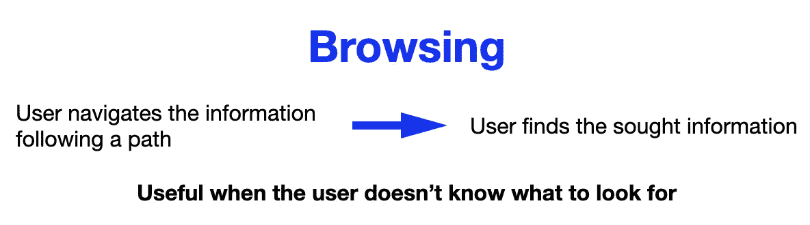

# 拉和推——机器如何向人类传递文本数据

> 原文：<https://pub.towardsai.net/pull-and-push-how-machines-deliver-text-data-to-human-ebc8e059c3de?source=collection_archive---------2----------------------->

## 了解“拉”和“推”策略如何定义如何将相关信息交付给最终用户

**信息检索(IR)是从环境中的数据源获取知识的过程**。根据环境的状态和用户的状态，可以通过多种方式探索这种环境以获得这种信息。

IR 的主要目标是最小化噪声传递的降低，并最大化信号传递的传递。

**想想谷歌**——可以肯定地说，它是世界上信息检索的主要来源。现在**想想** **关于** **亚马逊**——我们都知道它的推荐系统**有多强大。**但是谷歌和亚马逊是如何工作的，他们使用什么策略向最终用户提供相关内容？我们不会看搜索引擎和推荐系统是如何工作的，但是我们会一起看他们用来支持信息检索的策略。

# 传递文本数据的策略

我们提到了谷歌和亚马逊。第一是因为它是一个搜索引擎，第二是因为它的推荐系统。它们是行业事实上的标准，因为它们运行得非常好。用户对使用其产品的满意度证明了这一点。

但是在一些特定的功能上，它们在向用户传递信息的方式上有着根本的不同。虽然他们都使用搜索和推荐系统(例如，谷歌建议*相关关键词，*可以解释为推荐，而亚马逊通过搜索栏提供产品信息)，但我们可以剖析**谷歌如何通过搜索提供信息，亚马逊如何通过推荐提供信息。**

# 用户查询系统:拉策略

字面意思是*用户从系统中提取信息。*一个例子是当用户查询数据库或搜索引擎时。在这种情况下，用户采取主动并在环境中搜索信息。

具体来说，每当我们在谷歌上搜索某样东西时，我们都会从它的数据库中提取信息，并利用这些信息做一些事情。

拉动涉及两个方面:

*查询* 我们通过一个关键词查询搜索引擎，引擎返回相关文档。搜索引擎传递相关内容的能力决定了搜索引擎是否做得好。**当用户知道他们在找什么的时候，查询会非常有效。**

*浏览* 用户浏览文档的结构以找到他要找的信息。你可以直观的理解，当**用户不知道要找什么或者不能方便的查询系统的时候，这个策略效果很好。**

# 谷歌和亚马逊是如何使用拉策略的？

搜索和可视化他们的结果。
每当谷歌返回一个 SERP ( *搜索引擎结果页面*)，或者每当亚马逊显示一个产品列表，**他们就把用户从查询空间转移到浏览空间**。如果最终用户直接登陆到他们寻找的结果，这种情况就不会发生(例如谷歌的*你觉得幸运吗*功能)。

用户查询系统→“意大利米兰哪里买球鞋。”

用户浏览结果→文档(项目)符合用户意图

# 系统猜测什么信息是相关的:*推送*策略

当系统主动向最终用户交付可能相关的信息时，使用这种策略。**这个策略被推荐系统采用**。这些系统在推送信息方面做得越好，它们的性能和使用就越好。

亚马逊是这些系统如何在专业水平上工作的完美例子。网飞的系统是另一个值得一提的。我们都承认这些系统是多么强大，因为它们直接增加(或减少)了企业的用户价值。

但是为什么这些系统如此难以调整呢？为什么亚马逊如此擅长建议项目，而其他一些引擎在创建更复杂的关联时却失败了？

这是因为这些系统需要来自最终用户的稳定、干净的信息。换句话说，**它必须访问用户行为数据**。当然，你网站的流量越大，你可以存储和输入系统的数据就越多。

# 用户意图的问题

自然语言处理是一个非常困难的领域。让机器解码人类在对话中暗示的内容是一个相当大的挑战。

约翰看见一个小孩拿着望远镜。

光是这句话就足以破解过去 20 年的任何 NLP 算法。带望远镜的部分*既可以指约翰(好像约翰通过望远镜看到了那种)，也可以指孩子(好像约翰看到他时，孩子正拿着望远镜)。**识别歧义是当今自然语言处理中最大的挑战之一**。谷歌和脸书在这一领域做了大量工作，还有业内许多其他大腕。*

*不言而喻，在搜索过程中理解用户意图是一项艰巨的任务。作为世界上第一个真正以预测用户意图为工作的搜索引擎，谷歌仍在试图找出实现这一目标的方法。许多更新每周都被推送到它的核心算法，并且这些更新通常也调整了引擎更好地理解用户查询的能力。*

*实现搜索和推荐系统的数据科学家和 ML 工程师面临的最大问题是理解用户意图。也就是说，尽管很难准确理解用户真正想要的是什么，但信息检索系统仍然让企业赚了数百万美元。我们只是触及了表面。*

# *额外收获:谷歌的生成人工智能 LamDA*

*作为对那些一直陪我到最后的人的奖励，这里有一个视频，展示了谷歌新的人工智能 LamDA 令人难以置信的对话能力。与 IR 无关…但是谁知道呢？也许未来的搜索可以通过对话进行？我们已经有了 Siri 和谷歌助手…*

***如果你想支持我的内容创作活动，欢迎点击我下面的推荐链接，加入 Medium 的会员计划**。我将获得你投资的一部分，你将能够以无缝的方式访问 Medium 的大量数据科学文章。*

* [## 通过我的推荐链接加入 Medium-Andrew D # data science

### 阅读 Andrew D #datascience(以及媒体上成千上万的其他作者)的每一个故事。您的会员费直接…

medium.com](https://medium.com/@theDrewDag/membership)*