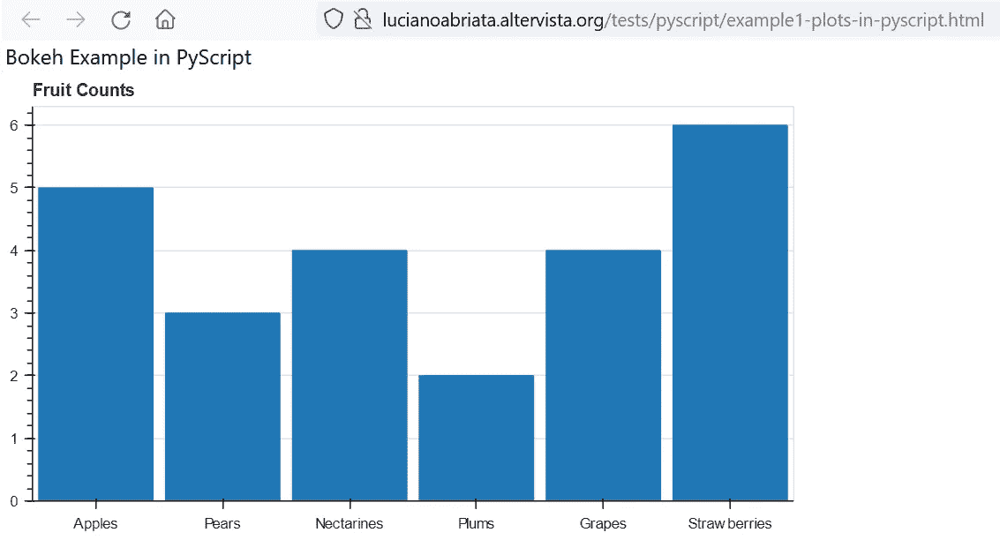
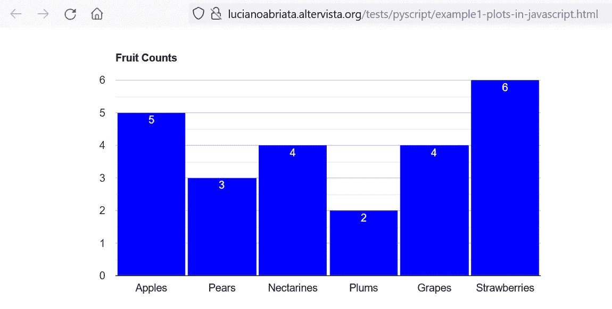
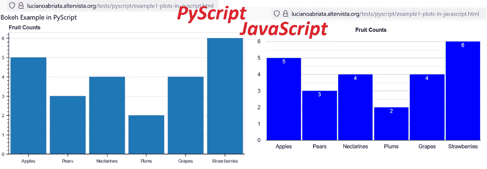

# PyScript 可以让你的页面具有交互性，但是如果你不懂 Javascript，它只能作为最后的资源

> 原文：<https://pub.towardsai.net/pyscript-is-ok-ish-to-make-your-pages-interactive-but-only-as-a-last-resource-if-you-dont-know-2197133b4348?source=collection_archive---------1----------------------->

## PyScript 太慢太笨重，而且它不支持你可能想用的所有特性和库。

最近有很多关于在网页中运行 Python 代码的可能性的宣传，这要归功于 PyScript，这是一个 web 组件，它将一系列 HTML 标记注入到你的网页中，在那里你可以…嗯…运行 Python 代码。当然，这听起来很令人兴奋，但是 JavaScript 已经与 web 浏览器发展得如此紧密，我想知道…难道不是更好吗？

嗯，我做了一些测试，但是……PyScript 加载起来太慢太重了，而且它不支持 Python 的所有特性和库(比如非常流行的 Plotly，见下文)…所以最终，

> 很抱歉地说，我觉得 PyScript 没什么用处，我宁愿选择普通的 JavaScript……除非你不懂这种语言，在这种情况下，PyScript 可能会做到——但是你要做好准备，让你的网页访问者等上一分钟来运行 Python 代码，并找到你经常使用的那些库的替代品！

不要误解我的意思，我承认 PyScript 是一个很好的想法，我真的希望它在未来会更好。但是现在，这种炒作是不合理的，缺乏任何支持。

# 一个比较 PyScript 和 JavaScript 实践的具体例子

让我们研究一下这个具体的例子，让我们比较一下 PyScript 和浏览器的核心编程语言 JavaScript 中的一段代码。

假设您的 web 开发技能很低，不足以使用众多 JavaScript 库中的一个来显示一个图形。你想“好吧，我知道 Python，所以我可以用 PyScript”。有点正确，除了 Plotly，它可能是最流行的 Python 图形库，不被 PyScript 支持。

因此，你可以选择 Bokeh，在注入 HTML 的 PyScript 标签中编写一段 Python 代码。我从这篇博文的示例 2 中提取了这个具体的案例和代码(顺便说一句，如果你想开始使用 PyScript，强烈推荐！):

[](https://betterdatascience.com/pyscript-intro/) [## PyScript 简介——如何在浏览器中运行 Python

### Anaconda 的首席执行官王蒙杰在 PyCon US 2022 期间透露了一些非常有趣的事情。这是 PyScript -一个 JavaScript…

betterdatascience.com](https://betterdatascience.com/pyscript-intro/) 

您可以在这个网页上看到结果——并检查代码以验证这是使用 PyScript 标记内运行的 Python 完成的:

[**http://lucianoabriata . alter vista . org/tests/py script/example 1-plots-in-py script . html**](http://lucianoabriata.altervista.org/tests/pyscript/example1-plots-in-pyscript.html)

就像我在最初的帖子中所写的代码一样，结果是这样的:



用 PyScript 在网页中显示数据。这张图片和所有其他图片都是作者根据自己的截图制作的。

好的，看起来不错，但是…加载花了 32 秒！这不是我的电脑，因为其他人也报告了类似的延迟…例如，Thuwarakesh Murallie 的这篇博客文章(也很棒)报告了一个简单的“Hello World！”：

[](https://towardsdatascience.com/pyscript-tutorial-a8fba77abd1b) [## 我在浏览器上尝试 Python 的第一印象

### 让 Python 成为通用编程语言的唯一缺失部分就在这里

towardsdatascience.com](https://towardsdatascience.com/pyscript-tutorial-a8fba77abd1b) 

除了强调 Python 代码运行的速度有多慢，Thuwarakesh 的文章还强调了通过 PyScript 在 HTML 中运行 Python 的其他非常重要的缺点。例如，在浏览器控制台中调试并没有太大的帮助，无论是 VScode 还是其他调试器都没有太大的用处。即使是代码编辑器和 ide 也不能正确处理和显示代码，所以很容易迷失在代码和缩进中。更糟糕的是，文档仍然非常有限(我认为几乎不存在)。布玛儿…

## 那么如何用 javaScript 绘制数据呢？

我说我们要做一个对比。在这里，您使用 Google 图表库为 JavaScript 重写了上面的示例:

[T3http://lucianoabriata . alter vista . org/tests/py script/example 1-plots-in-JavaScript . html](http://lucianoabriata.altervista.org/tests/pyscript/example1-plots-in-javascript.html)

您可以验证绘图是否在页面加载时立即显示**:**



用 JavaScript 在网页中显示数据。

此外，请注意，这不仅仅是一个静态的图表，而是交互式的:您可以放大和缩小，当您悬停在条形图上时可以获得信息，等等。在 PyScript 的当前版本中，这些都是不可能的。

看看代码有多简单…

```
<!DOCTYPE html>
<html lang=”en”>
<body><script type=”text/javascript” src=”[https://www.gstatic.com/charts/loader.js](https://www.gstatic.com/charts/loader.js)"></script>
 <script type=”text/javascript”>
 google.charts.load(“current”, {packages:[‘corechart’]});
 google.charts.setOnLoadCallback(drawChart);
 function drawChart() {
 var data = google.visualization.arrayToDataTable([ 
 [“Fruit”, “Fruit Counts”, { role: “style” } ],
 [“Apples”, 5, “blue”],
 [“Pears”, 3, “blue”],
 [“Nectarines”, 4, “blue”],
 [“Plums”, 2, “blue”],
 [“Grapes”, 4, “blue”],
 [“Strawberries”, 6, “blue”]
 ]);var view = new google.visualization.DataView(data);
 view.setColumns([0, 1,
 { calc: “stringify”,
 sourceColumn: 1,
 type: “string”,
 role: “annotation” },
 2]);var options = {
 title: “Fruit Counts”,
 width: 800,
 height: 400,
 bar: {groupWidth: “95%”},
 legend: { position: “none” },
 };
 var chart = new google.visualization.ColumnChart(document.getElementById(“columnchart_values”));
 chart.draw(view, options);
 }
 </script>
<div id=”columnchart_values” style=”width: 900px; height: 300px;”></div></body>
</html>
```

# PyScript 有什么值得挽救的积极点吗？

正如 Thuwarakesh 在他的文章中指出的，出于各种原因，在 web 浏览器中运行 Python 代码的可能性是有用的。您可以对从不离开浏览器的数据进行操作，因此不会损害其隐私。对我来说最重要的是，通过浏览器接口，Python 代码应该可以在任何地方、任何地方、任何设备的所有浏览器上立即被解释，而无需任何安装...简单地访问一个网页。

> 但是所有这些都可以通过 JavaScript 来实现，这样运行起来会更快！

我想唯一积极的一点是，许多人，尤其是(数据)科学家，知道并使用 Python 作为他们工作的主要语言。PyScript 缓解了 Python 不能在浏览器中在线运行的限制。或者至少这是它打算做的。

不幸的是，由于 PyScript 不支持许多库，因此它不太可能吸引程序员和数据分析师转向它。此外，所有主要的工具箱都已经有了一个 JavaScript 库，其中一些实际上运行得非常高效。比如 TensorFlow 有 TensorFlow.js。

还有一个更大的问题，实际上不仅影响 PyScript，还影响 JavaScript 本身，那就是浏览器可用的内存和资源通常是有限的，甚至对于处理中等规模的数据集来说也是如此。

总之，我恐怕必须同意 Thuwarakesh 的解释，尽管 PyScript 是未来的一个有前途的工具，但它不是我们今天可以真正受益的东西。这并不意味着它在未来没有用，但它可能需要与浏览器进行更紧密、更原生的集成。

# 一些更有趣的阅读

PyScript 官方网站:

[](https://pyscript.net/) [## Pyscript.net

### 那不是很酷吗...要运行 Python...在你的浏览器里？...|打印('现在你可以了！')| | |请注意…

pyscript.net](https://pyscript.net/) 

一篇介绍 PyScript 技术细节的文章:

[](https://towardsdatascience.com/pyscript-unleash-the-power-of-python-in-your-browser-6e0123c6dc3f) [## PyScript——在浏览器中释放 Python 的威力

### 如何从 HTML 代码中运行 Python

towardsdatascience.com](https://towardsdatascience.com/pyscript-unleash-the-power-of-python-in-your-browser-6e0123c6dc3f) 

这里有一篇更简单的介绍性文章:

[](https://thenewstrace.com/the-year-of-python-in-the-browser-this-new-project-lets-you-run-python-in-your-html/230334/) [## 浏览器中的 Python 年:这个新项目让你可以在 HTML 中运行 Python——thenewtrace

### PyScript 是一个新项目，它允许你将 Python 程序直接嵌入到 HTML 页面中，并在…

thenewstrace.com](https://thenewstrace.com/the-year-of-python-in-the-browser-this-new-project-lets-you-run-python-in-your-html/230334/) 

PyScript vs. JavaScript 的主角图。

www.lucianoabriata.com*我写作并拍摄我广泛兴趣范围内的一切事物:自然、科学、技术、编程等等。* [***成为媒介会员***](https://lucianosphere.medium.com/membership) *访问其所有故事(我免费获得小额收入的平台的附属链接)和* [***订阅获取我的新故事***](https://lucianosphere.medium.com/subscribe) ***通过电子邮件*** *。到* ***咨询关于小职位*** *查看我的* [***服务页面这里***](https://lucianoabriata.altervista.org/services/index.html) *。你可以* [***这里联系我***](https://lucianoabriata.altervista.org/office/contact.html) ***。***